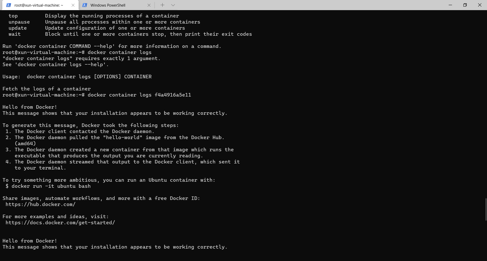

```sh
用法：docker[OPTIONS]命令
容器的自给自足运行时
选项：
--客户端配置文件的配置字符串位置（默认值为“/home/xun/.docker”）
-c、 --上下文字符串用于连接到守护进程的上下文的名称（覆盖DOCKER\u HOST env var和默认上下文集“DOCKER
上下文使用“）
-D、 --调试启用调试模式
-H、 --要连接的主机列表守护程序套接字
-l、 --日志级别字符串设置日志级别（“调试”|“信息”|“警告”|“错误”|“致命”）（默认为“信息”）
--tls使用tls；由--tlsverify隐含
--tlscacert string仅由此CA签名的信任证书（默认“/home/xun/.docker/CA.pem”）
--TLS证书文件的tlscert字符串路径（默认值为“/home/xun/.docker/cert.pem”）
--TLS密钥文件的tlskey字符串路径（默认值为“/home/xun/.docker/key.pem”）
--TLS验证使用TLS并验证远程
-v、 --版本打印版本信息并退出
管理命令：
app*	 应用程序*Docker应用程序（Docker Inc.，v0.9.1-beta3）
builder	 生成器管理生成
buildx*	 使用BuildKit构建（Docker Inc.，v0.5.1-Docker）
condig	 配置管理Docker配置
container集装箱管理集装箱
context	 上下文管理上下文
image 	 管理图像
manifest 清单管理Docker映像清单和清单列表
network	 网络管理网络
node	 节点管理群集节点
plugin   插件管理插件
scan*	 扫描*Docker扫描（Docker Inc.，v0.8.0）
secret	 秘密管理Docker秘密
service	 管理服务
stack    管理Docker堆栈
swarm    群集管理群集
system   管理Docker
trust    信任管理对Docker映像的信任
volume   卷管理卷
命令：
attach  将本地标准输入、输出和错误流附加到正在运行的容器
build   从Dockerfile生成映像
commit  提交从容器的更改创建新映像
cp      在容器和本地文件系统之间复制文件/文件夹
create  创建新容器
diff  	检查对容器文件系统上的文件或目录的更改
events	事件从服务器获取实时事件
exec	在正在运行的容器中运行命令
export	将容器的文件系统导出为tar存档
history	历史显示图像的历史
images	列表图像
import	从tarball导入内容以创建文件系统映像
info	信息显示系统范围的信息
inspect	检查返回Docker对象的低级信息
kill	杀死一个或多个正在运行的容器
load	从tar存档或STDIN加载图像
login	登录到Docker注册表
logout	注销从Docker注册表注销
logs	日志获取容器的日志
pause	暂停暂停一个或多个容器中的所有进程
port	端口列表端口映射或容器的特定映射
ps		列表容器
pull	从注册表中提取图像或存储库
push	将映像或存储库推送到注册表
rename	重命名容器
restart	重新启动一个或多个容器
rm		移除一个或多个容器
rmi		删除一个或多个图像
run		在新容器中运行命令
save	将一个或多个图像保存到tar存档（默认情况下流式传输到标准输出）
search	在Docker Hub中搜索图像
start	启动一个或多个停止的容器
stats	统计数据显示容器资源使用统计数据的实时流
stop	停止一个或多个正在运行的容器
tag		标记创建引用源图像的标记目标图像
top		顶部显示容器的运行进程
unpause	取消暂停取消暂停一个或多个容器中的所有进程
update	更新一个或多个容器的配置
version	版本显示Docker版本信息
wait	等待一个或多个容器停止，然后打印其出口代码
有关命令的详细信息，请运行“docker命令--帮助”。

要获得有关docker的更多帮助，请访问我们的指南https://docs.docker.com/go/guides/
```


```sh
#docker信息
docker search struts  //搜索容器

docker info  //查看docker信息

docker version //查看docker 版本


#image文件
$ docker image ls # 列出本机的所有 image 文件。

$ docker image rm [imageName]  # 删除 image 文件

$ docker image pull imageName  #拉取远程image文件


#案例
#docker image pull library/hello-world  
其中library 为image文件所在的组，hello-world为image文件的名字,library可省略不写
library/hello-world为image文件在仓库中的位置

$docker container run hello-world  新建image文件，生成容器

$docker container run -it ubuntu bash 运行的是服务，不会自己终止，
$docker container kill [containID] 结束容器


#容器文件
$docker container ls 列出正在运行的容器
$docker container ls -all 列出所有的容器，包括停止运行的容器
$docker container rm [containID] 删除停止运行的容器文件


#运行
docker container start [containID]  运行容器

$docker container stop [containID]  终止容器运行

stop终止的容器自行进行首尾清理工作，但是kill终止的容器强制性终止，正在进行的操作回丢失

$docker container logs [containID]  #查看容器的输出

$docker container exec -it [containID] /bin/bash

$docker container cp [containID]:[/path/to/file] . 
#将正在运行的容器中的文件拷贝到本机
```



```sh
本教程需要从仓库下载 image 文件，但是国内访问 Docker 的官方仓库很慢，还经常断线，所以要把仓库网址改成国内的镜像站。这里推荐使用官方镜像 registry.docker-cn.com 。下面是我的 Debian 系统的默认仓库修改方法，其他系统的修改方法参考官方文档。

打开/etc/default/docker文件（需要sudo权限），在文件的底部加上一行。

DOCKER_OPTS="--registry-mirror=https://registry.docker-cn.com"
然后，重启 Docker 服务。


$ sudo service docker restart
```


```sh
docker container run -d --rm --name testdb --env MYSQL_ROOT_PASSWORD=123456 --env MYSQL_DATABASE=testdb mysql:5.7
#新建一个mysql 容器 并运行

docker run -d -p 8080:8080 2d8ru/struts2


 docker exec -it b56435537635 /bin/bash
```


```sh
# cd进入漏洞环境目录
1. docker-compose build   编译靶场环境

2. docker-compose up -d   启动整个环境

3. docker ps 查看容器内的对象

4. docker inspect [containID] 查看容器的信息

5. docker-compose down结束服务
```

