### Linux系统层次：

​		硬件   ->   内核层  ->  shell层    ->  应用层    ->  用户

​			                         系统调用    shell命令      命令界面

- 内核层：系统的核心和基础，附着在硬件平台上，控制和管理系统内各种资源，有效地组织进程的允许，从而扩展硬件的功能，提高资源的利用效率，为用户提供方柏霓、高效、安全、可靠的应用环境。
- Shell层：是用户直接交互的界面，用户可以在提示符下输入命令行，由shell解释并输出相应结果或有关信息。
- 应用层：提供基于X Window协议的图形环境。

### 安装Linux系统

1. 安装VMware虚拟机管理工具
2. 新建虚拟机

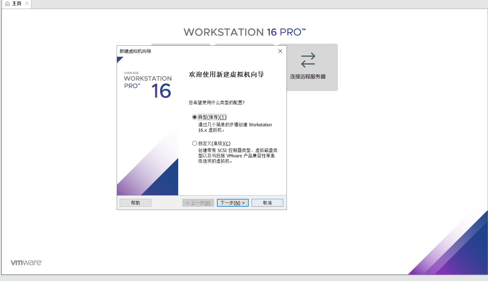

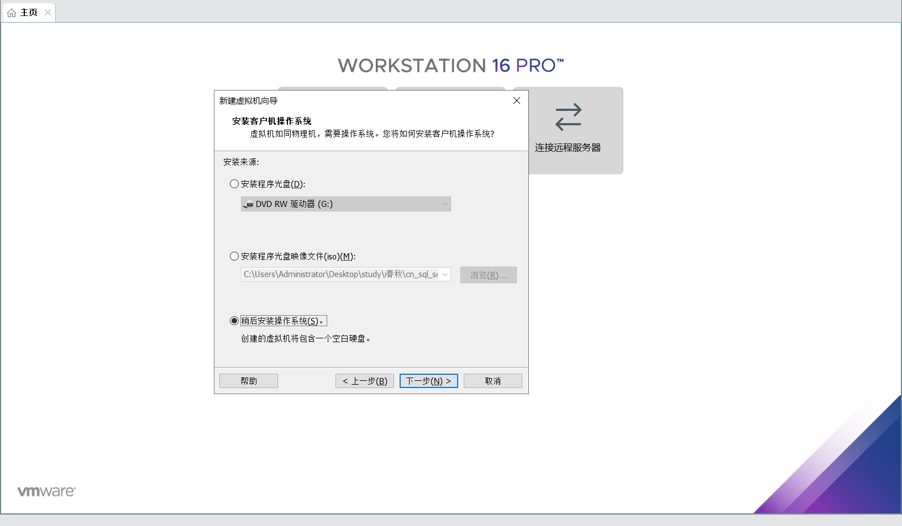

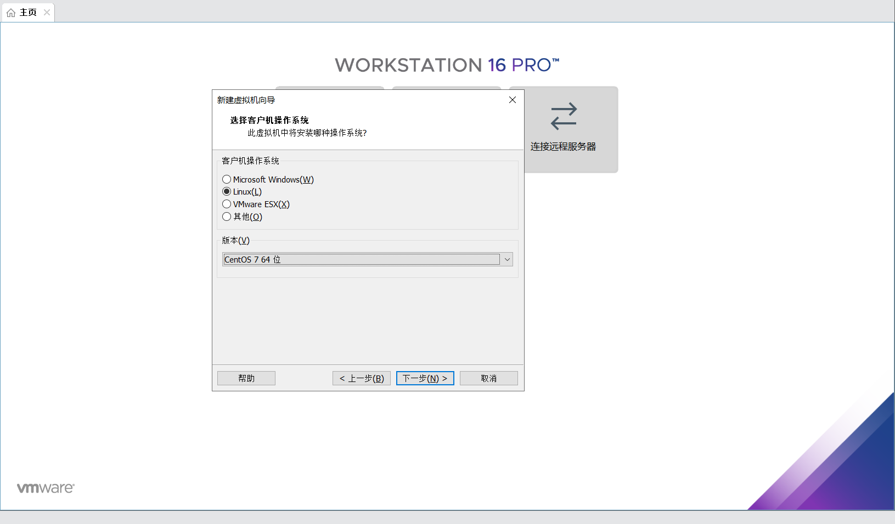

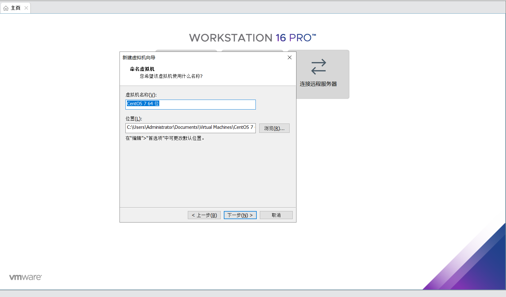

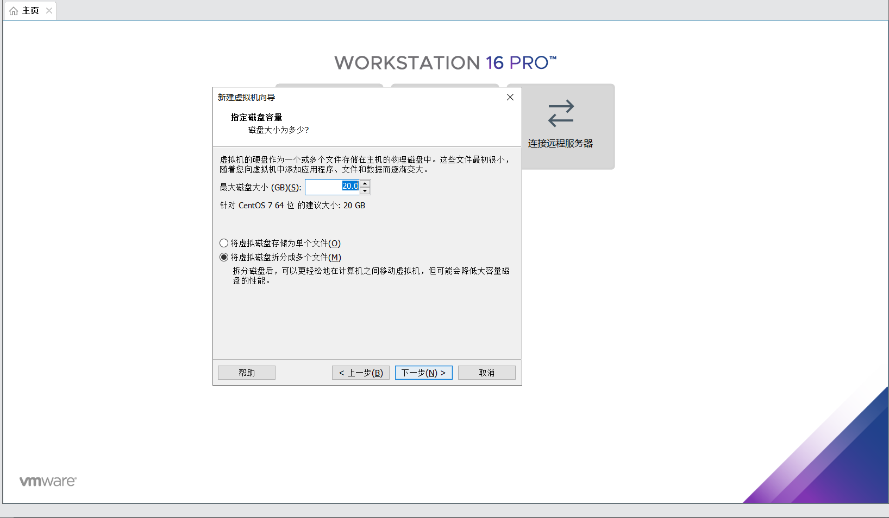

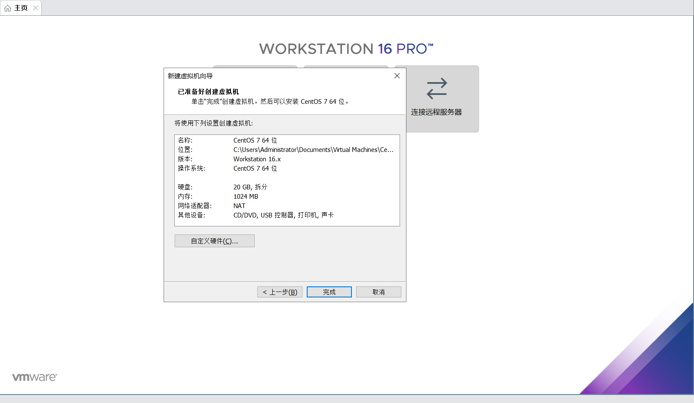

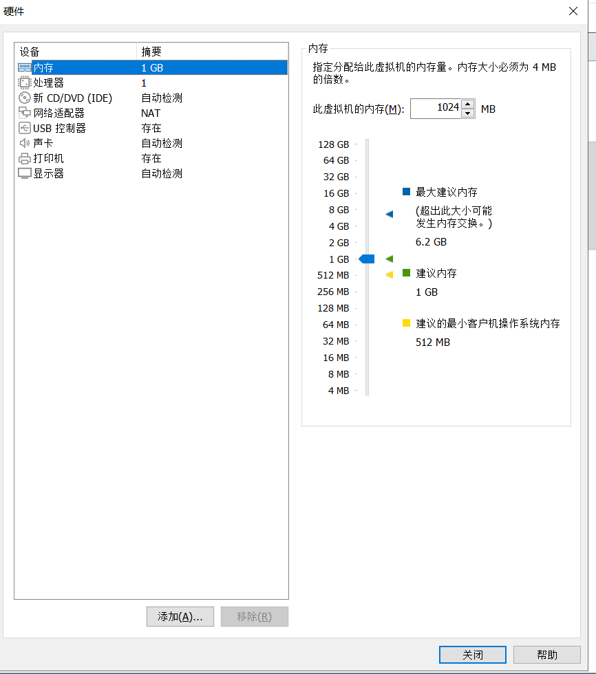

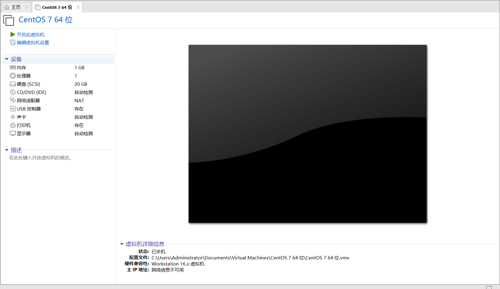

VMware 提供的网络连接有 5 种，分别是"桥接模式"、"NAT 模式"、"仅主机模式"、"自定义"和"LAN 区段"：

- 桥接模式：相当于虚拟机的网卡和宿主机的物理网卡均连接到虚拟机软件所提供的 VMnet0 虚拟交换机上，因此虚拟机和宿主机是平等的，相当于一个网络中的两台计算机。这种设置既可以保证虚拟机和宿主机通信，也可以和局域网内的其他主机通信，还可以连接 Internet，是限制最少的连接方式，推荐新手使用。
- NAT 模式：相当于虚拟机的网卡和宿主机的虚拟网卡 VMnet8 连接到虚拟机软件所提供的 VMnet8 虚拟交换机上，因此本机是通过 VMnet8 虚拟网卡通信的。在这种网络结构中，VMware 为虚拟机提供了一个虚拟的 NAT 服务器和一个虚拟的 DHCP 服务器，虚拟机利用这两个服务器可以连接到 Intemet。所以，在正常情况下，虚拟机系统只要设定自动获取 IP 地址，就能既和宿主机通信，又能连接到 Internet了。但是这种设置不能连接局域网内的其他主机。
- 仅主机模式：宿主机和虚拟机通信使用的是 VMware 的虚拟网卡 VMnet1，但是这种连接没有 NAT 服务器为虚拟机提供路由功能，所以仅主机网络只能连接宿主机，不能连接局域网，也不能连接 Internet 网络。
- 自定义网络：可以手工选择使用哪块虚拟机网卡。如果选择 Vmnet1，就相当于桥接网络；如果选择 VMnet8，就相当于 NAT 网络。
- LAN 区段：这是新版 VMware 新增的功能，类似于交换机中的 VLAN（虚拟局域网），可以在多台虚拟机中划分不同的虚拟网络。

### Linux远程管理协议（RFB,RDP,Telnet和SSH）

- RDP（remote desktop protocol）协议：远程桌面协议，大部分 Windows 系统都默认支持此协议，Windows 系统中的远程桌面管理就基于该协议。
- RFB（Remote FrameBuffer）协议：图形化远程管理协议，VNC 远程管理工具就基于此协议。
- Telnet：命令行界面远程管理协议，几乎所有的操作系统都默认支持此协议。此协议的特点是，在进行数据传送时使用明文传输的方式，也就是不对数据进行加密。
- SSH（Secure Shell）协议：命令行界面远程管理协议，几乎所有操作系统都默认支持此协议。和 Telnet 不同，该协议在数据传输时会对数据进行加密并压缩，因此使用此协议传输数据既安全速度又快。

### Linux根目录/

Linux中以/目录为根目录，所有目录都由根目录衍生出来，根目录与系统的开机、修复、还原密切相关

|  目录  |                             功能                             |
| :----: | :----------------------------------------------------------: |
|  /bin  |            存放系统目录。普通用户以及root都可执行            |
| /boot  | 系统启动目录，保存与系统相关的文件：启动引导程序和内核文件等 |
|  /dev  |                       设备文件保存位置                       |
|  /etc  | 配置文件保存位置。用户信息、服务端启动脚本、常用服务的配置文件 |
| /home  |                       普通用户的主目录                       |
|  /lib  |                   系统调用的函数库保存位置                   |
| /media |        挂载目录。系统建议用来挂载媒体设备：软盘+光盘         |
|  /mnt  |                 挂载目录。挂载U盘，移动硬盘                  |
| /misc  |         挂载目录。系统建议用来挂载NFS服务的共享目录          |
|  /opt  |                   第三方安装的软件保存位置                   |
| /root  |                       root用户的主目录                       |
| /sbin  | 保存与系统环境设置相关的命令，只有root可以使用这些命令进行系统环境设置，但是有些命令可以允许普通用户查看 |
|  /srv  |       服务数据目录。一些系统服务启动后保存所需要的数据       |
|  /tmp  | 临时目录。系统存放临时文件的目录。所有用户都可以访问以及写入 |
|  /var  |                包含系统一般运行时要改变的数据                |

##### 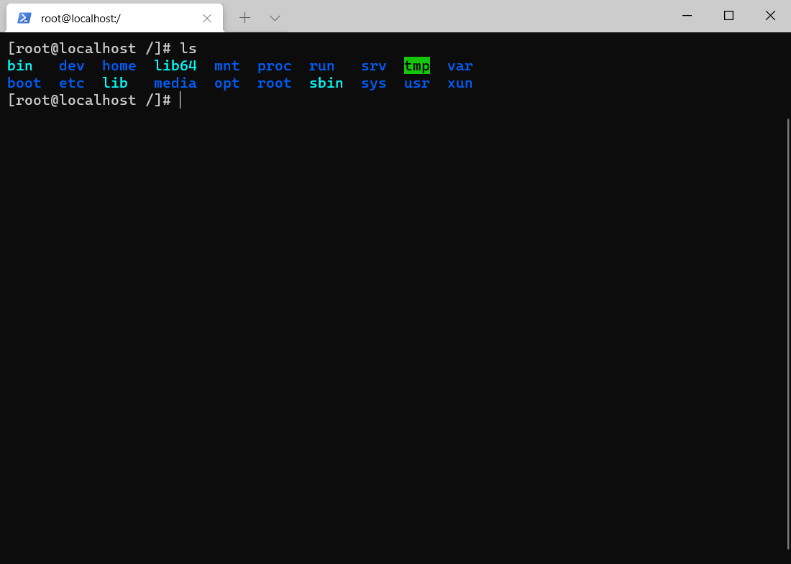

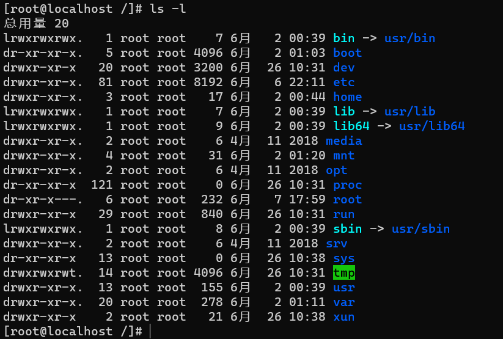

说明文件存放的位置使用两种方法：

- ​	绝对路径：从/目录开始写起e.g：/etc/sysconfig/network-scripts
- ​	相对路径：相对于当前路径的位置：../nework-network

.代表当前目录。..代码上级目录。pwd输出当前所在位置

##### 挂载

在Linux系统中，一切（包括硬件）皆文件。所有的文件均会以文件存放在根目录下。所以Linux在使用硬件设备时，只有将Linux本身的文件目录与硬件设备的文件目录合二为一，硬件设备才可以使用。

挂载：指的就是将设备文件中的顶级目录连接到Linux根目录下的某一目录（最好是空目录），访问此目录就等同于访问设备文件，

[root@localhost ~]# mkdir /mnt/cdrom
\#创建cdrom目录，作为光盘的挂载点
[root@localhost ~]# mount /dev/cdrom /mnt/cdrom/
mount: block device/dev/srO is write-protected, mounting read-only
\#挂载光盘到/mnt/cdrom目录下

##### Linux环境变量

变量是系统用于保存可变值的数据类型，可以通过变量名来提取对于的变量值。Linux中，环境变量用来定义系统运行环境的一些参数。使用env命令查看Linux中的所有环境变量。

#### Linux命令基本格式

命令提示符：

- ​	[]：提示符的分隔符，无意义
- ​	root：显示当前的登录用户
- ​	@：分隔符，无意义
- ​	localhost：当前系统的简写主机名
- ​	~：代表当前用户所在的目录
- ​	#：命令提示符#代表超级用户 $代表普通用户

命令格式：命令 [选项] [参数] eg：ls -l查看文件详细信息

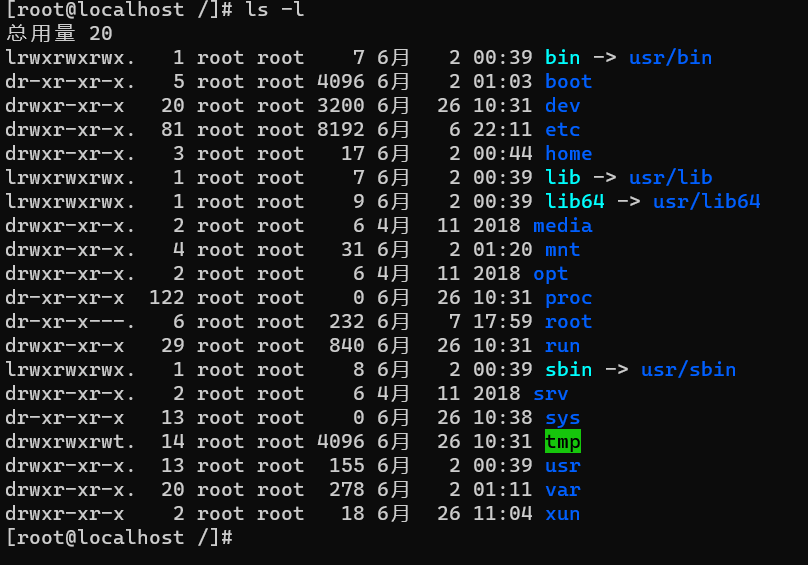

参数代表命令的操作对象，一般文件、目录、用户以及进程都可作为参数被命令操作。查看某个文件的详细内容

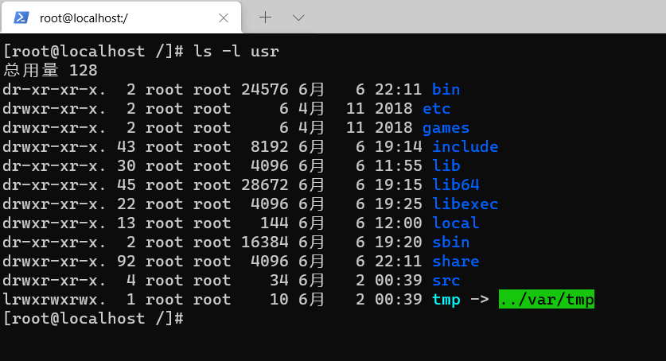

###### cd命令

cd命令：是 change directory的缩写，用来切换工作目录

使用：cd [相对路径或者绝对路径]

e.g：

- cd ~：切换到当前用户的主目录
- cd ~用户名：切换到指定用户的主目录
- cd -：切换到上次所在目录
- cd .：当前目录
- cd ..：切换到上级目录

###### ls命令

ls命令：查看目录下文件。list的缩写。

使用：ls [选项] 目录

常用选项：

- -a 显示全部文件，包括隐藏文件
- -f  以文件名进行排序
- -h 文件大小显示合适单位
- -R 连同子目录内容都列出

```sh
[root@localhost /]# ls -l
总用量 20
lrwxrwxrwx.   1 root root    7 6月   2 00:39 bin -> usr/bin
dr-xr-xr-x.   5 root root 4096 6月   2 01:03 boot
drwxr-xr-x   20 root root 3200 6月  26 10:31 dev
drwxr-xr-x.  81 root root 8192 6月   6 22:11 etc
drwxr-xr-x.   3 root root   17 6月   2 00:44 home
lrwxrwxrwx.   1 root root    7 6月   2 00:39 lib -> usr/lib
lrwxrwxrwx.   1 root root    9 6月   2 00:39 lib64 -> usr/lib64
drwxr-xr-x.   2 root root    6 4月  11 2018 media
drwxr-xr-x.   4 root root   31 6月   2 01:20 mnt
drwxr-xr-x.   2 root root    6 4月  11 2018 opt
dr-xr-xr-x  123 root root    0 6月  26 10:31 proc
dr-xr-x---.   6 root root  232 6月   7 17:59 root
drwxr-xr-x   29 root root  840 6月  26 10:31 run
lrwxrwxrwx.   1 root root    8 6月   2 00:39 sbin -> usr/sbin
drwxr-xr-x.   2 root root    6 4月  11 2018 srv
dr-xr-xr-x   13 root root    0 6月  26 10:38 sys
drwxrwxrwt.  14 root root 4096 6月  26 10:31 tmp
drwxr-xr-x.  13 root root  155 6月   2 00:39 usr
drwxr-xr-x.  20 root root  278 6月   2 01:11 var
drwxr-xr-x    2 root root   18 6月  26 11:04 xun
[root@localhost /]#
```

###### mkdir命令

mkdir命令：创建目录（文件夹）。make directories的缩写，

命令格式：mkdir [-mp] 目录名

- -m：用于手动配置所创建目录的权限
- -p：递归创建所有目录

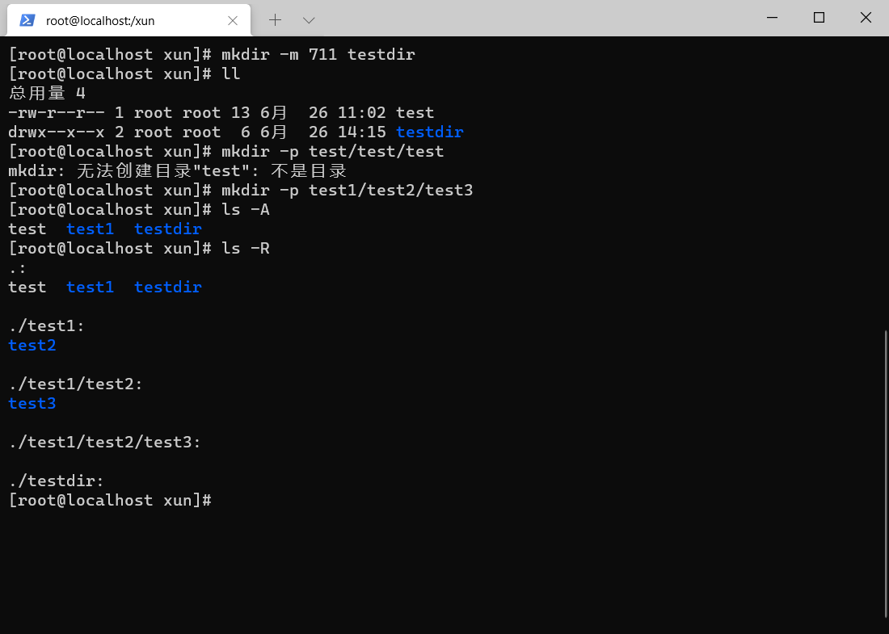

###### rmdir命令

rmdir命令：删除空目录。remove empty directories的缩写，只可删除空目录，一旦目录中有内容，就会报错

命令格式：rmdir [-p] 目录名。

-p：用于递归删除目录

```sh
[root@localhost xun]# ls
test  test1  testdir
[root@localhost xun]# rmdir testdir
[root@localhost xun]# ls
test  test1
[root@localhost xun]# rmdir -p test1/test2/test3/
[root@localhost xun]# ls -R
.:
test
[root@localhost xun]#
```

##### touch命令

touch命令：创建文件及修改文件的时间戳

Linux中，每个文件中有三个时间参数（stat命令查看），分别是文件的访问时间、数据修改时间以及状态修改时间。

- 访问时间：文件内容被访问，访问时间就会更新
- 数据修改时间：当文件的内容数据发生改变，文件数据修改时间会更新
- 状态修改时间：文件的状态（权限或属性）发生改变时，此时间就会响应该改变。

命令格式：touch [选项] 文件名

选项：

- -a：只修改文件的访问时间
- -c：仅修改文件的时间参数（3个时间都会发生改变）
- -d：加指定的日期 将文件的访问时间和修改时间改为指定的时间
- -m：只修改文件的数据修改时间
- -t：加指定的时间

```shell
[root@localhost xun]# touch newfile
[root@localhost xun]# touch -t 2212121212 newfile
[root@localhost xun]# ll
总用量 4
-rw-r--r-- 1 root root  0 12月 12 2022 newfile
-rw-r--r-- 1 root root 13 6月  26 11:02 test
drwxr-xr-x 2 root root  6 6月  26 14:25 test1
[root@localhost xun]#
```

###### ln命令：建立链接文件

ln命令用于给文件创建链接，根据Linux系统存储文件的特点，链接的方式分为2中：

1. 软链接：类似于Windows中的文件快捷方式，即产生一个特殊的文件，该文件指向另一个文件，链接方式统一适用于目录
2. 硬链接：指的是给一个文件的incode分配多个文件名，可以通过任何一个文件名，都可以指到此文件的incode,从而读取文件的数据信息

ln目录格式：ln [选项] 源文件 目标文件

选项：

- -s 建立软连接文件。默认建立硬链接。源文件必须写绝对路径
- -f 强制。若目标文件已存在，则删除目标文件后再建立链接文件；

```shell
[root@localhost xun]# ls
newfile  test  test1
[root@localhost xun]# ln -s newfile newfile2
[root@localhost xun]# echo "123" > newfile
[root@localhost xun]# cat newfile
123
[root@localhost xun]# cat newfile2
123
[root@localhost xun]# ls
newfile  newfile2  test  test1
[root@localhost xun]# ln newfile newfile3
[root@localhost xun]# cat newfile3
123
[root@localhost xun]# ls
newfile  newfile2  newfile3  test  test1
[root@localhost xun]#
```

###### cp命令

cp命令主要用来到文件和目录，同事借助选项赋值整个目录

格式：cp [选项] 源文件 目标文件

选项：

- -d：如果源文件为软链接，则复制的目标文件也为软链接
- -i：询问是否覆盖（目标文件存在）
- -I：把目标文件建立为源文件的硬链接文件
- -s：把目标文件建立为源文件的软链接文件
- -p：复制后目标文件保留源文件的属性
- -r：递归复制
- -u：目标文件比源文件有差异，使用此选项更新目标文件

###### rm 删除文件/目录

rm命令：永久地删除文件系统中指定的文件或目录

格式：rm [选项] 文件\目录

选项：

- -f 强制删除，不再询问
- -i 删除之前询问是否删除
- -r 递归删除目录（包括子目录以及子文件）

```shell
[root@localhost xun]# ls
newfile  newfile2  newfile3  test  test1
[root@localhost xun]# rm newfile
rm：是否删除普通文件 "newfile"？y
[root@localhost xun]# ls
newfile2  newfile3  test  test1
[root@localhost xun]# cat newfile3
123
[root@localhost xun]# ls
newfile3  test  test1
[root@localhost xun]#
```

###### mv命令

mv命令移动文件或改名，目标文件与源文件同目录为改名功能

格式：mv [选项] 源文件 目标文件

选项：

- -f 目标文件已存在强制覆盖目标文件
- -i 目标文件已存在询问是否覆盖
- -n 目标文件已存在，则不会覆盖移动，而且不询问
- -v 显示文件或目录的移动过程
- -u 若目标文件已存在，对比源文件是否更新，更新则对目标文件升级

```shell
[root@localhost xun]# ls
newfile3  test  test1
[root@localhost xun]# mv test test1
[root@localhost xun]# ls
newfile3  test1
[root@localhost xun]# ls test1/
test
[root@localhost xun]# mv newfile3 newfile1
[root@localhost xun]# ls
newfile1  test1
[root@localhost xun]#
```

##### 归档和压缩

归档：指的是文件和目录被存储再一个文件中，归档没有经过压缩。

压缩：指的是采用了不同的存储方式使集合中文件的大小比原文件大小综合要小

tar命令：打包操作，使用tar命令归档的包通常成为tar包

命令格式：tar [选项] 源文件\目录

[选项]：

- -c 将多个文件或目录进行打包
- -A 追加tar文件到归档文件
- -f 包名 指定包的文件名
- -v 显示打包文件过程
- -x 对tar包做解包操作
- -t 查看tar包中有哪些文件或目录，不做解包操作
- -C 指定解包位置
- -v 显示解包的具体过程

```shell
[root@localhost ~]# tar cvf testta.tar testta
testta/
[root@localhost ~]# ls
0606  0607  anaconda-ks.cfg  shell-study  testta  testta.tar  vm-tools
[root@localhost ~]# tar -tf testta.tar
testta/
```

打包压缩/解压缩操作

格式：tar [选项] 压缩包 源文件或目录

[选项]：

- -z 压缩和解压缩.tar.gz格式
- -j 压缩和解压缩.tar.bz2格式

```shell
[root@localhost testta]# tar zcvf test.tar.gz test1 test2.txt
test1/
test2.txt
[root@localhost testta]# ls
test1  test2.txt  test.tar.gz
//解压缩
[root@localhost testta]# ls
test.tar.gz
[root@localhost testta]# tar zxvf test.tar.gz
test2.txt
test3/
[root@localhost testta]# ls
test2.txt  test3  test.tar.gz
```

###### zip命令

zip命令需要手工指定压缩后的压缩包名

格式：zip [选项] 压缩包名 源文件/源目录文件
选项：

- -r 递归压缩目录，将目录下的所有文件全部压缩
- -m 文件压缩之后，删除原始文件
- -v 显示详细的压缩过程信息
- -q 在压缩的时候不显示命令的执行过程
- -u 更新压缩文件，往压缩文件中添加新文件

```shell
[root@localhost testta]# ls
test2.txt  test3  test.tar.gz
[root@localhost testta]# zip -r test.zip test3
  adding: test3/ (stored 0%)
[root@localhost testta]# ls
test2.txt  test3  test.tar.gz  test.zip
[root@localhost testta]#
```

###### unzip命令：查看和解压缩zip文件

格式：unzip [选项] 压缩包名

选项：

- -d 将压缩文件解压到指定目录下
- -n 解压时并不覆盖已存在的文件
- -o 解压时覆盖已经存在的文件，且无须确认
- -v 查看压缩文件的详细信息
- -t 测试压缩文件有无损坏，不做解压操作
- -x 解压文件，但不包含文件列表中指定的文件

```shell
[root@localhost testta]# ls
testnew  test.zip
[root@localhost testta]# unzip -d testnew/ test.zip
Archive:  test.zip
   creating: testnew/test3/
[root@localhost testta]# ls
testnew  test.zip
[root@localhost testta]# ls testnew/
test3
[root@localhost testta]#
```

###### gzip命令

gzip命令是Linux系统中常用来对文件进行压缩和解压缩的命令，通过此命令压缩得到的新文件，扩展名为gz。仅支持压缩文件，不可压缩目录，即便指定了目录，也只能压缩目录中的所有文件

格式：gzip [选项] 源文件

选项：

- -c 将压缩数据输出到标准输出中，并保留源文件
- -d 将压缩文件进行解压缩
- -r 递归压缩指定目录下以及子目录下的所有文件
- -v 对每个压缩和解压缩的文件，显示相应的文件名和压缩比

```shell
[root@localhost ~]# gzip install.log
#压缩instal.log 文件
[root@localhost ~]# ls
anaconda-ks.cfg install.log.gz install.log.syslog
#压缩文件生成，但是源文件也消失了

[root@localhost testnew]# echo "!32" > 123.txt
echo "vim" > 123.txt
[root@localhost testnew]# ls
123.txt  test3
[root@localhost testnew]# cd ..
[root@localhost testta]# gzip -r testnew/
[root@localhost testta]# ls
testnew  test.zip
[root@localhost testta]# cd testnew/
[root@localhost testnew]# ls
123.txt.gz  test3
[root@localhost testnew]#
```

gunzip命令：解压缩命令

格式：gunzip [选项] 文件

选项：

- -r 递归处理
- -f 强制解压缩，不理会是否存在情况
- -l 列出压缩文件内容
- -v 显示命令执行过程
- -t 测试压缩文件是否正常

```shell
[root@localhost testnew]# ls
123.txt.gz  test3
[root@localhost testnew]# gunzip 123.txt.gz
[root@localhost testnew]# ls
123.txt  test3
[root@localhost testnew]#
```

#### vim

vim文本编辑器，是由vi发展演变过来的文本编辑器。

vim工作模式：

- 命令模式：进入vim
- 输入模式：Esc键
- 编辑模式：按“:”进入输入模式

vim 文件名进入文件编辑模式

vim查找目标文本：

| 快捷键 |             描述             |
| :----: | :--------------------------: |
|  /abc  | 从光标位置向前查找字符串abc  |
| /^abc  |      查找以abc开头的行       |
| /abc$  |      查找以abc结尾的行       |
| /?abc  |  从光标所在为主向后查找abc   |
|   n    | 向同一放下重复上次的查找指令 |
|   N    | 向相反方向重复上次的查找指令 |

vim文本替换

|     快捷键      |                 描述                 |
| :-------------: | :----------------------------------: |
|        r        |        替换光标所在位置的字符        |
|        R        | 从光标位置开始替换。后面的内容会覆盖 |
|    :/a1/a2/g    |        光标所在行使用a2替换a1        |
| :n1,n2s/a1/a2/h |       从n1-n2行都使用a2替换a1        |
|    :g/a1/a/g    |        文件中所有a1都被a2替换        |

vim删除文本

| 捷键    |                功能描述                |
| ------- | :------------------------------------: |
| x       |         删除光标所在位置的字符         |
| dd      |             删除光标所在行             |
| ndd     |   删除当前行（包括此行）后 n 行文本    |
| dG      | 删除光标所在行一直到文件末尾的所有内容 |
| D       |        删除光标位置到行尾的内容        |
| :a1,a2d |     函数从 a1 行到 a2 行的文本内容     |

vim复制和粘贴文本

| 快捷键    |                          功能描述                          |
| --------- | :--------------------------------------------------------: |
| p         |                将剪贴板中的内容粘贴到光标后                |
| P（大写） |                将剪贴板中的内容粘贴到光标前                |
| y         |                  复制已选中的文本到剪贴板                  |
| yy        | 将光标所在行复制到剪贴板，此命令前可以加数字 n，可复制多行 |
| yw        |                将光标位置的单词复制到剪贴板                |

#### 查看文件内容

##### cat命令

cat命令显示文本文件的内容

格式：cat [选项] 文件名

选项：

- -A 列出所有隐藏符号
- -E 列出每行结尾的回车符$
- -n 对输出的所有行进行编号
- -b 对非空行进行编号
- -V 列出特殊字符
- -s 连续多行的空白行替换为1行

使用>可输出到指定文件中

```shell
[root@localhost testnew]# ls
123.txt  test3
[root@localhost testnew]# cat 123.txt > 23.txt
[root@localhost testnew]# ls
123.txt  23.txt  test3
[root@localhost testnew]# cat 123.txt
iivim
O123123eeaaaaaaaaadDAAAaaaaAAAA
#OOOOOOOaaO
[root@localhost testnew]# cat 23.txt
iivim
O123123eeaaaaaaaaadDAAAaaaaAAAA
#OOOOOOOaaO
[root@localhost testnew]#
```

more 命令可以分页显示文本文件的内容，使用者可以逐页阅读文件中内容，此命令的基本格式如下：

`[root@localhost ~]# more [选项] 文件名`

more 命令比较简单，一般不用什么选项，对于表 1 中所列的选项，读者只需看到认识即可。

| 选项 |                           含义                           |
| ---- | :------------------------------------------------------: |
| -f   |   计算行数时，以实际的行数，而不是自动换行过后的行数。   |
| -p   |  不以卷动的方式显示每一页，而是先清除屏幕后再显示内容。  |
| -c   |   跟 -p 选项相似，不同的是先显示内容再清除其他旧资料。   |
| -s   |  当遇到有连续两行以上的空白行时，就替换为一行的空白行。  |
| -u   | 不显示下引号（根据环境变量 TERM 指定的终端而有所不同）。 |
| +n   |         从第 n 行开始显示文件内容，n 代表数字。          |
| -n   |               一次显示的行数，n 代表数字。               |

head 命令可以显示指定文件前若干行的文件内容，其基本格式如下：

[root@localhost ~]# head [选项] 文件名

该命令常用选项以及各自的含义，如表 1 所示。

| 选项 | 含义                                                         |
| ---- | ------------------------------------------------------------ |
| -n K | 这里的 K 表示行数，该选项用来显示文件前 K 行的内容；如果使用 "-K" 作为参数，则表示除了文件最后 K 行外，显示剩余的全部内容。 |
| -c K | 这里的 K 表示字节数，该选项用来显示文件前 K 个字节的内容；如果使用 "-K"，则表示除了文件最后 K 字节的内容，显示剩余全部内容。 |
| -v   | 显示文件名；                                                 |

注意，如不设置显示的具体行数，则默认显示 10 行的文本数据。

```shell
[root@localhost testnew]# head -n 20 test.txt
0
1
2
3
4
5
6
7
8
9
10
11
12
13
14
15
16
17
18
19
[root@localhost testnew]#
```

less 命令的基本格式如下：

[root@localhost ~]# less [选项] 文件名

此命令可用的选项以及各自的含义如表 1 所示。


|      选项       |                        选项含义                        |
| :-------------: | :----------------------------------------------------: |
|       -N        |                    显示每行的行号。                    |
|       -S        |                行过长时将超出部分舍弃。                |
|       -e        |              当文件显示结束后，自动离开。              |
|       -g        |               只标志最后搜索到的关键同。               |
|       -Q        |                     不使用警告音。                     |
|       -i        |                  忽略搜索时的大小写。                  |
|       -m        |              显示类似 more 命令的百分比。              |
|       -f        | 强迫打开特殊文件，比如外围设备代号、目录和二进制文件。 |
|       -s        |                  显示连续空行为一行。                  |
| -b <缓冲区大小> |                   设置缓冲区的大小。                   |
|   -o <文件名>   |          将 less 输出的内容保存到指定文件中。          |
|    -x <数字>    |           将【Tab】键显示为规定的数字空格。            |

在使用 less 命令查看文件内容的过程中，和 more 命令一样，也会进入交互界面，因此需要读者掌握一些常用的交互指令，如表 2 所示。

|  交互指令  |                  功能                  |
| :--------: | :------------------------------------: |
|  /字符串   |        向下搜索“字符串”的功能。        |
|  ?字符串   |        向上搜索“字符串”的功能。        |
|     n      |  重复*前一个搜索（与 / 成 ? 有关）。   |
|     N      | 反向重复前一个搜索（与 / 或 ? 有关）。 |
|     b      |             向上移动一页。             |
|     d      |             向下移动半页。             |
|   h 或 H   |             显示帮助界面。             |
|   q 或 Q   |            退出 less 命令。            |
|     y      |             向上移动一行。             |
|   空格键   |             向下移动一页。             |
|   回车键   |             向下移动一行。             |
| 【PgDn】键 |             向下移动一页。             |
| 【PgUp】键 |             向上移动一页。             |
|   Ctrl+f   |             向下移动一页。             |
|   Ctrl+b   |             向上移动一页。             |
|   Ctrl+d   |             向下移动一页。             |
|   Ctrl+u   |             向上移动半页。             |
|     j      |             向下移动一行。             |
|     k      |             向上移动一行。             |
|     G      |            移动至最后一行。            |
|     g      |             移动到第一行。             |
|     ZZ     |            退出 less 命令。            |
|     v      |     使用配置的编辑器编辑当前文件。     |
|     [      |       移动到本文档的上一个节点。       |
|     ]      |       移动到本文档的下一个节点。       |
|     p      |        移动到同级的上一个节点。        |
|     u      |             向上移动半页。             |

tail 命令和 head 命令正好相反，它用来查看文件末尾的数据，其基本格式如下：

[root@localhost ~]# tail [选项] 文件名

此命令常用的选项及含义如表 1 所示。

| 选 项 |                             含义                             |
| :---: | :----------------------------------------------------------: |
| -n K  | 这里的 K 指的是行数，该选项表示输出最后 K 行，在此基础上，如果使用 -n +K，则表示从文件的第 K 行开始输出。 |
| -c K  | 这里的 K 指的是字节数，该选项表示输出文件最后 K 个字节的内容，在此基础上，使用 -c +K 则表示从文件第 K 个字节开始输出。 |
|  -f   |                 输出文件变化后新增加的数据。                 |

##### 查找文件内容

grep：在文件中找到宝航指定信息的行

格式：grep [选项] 模式 文件名

选项：

- -c 仅列出文件中包含模式的行数
- -i 忽略模式中的字母大小写
- -l 列出带有批评和的文件名
- -n 在每一行的最前面列出行号
- -v 列出没有匹配模式的行
- -w 把表达式当做一个完整的单字符来搜寻，忽略那些部分匹配的行

```shell
[root@localhost testnew]# grep 33 test.txt
33
[root@localhost testnew]# grep -l 33 test.txt
test.txt
[root@localhost testnew]# grep -c 33 test.txt
1
```

awk：逐行扫描文件，寻找含有目标文本的行，如果匹配成功，则会在该行执行用户想要的操作，反之不做任何处理

awk [选项] '脚本命令' 文件名

e.g：awk `{print $1` data2.txt输入每一行的第二个字段

ooo选项：

- -F fs 指定以fs作为输入行的分隔符，默认以空格或者制表符
- -f file 从脚本文件中读取awk脚本指令，以取代直接在命令行输入指令
- -v var=val 在执行处理过程之前，设置一个变量var且初始值为val

BEGIN指定脚本命令的运行实际，在数据处理前运行脚本命令

END指定在读完数据后执行

#### Linux软件安装

Linux软件包分为：源码包以及二进制包

rpm二进制包RPM包的扩展名，可以使用rpm命令安装

RPM包默认安装路径

|    安装路径     |              含义              |
| :-------------: | :----------------------------: |
|      /etc/      |        配置文件安装目录        |
|    /usr/bin/    |      可执行的命令安装目录      |
|    /usr/lib     |    程序使用的函数库保存位置    |
| /usr/share/doc/ | 基本的软件是哟呵你手册保存位置 |
| /usr/share/man/ |        帮助文件保存位置        |

安装RPM的命令格式：

rpm -ivh 包全名 

- -i 安装
- -v 显示跟详细信息
- -h 显示安装进度
- -U 升级
- -F 软件没有安装，则不会安装，必须安装低版本才可以升级
- -e 卸载
- -q 查询软件是否安装
- -qa 查询所有已安装软件包

rpmbuild [选项] .src.rpm

- -rebuild：编译 SRPM 包生成 RPM 二进制包；
- -recompile：编译 SRPM 包，同时安装。

##### yum

专门为了解决包的依赖关系而存在的软件管理器

yum源配置文件位于/etc/yum.repos.d/目录下。源地址配置文件为Centos-Base.repo

命令：

- yum list：查询所有已安装和可按照的软件包
- yun -y install 包名：安装软件包，-y表示都同意
- yum -y update 包：升级软件包
- yum remove 包：卸载软件包

##### 源码包安装

源码包安装需要C和C++，以及make

1. 下载软件的源码包
2. 解压源码包：tar xvf Python-3.9.5.tar.xz
3. 进入源码目录：cd Python-3.9.5
4. 检查系统环境是否符合安装要求：./configure(--prefix 选项的含义为指定安装目录。)
5. make编译：make
6. 正式安装：make install 
7. 源码包卸载：找到软件的安装目录，删除所在目录

### *Linux用户组和用户*

Linux是多用户多任务操作系统，不同用户有不同的权限，每个用户在权限允许的范围内完成不间的任务。

用户与用户组的对应关系：

1. 一对一：一个用户存在一个组中
2. 一对多：一个用户存在多个组中，含有多个组的共同权限
3. 多对一：多个用户存在一个组中，用户具有和组相同的权限
4. 多对多：多个用户存在多个组中

用户含有ID（UID)，用户组ID（GID）

Linux系统中的/etc/passwd文件是系统用户配置文件，存储了系统中所有用户的基本信息，并且所有用户都可以对此文件执行读操作

```shell
[root@localhost ~]# cat /etc/passwd
root:x:0:0:root:/root:/bin/bash
bin:x:1:1:bin:/bin:/sbin/nologin
daemon:x:2:2:daemon:/sbin:/sbin/nologin
adm:x:3:4:adm:/var/adm:/sbin/nologin
lp:x:4:7:lp:/var/spool/lpd:/sbin/nologin
sync:x:5:0:sync:/sbin:/bin/sync
shutdown:x:6:0:shutdown:/sbin:/sbin/shutdown
#省略其余内容
```

字段含义：

用户名：密码：UID（用户id）：GID（初始组ID）：描述信息：主目录：默认shell

/etc/shadow 文件，用于存储 Linux 系统中用户的密码信息

```shell
[root@localhost ~]# cat /etc/shadow
root:xxxxxxxxxxxxxxxxxxxxxxxxxxxxxxxxx::0:99999:7:::
bin:*:18353:0:99999:7:::
daemon:*:18353:0:99999:7:::
adm:*:18353:0:99999:7:::
lp:*:18353:0:99999:7:::
sync:*:18353:0:99999:7:::
shutdown:*:18353:0:99999:7:::
halt:*:18353:0:99999:7:::
mail:*:18353:0:99999:7:::
operator:*:18353:0:99999:7:::
```

shadow文件只允许root用户读取，其他用户没有任何权限

字段说明：

用户名：加密密码（使用SHA512散列加密算法）：最后一次修改时间：最小修改时间间隔：密码有效期：密码需要变更前的警告天数：密码过期后的宽限时间：密码失效时间：保留字段

/etc/group 用户组配置文件，保存用户组的所有信息

### useradd添加用户

格式：useradd [选项] 用户名

选项：

| 选项 | 功能                         |
| ---- | ---------------------------- |
| -u   | 指定用户的UID（不要小于500） |
| -d   | 指定用户的主目录（绝对路径） |
| -c   | 指定用户说明                 |
| -g   | 手工指定用户的初始组         |
| -G   | 指定用户的附加组             |
| -s   | 指定用户得到登录shell        |
| -e   | 指定用户的失效期             |

### passwd命令：修改用户密码

格式：passwd [选项] 用户名

选项：

- -S：查询用户密码的状态，也就是 /etc/shadow 文件中此用户密码的内容。仅 root 用户可用；
- -l：暂时锁定用户，该选项会在 /etc/shadow 文件中指定用户的加密密码串前添加 "!"，使密码失效。仅 root 用户可用；
- -u：解锁用户，和 -l 选项相对应，也是只能 root 用户使用；
- --stdin：可以将通过管道符输出的数据作为用户的密码。主要在批量添加用户时使用；
- -n 天数：设置该用户修改密码后，多长时间不能再次修改密码，也就是修改 /etc/shadow 文件中各行密码的第 4 个字段；
- -x 天数：设置该用户的密码有效期，对应 /etc/shadow 文件中各行密码的第 5 个字段；
- -w 天数：设置用户密码过期前的警告天数，对于 /etc/shadow 文件中各行密码的第 6 个字段；
- -i 日期：设置用户密码失效日期，对应 /etc/shadow 文件中各行密码的第 7 个字段。

```shell
[root@localhost etc]# useradd lamp
[root@localhost etc]# passwd lamp
更改用户 lamp 的密码 。
新的 密码：
无效的密码： 密码未通过字典检查 - 它基于字典单词
重新输入新的 密码：
passwd：所有的身份验证令牌已经成功更新。
[root@localhost etc]#
```

### usermod修改用户信息

usermod修改用户信息的命令

格式：usermod [选项] 用户名

- -c 用户说明：修改用户的说明信息，即修改 /etc/passwd 文件目标用户信息的第 5 个字段；
- -d 主目录：修改用户的主目录，即修改 /etc/passwd 文件中目标用户信息的第 6 个字段，需要注意的是，主目录必须写绝对路径；
- -e 日期：修改用户的失效曰期，格式为 "YYYY-MM-DD"，即修改 /etc/shadow 文件目标用户密码信息的第 8 个字段；
- -g 组名：修改用户的初始组，即修改 /etc/passwd 文件目标用户信息的第 4 个字段（GID）；
- -u UID：修改用户的UID，即修改 /etc/passwd 文件目标用户信息的第 3 个字段（UID）；
- -G 组名：修改用户的附加组，其实就是把用户加入其他用户组，即修改 /etc/group 文件；
- -l 用户名：修改用户名称；
- -L：临时锁定用户（Lock）；
- -U：解锁用户（Unlock），和 -L 对应；
- -s shell：修改用户的登录 Shell，默认是 /bin/bash。

### userdel 删除用户

用户信息存储位置

- 用户基本信息：存储在 /etc/passwd 文件中；
- 用户密码信息：存储在 /etc/shadow 文件中；
- 用户群组基本信息：存储在 /etc/group 文件中；
- 用户群组信息信息：存储在 /etc/gshadow 文件中；
- 用户个人文件：主目录默认位于 /home/用户名，邮箱位于 /var/spool/mail/用户名。

userdel -r 用户名删除用户

切换登录用户命令：su

su 命令的基本格式：su [选项] 用户名
选项：

- -：当前用户不仅切换为指定用户的身份，同时所用的工作环境也切换为此用户的环境（包括 PATH 变量、MAIL 变量等），使用 - 选项可省略用户名，默认会切换为 root 用户。
- -l：同 - 的使用类似，也就是在切换用户身份的同时，完整切换工作环境，但后面需要添加欲切换的使用者账号。
- -p：表示切换为指定用户的身份，但不改变当前的工作环境（不使用切换用户的配置文件）。
- -m：和 -p 一样；
- -c 命令：仅切换用户执行一次命令，执行后自动切换回来，该选项后通常会带有要执行的命令。

为了避免系统管理员（root）太忙碌，无法及时管理群组，我们可以使用 gpasswd 命令给群组设置一个群组管理员，代替 root 完成将用户加入或移出群组的操作。

gpasswd 命令的基本格式如下：

[root@localhost ~]# gpasswd 选项 组名

表详细介绍了此命令提供的各种选项以及功能。

| 选项         | 功能                                                         |
| ------------ | ------------------------------------------------------------ |
|              | 选项为空时，表示给群组设置密码，仅 root 用户可用。           |
| -A user1,... | 将群组的控制权交给 user1,... 等用户管理，也就是说，设置 user1,... 等用户为群组的管理员，仅 root 用户可用。 |
| -M user1,... | 将 user1,... 加入到此群组中，仅 root 用户可用。              |
| -r           | 移除群组的密码，仅 root 用户可用。                           |
| -R           | 让群组的密码失效，仅 root 用户可用。                         |
| -a user      | 将 user 用户加入到群组中。                                   |
| -d user      | 将 user 用户从群组中移除。                                   |

### Linux权限管理

Linux权限管理指的是对不同的用户设置不同的文访问权限，包括对文件的读、写、执行，在Linux中，每个都具有不同的权限，

1. chgrp：用于修改文件或者目录的所属组

   格式：chgrp [-R] 所属组 文件名

   -R连同子目录所有文件的所属组

2. chown：修改文件的所有者（也可修改所属组）

   [注：普通用户仅可修改自己文件的权限]

   格式：chown [-R] 所有者（:所属组 ）文件名

   -R（注意大写）选项表示连同子目录中的所有文件，都更改所有者。

   ```shell
   [root@localhost testta]# ll
   总用量 4
   drwxr-xr-x 3 root root  78 6月  26 17:44 testnew
   -rw-r--r-- 1 root root 162 6月  26 16:38 test.zip
   [root@localhost testta]# chown -R xun testnew/
   [root@localhost testta]# ll
   总用量 4
   drwxr-xr-x 3 xun  root  78 6月  26 17:44 testnew
   -rw-r--r-- 1 root root 162 6月  26 16:38 test.zip
   [root@localhost testta]#
   ```

3. 文件权限分为三种：文件的读（r），写（w），执行（x）使用ls -l查看权限信息

   各权限对文件的作用

   - r：表示可读取此文件中的实际内容，例如cat，more，head，tail等文件查看命令
   - w：表示可以编辑、新增或者修改文件中的内容例如echo，vim等命令。注意，无权限不赋予用户删除文件的权利，除非用户对文件的上级目录拥有写权限才可以。
   - x表示文件具有被执行的权限

   各权限对目录的作用

   - r：表示具有读取目录结构列表的权限，可以执行ls命令，查看目录中的内容
   - w：对于目录，w是最高权限。可以对目录现键文件和目录、删除文件或目录。对文件或目录进行更名。移动目录下文件或目录的位置
   - x：可以进入目录

   ```shell
   [root@localhost test3]# ll -a
   总用量 0
   drwxr-xr-x 2 xun root  6 6月  26 16:31 .
   drwxr-xr-x 3 xun root 78 6月  26 17:44 ..
   [root@localhost test3]#
   ```

   不同的用户文件权限涉及9位字符rwxrwxrwx，前三位为所属主的权限，中间三位为所属组的权限，后三位为其他用户的权限。

4. chmod修改文件的权限

   格式：chmod [-R] 权限值 文件名

   权限值可以使用数值：4为读，2为写、1为执行

   e.g：chmod -R 751 filename

   使用字母修改：chmod u/g/o/a +/-/= r/w/x filename

   e.g：chmod -R a+w filename

   

sudo：sudo命令的运行只需知道自己的密码即可

sudo 命令默认只有 root 用户可以运行，该命令的基本格式为：

[root@localhost ~]# sudo [-b] [-u 新使用者账号] 要执行的命令

常用的选项与参数：

- -b ：将后续的命令放到背景中让系统自行运行，不对当前的 shell 环境产生影响。
- -u ：后面可以接欲切换的用户名，若无此项则代表切换身份为 root 。
- -l：此选项的用法为 sudo -l，用于显示当前用户可以用 sudo 执行那些命令。


日志：

| 日志文件          | 说 明                                                        |
| ----------------- | ------------------------------------------------------------ |
| /var/log/cron     | 记录与系统定时任务相关的曰志                                 |
| /var/log/cups/    | 记录打印信息的曰志                                           |
| /var/log/dmesg    | 记录了系统在开机时内核自检的信总。也可以使用dmesg命令直接查看内核自检信息 |
| /var/log/btmp     | 记录错误登陆的日志。这个文件是二进制文件，不能直接用Vi查看，而要使用lastb命令查看。命令如下： [root@localhost log]#lastb root tty1 Tue Jun 4 22:38 - 22:38 (00:00) #有人在6月4 日 22:38便用root用户在本地终端 1 登陆错误 |
| /var/log/lasllog  | 记录系统中所有用户最后一次的登录时间的曰志。这个文件也是二进制文件.不能直接用Vi 查看。而要使用lastlog命令查看 |
| /var/Iog/mailog   | 记录邮件信息的曰志                                           |
| /var/log/messages | 它是核心系统日志文件，其中包含了系统启动时的引导信息，以及系统运行时的其他状态消息。I/O 错误、网络错误和其他系统错误都会记录到此文件中。其他信息，比如某个人的身份切换为 root，已经用户自定义安装软件的日志，也会在这里列出。 |
| /var/log/secure   | 记录验证和授权方面的倍息，只要涉及账户和密码的程序都会记录，比如系统的登录、ssh的登录、su切换用户，sudo授权，甚至添加用户和修改用户密码都会记录在这个日志文件中 |
| /var/log/wtmp     | 永久记录所有用户的登陆、注销信息，同时记录系统的后动、重启、关机事件。同样，这个文件也是二进制文件.不能直接用Vi查看，而要使用last命令查看 |
| /var/tun/ulmp     | 记录当前已经登录的用户的信息。这个文件会随着用户的登录和注销而不断变化，只记录当前登录用户的信息。同样，这个文件不能直接用Vi查看，而要使用w、who、users等命令查看 |

| 日志文件        | 说明                                |
| --------------- | ----------------------------------- |
| /var/log/httpd/ | RPM包安装的apache取务的默认日志目录 |
| /var/log/mail/  | RPM包安装的邮件服务的额外日志因录   |
| /var/log/samba/ | RPM色安装的Samba服务的日志目录      |
| /var/log/sssd/  | 守护进程安全服务目录                |


配置网卡信息文件地址:/etc/sysconfig/network-scripts/ifcon-ens33

静态获取

```shell
BOOTPROT=static
IPADDR=192.168.1.200
GATEWAY=192.168.1.1
NETMASK=255.255.255.0
ONBOOT=yes
```

动态获取

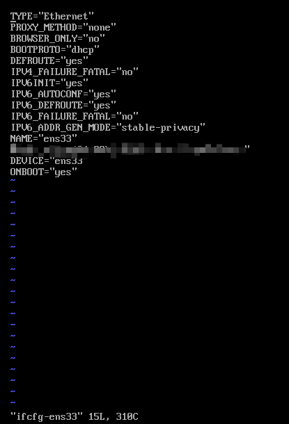

查看开启的端口

```sh
lsof -i:80  查看具体端口
[root@localhost ~]# lsof -i:80
COMMAND  PID   USER   FD   TYPE DEVICE SIZE/OFF NODE NAME
httpd   1138   root    4u  IPv6  20548      0t0  TCP *:http (LISTEN)
httpd   1738 apache    4u  IPv6  20548      0t0  TCP *:http (LISTEN)
httpd   1739 apache    4u  IPv6  20548      0t0  TCP *:http (LISTEN)
httpd   1740 apache    4u  IPv6  20548      0t0  TCP *:http (LISTEN)
httpd   1741 apache    4u  IPv6  20548      0t0  TCP *:http (LISTEN)
httpd   1742 apache    4u  IPv6  20548      0t0  TCP *:http (LISTEN)
[root@localhost ~]# netstat -aptn  //查看开启的tcp端口
Active Internet connections (servers and established)
Proto Recv-Q Send-Q Local Address           Foreign Address         State       PID/Program name
tcp        0      0 0.0.0.0:22              0.0.0.0:*               LISTEN      1139/sshd
tcp        0      0 127.0.0.1:25            0.0.0.0:*               LISTEN      1252/master
tcp        0      0 0.0.0.0:3306            0.0.0.0:*               LISTEN      1428/mysqld
tcp        0     36 10.10.9.221:22          10.10.9.180:57088       ESTABLISHED 1685/sshd: root@pts
tcp6       0      0 :::22                   :::*                    LISTEN      1139/sshd
tcp6       0      0 ::1:25                  :::*                    LISTEN      1252/master
tcp6       0      0 :::80                   :::*                    LISTEN      1138/httpd
[root@localhost ~]# netstat -apun //查看开启的udp端口
Active Internet connections (servers and established)
Proto Recv-Q Send-Q Local Address           Foreign Address         State       PID/Program name
udp        0      0 127.0.0.1:323           0.0.0.0:*                           656/chronyd
udp        0      0 0.0.0.0:68              0.0.0.0:*                           1063/dhclient
udp6       0      0 ::1:323                 :::*                                656/chronyd
用法：netstat [-vWeenNcCF] [<Af>] -r netstat {-V|--version|-h|--help}
       netstat [-vWnNcaeol] [<Socket> ...]
       netstat { [-vWeenNac] -I[<Iface>] | [-veenNac] -i | [-cnNe] -M | -s [-6tuw] } [延迟]
        -r, --route 显示路由表
        -I, --interfaces=<Iface> 显示 <Iface> 的接口表
        -i, --interfaces 显示接口表
        -g, --groups 显示多播组成员身份
        -s, --statistics 显示网络统计信息（如 SNMP）
        -M, --masquerade 显示伪装的连接
        -v, --verbose 是冗长的
        -W, --wide 不截断 IP 地址
        -n, --numeric 不解析名称
        --numeric-hosts 不解析主机名
        --numeric-ports 不解析端口名称
        --numeric-users 不解析用户名
        -N, --symbolic 解析硬件名称
        -e, --extend 显示其他/更多信息
        -p, --programs 显示套接字的 PID/程序名称
        -o, --timers 显示计时器
        -c, --continuous 连续列出
        -l, --listening 显示监听服务器套接字
        -a, --all 显示所有套接字（默认：已连接）
        -F, --fib 显示转发信息库（默认）
        -C, --cache 显示路由缓存而不是 FIB
        -Z, --context 显示套接字的 SELinux 安全上下文

  <Socket>={-t|--tcp} {-u|--udp} {-U|--udplite} {-S|--sctp} {-w|--raw}
           {-x|--unix} --ax25 --ipx --netrom
  <AF>=使用'-6|-4'或'-A <af>'或'--<af>'；默认值：inet
  可能的地址族列表（支持路由）：
    inet (DARPA Internet) inet6 (IPv6) ax25 (AMPR AX.25)
    netrom (AMPR NET/ROM) ipx (Novell IPX) ddp (Appletalk DDP)
    x25 (CCITT X.25)
```

```sh
#firewalld
systemctl start firewalld 开启firewalld服务
systemctl stop firewalld 关闭firewalld服务
systemctl enable firewalld firewalld服务开机自启
systemctl disable firewalld firewalld服务关闭开机自启
systemctl status firewalld 查看firewalld服务状态

firewall-cmd --version  # 查看版本
firewall-cmd --help     # 查看帮助
fireawll-cmd --state	#查看状态
firewall-cmd --get-active-zones  # 查看区域信息
firewall-cmd --get-zone-of-interface=eth0  # 查看指定接口所属区域
firewall-cmd --panic-on  # 拒绝所有包
firewall-cmd --panic-off  # 取消拒绝状态
firewall-cmd --query-panic  # 查看是否拒绝

firewall-cmd --reload	#更新防火墙规则
firewall-cmd --complete-reload
# 两者的区别就是第一个无需断开连接，就是firewalld特性之一动态添加规则，第二个需要断开连接，类似重启服务

# 将接口添加到区域，默认接口都在public
firewall-cmd --zone=public --add-interface=eth0
# 永久生效再加上 --permanent 然后reload防

# 查看所有打开的端口：
firewall-cmd --zone=public --list-ports

#public区域添加端口80/tcp服务  --permanent表示永久性
firewall-cmd --zone=public --add-port=80/tcp --permanent

#public区域移除端口80/tcp服务 
firewall-cmd --zone=public --remove-port=80/udp

# 查看当前区域
firewall-cmd --get-active-zones

# 显示所有公共区域（public）
[root@localhost www]# firewall-cmd --zone=public --list-all
public
  target: default
  icmp-block-inversion: no
  interfaces:
  sources:
  services: dhcpv6-client ssh
  ports: 80/tcp
  protocols:
  masquerade: no
  forward-ports:
  source-ports:
  icmp-blocks:
  rich rules:
  
  
  
# 显示服务列表  
Amanda, FTP, Samba和TFTP等最重要的服务已经被FirewallD提供相应的服务，可以使用如下命令查看：
firewall-cmd --get-services

# 查看防火墙，添加的端口也可以看到
firewall-cmd --list-all

伪装 IP

firewall-cmd --query-masquerade # 检查是否允许伪装IP
firewall-cmd --add-masquerade   # 允许防火墙伪装IP
firewall-cmd --remove-masquerade# 禁止防火墙伪装IP
端口转发

端口转发可以将指定地址访问指定的端口时，将流量转发至指定地址的指定端口。转发的目的如果不指定 ip 的话就默认为本机，如果指定了 ip 却没指定端口，则默认使用来源端口。 如果配置好端口转发之后不能用，可以检查下面两个问题：

比如我将 80 端口转发至 8080 端口，首先检查本地的 80 端口和目标的 8080 端口是否开放监听了
其次检查是否允许伪装 IP，没允许的话要开启伪装 IP
firewall-cmd --add-forward-port=port=80:proto=tcp:toport=8080   # 将80端口的流量转发至8080
firewall-cmd --add-forward-port=port=80:proto=tcp:toaddr=192.168.0.1 # 将80端口的流量转发至192.168.0.1
firewall-cmd --add-forward-port=port=80:proto=tcp:toaddr=192.168.0.1:toport=8080 # 将80端口的流量转发至192.168.0.1的8080端口
```

