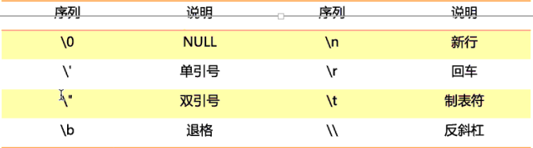

# Mysql数据库

数据库：数据库是一些关联表的集合

数据表：数据表是数据的矩阵

列：一列包含了相同的数据

行：是一组相关的数据

冗余：存储两倍数据

主键：主键是唯一的。一个数据表中只能包含一个主键，可用主键来查询数据

外键：外键用于关联两个表

符合键：复合键用于将多个列作为一个索引键，用于复合索引

索引：使用索引可以快速访问数据库表中男的特定信息，索引是对数据库表中一列或多列的值进行排序的一种结构，类似于书籍的目录

参照完整性：参照的完整性要求关系中不允许引用不存在的实体，与实体完整性是关系模型必须满足的完整性约束条件，目的是保证数据的一致性

MySQL是一个关系型数据库管理系统。是一种关联数据库管理系统

mysql.ini ：MySQL配置文件

bin：MySQL二进制程序 mysqld.exe服务端程序

mysql.exe客户端程序

连接方式：mysql -u root -p

查看数据库： show databases;

选择操作的数据库：use databasename;

查看表：show tables;

显示数据表的属性：show columns from tablename;  == desc tablename;

显示数据不的详细索引信息(包括主键)：show index from tablename;

输出MySQL数据库管理系统的性能及统计信息：show tables status like tablename\G;

\q退出

\s显示客户端数据信息

## 数据库数据类型：

|    类型     |           说明           |
| :---------: | :----------------------: |
|   TINYINT   |      1字节 -128-127      |
|  SMALLINT   |    2字节 -32768-32767    |
|  MEDIUMINT  | 3字节 -8388608 - 8388607 |
| INT/INTEGER |  4字节 -2147483648 整型  |
|    FLOAT    |    4字节 单精度浮点型    |
|   DOUBEL    |    8字节 双精度浮点型    |

#### 日期：

| 日期类型  |                     说明                     |
| :-------: | :------------------------------------------: |
|   DATA    |          3字节 日期值（YYYY-MM-DD)           |
|   TIME    |           3字节 时间值 （HH:MM:SS)           |
|   YEAR    |              1字节 年份 （YYYY)              |
| DATATIME  | 8字节 混合日期和时间值（YYYY-MM-DD HH:MM:SS) |
| TIMESTAMP |       4字节 时间戳（YYYYMMDD HHMMSS）        |

#### 字符串：

|    类型    |                    说明                    |
| :--------: | :----------------------------------------: |
|    CHAR    |            0-255字节 定长字符串            |
|  VARCHAR   |           0-65535字节 变长字符串           |
|  TINYBLOB  |   0-255字节 不超过255字符的二进制字符串    |
|    BLOB    | 0-65535字节 二进制形式的长文本数据，存图像 |
| MIDIUMBLOB |                                            |
|  LONGBLOB  |                                            |
|  TINYTEXT  |           0-255字节 短文本字符串           |
|    TEXT    |               0-65535长文本                |
| MIDIUMTEXT |                 中长度文本                 |
|  LONGTEXT  |                极大文本数据                |
|    ENUM    |                    枚举                    |
|    SET     |                    集合                    |
|    NULL    |                     空                     |

列属性

|      属性      |          说明          |
| :------------: | :--------------------: |
| NULL/NOT NULL  |    可为空或不可为空    |
| AUTO_INCREMENT |        自增属性        |
|  PRIMARY KEY   |      定义列为主键      |
|    UNSIGNED    |      数值无符号化      |
|    COMMENT     |      描述定义规则      |
|    DEFAULT     |         默认值         |
|  PRIMARY KEY   |          主键          |
|     unicue     | 保证数据唯一性（可空） |




### 数据库命令：

exit 退出数据库

创建数据库：`create database name`

导入sql语句：`source xxx.sql;`

删除数据库：`drop databasename;`

选择数据库：`use databasename;`

创建数据表：`create table table_name(column_name column_type);`

``` mysql
create user(user_id INT NOT NULL AUTO_INCREMENT,NAME VARCHAR(10) NOT NULL,TITLE VARCHAR(40) NOT NULL,submission_data DATE,PRIMARY KEY (user_id));
```

删除数据表：`DROP TABLE table_name; drop table users;`

插入数据：

```mysql
INSERT INTO table_name(field1,field2,....fieldn)VALUES(value1,value2,....valuen);
-- insert into user(user_id,age,join_time)VALUES(1,15,'2021-01-01');`
```

get_magic_quotes_gpc()函数来判断特殊字符的转义是否已经开启，没开的话调用addslashes()函数为字符串增加转义

查询数据：`SELECT column_name1,column_name2) FROM table_name [WHERE clause] [OFFSET M] [LIMIT N]`

WHERE语句包含任何条件

OFFSET指定SELECT语句开始查询的数据偏移量，默认情况为0

LIMIT属性来设定返回的记录数

where子句 条件：= < > like and or   %n以结尾

1. **%**：表示任意 0 个或多个字符。可匹配任意类型和长度的字符，有些情况下若是中文，请使用两个百分号（%%）表示。
2. **_**：表示任意单个字符。匹配单个任意字符，它常用来限制表达式的字符长度语句。
3. **[]**：表示括号内所列字符中的一个（类似正则表达式）。指定一个字符、字符串或范围，要求所匹配对象为它们中的任一个。
4. **[^]** ：表示不在括号所列之内的单个字符。其取值和 [] 相同，但它要求所匹配对象为指定字符以外的任一个字符。
5. 查询内容包含通配符时,由于通配符的缘故，导致我们查询特殊字符 “%”、“_”、“[” 的语句无法正常实现，而把特殊字符用 “[ ]” 括起便可正常查询。

`select * from table_name where conditions [and[or]] condition2 ...`

where也可再delete\update中使用

BINARY可指定where语句中字符串区分大小写

更新数据：update

`update table_name set field=value1,field2=value2 [where clause];`

e.g:`update user set user_age=12 where user_id=1;`

删除数据：delete

`delete from table_name [where clause];`

like子句：MySQL中使用%来表示任意字符，

`select field1,field2 from table1,table2 where filed1 like condition1 [and[or]] field2 = 'xx';`

排序：ORDER BY子句

`select field1,field2 from table1,table2 order by field1,field2 [asc[desc]]`

asc升序，desc降序

分组：GROUP BY 根据一个或多个列对结果进行分组

`select column_name,function(column_name) from table_name where column_name operator value group by column_name;`

WITH ROLLUP 可以实现在分组哦那估计数据基础上再进行相同的统计（SUM,AVG,COUNT)

进行分组之后再对其他的列进行统计计算。

`select name,SUM（signin) as singin_count from table_name group by name with rollup`

UNION操作符 ：合并两个或多个select语句的结果 SELECT field1 from table1 UNION select field2 from table2;  union会去重，union all不会去重d'r

NULL值处理：IS NULL 当前的值是NULL 运算符返回true ; IS NOT NULL相反  <=> 比较的两值为null返回true

#### MySQL ALTER命令

ALTER 用来修改数据表名或者修改数据表字段。

```mysql 删除某个字段
ALTER TABLE tablename DROP i; //某个表删除字段
ALTER TABLE tablenaem add i INT; //某个表添加字段，自动添加到数据表的末尾。可选择FIRST || AFTER C选择插入字段的位置。
ALTER TABLE tablename MODIFY c CHAR(10); //MODIFY将字段c的类型修改到CHAR(10)
ALTER TABLE tablename CHANGE i j BIGINTL; //CHANGE i为旧的字段名，j为新的字段名，以及新的字段类型
ALTET TABLE tablename CHANGE j j INT;  //修改j本身的字段类型
ALTER TABLE tablename MODIFY j BIGINT NOT NULL DEFAULT 100; //指定字段j为NOT NULL且默认值为100
ALTER TABLE tablename ALTER i SET DEFAULT 1000; //修改i字段的默认值为1000
ALTER TABLE tablename ALTER i DROP DEFAULT; //删除字段的默认值
ALTER TABLE tablename TYPE = MYSIAM; //修改表的类型
ALTER TABLE tablename RENAME TO newname; //对表进行重命名
```

#### MySQL连接的使用

MySQL经常需要在多个表中读取数据，可以使用MySQL中的JOIN在两个或多个表进行查询数据，

join分类

|      连接方式      |                     含义                     |
| :----------------: | :------------------------------------------: |
| INNER JOIN(内连接) |         获取两个表字段匹配关系的记录         |
| LEFT JOIN(左连接)  | 获取左表所有记录，即使右表没有对应匹配的记录 |
| RIGHT JOIN(右连接) | 获取右表所有记录，即使左表没有对应匹配的记录 |
|  FULL OUTER JOIN   |      取并集，彼此没有对应的值为 null。       |

左连接：`SELECT field FROM tableA A LEFT JOIN TABLEB B ON A.KEY = B.KEY;`

右连接：`SELECT field FROM tableA A RIGHT JOIN TABLEB B ON A.KEY = B.KEY;`

内连接：`SELECT field FROM tableA A INNER JOIN TABLEB B ON A.KEY = B.KEY;`

# MySQL事务

- MySQL事务用来处理操作量大，复杂度高的数据。
- 事务处理用来维护数据库的完整性，保证成批的SQL语句要么全部执行，要么全部不执行。
- 用来管理INSERT,UPDATE,DELETE语句

事务必须满足四个条件：原子性、一致性、隔离性、持久性

- 原子性：一组事务，要么成功；要么撤回
- 一致性：一个事务不论从开始前还是开始后，数据库的完整性不被破坏。写入的数据必须符合所有的预设规则
- 隔离性：数据库允许多个事务并发的同时对数据进行读写改操作，可以防止多个事务并发执行由于交叉执行导致数据的不椅子
- 持久性：事务在处理结束后对数据做出的修改是永久的，无法修改

```mysql
start transaction //开始一个事务 == begin
savepoint pointname //做保存点，一个事务可有多个保存点
commit //提交事务，并使数据库中进行的所有修改成为永久的 == commit work
rollback //回滚结束用户的事务，并撤销正在进行的所有未提交的修改 == rollback work
release savepoint pointname //删除一个事务的保存点，若未指定保存点，执行会报错
rollback to 标记点 //将事务滚回标记点
set transaction //设置事务的隔离级别
set autocommit = num  //改变MySQL的自动提交模式 0为自动提交 1为开启自动提交
```


## 索引

## 临时表

## 元数据

## 序列使用

## 处理重复数据

数据表设置指定的字段为PRIMARY KEY(主键) 或者 UNIQUE(唯一)保证数据的唯一性。

INSERT IGNORE INTO在插入数据的时候有重复数据就会跳过这条数据不会出错。

REPLACE INTO如果插入的数据存在相同的记录则会先删除再插入新记录。

过滤重复数据：SELECT DISTINCT field1,field2 FROM tablename ORDER BY field1;

删除重复数据：CREATE newtablename SELECT field1,field2,field3 FROM oldtablename GROUP BY (field1,field2);

## 防止SQL注入

- 对输入的内容进行校验，通过正则表达式，限制长度，双引号和双-进行转换
- 不适用动态拼装SQL，使用参数化的SQL或者直接使用存储过程进行数据库查询存储
- 为每个应用使用单独的权限有限的数据库连接
- 将机密信息进行加密或者hash
- 异常信息提示进行自定义
- 辅助软件或平台进行检测

PHP防SQL注入：使用mysql_real_escape_string()函数来转义特殊的输入字符

## 导出数据******

```mysql
SELECT * FROM tablename INTO OUTFILE '/TAM/XXX.txt';
SELECT * FROM tablename INTO OUTFILE '/tmp/xx/txt' FIELDS TERMINATED BY ',' ENCLISED BY'"' LINES TERMINATED BY '\r\n'; //指定输出的格式

```

## 导入数据

LOAD DATA 导入数据

```mysql 
LOAD DATA LOCAL INFILE 'XXX.TXT' INTO TABLE mytbl;
```


### MYSQL+php语法

mysqli_function(value,value2)

mysqli_connect(servername,username,password);是面向过程的数据库连接方式，以过程进行访问

mysqli_connect()是面向对象的方式。链接后以对象形式存在

```php
mysqli_connect(host,username,password,dbname,oort,socket);

```

mysqli_set_charset('utf-8');

mysqli_query(sql,connection);sql为sql语句，connection为连接标识符，可选

mysqli_query('drop databasename;',conncection) php删除数据库

mysqli_select_db(dbname,connection) php选择数据库、

mysqli_fetch_array(result,MYSQL_ASSOC) 从结果中取得一行作为关联数组，返回根据从结果集取得的行生成的关联数组，如果没有更多行，则返回 false。PHP mysql_fetch_array()函数第二个参数为MYSQL_ASSOC， 设置该参数查询结果返回关联数组，你可以使用字段名称来作为数组的索引。可用MySQL_NUM作为返回数字数组

mysqli_error()返回错误信息

执行完成SELECT语句后，释放游标内存，php中使用mysqli_free_result()函数实现内存的释放

```php
<?php
    $con = mysql_connect("localhost","root","password");
if(!$con){
    die("can not connect to".mysql_error());
}
if(mysql_query($sql,$con)){
    echo "success";
}
else{
    echo "failed".mysql_error();
}
mysql_select_db("dbname",$con);
$sql = "select * from tablename;";
?>
```

```php
//连接数据库返回的内容
object(mysqli)'#'1 (19) { ["affected_rows"]=> int(0) ["client_info"]=> string(79) "mysqlnd 5.0.11-dev - 20120503 - $Id: 3c688b6bbc30d36af3ac34fdd4b7b5b787fe5555 $" ["client_version"]=> int(50011) ["connect_errno"]=> int(0) ["connect_error"]=> NULL ["errno"]=> int(0) ["error"]=> string(0) "" ["error_list"]=> array(0) { } ["field_count"]=> int(0) ["host_info"]=> string(20) "localhost via TCP/IP" ["info"]=> NULL ["insert_id"]=> int(0) ["server_info"]=> string(6) "5.7.26" ["server_version"]=> int(50726) ["stat"]=> string(135) "Uptime: 35636 Threads: 2 Questions: 644 Slow queries: 0 Opens: 140 Flush tables: 1 Open tables: 29 Queries per second avg: 0.018" ["sqlstate"]=> string(5) "00000" ["protocol_version"]=> int(10) ["thread_id"]=> int(82) ["warning_count"]=> int(0) }
//执行查询sql语句返回的内容
object(mysqli_result)'#'2 (5) { ["current_field"]=> int(0) ["field_count"]=> int(6) ["lengths"]=> NULL ["num_rows"]=> int(2) ["type"]=> int(0) }
//查询一行数据查看对象返回的内容
array(12) { [0]=> string(1) "1" ["id"]=> string(1) "1" [1]=> string(6) "张飞" ["uname"]=> string(6) "张飞" [2]=> string(32) "e10adc3949ba59abbe56e057f20f883e" ["upass"]=> string(32) "e10adc3949ba59abbe56e057f20f883e" [3]=> string(11) "default.jpg" ["active"]=> string(11) "default.jpg" [4]=> string(12) "12345@qq.com" ["mail"]=> string(12) "12345@qq.com" [5]=> string(19) "2021-06-23 18:37:37" ["addtim"]=> string(19) "2021-06-23 18:37:37" }
//执行创建数据库语句返回的内容
bool(true)
//执行创建数据表语句返回的内容
bool(true)
//执行插入数据语句返回的内容
bool(true)
//执行删除数据语句返回的内容
bool(true)
//执行修改数据语句返回的内容
bool(true)
```


