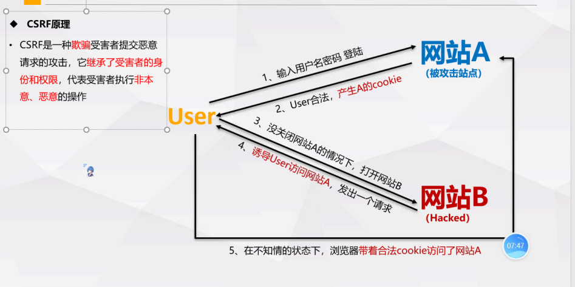
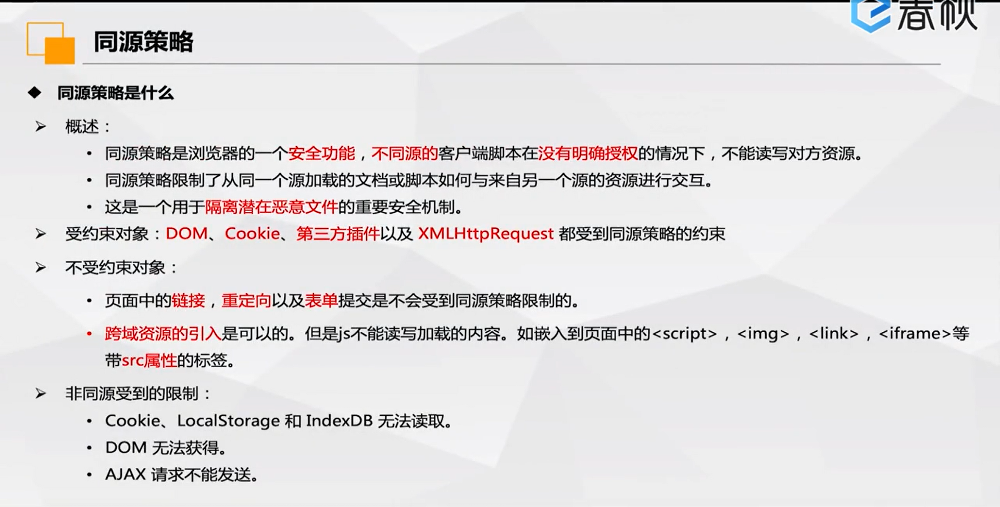

# CSRF(跨站请求伪造)

:biking_man:

### 定义

跨站请求伪造，cross-site request forgery。强制用户在当前对其进行身份验证后的web应用程序上执行非本意的操作，伪造更改状态的请求。



### 条件

1. 用户登录目标网站且生成cookie等身份凭证
2. 在身份凭证未过期的情况下访问恶意网站

### 危害

1. 攻击者盗用了用户的身份后，以用户的名义进行发送恶意请求
2. CSRF的恶意操作，又用户名义发送邮件、消息、盗取账号、
3. 个人隐私泄露、财产安全

### 防御手段

1. 验证REFERER字段、referer来自其他网站，拒绝该请求
2. 添加token验证
3. 二次验证，对特殊请求操作之前进行二次验证如验证码
4. 用户养成良好的习惯、不随意点击链接
5. WAF
6. cookie hash

### CSRF验证方法


admin/password

gordonb/abc123

1337/charley

pablo/letmein

smithy/password

## 同源策略

url中的协议、端口、域名都相同，具有同样的源

```javascript
$.ajax({url: "http://172.16.12.2/csrfpost/csrf_post_edit.php",type: "POST",crossDomain:true,xhrFields: {withCredentials: true},data: {name:"lili",sex:"girl",phonenum:"18622222225",add:"usqqqa",email:"2",submit:"submit"}})
```



关于跨域

1. 协议，域名，端口三者其中存在不同都会形成跨域；故，当协议，端口，域名三者均相同时，浏览器就会认为是同源，允许加载该资源，否则为不同源。
2. 跨域存在原因：浏览器的同源限制策略

- 请求：客户端（www.a.com） -》 服务端(www.baidu.com)
- 响应：客户端（www.a.com）《-  服务端(www.baidu.com)


#### 发生跨域时，允许进行的操作

1. 通常允许跨域写操作（link、redirect、表单提交）
2. 通常允许跨域资源嵌入（script、img、video...）
3. 通常禁止跨域读操作(ajax)
4. 可以正常发送请求，可以携带Cookie(withCredentials)，但是浏览器会限制来自于不同域的资源的接收


#### 跨域限制的资源

- 1.数据存储限制：Cookie, LocalStorage, IndexDB 无法读取
- 2.脚本 API 限制：DOM 无法操作
- 3.网络请求限制：XHR 请求无法接收响应

#### 1. Referer: HTTP请求完整来源路径（不完善）

```
针对通过 Referer 字段去判断请求来源是否合法是不太靠谱的，这个字段很有可能会丢失：

1.IE6、7下使用 window.location.href=url 进行界面的跳转或者 window.open，都会造成 Referer 丢失。

2.HTTPS 页面跳转到 HTTP 页面，所有浏览器 Referer 都丢失。

3.点击 Flash 上到达另外一个网站的时候，Referer 的情况就比较杂乱，不太可信。

可以附加使用于判断请求来源，但是仅通过该字段进行判断是不太靠谱的，如果请求头丢失该字段，则服务端无法判断当前请求来源，无法校验请求是否合法。
```


#### 2. Origin: CORS 中的请求头，当跨域访问时，会携带此请求头（不完善）

```
在以下情况不存在此请求头：

302 重定向： 
1. 在 302 重定向之后 Origin 不包含在重定向的请求中，因为 Origin 可能会被认为是其他来源的敏感信息。
2.对于 302 重定向的情况来说都是定向到新的服务器上的 URL，因此浏览器不想将 Origin 泄漏到新的服务器上。

Origin 和 Referer 存在相同的问题，同样有可能丢失该字段。
```

#### 3. **token 校验（常用方式）**

最常用的一种是通过token去校验请求是否合法：

##### 校验原理:

1. 后端生成 token，并存在 session 中。
2. 用户请求成功后，后端将 token 发送到客户端，发送方式主要是为以下两种：

（1）服务端将 token 渲染到 html 中。 也就是通过一个 dom 结点保存 token 信息，客户端就可以通过 dom 操作获取到该 token 内容。（同源策略会限制脚本 API 操作）

（2）服务端将 token 设置到 cookie 中。 客户端从 cookie 中获取（同源策略限制 cookie 操作） 3. 客户端在获取到 token 后，在下一次进行比较关键的请求操作时，将 token 发送到服务端。

发送 token 到服务端的方式主要包括两种：

- 在请求头中将获取到的 token 设置到 cookie 中。
- 将 token 放到请求参数中。

1. 服务端在接收到请求后，会从请求头中取出 token，并和 session 中的 token 进行比较，一致则表示身份验证通过，再返回相应的信息；否则，则校验不通过。

补充：

  token 校验之所以能防御 csrf，是因为相信浏览器的同源策略。为什么这么说？因为只有在同源的情况下，页面才能进行脚本操作和使用 js 获取 cookie 的操作，才能获取到 token。也就是说第三方网站是没有办法拿到 token 的。只有真正有权限的网站或页面才有办法取到 token，并将 token 传到服务端。所以服务端默认带有相应 token 的请求都是合法的请求。

注：设置 http only，禁止通过 js 操作 cookie

