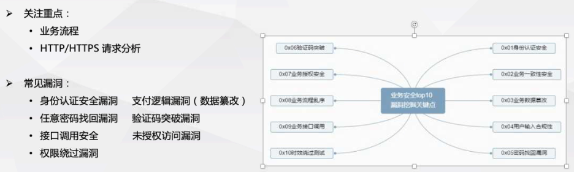
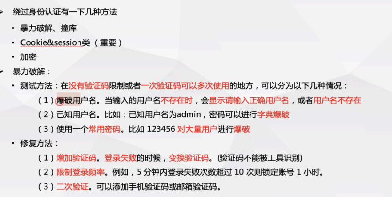
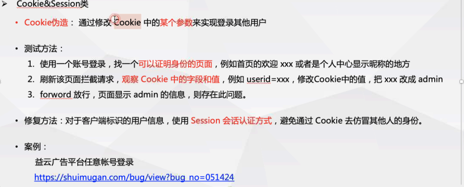
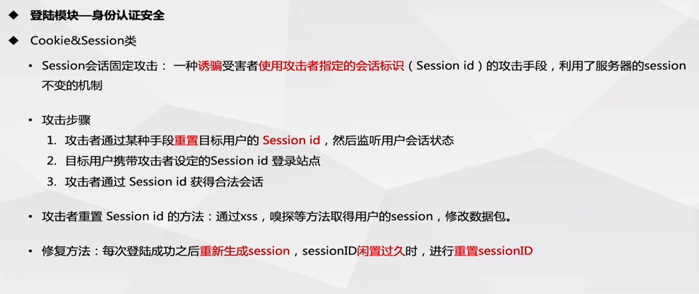
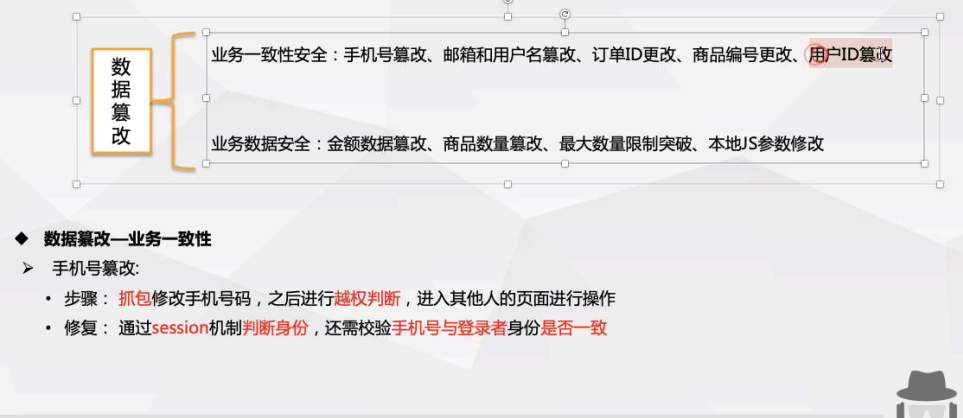
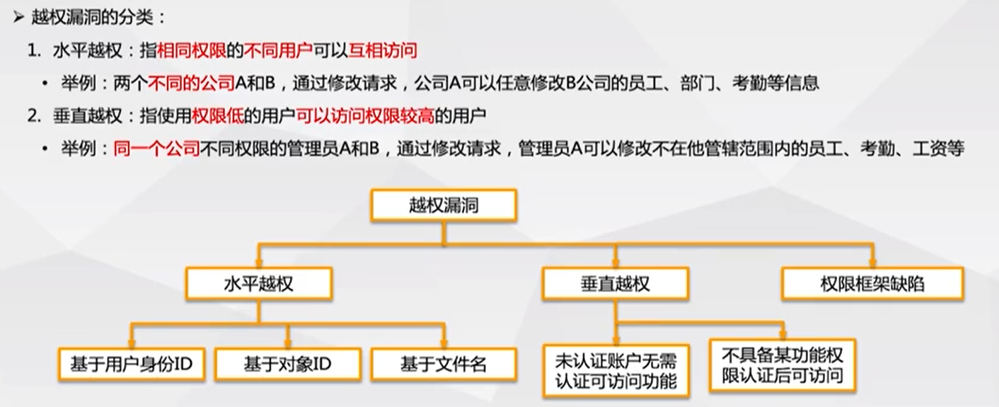

# 逻辑漏洞

由于程序逻辑不严谨或者逻辑太复杂，导致逻辑分支不能正常处理和处理错误，称为逻辑漏洞

## 身份认证安全

产生原因：网站对身份认证模块没有做好安全防护，导致漏洞产生。

## 数据篡改

1. 业务一致性安全
2. 业务数据安全

 

进入MySQL数据库

查看所有库

创建一个名为Class的数据库

选择Class数据库

创建一个student的数据表（第一个字段id(int类型，自增，主键)，第二个字段（name，字符型长度20，不能为空），第三个字段（age(int类型，不能为空)））

创建一个teacher的数据表（字段同上）  字段的内容可查看笔记，其他的尽量不看笔记  name改为tc_name  age改为tc_age  id为th_id

查看所有的表

往student分别插入数据name为zs，age为20     |  name为ls  age为21

往teacher分别插入数据name为，age为20     |  th_name为ls  th_age为21

分别查询两条数据表中的所有数据

分别查询id为1或者2的数据

查询student表中的id为1的数据且联合查询teacher表中的th_id为1的数据

### 验证码

1. 暴力破解
2. 时间、次数突破
3. 回显测试
4. 绕过测试

cookie置空，验证码置空 或者 code[]=''

### 越权漏洞

对特定资源的读写权限，

非授权访问：用户在没有通过认证授权的情况下直接访问需要通过认证才能访问的内容

开发人员在对数据进行操作的时对客户端请求的数据过分相信而遗漏了权限的判定

一般越权存在的位置

1. 修改、重置、找回账户的密码
2. 查看、修改其他账户未公开的信息（个人资料、文件、数据、程序等）
3. 与账户关联的权限操作

分为水平和垂直越权

目录遍历  ：apache配置不当

# 逻辑漏洞

 2021-08-05 [Web渗透 ](https://www.zerochen.top/categories/Web渗透/) 5.4k 字

[逻辑漏洞](https://www.zerochen.top/tags/逻辑漏洞/)

# 一、漏洞的产生

常见漏洞：

身份认证安全漏洞、支付逻辑漏洞（数据纂改）

任意密码找回漏洞、验证码突破漏洞

接口调用安全、未授权访问漏洞

# 二、权限绕过漏洞

| 说明                                                         | 方法                                                         |
| :----------------------------------------------------------- | :----------------------------------------------------------- |
| 身份认证安全： 有些网站对身份认证模块没有做好安全防护，导致漏洞产生 | 绕过身份认证有以下几种方法 1、暴力破解、撞库 2、Cookie&session类（重要）加密 3、暴力破解： 测试方法： 在没有验证码限制或者一次验证码可以多次使用的地方，可以分为以下几种情况： 爆破用户名。当输入的用户名不存在时，会显示请输入正确用户名，或者用户名不存在 已知用户名。 比如： 已知用户名为admin，密码可以进行字典爆破 使用一个常用密码。比如123456对大量用户进行爆破  修复方法： 1、增加验证码。登录失败的时候，变换验证码。(验证码不能被工具识别) 2、限制登录频率。例如，5分钟内登录失败次数超过10次则锁定账号1小时。 3、二次验证。可以添加手机验证码或邮箱验证码。 |
| Cookie伪造： 通过修改Cookie中的某个参数来实现登录其他用户    | 测试方法： 1.使用一个账号登录，找一个可以证明身份的页面，例如首页的欢迎xxx或者是个人中心显示昵称的地方 2.刷新该页面拦截请求，观察Cookie中的字段和值，例如userid=xxx，修改Cookie中的值，把xxx改成admin 3.forword放行，页面显示admin的信息，则存在此问题。  修复方法： 对于客户端标识的用户信息，使用Session会话认证方式，避免通过Cookie去仿冒其他人的身份。 |
| Session会话固定攻击： 一种诱骗受害者使用攻击者指定的会话标识（Sessionid）的攻击手段，利用了服务器的session不变的机制 | 攻击步骤： 1、攻击者通过某种手段重置目标用户的Sessionid，然后监听用户会话状态 2、目标用户携带攻击者设定的Sessionid登录站点 3、攻击者通过Sessionid获得合法会话  攻击者重置Sessionid的方法： 通过xss，嗅探等方法取得用户的session，修改数据包。 修复方法： 每次登陆成功之后重新生成session，sessionID闲置过久时，进行重置sessionID |
| 加密测试                                                     | 概念： 有些网站在前端加密，然后传到后台直接和数据库里的值做对比，这时抓包就知道加密方式，然后做暴力破解。  测试方法： 1、用账号密码登录，拦截请求，查看传输信息是不是通过一些加密方式对账号和密码进行了加密，如果有则存在此问题 2、对于前端加密后的密码进行暴力破解测试时，可以在BurpSuite的Intruder模块 PayloadProcessing中选择加密方式  修复方法： 把加密对比的方法放到后台去执行 |

# 三、数据篡改

数据纂改分为两方面：

1、业务一致性安全：手机号篡改、邮箱和用户名篡改、订单ID更改、商品编号更改、用户ID篡改

2、业务数据安全：金额数据篡改、商品数量篡改、最大数量限制突破、本地JS参数修改

| 方法             | 说明                                                         |
| :--------------- | :----------------------------------------------------------- |
| 手机号篡改       | 步骤： 抓包修改手机号码，之后进行越权判断，进入其他人的页面进行操作  修复： 通过session机制判断身份，还需校验手机号与登录者身份是否一致 |
| 邮箱和用户名纂改 | 步骤： 抓包修改用户名和邮箱为其他用户或邮箱  修复： 通过session机制判断身份，如需传输邮件，要判断发件人与session一致 |
| 订单ID纂改       | 步骤： 注册一普通账号，修改遍历订单ID，获取其他用户订单详情（平行越权）  修复： 查看订单是通过session判断用户身份，做好平行权限控制 |
| 商品编号纂改     | 步骤： 提交订单时，抓包修改商品标号，导致商品与价格不符却交易成功 举例： 例如100个积分只能换商品编号为001,1000个积分只能换商品编号005，在100积分换商品的时候抓包把换商品的编号修改为005，用低积分换取高积分商品。  修复： 金额不在客户端传入，防止被篡改，如必要，则务必检查交易金额与商品价格或对支付金额做签名校验 |
| 用户ID纂改       | 步骤：抓包查看用户的ID，修改ID（加减1），查看是否能查看其它用户id信息。 修复：通过session机制判断身份，如果必须用userID参数，要判断与session是否一致 |
| 金额数据纂改     | 步骤： 在提交订单时进行抓包，修改支付的金额或折扣等相关数据。  修复： 商品信息如金额、折扣等原始数据校验应来自于服务器端，不应接受客户端传来的值 |
| 商品数量纂改     | 步骤： 抓包修改商品数量等字段，将请求中的商品数量修改为负数或0，查看能否以修改后的数量完成业务流程。  修复： 产生异常的交易行为时直接限制、阻断 |
| 本地JS参数纂改   | 步骤： 部分应用程序通过Javascript处理用户提交的请求，通过修改Javascript脚本，测试修改后的数据是否影响到用户。  修复： 服务器校验；跨平台支付调用接口，要做好数据的完整性校验，确保一致性 |
| 最大数限制突破   | 步骤： 很多商品限制用户购买数量时，服务器仅在页面通过js脚本限制，没有在服务器端校验用户提交的数量，通过抓包修改商品最大数限制，将请求中的商品数量改为大于最大数限制的值，查看能否以修改后的数量完成业务流程。  修复： 每次提交都对其对应的各项信息做强校验 |

# 四、业务授权安全

越权漏洞的分类：

| 说明                                              |                                                              |
| :------------------------------------------------ | :----------------------------------------------------------- |
| 水平越权 指相同权限的不同用户可以互相访问         | 漏洞危害： 如果出现此漏洞，那么将可能会造成大批量数据泄露，严重的甚至会造成用户信息被恶意篡改。 |
| 垂直越权 指使用权限低的用户可以访问权限较高的用户 | 举例： 同一个公司不同权限的管理员A和B，通过修改请求，管理员A可以修改不在他管辖范围内的员工、考勤、工资等 |

**漏洞危害：**

向上越权：普通用户可以执行管理员权限，比如发布文章、删除文章等操作。

向下越权：一个高级用户可以访问低级用户信息（暴露用户隐私）

**检测手段：**

查看所有敏感涉及到账户的操作是否有除了UID之外的验证方式，没有的话构造uid访问，可检查是否有漏洞，这里的uid代指username、email、userid等声称的账户信息

如果有验证参数，尝试是否是可以预知的或者可以猜测出来的。不是，没有漏洞，是，有漏洞，构造请求验证漏洞

**发生越权行为的修复方法：**

1、涉及用户信息的操作需要验证用户身份，比如查看各种用户信息的情况下，不能只根据用户uid去搜索，应该再次进行身份验证

2、特别敏感的操作应该进行二次操作

# 五、任意密码找回的方法

| 方法               | 说明                                                         |
| :----------------- | :----------------------------------------------------------- |
| 用户凭证暴力破解   | 概念： 常见的是找回密码的验证码为4位，并且服务端没有加以限制，我们可以通过爆破出验证码的方式来找回密码 步骤： 验证码的位数：4or6，验证码有效时间：1min-15min 验证码爆破防护绕过  修复： 增加验证码复杂性和长度 限制请求修改次数 |
| 返回凭证           | 返回凭证的三种形式 1、url返回凭证 2、抓包返回凭证 3、凭证在页面中  方法： 1、URL返回凭证 使用firefox的firebug查看请求链接，看链接中是否有验证码等密码找回凭证 2、抓包直接返回 根据手机号找回密码后抓包，可以发现验证码直接显示verifycode=xxxx，如果信息被加密，解密即可（其他信息同理） 3、密码找回凭证在页面中 通过密保问题找回密码，查看源码，密保问题和答案就在源码中显示 |
| 邮箱弱token        | 获取邮箱弱token的方法： 1、Unix时间戳+md5 例如：通过邮箱找回密码，正常流程去邮箱查看重置密码链接，发现链接处有一串md5加密字符串。字符串解密，类似1491293277（10位），可以判断为Unix时间戳。 重置他人密码只需利用他人邮箱发送重置密码邮件，在短时间内对Unix时间戳进行暴力破解，即可获得重置密码的链接 2、用户名 例如：重置密码链接直接使用用户名进行区别，改变用户名即可更改他人密码 3、服务器时间 例如： 利用两个帐号同时点击找回密码，去邮箱查看找回密码的链接，发现两者的随机token只差1-2，而且可以猜测出为服务器时间。所以可以用一个未知帐号和一个已知帐号同时点击找回密码，稍微遍历随机token，就可以构造出未知帐号的密码找回链接 |
| 用户凭证有效性     | 通过用户凭证有效性修改密码： 1、短信验证码 通过他人手机号找回密码，抓包，将他人手机号替换成自己的手机号，获取验证码，提交后修改密码。 通过自己手机号找回密码，获取验证码后抓包，将数据包中的username改为他人用户名，提交后成功修改他人密码 2、邮箱token 通过邮箱找回密码，访问链接重置密码，输入新密码提交时抓包，虽然有token，但依然可以直接修改用户ID进而修改密码  案例：短信验证码 P2P之通融易贷存在设计缺陷可重置任意用户密码https://www.uedbox.com/post/19507/ 说明：点击修改密码时抓包，将邮箱号修改为自己的邮箱号，验证码就被发送到自己的邮箱中 |
| 重新绑定手机和邮箱 | 1、手机绑定： 给已知账户绑定手机，发现绑定手机的URL链接中有uid参数，修改uid参数为他人的，即可实现将他人的账户绑定上自己的手机，之后通过手机修改密码 修改个人资料处抓包，修改userId为他人，修改手机号为自己的手机，即可实现将他人的账户绑定上自己的手机，之后通过手机来修改密码  2、邮箱绑定： 通过邮箱找回密码，URL链接中修改用户ID为他人，邮箱不变，之后通过链接可以将他人账户绑定为自己的邮箱，之后通过邮箱找回密码 |
| 服务器验证         | 1、最终提交步骤 使用邮箱找回密码，通过链接至修改密码页面，修改密码后提交、抓包，获得Uid参数，修改为他人，即可修改其他用户密码 2、服务器验证的验证逻辑为空（绕过认证） 通过密码保护问题找回密码，抓包，将密码保护问题删除，直接修改密码，提交 注：此处密保问题和新密码在同一页面  案例1：最终提交步骤 携程旅行网任意用户密码修改说明：通过修改密码邮件，进行密码修改，提交时进行抓包。将Uid改为别人的，即可修改其他人的密码 |
| 修改凭证           | 修改凭证找回密码的方法 1、修改手机号码 2、修改邮箱地址       |
| 跳过验证           | 跳过验证步骤、找回方式、直接到设置新密码页面 1、正常流程下，密码找回，查看最后设置新密码页面的URL，记录下来。继续返回密码找回处，输入其他用户名，提交找回申请，直接访问上面记录下的修改密码页面，成功修改密码 2、正常流程下，修改密码页面抓包，修改其中的USERNAME_COOKIE为其他用户（有可能会经过编码，比如base64），提交即可修改其他用户密码，如果抓包其中有step参数，可以修改这个参数为最后一步（比如：5），提交便可略过之前的步骤 |
| 本地验证           | 1、在本地验证服务器的返回信息，确定是否执行密码重置，但是其返回信息是可控的内容，或者是可以获得的内容 例如：通过手机找回密码，随便输入验证码，抓包，发送，拦截response包（Burpsuite中可以选取do intercept–>response to this request），修改response包中的返回码，继续发送，说不定就可以绕过验证，直接跳到修改密码的页面。 2、发生短信等验证信息的动作在本地执行，可以通过修改request包进行控制 例如：通过用户名找回密码，提交后会自动发送验证码到手机中，抓包，修改手机为自己的手机（如果其中有type之类的参数，也可以尝试修改，有email之类的参数，可以尝试删除内容），发送修改后的包，手机成功接收验证码。输入验证码，继续发送，抓包，如果有type之类的参数，可以继续尝试修改，发送就可以成功修改密码 |
| Token生成可控      | token生成可控 举例： 1、通过邮箱找回密码，正常流程下，抓包查看提交验证码后返回的数据，有加密字符串，这个加密字符串和后面重新设置新密码URL链接中的加密字符串一样，所以可以利用这个加密字符串 2、根据上面提交验证码的抓包，修改User为其他用户（User有可能会使用md5加密），发送，就可以返回其他用户的加密字符串 3、重新返回到找回密码首页，利用其他用户找回，点下一步，到输入验证码处，直接修改URL链接，加入加密字符串，可以直接绕过验证码，重置密码 |
| 注册覆盖           | 注册覆盖 举例： 注册重复的用户名，例如admin，相当于修改了密码 |
| Session覆盖        | Session覆盖 举例： 同一浏览器，首先输入自己的账户进行邮箱密码找回，进入邮箱查看链接，接着输入他人账户，进行密码找回，返回刚刚自己的邮箱点击链接，由于session覆盖导致了，这个链接成为了修改他人密码的链接，成功修改他人密码 |

# 六、验证码突破

验证码突破方法

| 方法           | 说明                                                         |
| :------------- | :----------------------------------------------------------- |
| 暴力破解       | 方法 1、有的验证码输入正确一次，在一定时间内不用再输入。 2、有的验证码输入正确一次，会在你session中设定一个值，告诉服务器你已经通过验证码验证了。 3、有的验证码因为逻辑问题只是一个摆设，正常的逻辑为先对比验证码是否正确，再检测账号密码是否正确，反过来了 4、删除cookie，将验证码参数va=1234变成va[]=1234  修复建议： 1、提高验证码的长度、复杂度 2、可限制错误登录次数、有效时间突破验证码的方法 |
| 时间、次数突破 | 概念： 重复提交携带验证码的数据包，查看返回包，判断次数 测试方法：填写正确登录信息和验证码–>抓取提交数据包–>重复提交该数据包–>查看是否登录成功–>登录成功则存在验证码重复使用问题  案例： Step1、输入正确信息点击登录时抓包 Step2、抓包，通过修改imageField参数的大小来实现暴力提交，自设一个两位数数字字典作为payloadStep3.查看任意响应包是否登录成功，从结果来看，暴力重复提交的数据包均登录成功。 |
| 回显测试       | 概念： 验证码直接由客户端生成，在回显中显示，可通过浏览器工具直接查看 测试方法： 1、在源码中显示。源代码审计，搜索源码中有无验证码 2、在COOKIE中显示。抓包时分析COOKIE中是否含有验证码 案例： Step1、输入相关信息 Step2、抓包，得到验证码 Step3、输入验证码。验证通过 |
| 绕过测试       | 漏洞成因：由于逻辑设计缺陷，可绕过验证，比如直接删除COOKIE或验证码参数可绕过、当验证不通过清空session时，验证码参数值为空时绕过等。 测试方法： 1、抓包，删除验证码字段，查看是否可以成功发送 2、抓包，正常流程下，记录验证码后的数据包，替换目标包中内容，直接发送，查看是否可以直接绕过验证码 案例： Step1、输入正确账户信息和错误验证码，登录时抓包 Step2、删除COOKIEStep3.客户端登陆成功 |

# 七、接口调用安全

| 方法                    | 说明                                                         |
| :---------------------- | :----------------------------------------------------------- |
| 重放攻击                | 在短信、邮件调用业务或生成业务数据环节中（类：短信验证码，邮件验证码，订单生成，评论提交等），对其业务环节进行调用（重放）测试 常见类型： 短信轰炸（末尾空格、\n绕过） 恶意注册  修复： 1、对评论提交等操作采用验证码机制，防止生成数据业务被恶意调用； 2、短信/邮件接口，需要对接调用频率进行控制或者上限限制； 3、每一个订单（接口访问）使用唯一的token，提交一次后，token失效 |
| 内容编辑                | 例如： 点击获取短信验证码，抓包，可以修改短信内容，实施下一步攻击  修复： 从客户端处获取手机号、邮箱等账号信息，要与Session中的凭证进行核验，验证通过后才允许进行业务操作。 |
| 接口调用遍历漏洞        | Web接口一般将常见的一些功能需求进行封装，通过传入不同的参数来获取对应的数据或者执行相应的功能，其中最常见的场景就是通过接口传入id参数，返回对应id的信息。此类接口如请求合法性校验不严，很容易出现非授权访问或者越权访问的问题。  修复： 1、在session中存储当前用户的凭证或者id，只有传入凭证或者id参数值与session中的一致才返回结果。 2、一般涉及身份校验的接口，不要直接将敏感信息的明文信息在客户端与服务端间传递，可以将敏感信息在服务端关联到用户标识ID，在客户端保存用户标识ID并提交到服务端，服务端根据ID取出对应信息后进行校验； |
| 接口未授权访问/调用漏洞 | 在正常的业务中，敏感功能的接口需要对访问者的身份进行验证，验证通过后才允许调用接口进行操作。接口未做身份验证或身份校验不严，可能导致非授权访问或越权调用，越权又分为垂直越权和水平越权。  修复： 1、采用Token校验的方式，在url中添加一个Token参数，只有Token验证通过才返回接口数据且Token使用一次后失效； 2、在接口被调用时，服务器端对会话状态进行验证，如果已经登录，便返回接口数据；如未登录，则返回自定义的错误信息； 3、未授权访问接口做Session认证，并对用户访问的每一个URL做身份鉴别，正确的校验用户id及token等； 4、服务器端需校验身份唯一性，访问接口来源验证，不同身份只能查看修改删除添加自己的信息。 |
