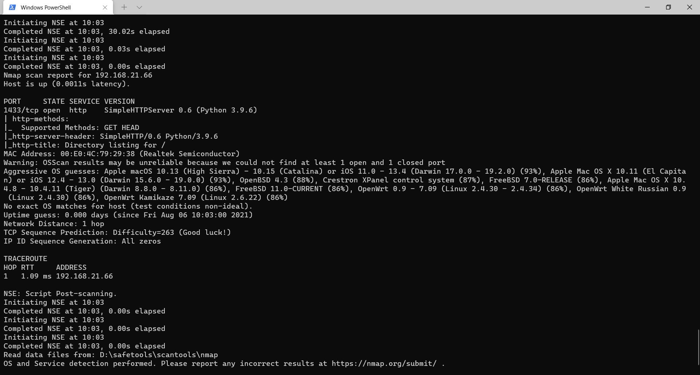
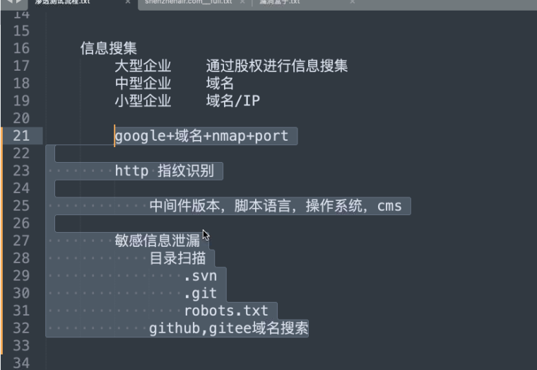

# 信息收集

渗透测试流程

1. 前期交互

   渗透人员+甲方客户=签授权合同

   规定攻击方式

   规定渗透范围

   规定法律相关

   规定信息泄露相关

2. 信息搜集

   大型企业：通过股权进行信息搜集

   中型企业：域名+ip

   小型企业：IP

   Google hacking

3. 威胁建模

4. 渗透测试

5. 后渗透测试

6. 报告阶段

主动搜集：与目标主机进行交互，获取目标信息

被动搜集：不与主机进行直接交互，通过搜索引擎查询

site:xxx.com

inurl:login

allinurl:login admin

intext:正文包含

allintext:正文包含多个关键字

intitle:标题

### 子域名收集

googlehacking  site:域名

dnsdumpster.com  扫域名


### 其他信息搜集


### nmap的使用

nmap 192.168.21.1-254          |   192.168.21.1/24

nmap 192.168.21.1 192.168.21.2 192.168.21.14(多个ip)

nmap -iL  ip.txt (文件中包含ip)

namp -h -a -b 192.168.21.11（参数在最前，ip在最后）

-sn 判断主机是否在线

-Pn 不进行主机扫描  进行端口扫描（默认1000个端口）

-v 显示进度 -vv详细程度高

--top-ports 指定端口数量（默认1000）

-p 指定端口 22,23,23,900-1000

-A 端口的详细信息




-O 识别主机操作系统

-sS  SYN包半开放扫描

-sT 完整的TCP会话扫描

-sU  UDP扫描

--script 指定脚本

nmap --script vmvare -p  -Pn 443 

-oN 指定输出文件

-oX xml文件

```nmap
用法：nmap [扫描类型] [选项] {目标规范}
目标规格：
  可以传递主机名、IP 地址、网络等。
  例如：scanme.nmap.org、microsoft.com/24、192.168.0.1； 10.0.0-255.1-254
  -iL <inputfilename>：从主机/网络列表输入
  -iR <num hosts>：选择随机目标
  --exclude <host1[,host2][,host3],...>：排除主机/网络
  --excludefile <exclude_file>: 从文件中排除列表
主机发现：
  -sL：列表扫描 - 简单地列出要扫描的目标
  -sn：Ping 扫描 - 禁用端口扫描
  -Pn：将所有主机视为在线——跳过主机发现
  -PS/PA/PU/PY[portlist]：TCP SYN/ACK、UDP 或 SCTP 发现到给定端口
  -PE/PP/PM：ICMP 回显、时间戳和网络掩码请求发现探测
  -PO[协议列表]：IP协议Ping
  -n/-R：从不进行 DNS 解析/始终解析 [默认：有时]
  --dns-servers <serv1[,serv2],...>：指定自定义 DNS 服务器
  --system-dns：使用操作系统的 DNS 解析器
  --traceroute：跟踪每台主机的跳跃路径
扫描技术：
  -sS/sT/sA/sW/sM：TCP SYN/Connect()/ACK/Window/Maimon 扫描
  -sU：UDP 扫描
  -sN/sF/sX：TCP Null、FIN 和 Xmas 扫描
  --scanflags <flags>：自定义 TCP 扫描标志
  -sI <僵尸主机[:probeport]>：空闲扫描
  -sY/sZ：SCTP INIT/COOKIE-ECHO 扫描
  -sO：IP协议扫描
  -b <FTP 中继主机>：FTP 反弹扫描
端口规格和扫描顺序：
  -p <端口范围>：只扫描指定端口
    例如：-p22; -p1-65535; -p U:53,111,137,T:21-25,80,139,8080,S:9
  --exclude-ports <端口范围>：从扫描中排除指定的端口
  -F：快速模式 - 扫描比默认扫描更少的端口
  -r：连续扫描端口 - 不要随机化
  --top-ports <number>: 扫描 <number> 最常见的端口
  --port-ratio <ratio>：扫描比<ratio>更常见的端口
服务/版本检测：
  -sV：探测开放端口以确定服务/版本信息
  --version-intensity <level>：设置从 0（轻）到 9（尝试所有探测器）
  --version-light：限制为最可能的探测（强度 2）
  --version-all：尝试每个探针（强度 9）
  --version-trace：显示详细的版本扫描活动（用于调试）
脚本扫描：
  -sC：相当于--script=default
  --script=<Lua scripts>: <Lua scripts> 是逗号分隔的列表
           目录、脚本文件或脚本类别
  --script-args=<n1=v1,[n2=v2,...]>：为脚本提供参数
  --script-args-file=filename: 在文件中提供 NSE 脚本参数
  --script-trace：显示所有发送和接收的数据
  --script-updatedb：更新脚本数据库。
  --script-help=<Lua 脚本>：显示有关脚本的帮助。
           <Lua scripts> 是一个以逗号分隔的脚本文件列表或
           脚本类别。
操作系统检测：
  -O：启用操作系统检测
  --osscan-limit：将操作系统检测限制为有希望的目标
  --osscan-guess：更积极地猜测操作系统
时间和性能：
  需要 <time> 的选项以秒为单位，或附加 'ms'（毫秒），
  's'（秒）、'm'（分钟）或 'h'（小时）到值（例如 30m）。
  -T<0-5>：设置时序模板（越高越快）
  --min-hostgroup/max-hostgroup <size>：并行主机扫描组大小
  --min-parallelism/max-parallelism <numprobes>：探针并行化
  --min-rtt-timeout/max-rtt-timeout/initial-rtt-timeout <时间>：指定
      探测往返时间。
  --max-retries <tries>：限制端口扫描探测重传的次数。
  --host-timeout <time>: 这么长时间后放弃目标
  --scan-delay/--max-scan-delay <time>：调整探针之间的延迟
  --min-rate <number>：每秒发送数据包的速度不低于 <number>
  --max-rate <number>：每秒发送数据包的速度不超过 <number>
防火墙/IDS 逃避和欺骗：
  -F; --mtu <val>：分段数据包（可选w/给定的 MTU）
  -D <decoy1,decoy2[,ME],...>：用诱饵隐藏扫描
  -S <IP_Address>：欺骗源地址
  -e <iface>：使用指定的接口
  -g/--source-port <portnum>：使用给定的端口号
  --proxies <url1,[url2],...>：通过 HTTP/SOCKS4 代理中继连接
  --data <hex string>：将自定义负载附加到发送的数据包
  --data-string <string>：将自定义 ASCII 字符串附加到发送的数据包
  --data-length <num>：将随机数据附加到发送的数据包中
  --ip-options <options>: 发送指定ip选项的数据包
  --ttl <val>: 设置 IP 生存时间字段
  --spoof-mac <mac 地址/前缀/供应商名称>：欺骗您的 MAC 地址
  --badsum：发送带有伪造 TCP/UDP/SCTP 校验和的数据包
输出：
  -oN/-oX/-oS/-oG <file>: 正常输出扫描, XML, s|<rIpt kIddi3,
     和 Grepable 格式，分别为给定的文件名。
  -oA <basename>：一次输出三种主要格式
  -v：增加详细级别（使用 -vv 或更多以获得更大的效果）
  -d：提高调试级别（使用 -dd 或更多以获得更大的效果）
  --reason：显示端口处于特定状态的原因
  --open：只显示开放（或可能开放）的端口
  --packet-trace：显示所有发送和接收的数据包
  --iflist：打印主机接口和路由（用于调试）
  --append-output: 附加到而不是
  n clobber 指定的输出文件
   --resume <文件名>：恢复中止的扫描
   --stylesheet <path/URL>：将 XML 输出转换为 HTML 的 XSL 样式表
   --webxml：来自 Nmap.Org 的参考样式表以获得更可移植的 XML
   --no-stylesheet：防止将 XSL 样式表与 XML 输出相关联
杂项：
   -6：启用 IPv6 扫描
   -A：启用操作系统检测、版本检测、脚本扫描和traceroute
   --datadir <dirname>：指定自定义Nmap数据文件位置
   --send-eth/--send-ip：使用原始以太网帧或 IP 数据包发送
   --privileged：假设用户拥有完全特权
   --unprivileged：假设用户没有原始套接字权限
   -V：打印版本号
   -h：打印此帮助摘要页。
例子：
   nmap -v -A scanme.nmap.org
   nmap -v -sn 192.168.0.0/16 10.0.0.0/8
   nmap -v -iR 10000 -Pn -p 80
有关更多选项和示例，请参阅手册页 (https://nmap.org/book/man.html)
```


### http指纹识别

中间件版本、脚本语言、操作系统、cms

敏感信息泄露

1. 目录
2. .svn
3. .git
4. robots.txt
5. github,gitee

### 威胁建模

分析搜集到的信息，可能存在的漏洞点

| 

|

\/

**渗透测试** 常规的漏洞挖掘

后渗透测试：有指向性的获取目标数据     

**输出报告**




### **4.指纹识别的对象**

1、CMS信息：比如大汉CMS、织梦、帝国CMS、phpcms、ecshop等；

2、前端技术：比如HTML5、jquery、bootstrap、pure、ace等；

3、Web服务器：比如Apache、lighttpd, Nginx, IIS等；

4、应用服务器：比如Tomcat、Jboss、weblogic、websphere等；

5、开发语言：比如PHP、Java、Ruby、Python、C#等；

6、操作系统信息：比如linux、win2k8、win7、kali、centos等；

7、CDN信息：是否使用CDN，如cloudflare、360cdn、365cyd、yunjiasu等；

8、WAF信息：是否使用waf，如Topsec、Jiasule、Yundun等；

9、IP及域名信息：IP和域名注册信息、服务商信息等；

10、端口信息：有些软件或平台还会探测服务器开放的常见端口。

```google
基本语法：
site：可以限制你搜索范围的域名；
inurl：用于搜索网页上包含的URL，这个语法对寻找网页上的搜索，帮助之类的很有用；
intext: 只搜索网页部分中包含的文字(也就是忽略了标题、URL等的文字)；
intitle: 查包含关键词的页面，一般用于社工别人的webshell密码；
filetype：搜索文件的后缀或者扩展名；
intitle：限制你搜索的网页标题；
查找后台地址：
site:域名inurl:login|admin|manage|member|admin_login|login_admin|system|login|user|main|cms
查找文本内容：
site:域名 intext:管理|后台|登陆|用户名|密码|验证码|系统|admin|login|sys|managetem|password|username
查找可注入点：
site:域名 inurl:aspx|jsp|php|asp
查找上传漏洞：
site:域名 inurl:file|load|editor|Files
找eweb编辑器：
site:域名 inurl:ewebeditor|editor|uploadfile|eweb|edit
存在的数据库：
site:域名 filetype:mdb|asp|#
查看脚本类型：
site:域名 filetype:asp/aspx/php/jsp
迂回策略入侵：
inurl:cms/data/templates/images/index/

高级语法：
1.搜索社交媒体

在用于搜索社交媒体的字词前加上 @。例如：@twitter。

2.搜索特定价格

在数字前加上 $。例如：camera $400。

3.搜索 # 标签

在字词前加上 #。例如：#throwbackthursday。

4.从搜索结果中排除特定字词

在要排除的字词前加上 -。例如：jaguar speed -car。

5.搜索完全匹配的结果

为字词或短语加上引号。例如：“tallest building”。

6.在某个数字范围内执行搜索

在两个数字之间加上 …。例如：camera $50…$100。

7.组合搜索

在各个搜索查询之间加上“OR”。例如：marathon OR race。

8.搜索特定网站

在相应网站或网域前加上“site:”。例如：site:youtube.com 或 site:.gov。

9.搜索相关网站

在已知网址前加上“related:”。例如：related:time.com。

10.查看网站的 Google 缓存版本

在相应网址前加上“cache:”。

11.网页标题中必须含有某个词 intitle:语法

如果：intitle:高跟鞋

搜索出来的网页标题就会含有高跟鞋三个关键词。这个也可以结合“site:”语法，如：intitle:高跟鞋 site:fzdp123.com，但在高跟鞋的后面必需加上空格，不然搜索不出东西。

12.搜索出来的网页中必须包含某个关键词 intext:语法

如：intext:名媛高跟鞋

这个搜索出来的内容除了标题带有“名媛高跟鞋”，网页中的内容也同样带有“名媛高跟鞋”，此方法可以作为全文搜索。

13.只在网页里查找包含以下某个关键词的内容 allintext:语法

例如：allintext:高跟鞋

14.查找两个字或词在不超过指定的距离 AROUND语法

例如：高跟鞋 AROUND(5) 恨天高

以上举例中的例子，代表高跟鞋与恨天高之间的距离不超过5个字。

15.网址中包含特定的词 inurl:语法

如：inurl:高跟鞋

搜索出来的网址中基本上都带有高跟鞋这个关键字。

16.网址中包含以下所有词 allinurl:语法

例如：allinurl:高跟鞋 恨天高

这样搜索出来的结果网址中就会包含高跟鞋。

17.搜索指定类型的文件 filetype:语法

例如：游戏 filetype:rar

搜索出来的内容基本上都是rar压缩文件包。

18.搜索词语的解释
————————————————
版权声明：本文为CSDN博主「爱上卿Ooo」的原创文章，遵循CC 4.0 BY-SA版权协议，转载请附上原文出处链接及本声明。
原文链接：https://blog.csdn.net/qq_32434307/article/details/107244142
```

