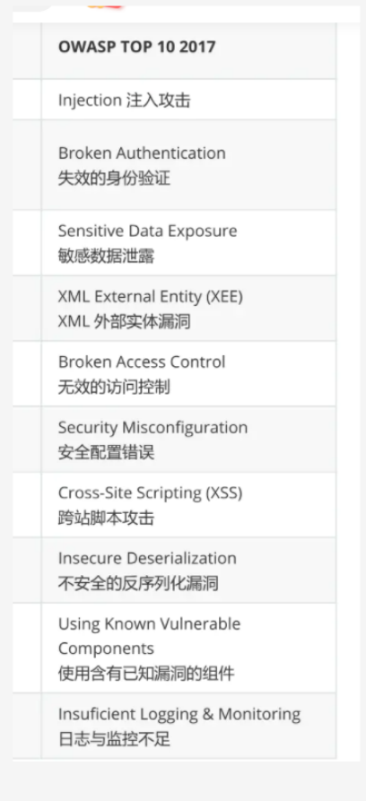

### 注入攻击：sql注入  

在 2013、2017 的版本中都是第一名，可见此漏洞的引入是多么的容易，同时也证明此漏洞的危害有多么严重。

#### 攻击方式

利用应用程序弱点，通过恶意字符将恶意代码写入数据库，获取敏感数据或进一步在服务器执行命令。

#### 漏洞原因

未审计的数据输入框

使用网址直接传递变量

未过滤的特殊字符

SQL 错误回显

#### 漏洞影响

获取敏感数据或进一步在服务器执行命令接管服务器

#### SQL 注入

其实注入有很多类型，常见的注入包括：SQL、OS 命令、ORM、LDAP和表达式语言或者 OGNL 注入，对于应用解释器来说这些概念都是相同的。对于最常见的SQL注入，后端开发人员经常会拼接 SQL 查询；在不经意间就引入了 SQL 注入漏洞。

一个例子

```
select * from users where pwd='输入字符'
-- 恶意代绕过 ' or 1=1 --'
select * from uses where pwd = '' or 1=1 --'
```

SQL 注入工具

作为最强大的 SQL 注入工具，这里要介绍下基于 python开发的 SQLmap，SQLmap 支持对 PostgreSql，MySQL，Access，MsSql Server 等数据库的自动化注入。是在检查SQL注入漏洞方面最得力的工具。

#### SQL 注入防护

关闭 SQL 错误回显

前端输入字符白名单验证（长度、类型等）

对输入的特殊字符使用转义处理

SQL 操作使用 PreParedStatement

SQL 服务运行于专门的账号，并且使用最小权限

限制 SQL 服务的远程访问，只开放给特定开发人员

代码审计，最有效的检测应用程序的注入风险的方法之一

使用成熟的 waf

### A2 失效的身份认证

#### 攻击方式

攻击者利用网站应用程序中的身份认证缺陷获取高权限并进行攻击应用服务

#### 漏洞原因

应用程序身份认证系统认证缺陷

#### 漏洞影响

盗用账号与身份

#### 常见设计缺陷

修改利用网络协议数据包获取使用者账号密码

网站设计不良，可直接绕过验证页面

使用者忘记注销，而让攻击者有可趁之机

弱密码

#### 弱密码攻击

身份认证非常容易受到弱密码攻击，常用的弱密码攻击方式有

常用密码攻击 - 使用泄露的密码字典攻击

使用公司名称缩写、域名、电话号码

全数字、英文的简单密码

账号与密码相同的

不同网站、电脑、APP 使用了相同的密码

#### 漏洞防护

网站的登录页面就使用加密连接

网站应该具体良好的权限控制与管理

网站应该具备超时注销机制

### A3 敏感数据泄露

#### 攻击方式

常见的攻击方式主要是扫描应用程序获取到敏感数据

#### 漏洞原因

应用维护或者开发人员无意间上传敏感数据，如 github 文件泄露

敏感数据文件的权限设置错误，如网站目录下的数据库备份文件泄露

网络协议、算法本身的弱点，如 telent、ftp、md5 等

#### 漏洞影响

应用程序、网站被修改

个人资料、公司资料泄露，被用于售卖获利

#### 漏洞防护

对于 github 泄露，定期对仓库扫描

对于应用网站目录定期扫描

使用强壮的网络协议与算法

### A4 XML 外部实体漏洞

#### 攻击方式

当应用程序解析 XML文件时包含了对外部实体的引用，攻击者传递恶意包含 XML 代码的文件，读取指定的服务器资源。

#### 漏洞原因

XML 协议文档本身的设计特性，可以引入外部的资源；定义 XML 文件时使用的外部实体引入功能

#### 漏洞影响

读取服务器敏感资料，如、`/etc/password`

读取应用程序源码

#### 漏洞防护

关闭 DTD (Data Type Definition)

- 禁止外部实体引入


### A5 无效的访问控制

#### 攻击方式

没有检查身份，直接导致攻击者绕过权限直接访问

#### 漏洞原因

#### 漏洞影响

绕过路径，如未读取的参数做检查，导致路径绕过读取到敏感文件

权限提升，如未对权限做检查，导致攻击者变更权限

- 垂直越权，攻击者可以从普通的用户权限提升到管理员的权限访问应用程序
- 水平越权，攻击者可以从普通用户A的权限提升到普通用户B的权限访问应用程序

#### 漏洞防护

对参数的白名单过滤

对权限的控制管理重新设计与限制

限制下载文件的类型

### A6 安全配置错误

#### 攻击方式

攻击者利用错误配置攻击，获取敏感数据或者提升权限

#### 漏洞原因

开发或者维护人员设置了错误的配置，如 python 开发中对于 Django 框架在生产环境启用了 Debug 模式

#### 漏洞影响


可让攻击者获取到敏感数据


可让攻击者提升权限，如未修改应用程序配置的默认密码，未删除应用程序安装程序目录文件等


目录遍历


Debug 模式


#### 漏洞防护

应用程序上传权限检查

- 检查文件扩展名
- 重命名上传文件
- 控制上传文件的权限，如关闭执行权限


移除不使用的页面，如安装目录文件

移除临时文件、备份文件

不使用简单的命名规则，防止猜测

定义白名单

### A7 跨站脚本攻击

#### 攻击方式

攻击者使用恶意字符嵌入应用程序代码中并运行，盗取应用程序数据

常见攻击 payload


```lang
><script>alert(document.cookie)</script>='><script>alert(document.cookie)</script>"><script>alert(document.cookie)</script><script>alert(document.cookie)</script><script>alert (vulnerable)</script>%3Cscript%3Ealert('XSS')%3C/script%3E<script>alert('XSS')</script><div style="height:expression(alert('XSS'),1)"></div>（这个仅于IE7(含)之前有效）
```

#### 漏洞原因

应用程序未对应用输入做过滤与检查，导致用户数据被当作代码执行。

#### 漏洞影响

欺骗使用者点击嵌入了恶意网站的正常网站，获取使用得的敏感数据

盗取使用者 cookie，冒用使用者身份

#### 漏洞防护

验证输入/接收的字符，过滤或者替换非法字符

使用白名单机制

### A8 不安全的反序列化漏洞

#### 攻击方式

攻击者利用应用程序反序列化功能，反序列化恶意对象攻击应用程序。

#### 漏洞原因

应用程序在反序列化数据对象时，执行了攻击者传递的恶意数据对象

#### 漏洞影响

最严重情况下，可导致远程代码执行 RCE

注入攻击

越权

#### 漏洞防护

对数据对象签名，并作完整检查

数据对象中的数据做严格的类型检查，限制一部分恶意攻击

隔离反序列化操作环境

### A9 使用含有已知漏洞的组件

#### 攻击方式

利用应用程序技术栈中的框架、库、工具等的已知漏洞进行攻击，获取高权限或者敏感数据

#### 漏洞原因

应用程序技术栈中使用的框架、库、工具爆出了漏洞，应用程序未能及时更新与修复

#### 漏洞影响

敏感数据泄露

提升权限

远程代码执行

#### 漏洞防护

及时更新、修复组件漏洞

移除不再使用的依赖组件

### A10 日志记录和监控不足导致的风险

#### 漏洞原因

对于日志记录的监控不足，造成攻击者攻击系统、应用、盗取数据等操作无法被发现和追查。

#### 漏洞影响

无法判断安全事件的发生

无法判断和修复漏洞

导致再次被入侵

#### 漏洞防护

启用日志监控、告警机制

启用异地监控，C/S架构的监制机制

尽可能的完整记录所有日志

