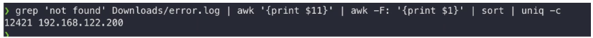

# windows

事件定性

事件

账号安全:注册表、net user、 lusrmgr.msc

webshell查杀

登录日志

文件

​	打开隐藏文件 以及文件后缀

进程

​	任务管理器、task list

开机启动项

​	注册表 ：hkey_loacl_machine->sam->domains->count

​	启动目录

​	gpedit.msc 组策略

计划任务：控制面板

​	schtasks | at(新版本不可用)

# 时间

