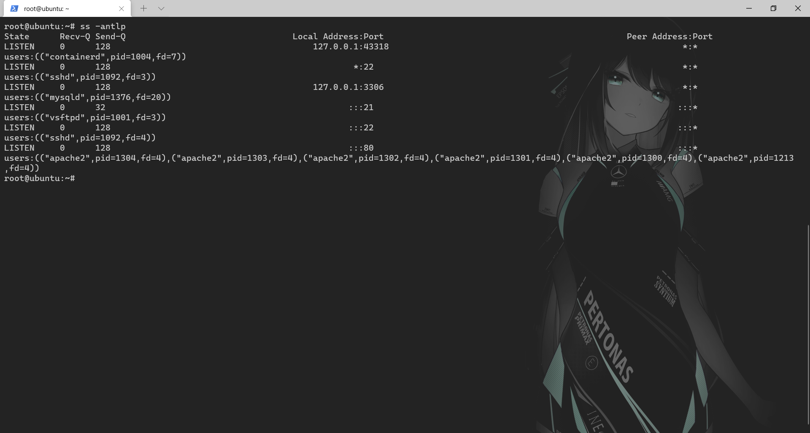
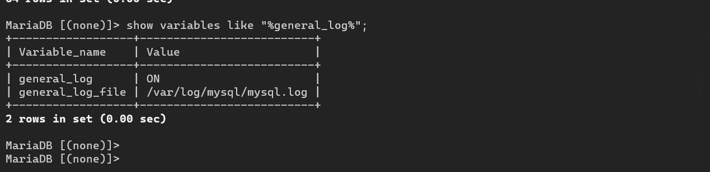

# 基线检查


windows: 控制面板--管理工具--本地安全策略--密码策略/账户锁定通过策略

事件查看器：Windows日志查看登录


linux基线检查

检查是否存在空口令


sshd加固

- 进制使用密码登录
- root禁止登录
- 记录ssh日志
- 


# 日志分析


系统日志分析


Windows日志

- 事件日志
- IIS日志
- FTP日志
- 数据库日志
- 邮件服务日志

使用eventvwr.msc日志查看

LogParser


```sh
Logparser -i:evt -o:DATAGRID "SELECT * FROM .\\System.evtx where EventID=20003"
//查看

logparser -i:evt -o:DATAGRID "SELECT * FROM .\security.evtx where eventID=4625" 查看登录失败的日志

```


## linux日志


1. 内核及系统日志
2. 用户日志
3. 程序日志

```shell
/var/log 存放日志信息
/var/log/cron 计划任务日志信息
/var/log/message 系统日志相关信息（网卡等）
/var/log/cron
/var/log/mailog
/var/log/secure 记录系统sshd等信息
/var/log/boot.log 记录开机日志
/var/log/lastlog 最后登录信息
lastlog 记录多条最后登录信息
/var/log/utmp 记录当前用户的登录信息
/var/log/btmp 记录登录失败的用户信息
```

/sbin/rsyslog同意管理日志


**计划任务日志**


**系统日志**


**开机日志**


## 中间件日志

apache:/usr/log/httpd/log

winows：apache安装目录的logs下


访问日志 access_log


错误日志 error_log 记录服务器错误日志


```shell
cat access.log | grep 'login'| awk '{print $7}'| sort | uniq -c > login_dir.txt
```

# 入侵检查

常见时间分类：

- web入侵：网页挂马，主页篡改，webshell
- 系统入侵：病毒木马，勒索软件，远控后门
- 网络攻击：DDOS攻击，DNS劫持，ARP欺骗

## 排查思路

排查思路：攻击类型定位-》时间范围-》文件分析-》进程分析-》系统分析-》日志分析-》关联分析-》逻辑推理-》事件总结

### 文件分析


### 进程分析


### 系统分析


### 日志分析


### 账户安全


### 查看端口


`netstat -antlp`查看链接状态

`ps -aux`查看进程（pts启动为远程启动）

 file /proc/进程id/exec

### 开机启动项


### 查看计划任务


`crontab -l ` -u xx 指定用户创建的任务

### 第三方软件漏洞


# linux入侵排查实验

1. 查看/etc/passwd

   

2. 查看/etc/shadow

   

3. 查看端口信息 ss -antlp

   

4. 查看ssh的日志文件/var/log/auth.log 

   

5. 获取ftp文件路径

   `cat /etc/vsftpd.conf | grep 'xferlog_file'`

   

6. 查看ftp日志（存在爆破）

   

7. 匹配成功登录

   `cat /etc/pass/vsftpd.log | grep 'OK LOGIN'`

   

8. 查看数据库日志

   

   

9. .bashrc

   .profile

   /etc/rc.local

   


提权

权限维持:cs;msf;免杀

主机信息搜集

内网信息搜集

流量转发

横向扩展：pth;arp欺骗;爆破;漏洞利用

域:ptk;票据原理;域控原理;域内信息搜集

powershell

exchanege服务

azure云计算


# 第1篇:Window日志分析

### 0x01 Window事件日志简介

Windows系统日志是记录系统中硬件、软件和系统问题的信息，同时还可以监视系统中发生的事件。用户可以通过它来检查错误发生的原因，或者寻找受到攻击时攻击者留下的痕迹。

Windows主要有以下三类日志记录系统事件：应用程序日志、系统日志和安全日志。

**系统日志**

```
记录操作系统组件产生的事件，主要包括驱动程序、系统组件和应用软件的崩溃以及数据丢失错误等。系统日志中记录的时间类型由Windows NT/2000操作系统预先定义。

默认位置： %SystemRoot%\System32\Winevt\Logs\System.evtx
```

**应用程序日志**

```
包含由应用程序或系统程序记录的事件，主要记录程序运行方面的事件，例如数据库程序可以在应用程序日志中记录文件错误，程序开发人员可以自行决定监视哪些事件。如果某个应用程序出现崩溃情况，那么我们可以从程序事件日志中找到相应的记录，也许会有助于你解决问题。 

默认位置：%SystemRoot%\System32\Winevt\Logs\Application.evtx
```

**安全日志**

```
记录系统的安全审计事件，包含各种类型的登录日志、对象访问日志、进程追踪日志、特权使用、帐号管理、策略变更、系统事件。安全日志也是调查取证中最常用到的日志。默认设置下，安全性日志是关闭的，管理员可以使用组策略来启动安全性日志，或者在注册表中设置审核策略，以便当安全性日志满后使系统停止响应。

默认位置：%SystemRoot%\System32\Winevt\Logs\Security.evtx
```

 系统和应用程序日志存储着故障排除信息，对于系统管理员更为有用。 安全日志记录着事件审计信息，包括用户验证（登录、远程访问等）和特定用户在认证后对系统做了什么，对于调查人员而言，更有帮助。

### 0X02 审核策略与事件查看器

Windows Server 2008 R2 系统的审核功能在默认状态下并没有启用 ，建议开启审核策略，若日后系统出现故障、安全事故则可以查看系统的日志文件，排除故障，追查入侵者的信息等。

PS：默认状态下，也会记录一些简单的日志，日志默认大小20M

**设置1**：开始 → 管理工具 → 本地安全策略 → 本地策略 → 审核策略，参考配置操作：


**设置2**：设置合理的日志属性，即日志最大大小、事件覆盖阀值等：


**查看系统日志方法：**

1. 在**“开始”**菜单上，依次指向**“所有程序”**、**“管理工具”**，然后单击**“事件查看器”**
2. 按 "**Window+R**"，输入 ”**eventvwr.msc**“ 也可以直接进入“**事件查看器**”


### 0x03 事件日志分析

对于Windows事件日志分析，不同的EVENT ID代表了不同的意义，摘录一些常见的安全事件的说明：

| 事件ID |                             说明 |
| :----- | -------------------------------: |
| 4624   |                         登录成功 |
| 4625   |                         登录失败 |
| 4634   |                         注销成功 |
| 4647   |                   用户启动的注销 |
| 4672   | 使用超级用户（如管理员）进行登录 |
| 4720   |                         创建用户 |

每个成功登录的事件都会标记一个登录类型，不同登录类型代表不同的方式：

| 登录类型 | 描述                            |                                             说明 |
| :------- | :------------------------------ | -----------------------------------------------: |
| 2        | 交互式登录（Interactive）       |                             用户在本地进行登录。 |
| 3        | 网络（Network）                 | 最常见的情况就是连接到共享文件夹或共享打印机时。 |
| 4        | 批处理（Batch）                 |                         通常表明某计划任务启动。 |
| 5        | 服务（Service）                 |     每种服务都被配置在某个特定的用户账号下运行。 |
| 7        | 解锁（Unlock）                  |                                       屏保解锁。 |
| 8        | 网络明文（NetworkCleartext）    |      登录的密码在网络上是通过明文传输的，如FTP。 |
| 9        | 新凭证（NewCredentials）        |      使用带/Netonly参数的RUNAS命令运行一个程序。 |
| 10       | 远程交互，（RemoteInteractive） |     通过终端服务、远程桌面或远程协助访问计算机。 |
| 11       | 缓存交互（CachedInteractive）   |             以一个域用户登录而又没有域控制器可用 |

关于更多EVENT ID，详见微软官方网站上找到了“Windows Vista 和 Windows Server 2008 中的安全事件的说明”。

> 原文链接 ：https://support.microsoft.com/zh-cn/help/977519/description-of-security-events-in-windows-7-and-in-windows-server-2008

案例1：可以利用eventlog事件来查看系统账号登录情况：

1. 在**“开始”**菜单上，依次指向**“所有程序”**、**“管理工具”**，然后单击**“事件查看器”**；
2. 在事件查看器中，单击**“安全”**，查看安全日志；
3. 在安全日志右侧操作中，点击**“筛选当前日志”**，输入事件ID进行筛选。

4624 --登录成功
4625 --登录失败
4634 -- 注销成功 4647 -- 用户启动的注销
4672 -- 使用超级用户（如管理员）进行登录

我们输入事件ID：4625进行日志筛选，发现事件ID：4625，事件数175904，即用户登录失败了175904次，那么这台服务器管理员账号可能遭遇了暴力猜解。


案例2：可以利用eventlog事件来查看计算机开关机的记录：

1、在**“开始”**菜单上，依次指向**“所有程序”**、**“管理工具”**，然后单击**“事件查看器”**；

2、在事件查看器中，单击**“系统”**，查看系统日志；

3、在系统日志右侧操作中，点击**“筛选当前日志”**，输入事件ID进行筛选。

其中事件ID 6006 ID6005、 ID 6009就表示不同状态的机器的情况（开关机）。 6005 信息 EventLog 事件日志服务已启动。(开机) 6006 信息 EventLog 事件日志服务已停止。(关机) 6009 信息 EventLog 按ctrl、alt、delete键(非正常)关机

我们输入事件ID：6005-6006进行日志筛选，发现了两条在2018/7/6 17:53:51左右的记录，也就是我刚才对系统进行重启的时间。


### 0x04 日志分析工具

#### Log Parser

Log Parser（是微软公司出品的日志分析工具，它功能强大，使用简单，可以分析基于文本的日志文件、XML 文件、CSV（逗号分隔符）文件，以及操作系统的事件日志、注册表、文件系统、Active Directory。它可以像使用 SQL 语句一样查询分析这些数据，甚至可以把分析结果以各种图表的形式展现出来。

Log Parser 2.2下载地址：https://www.microsoft.com/en-us/download/details.aspx?id=24659

Log Parser 使用示例：https://mlichtenberg.wordpress.com/2011/02/03/log-parser-rocks-more-than-50-examples/


**基本查询结构**

```
Logparser.exe –i:EVT –o:DATAGRID "SELECT * FROM c:\xx.evtx"
```

**使用Log Parser分析日志**

1、查询登录成功的事件

```
登录成功的所有事件
LogParser.exe -i:EVT –o:DATAGRID  "SELECT *  FROM c:\Security.evtx where EventID=4624"

指定登录时间范围的事件：
LogParser.exe -i:EVT –o:DATAGRID  "SELECT *  FROM c:\Security.evtx where TimeGenerated>'2018-06-19 23:32:11' and TimeGenerated<'2018-06-20 23:34:00' and EventID=4624"

提取登录成功的用户名和IP：
LogParser.exe -i:EVT  –o:DATAGRID  "SELECT EXTRACT_TOKEN(Message,13,' ') as EventType,TimeGenerated as LoginTime,EXTRACT_TOKEN(Strings,5,'|') as Username,EXTRACT_TOKEN(Message,38,' ') as Loginip FROM c:\Security.evtx where EventID=4624"
```

2、查询登录失败的事件

```
登录失败的所有事件：
LogParser.exe -i:EVT –o:DATAGRID  "SELECT *  FROM c:\Security.evtx where EventID=4625"

提取登录失败用户名进行聚合统计：
LogParser.exe  -i:EVT "SELECT  EXTRACT_TOKEN(Message,13,' ')  as EventType,EXTRACT_TOKEN(Message,19,' ') as user,count(EXTRACT_TOKEN(Message,19,' ')) as Times,EXTRACT_TOKEN(Message,39,' ') as Loginip FROM c:\Security.evtx where EventID=4625 GROUP BY Message" 
```

3、系统历史开关机记录：

```
LogParser.exe -i:EVT –o:DATAGRID  "SELECT TimeGenerated,EventID,Message FROM c:\System.evtx where EventID=6005 or EventID=6006"
```

#### LogParser Lizard

对于GUI环境的Log Parser Lizard，其特点是比较易于使用，甚至不需要记忆繁琐的命令，只需要做好设置，写好基本的SQL语句，就可以直观的得到结果。

下载地址：http://www.lizard-labs.com/log_parser_lizard.aspx

依赖包：Microsoft .NET Framework 4 .5，下载地址：https://www.microsoft.com/en-us/download/details.aspx?id=42642

查询最近用户登录情况：


#### Event Log Explorer

Event Log Explorer是一款非常好用的Windows日志分析工具。可用于查看，监视和分析跟事件记录，包括安全，系统，应用程序和其他微软Windows 的记录被记载的事件，其强大的过滤功能可以快速的过滤出有价值的信息。

下载地址：https://event-log-explorer.en.softonic.com/


参考链接：

Windows日志分析 https://mp.weixin.qq.com/s/ige5UO8WTuOOO3yRw-LeqQ

# 第2篇:Linux日志分析

### 0x00 前言

Linux系统拥有非常灵活和强大的日志功能，可以保存几乎所有的操作记录，并可以从中检索出我们需要的信息。 本文简介一下Linux系统日志及日志分析技巧。

### 0x01 日志简介

日志默认存放位置：/var/log/

查看日志配置情况：more /etc/rsyslog.conf

| 日志文件         |                                                         说明 |
| :--------------- | -----------------------------------------------------------: |
| /var/log/cron    |                                 记录了系统定时任务相关的日志 |
| /var/log/cups    |                                           记录打印信息的日志 |
| /var/log/dmesg   | 记录了系统在开机时内核自检的信息，也可以使用dmesg命令直接查看内核自检信息 |
| /var/log/mailog  |                                                 记录邮件信息 |
| /var/log/message | 记录系统重要信息的日志。这个日志文件中会记录Linux系统的绝大多数重要信息，如果系统出现问题时，首先要检查的就应该是这个日志文件 |
| /var/log/btmp    | 记录错误登录日志，这个文件是二进制文件，不能直接vi查看，而要使用lastb命令查看 |
| /var/log/lastlog | 记录系统中所有用户最后一次登录时间的日志，这个文件是二进制文件，不能直接vi，而要使用lastlog命令查看 |
| /var/log/wtmp    | 永久记录所有用户的登录、注销信息，同时记录系统的启动、重启、关机事件。同样这个文件也是一个二进制文件，不能直接vi，而需要使用last命令来查看 |
| /var/log/utmp    | 记录当前已经登录的用户信息，这个文件会随着用户的登录和注销不断变化，只记录当前登录用户的信息。同样这个文件不能直接vi，而要使用w,who,users等命令来查询 |
| /var/log/secure  | 记录验证和授权方面的信息，只要涉及账号和密码的程序都会记录，比如SSH登录，su切换用户，sudo授权，甚至添加用户和修改用户密码都会记录在这个日志文件中 |

比较重要的几个日志： 登录失败记录：/var/log/btmp //lastb 最后一次登录：/var/log/lastlog //lastlog 登录成功记录: /var/log/wtmp //last 登录日志记录：/var/log/secure

 目前登录用户信息：/var/run/utmp //w、who、users

 历史命令记录：history 仅清理当前用户： history -c

### 0x02 日志分析技巧

#### A、常用的shell命令

Linux下常用的shell命令如：find、grep 、egrep、awk、sed

小技巧：

1、grep显示前后几行信息:

```
   标准unix/linux下的grep通过下面參数控制上下文：
   grep -C 5 foo file 显示file文件里匹配foo字串那行以及上下5行
   grep -B 5 foo file 显示foo及前5行
   grep -A 5 foo file 显示foo及后5行
   查看grep版本号的方法是
   grep -V
```

2、grep 查找含有某字符串的所有文件

```
    grep -rn "hello,world!" 
    * : 表示当前目录所有文件，也可以是某个文件名
    -r 是递归查找
    -n 是显示行号
    -R 查找所有文件包含子目录
    -i 忽略大小写
```

3、如何显示一个文件的某几行：

```
    cat input_file | tail -n +1000 | head -n 2000
    #从第1000行开始，显示2000行。即显示1000~2999行
```

4、find /etc -name init

```
//在目录/etc中查找文件init
```

5、只是显示/etc/passwd的账户

```
`cat /etc/passwd |awk  -F ':'  '{print $1}'`  
//awk -F指定域分隔符为':'，将记录按指定的域分隔符划分域，填充域，$0则表示所有域,$1表示第一个域,$n表示第n个域。
```

6、sed -i '153,$d' .bash_history

```
删除历史操作记录，只保留前153行
```

#### B、日志分析技巧

**A、/var/log/secure**

```
1、定位有多少IP在爆破主机的root帐号：    
grep "Failed password for root" /var/log/secure | awk '{print $11}' | sort | uniq -c | sort -nr | more

定位有哪些IP在爆破：
grep "Failed password" /var/log/secure|grep -E -o "(25[0-5]|2[0-4][0-9]|[01]?[0-9][0-9]?)\.(25[0-5]|2[0-4][0-9]|[01]?[0-9][0-9]?)\.(25[0-5]|2[0-4][0-9]|[01]?[0-9][0-9]?)\.(25[0-5]|2[0-4][0-9]|[01]?[0-9][0-9]?)"|uniq -c

爆破用户名字典是什么？
 grep "Failed password" /var/log/secure|perl -e 'while($_=<>){ /for(.*?) from/; print "$1\n";}'|uniq -c|sort -nr

2、登录成功的IP有哪些：   
grep "Accepted " /var/log/secure | awk '{print $11}' | sort | uniq -c | sort -nr | more

登录成功的日期、用户名、IP：
grep "Accepted " /var/log/secure | awk '{print $1,$2,$3,$9,$11}' 

3、增加一个用户kali日志：
Jul 10 00:12:15 localhost useradd[2382]: new group: name=kali, GID=1001
Jul 10 00:12:15 localhost useradd[2382]: new user: name=kali, UID=1001, GID=1001, home=/home/kali
, shell=/bin/bash
Jul 10 00:12:58 localhost passwd: pam_unix(passwd:chauthtok): password changed for kali
#grep "useradd" /var/log/secure 

4、删除用户kali日志：
Jul 10 00:14:17 localhost userdel[2393]: delete user 'kali'
Jul 10 00:14:17 localhost userdel[2393]: removed group 'kali' owned by 'kali'
Jul 10 00:14:17 localhost userdel[2393]: removed shadow group 'kali' owned by 'kali'
# grep "userdel" /var/log/secure

5、su切换用户：
Jul 10 00:38:13 localhost su: pam_unix(su-l:session): session opened for user good by root(uid=0)

sudo授权执行:
sudo -l
Jul 10 00:43:09 localhost sudo:    good : TTY=pts/4 ; PWD=/home/good ; USER=root ; COMMAND=/sbin/shutdown -r now
```

**2、/var/log/yum.log**

软件安装升级卸载日志：

\~~~yum install gcc yum install gcc

[root@bogon ~]# more /var/log/yum.log

Jul 10 00:18:23 Updated: cpp-4.8.5-28.el7_5.1.x86_64 Jul 10 00:18:24 Updated: libgcc-4.8.5-28.el7_5.1.x86_64 Jul 10 00:18:24 Updated: libgomp-4.8.5-28.el7_5.1.x86_64 Jul 10 00:18:28 Updated: gcc-4.8.5-28.el7_5.1.x86_64 Jul 10 00:18:28 Updated: libgcc-4.8.5-28.el7_5.1.i686 ~~~

# 第3篇:Web日志分析

### ox01 Web日志

Web访问日志记录了Web服务器接收处理请求及运行时错误等各种原始信息。通过对WEB日志进行的安全分析，不仅可以帮助我们定位攻击者，还可以帮助我们还原攻击路径，找到网站存在的安全漏洞并进行修复。

我们来看一条Apache的访问日志：

```
127.0.0.1 - - [11/Jun/2018:12:47:22 +0800] "GET /login.html HTTP/1.1" 200 786 "-" "Mozilla/5.0 (Windows NT 10.0; WOW64) AppleWebKit/537.36 (KHTML, like Gecko) Chrome/66.0.3359.139 Safari/537.36"
```

通过这条Web访问日志，我们可以清楚的得知用户在什么IP、什么时间、用什么操作系统、什么浏览器的情况下访问了你网站的哪个页面，是否访问成功。

本文通过介绍Web日志安全分析时的思路和常用的一些技巧。

### 0x02 日志分析技巧

在对WEB日志进行安全分析时，一般可以按照两种思路展开，逐步深入，还原整个攻击过程。

第一种：确定入侵的时间范围，以此为线索，查找这个时间范围内可疑的日志，进一步排查，最终确定攻击者，还原攻击过程。

第二种：攻击者在入侵网站后，通常会留下后门维持权限，以方便再次访问，我们可以找到该文件，并以此为线索来展开分析。

常用分析工具：

Window下，推荐用 EmEditor 进行日志分析，支持大文本，搜索效率还不错。

Linux下，使用Shell命令组合查询分析。

Shell+Linux命令实现日志分析，一般结合grep、awk等命令等实现了几个常用的日志分析统计技巧。

Apache日志分析技巧：

```
1、列出当天访问次数最多的IP命令：
cut -d- -f 1 log_file|uniq -c | sort -rn | head -20

2、查看当天有多少个IP访问：
awk '{print $1}' log_file|sort|uniq|wc -l

3、查看某一个页面被访问的次数：
grep "/index.php" log_file | wc -l

4、查看每一个IP访问了多少个页面：
awk '{++S[$1]} END {for (a in S) print a,S[a]}' log_file

5、将每个IP访问的页面数进行从小到大排序：
awk '{++S[$1]} END {for (a in S) print S[a],a}' log_file | sort -n

6、查看某一个IP访问了哪些页面：
grep ^111.111.111.111 log_file| awk '{print $1,$7}'

7、去掉搜索引擎统计当天的页面：
awk '{print $12,$1}' log_file | grep ^\"Mozilla | awk '{print $2}' |sort | uniq | wc -l

8、查看2018年6月21日14时这一个小时内有多少IP访问:
awk '{print $4,$1}' log_file | grep 21/Jun/2018:14 | awk '{print $2}'| sort | uniq | wc -l  
```

### 0x03 日志分析案例

Web日志分析实例：通过nginx代理转发到内网某服务器，内网服务器某站点目录下被上传了多个图片木马，虽然II7下不能解析，但还是想找出谁通过什么路径上传的。

在这里，我们遇到了一个问题：由于设置了代理转发，只记录了代理服务器的ip，并没有记录访问者IP？这时候，如何去识别不同的访问者和攻击源呢？

这是管理员日志配置不当的问题，但好在我们可以通过浏览器指纹来定位不同的访问来源，还原攻击路径。

1、定位攻击源

首先访问图片木马的记录，只找到了一条，由于所有访问日志只记录了代理IP，并不能通过IP来还原攻击路径，这时候，可以利用浏览器指纹来定位。


浏览器指纹：

```
Mozilla/4.0+(compatible;+MSIE+7.0;+Windows+NT+6.1;+WOW64;+Trident/7.0;+SLCC2;+.NET+CLR+2.0.50727;+.NET+CLR+3.5.30729;+.NET+CLR+3.0.30729;+.NET4.0C;+.NET4.0E)
```

2、搜索相关日志记录

通过筛选与该浏览器指纹有关的日志记录，可以清晰地看到攻击者的攻击路径。


3、对找到的访问日志进行解读，攻击者大致的访问路径如下：

```
A、攻击者访问首页和登录页
B、攻击者访问MsgSjlb.aspx和MsgSebd.aspx
C、攻击者访问Xzuser.aspx
D、攻击者多次POST（怀疑通过这个页面上传模块缺陷）
E、攻击者访问了图片木马
```

打开网站，访问Xzuser.aspx，确认攻击者通过该页面的进行文件上传了图片木马，同时，发现网站了存在越权访问漏洞，攻击者访问特定URL，无需登录即可进入后台界面。通过日志分析找到网站的漏洞位置并进行修复。

### 0x04 日志统计分析技巧

统计爬虫：

```javascript
grep -E 'Googlebot|Baiduspider'  /www/logs/access.2019-02-23.log | awk '{ print $1 }' | sort | uniq
```

统计浏览器：

```javascript
cat /www/logs/access.2019-02-23.log | grep -v -E 'MSIE|Firefox|Chrome|Opera|Safari|Gecko|Maxthon' | sort | uniq -c | sort -r -n | head -n 100       
```

IP 统计：

```javascript
grep '23/May/2019' /www/logs/access.2019-02-23.log | awk '{print $1}' | awk -F'.' '{print $1"."$2"."$3"."$4}' | sort | uniq -c | sort -r -n | head -n 10
   2206 219.136.134.13
   1497 182.34.15.248
   1431 211.140.143.100
   1431 119.145.149.106
   1427 61.183.15.179
   1427 218.6.8.189
   1422 124.232.150.171
   1421 106.187.47.224
   1420 61.160.220.252
   1418 114.80.201.18           
```

统计网段：

```javascript
cat /www/logs/access.2019-02-23.log | awk '{print $1}' | awk -F'.' '{print $1"."$2"."$3".0"}' | sort | uniq -c | sort -r -n | head -n 200           
```

统计域名：

```javascript
cat  /www/logs/access.2019-02-23.log |awk '{print $2}'|sort|uniq -c|sort -rn|more       
```

HTTP Status：

```javascript
cat  /www/logs/access.2019-02-23.log |awk '{print $9}'|sort|uniq -c|sort -rn|more
5056585 304
1125579 200
   7602 400
      5 301 
```

URL 统计：

```javascript
cat  /www/logs/access.2019-02-23.log |awk '{print $7}'|sort|uniq -c|sort -rn|more           
```

文件流量统计：

```javascript
cat /www/logs/access.2019-02-23.log |awk '{sum[$7]+=$10}END{for(i in sum){print sum[i],i}}'|sort -rn|more

grep ' 200 ' /www/logs/access.2019-02-23.log |awk '{sum[$7]+=$10}END{for(i in sum){print sum[i],i}}'|sort -rn|more          
```

URL访问量统计：

```javascript
cat /www/logs/access.2019-02-23.log | awk '{print $7}' | egrep '\?|&' | sort | uniq -c | sort -rn | more            
```

脚本运行速度：

查出运行速度最慢的脚本

```javascript
grep -v 0$ /www/logs/access.2019-02-23.log | awk -F '\" ' '{print $4" " $1}' web.log | awk '{print $1" "$8}' | sort -n -k 1 -r | uniq > /tmp/slow_url.txt           
```

IP, URL 抽取：

```javascript
# tail -f /www/logs/access.2019-02-23.log | grep '/test.html' | awk '{print $1" "$7}'           
```

参考链接：

> https://www.jb51.net/article/53954.htm
>
> https://www.jb51.net/article/58017.htm
>
> https://cloud.tencent.com/developer/article/1051427

# 第5篇:MySQL日志分析

常见的数据库攻击包括弱口令、SQL注入、提升权限、窃取备份等。对数据库日志进行分析，可以发现攻击行为，进一步还原攻击场景及追溯攻击源。

### 0x01 Mysql日志分析

general query log能记录成功连接和每次执行的查询，我们可以将它用作安全布防的一部分，为故障分析或黑客事件后的调查提供依据。

```
1、查看log配置信息
show variables like '%general%';
2、开启日志
SET GLOBAL general_log = 'On';
3、指定日志文件路径
#SET GLOBAL general_log_file = '/var/lib/mysql/mysql.log';
```

比如，当我访问 /test.php?id=1，此时我们得到这样的日志：

```
190604 14:46:14       14 Connect    root@localhost on 
           14 Init DB    test
           14 Query    SELECT * FROM admin WHERE id = 1
           14 Quit  `
```

我们按列来解析一下：

```
第一列:Time，时间列，前面一个是日期,后面一个是小时和分钟，有一些不显示的原因是因为这些sql语句几乎是同时执行的,所以就不另外记录时间了。
第二列:Id，就是show processlist出来的第一列的线程ID,对于长连接和一些比较耗时的sql语句,你可以精确找出究竟是那一条那一个线程在运行。
第三列:Command，操作类型，比如Connect就是连接数据库，Query就是查询数据库(增删查改都显示为查询)，可以特定过虑一些操作。
第四列:Argument，详细信息，例如 Connect    root@localhost on 意思就是连接数据库，如此类推,接下面的连上数据库之后,做了什么查询的操作。
```

### 0x02 登录成功/失败

我们来做个简单的测试吧，使用我以前自己开发的弱口令工具来扫一下，字典设置比较小，2个用户，4个密码，共8组。


MySQL中的log记录是这样子：

```
Time                 Id        Command         Argument

190601 22:03:20    98 Connect   root@192.168.204.1 on 
           98 Connect   Access denied for user 'root'@'192.168.204.1' (using password: YES)
          103 Connect   mysql@192.168.204.1 on 
          103 Connect   Access denied for user 'mysql'@'192.168.204.1' (using password: YES)
          104 Connect   mysql@192.168.204.1 on 
          104 Connect   Access denied for user 'mysql'@'192.168.204.1' (using password: YES)
          100 Connect   root@192.168.204.1 on 
          101 Connect   root@192.168.204.1 on 
          101 Connect   Access denied for user 'root'@'192.168.204.1' (using password: YES)
           99 Connect   root@192.168.204.1 on 
           99 Connect   Access denied for user 'root'@'192.168.204.1' (using password: YES)
          105 Connect   mysql@192.168.204.1 on 
          105 Connect   Access denied for user 'mysql'@'192.168.204.1' (using password: YES)
          100 Query set autocommit=0
          102 Connect   mysql@192.168.204.1 on 
          102 Connect   Access denied for user 'mysql'@'192.168.204.1' (using password: YES)
          100 Quit  `
```

你知道在这个口令猜解过程中，哪个是成功的吗？

利用爆破工具，一个口令猜解成功的记录是这样子的：

```
190601 22:03:20     100 Connect root@192.168.204.1 on 
       100 Query    set autocommit=0
       100 Quit
```

但是，如果你是用其他方式，可能会有一点点不一样的哦。

Navicat for MySQL登录：

```
190601 22:14:07   106 Connect   root@192.168.204.1 on 
                 106 Query  SET NAMES utf8
                 106 Query  SHOW VARIABLES LIKE 'lower_case_%'
                 106 Query  SHOW VARIABLES LIKE 'profiling'
                 106 Query  SHOW DATABASES
```

命令行登录：

```
190601 22:17:25   111 Connect   root@localhost on 
                 111 Query  select @@version_comment limit 1
190601 22:17:56   111 Quit
```

这个差别在于，不同的数据库连接工具，它在连接数据库初始化的过程中是不同的。通过这样的差别，我们可以简单判断出用户是通过连接数据库的方式。

另外，不管你是爆破工具、Navicat for MySQL、还是命令行，登录失败都是一样的记录。

登录失败的记录：

```
102 Connect mysql@192.168.204.1 on 
102 Connect Access denied for user 'mysql'@'192.168.204.1' (using password: YES)
```

利用shell命令进行简单的分析：

```
#有哪些IP在爆破？
grep  "Access denied" mysql.log |cut -d "'" -f4|uniq -c|sort -nr
     27 192.168.204.1

#爆破用户名字典都有哪些？
grep  "Access denied" mysql.log |cut -d "'" -f2|uniq -c|sort -nr
     13 mysql
     12 root
      1 root
      1 mysql
```

在日志分析中，特别需要注意一些敏感的操作行为，比如删表、备库，读写文件等。关键词：drop table、drop function、lock tables、unlock tables、load_file() 、into outfile、into dumpfile。

敏感数据库表：SELECT * from mysql.user、SELECT * from mysql.func

### 0x03 SQL注入入侵痕迹

在利用SQL注入漏洞的过程中，我们会尝试利用sqlmap的--os-shell参数取得shell，如操作不慎，可能留下一些sqlmap创建的临时表和自定义函数。我们先来看一下sqlmap os-shell参数的用法以及原理：

1、构造一个SQL注入点，开启Burp监听8080端口

```
sqlmap.py -u http://192.168.204.164/sql.php?id=1 --os-shell --proxy=http://127.0.0.1:8080
```

HTTP通讯过程如下：


创建了一个临时文件tmpbwyov.php，通过访问这个木马执行系统命令，并返回到页面展示。

tmpbwyov.php：

&1\n";function f($n){global $z;return is_callable($n)and!in_array($n,$z);}if(f('system')){ob_start();system($c);$w=ob_get_contents();ob_end_clean();}elseif(f('proc_open')){$y=proc_open($c,array(array(pipe,r),array(pipe,w),array(pipe,w)),$t);$w=NULL;while(!feof($t[1])){$w.=fread($t[1],512);}@proc_close($y);}elseif(f('shell_exec')){$w=shell_exec($c);}elseif(f('passthru')){ob_start();passthru($c);$w=ob_get_contents();ob_end_clean();}elseif(f('popen')){$x=popen($c,r);$w=NULL;if(is_resource($x)){while(!feof($x)){$w.=fread($x,512);}}@pclose($x);}elseif(f('exec')){$w=array();exec($c,$w);$w=join(chr(10),$w).chr(10);}else{$w=0;}print "

```
".$w."
```

";?>

`

创建了一个临时表sqlmapoutput，调用存储过程执行系统命令将数据写入临时表，然后取临时表中的数据展示到前端。

通过查看网站目录中最近新建的可疑文件，可以判断是否发生过sql注入漏洞攻击事件。

检查方法：

1、检查网站目录下，是否存在一些木马文件：


2、检查是否有UDF提权、MOF提权痕迹

检查目录是否有异常文件

mysql\lib\plugin

c:/windows/system32/wbem/mof/

检查函数是否删除

```
select * from mysql.func
```

3、结合web日志分析。

# 第4篇:MSSQL日志分析

常见的数据库攻击包括弱口令、SQL注入、提升权限、窃取备份等。对数据库日志进行分析，可以发现攻击行为，进一步还原攻击场景及追溯攻击源。

### 0x01 MSSQL日志分析

首先，MSSQL数据库应启用日志记录功能，默认配置仅限失败的登录，需修改为失败和成功的登录，这样就可以对用户登录进行审核。


登录到SQL Server Management Studio，依次点击 管理--SQL Server 日志


双击日志存档文件即可打开日志文件查看器，并可以对日志进行筛选或者导出等操作。


另外，MSSQ提供了一个工具SQL Server Profiler ，方便查找和发现SQL执行的效率和语句问题。


日志分析案例：

在日志文件查看器中，选择筛选，在筛选设置中源设置为“登录”，应用筛选器，确定。


筛选后的结果，可以很清晰的识别用户登录信息，记录内容包括用户登录时间、登录是否成功、登录使用的账号以及远程登录时用户使用的IP地址。

如下图：客户端：192.168.204.1进行尝试弱口令登录，并发现其中有一条登录成功的记录。


### 0x02 SQL注入入侵痕迹

在利用SQL注入漏洞的过程中，我们会尝试利用sqlmap的--os-shell参数取得shell，如操作不慎，可能留下一些sqlmap创建的临时表和自定义函数。我们先来看一下sqlmap os-shell参数的用法以及原理：

1、构造一个SQL注入点，开启Burp监听8080端口

```
sqlmap.py -u http://192.168.204.164/sql.asp?id=1 --os-shell --proxy=http://127.0.0.1:8080
```

HTTP通讯过程如下：

创建了一个临时表sqlmapoutput，调用存储过程执行系统命令将数据写入临时表，然后取临时表中的数据展示到前端。

通过查看数据库中最近新建的表的结构和内容，可以判断是否发生过sql注入漏洞攻击事件。

检查方法：

1、数据库表检查

2、检查xp_cmdshell等存储过程

xp_cmdshell在mssql2005之后的版本中是默认禁止的，查看xp_cmdshell是否被启用。

`Exec master.dbo.xp_cmdshell 'whoami'

3、需要结合web日志，通过查看日志文件的大小以及审计日志文件中的内容，可以判断是否发生过sql注入漏洞攻击事件。

# 第1篇：window入侵排查

### 0x00 前言

当企业发生黑客入侵、系统崩溃或其它影响业务正常运行的安全事件时，急需第一时间进行处理，使企业的网络信息系统在最短时间内恢复正常工作，进一步查找入侵来源，还原入侵事故过程，同时给出解决方案与防范措施，为企业挽回或减少经济损失。

常见的应急响应事件分类：

web入侵：网页挂马、主页篡改、Webshell

系统入侵：病毒木马、勒索软件、远控后门

网络攻击：DDOS攻击、DNS劫持、ARP欺骗

针对常见的攻击事件，结合工作中应急响应事件分析和解决的方法，总结了一些Window服务器入侵排查的思路。

### 0x01 入侵排查思路

#### 1.1 检查系统账号安全

1、查看服务器是否有弱口令，远程管理端口是否对公网开放。

- 检查方法：据实际情况咨询相关服务器管理员。

2、查看服务器是否存在可疑账号、新增账号。

- 检查方法：打开 cmd 窗口，输入`lusrmgr.msc`命令，查看是否有新增/可疑的账号，如有管理员群组的（Administrators）里的新增账户，如有，请立即禁用或删除掉。

3、查看服务器是否存在隐藏账号、克隆账号。

- 检查方法：

a、打开注册表 ，查看管理员对应键值。

b、使用D盾_web查杀工具，集成了对克隆账号检测的功能。


4、结合日志，查看管理员登录时间、用户名是否存在异常。

- 检查方法：

a、Win+R打开运行，输入“eventvwr.msc”，回车运行，打开“事件查看器”。

b、导出Windows日志--安全，利用Log Parser进行分析。


#### 1.2 检查异常端口、进程

1、检查端口连接情况，是否有远程连接、可疑连接。

- 检查方法：

a、netstat -ano 查看目前的网络连接，定位可疑的ESTABLISHED

b、根据netstat 定位出的pid，再通过tasklist命令进行进程定位 tasklist | findstr “PID”


2、进程

- 检查方法：

a、开始--运行--输入msinfo32，依次点击“软件环境→正在运行任务”就可以查看到进程的详细信息，比如进程路径、进程ID、文件创建日期、启动时间等。

b、打开D盾_web查杀工具，进程查看，关注没有签名信息的进程。

c、通过微软官方提供的 Process Explorer 等工具进行排查 。

d、查看可疑的进程及其子进程。可以通过观察以下内容：

```
        没有签名验证信息的进程
        没有描述信息的进程
        进程的属主
        进程的路径是否合法
        CPU或内存资源占用长时间过高的进程
```

3、小技巧：

 a、查看端口对应的PID： netstat -ano | findstr “port”

 b、查看进程对应的PID：任务管理器--查看--选择列--PID 或者 tasklist | findstr “PID”

 c、查看进程对应的程序位置：

 任务管理器--选择对应进程--右键打开文件位置

 运行输入 wmic，cmd界面 输入 process

 d、tasklist /svc 进程--PID--服务

 e、查看Windows服务所对应的端口： %system%/system32/drivers/etc/services（一般%system%就是C:\Windows）

#### 1.3 检查启动项、计划任务、服务

1、检查服务器是否有异常的启动项。

- 检查方法：

a、登录服务器，单击【开始】>【所有程序】>【启动】，默认情况下此目录在是一个空目录，确认是否有非业务程序在该目录下。 b、单击开始菜单 >【运行】，输入 msconfig，查看是否存在命名异常的启动项目，是则取消勾选命名异常的启动项目，并到命令中显示的路径删除文件。 c、单击【开始】>【运行】，输入 regedit，打开注册表，查看开机启动项是否正常，特别注意如下三个注册表项： HKEY_CURRENT_USER\software\micorsoft\windows\currentversion\run HKEY_LOCAL_MACHINE\Software\Microsoft\Windows\CurrentVersion\Run HKEY_LOCAL_MACHINE\Software\Microsoft\Windows\CurrentVersion\Runonce 检查右侧是否有启动异常的项目，如有请删除，并建议安装杀毒软件进行病毒查杀，清除残留病毒或木马。

d、利用安全软件查看启动项、开机时间管理等。

e、组策略，运行gpedit.msc。


2、检查计划任务

- 检查方法：

a、单击【开始】>【设置】>【控制面板】>【任务计划】，查看计划任务属性，便可以发现木马文件的路径。

b、单击【开始】>【运行】；输入 cmd，然后输入at，检查计算机与网络上的其它计算机之间的会话或计划任务，如有，则确认是否为正常连接。

3、服务自启动

- 检查方法：单击【开始】>【运行】，输入services.msc，注意服务状态和启动类型，检查是否有异常服务。

#### 1.4 检查系统相关信息

1、查看系统版本以及补丁信息

- 检查方法：单击【开始】>【运行】，输入systeminfo，查看系统信息

2、查找可疑目录及文件

- 检查方法：

a、 查看用户目录，新建账号会在这个目录生成一个用户目录，查看是否有新建用户目录。

 Window 2003 C:\Documents and Settings

 Window 2008R2 C:\Users\

b、单击【开始】>【运行】，输入%UserProfile%\Recent，分析最近打开分析可疑文件。

c、在服务器各个目录，可根据文件夹内文件列表时间进行排序，查找可疑文件。

d、回收站、浏览器下载目录、浏览器历史记录

e、修改时间在创建时间之前的为可疑文件

3、得到发现WEBSHELL、远控木马的创建时间，如何找出同一时间范围内创建的文件？

 a、利用 Registry Workshop 注册表编辑器的搜索功能，可以找到最后写入时间区间的文件。

 b、利用计算机自带文件搜索功能，指定修改时间进行搜索。

#### 1.5 自动化查杀

- 病毒查杀
- 检查方法：下载安全软件，更新最新病毒库，进行全盘扫描。
- webshell查杀
- 检查方法：选择具体站点路径进行webshell查杀，建议使用两款webshell查杀工具同时查杀，可相互补充规则库的不足。

#### 1.6 日志分析

系统日志

- 分析方法：

a、前提：开启审核策略，若日后系统出现故障、安全事故则可以查看系统的日志文件，排除故障，追查入侵者的信息等。

b、Win+R打开运行，输入“eventvwr.msc”，回车运行，打开“事件查看器”。

C、导出应用程序日志、安全日志、系统日志，利用Log Parser进行分析。

WEB访问日志

- 分析方法：

a、找到中间件的web日志，打包到本地方便进行分析。

b、推荐工具：Window下，推荐用 EmEditor 进行日志分析，支持大文本，搜索效率还不错。

 Linux下，使用Shell命令组合查询分析

### 0x02 工具篇

#### 2.1 病毒分析

PCHunter：http://www.xuetr.com

火绒剑：https://www.huorong.cn

Process Explorer：https://docs.microsoft.com/zh-cn/sysinternals/downloads/process-explorer

processhacker：https://processhacker.sourceforge.io/downloads.php

autoruns：https://docs.microsoft.com/en-us/sysinternals/downloads/autoruns

OTL：https://www.bleepingcomputer.com/download/otl/

SysInspector：http://download.eset.com.cn/download/detail/?product=sysinspector

#### 2.2 病毒查杀

卡巴斯基：http://devbuilds.kaspersky-labs.com/devbuilds/KVRT/latest/full/KVRT.exe （推荐理由：绿色版、最新病毒库）

大蜘蛛：http://free.drweb.ru/download+cureit+free（推荐理由：扫描快、一次下载只能用1周，更新病毒库）

火绒安全软件：https://www.huorong.cn

360杀毒：http://sd.360.cn/download_center.html

#### 2.3 病毒动态

CVERC-国家计算机病毒应急处理中心：http://www.cverc.org.cn

微步在线威胁情报社区：https://x.threatbook.cn

火绒安全论坛：http://bbs.huorong.cn/forum-59-1.html

爱毒霸社区：http://bbs.duba.net

腾讯电脑管家：http://bbs.guanjia.qq.com/forum-2-1.html

#### 2.4 在线病毒扫描网站

http://www.virscan.org //多引擎在线病毒扫描网 v1.02，当前支持 41 款杀毒引擎

https://habo.qq.com //腾讯哈勃分析系统

https://virusscan.jotti.org //Jotti恶意软件扫描系统

http://www.scanvir.com //针对计算机病毒、手机病毒、可疑文件等进行检测分析

#### 2.5 webshell查杀

D盾_Web查杀：http://www.d99net.net/index.asp

河马webshell查杀：http://www.shellpub.com

深信服Webshell网站后门检测工具：http://edr.sangfor.com.cn/backdoor_detection.html

Safe3：http://www.uusec.com/webshell.zip

# 第2篇：Linux入侵排查

### 0x00 前言

当企业发生黑客入侵、系统崩溃或其它影响业务正常运行的安全事件时，急需第一时间进行处理，使企业的网络信息系统在最短时间内恢复正常工作，进一步查找入侵来源，还原入侵事故过程，同时给出解决方案与防范措施，为企业挽回或减少经济损失。

针对常见的攻击事件，结合工作中应急响应事件分析和解决的方法，总结了一些Linux服务器入侵排查的思路。

### 0x01 入侵排查思路

#### 1.1 账号安全

**基本使用：**

```
1、用户信息文件/etc/passwd
root:x:0:0:root:/root:/bin/bash
account:password:UID:GID:GECOS:directory:shell
用户名：密码：用户ID：组ID：用户说明：家目录：登陆之后shell
注意：无密码只允许本机登陆，远程不允许登陆

2、影子文件/etc/shadow
root:$6$oGs1PqhL2p3ZetrE$X7o7bzoouHQVSEmSgsYN5UD4.kMHx6qgbTqwNVC5oOAouXvcjQSt.Ft7ql1WpkopY0UV9ajBwUt1DpYxTCVvI/:16809:0:99999:7:::
用户名：加密密码：密码最后一次修改日期：两次密码的修改时间间隔：密码有效期：密码修改到期到的警告天数：密码过期之后的宽限天数：账号失效时间：保留
who     查看当前登录用户（tty本地登陆  pts远程登录）
w       查看系统信息，想知道某一时刻用户的行为
uptime  查看登陆多久、多少用户，负载
```

**入侵排查：**

```
1、查询特权用户特权用户(uid 为0)
[root@localhost ~]# awk -F: '$3==0{print $1}' /etc/passwd
2、查询可以远程登录的帐号信息
[root@localhost ~]# awk '/\$1|\$6/{print $1}' /etc/shadow
3、除root帐号外，其他帐号是否存在sudo权限。如非管理需要，普通帐号应删除sudo权限
[root@localhost ~]# more /etc/sudoers | grep -v "^#\|^$" | grep "ALL=(ALL)"
4、禁用或删除多余及可疑的帐号
    usermod -L user    禁用帐号，帐号无法登录，/etc/shadow第二栏为!开头
    userdel user       删除user用户
    userdel -r user    将删除user用户，并且将/home目录下的user目录一并删除
```

#### 1.2 历史命令

**基本使用：**

```
通过.bash_history查看帐号执行过的系统命令
1、root的历史命令
histroy
2、打开/home各帐号目录下的.bash_history，查看普通帐号的历史命令

为历史的命令增加登录的IP地址、执行命令时间等信息：
1）保存1万条命令
sed -i 's/^HISTSIZE=1000/HISTSIZE=10000/g' /etc/profile
2）在/etc/profile的文件尾部添加如下行数配置信息：
######jiagu history xianshi#########
USER_IP=`who -u am i 2>/dev/null | awk '{print $NF}' | sed -e 's/[()]//g'`
if [ "$USER_IP" = "" ]
then
USER_IP=`hostname`
fi
export HISTTIMEFORMAT="%F %T $USER_IP `whoami` "
shopt -s histappend
export PROMPT_COMMAND="history -a"
######### jiagu history xianshi ##########
3）source /etc/profile让配置生效

生成效果： 1  2018-07-10 19:45:39 192.168.204.1 root source /etc/profile

3、历史操作命令的清除：history -c
但此命令并不会清除保存在文件中的记录，因此需要手动删除.bash_profile文件中的记录。
```

**入侵排查：**

```
进入用户目录下
cat .bash_history >> history.txt
```

#### 1.3 检查异常端口

使用netstat 网络连接命令，分析可疑端口、IP、PID

```
netstat -antlp|more

查看下pid所对应的进程文件路径，
运行ls -l /proc/$PID/exe或file /proc/$PID/exe（$PID 为对应的pid 号）
```

#### 1.4 检查异常进程

使用ps命令，分析进程

```
ps aux | grep pid 
```

#### 1.5 检查开机启动项

**基本使用：**

系统运行级别示意图：

| 运行级别 |                                                      含义 |
| :------- | --------------------------------------------------------: |
| 0        |                                                      关机 |
| 1        | 单用户模式，可以想象为windows的安全模式，主要用于系统修复 |
| 2        |                           不完全的命令行模式，不含NFS服务 |
| 3        |                        完全的命令行模式，就是标准字符界面 |
| 4        |                                                  系统保留 |
| 5        |                                                  图形模式 |
| 6        |                                                    重启动 |

查看运行级别命令 runlevel

系统默认允许级别

```
vi  /etc/inittab
id=3：initdefault  系统开机后直接进入哪个运行级别
```

开机启动配置文件

```
/etc/rc.local
/etc/rc.d/rc[0~6].d
```

例子:当我们需要开机启动自己的脚本时，只需要将可执行脚本丢在/etc/init.d目录下，然后在/etc/rc.d/rc*.d中建立软链接即可

```
root@localhost ~]# ln -s /etc/init.d/sshd /etc/rc.d/rc3.d/S100ssh
```

此处sshd是具体服务的脚本文件，S100ssh是其软链接，S开头代表加载时自启动；如果是K开头的脚本文件，代表运行级别加载时需要关闭的。

**入侵排查：**

启动项文件： more /etc/rc.local /etc/rc.d/rc[0~6].d ls -l /etc/rc.d/rc3.d/

#### 1.6 检查定时任务

**基本使用**

1、利用crontab创建计划任务

- 基本命令

crontab -l 列出某个用户cron服务的详细内容

Tips：默认编写的crontab文件会保存在 (/var/spool/cron/用户名 例如: /var/spool/cron/root

crontab -r 删除每个用户cront任务(谨慎：删除所有的计划任务)

crontab -e 使用编辑器编辑当前的crontab文件

如：*/1 ** * * echo "hello world" >> /tmp/test.txt 每分钟写入文件

2、利用anacron实现异步定时任务调度

- 使用案例

每天运行 /home/backup.sh脚本： vi /etc/anacrontab @daily 10 example.daily /bin/bash /home/backup.sh

当机器在 backup.sh 期望被运行时是关机的，anacron会在机器开机十分钟之后运行它，而不用再等待 7天。

**入侵排查**

重点关注以下目录中是否存在恶意脚本

```
/var/spool/cron/* 
/etc/crontab
/etc/cron.d/*
/etc/cron.daily/* 
/etc/cron.hourly/* 
/etc/cron.monthly/*
/etc/cron.weekly/
/etc/anacrontab
/var/spool/anacron/*
```

小技巧：

```
 more /etc/cron.daily/*  查看目录下所有文件
```

#### 1.7 检查服务

**服务自启动**

第一种修改方法：

```
chkconfig [--level 运行级别] [独立服务名] [on|off]
chkconfig –level  2345 httpd on  开启自启动
chkconfig httpd on （默认level是2345）
```

第二种修改方法：

```
修改/etc/re.d/rc.local 文件  
加入 /etc/init.d/httpd start
```

第三种修改方法：

使用ntsysv命令管理自启动，可以管理独立服务和xinetd服务。

**入侵排查**

1、查询已安装的服务：

RPM包安装的服务

```
chkconfig  --list  查看服务自启动状态，可以看到所有的RPM包安装的服务
ps aux | grep crond 查看当前服务

系统在3与5级别下的启动项 
中文环境
chkconfig --list | grep "3:启用\|5:启用"
英文环境
chkconfig --list | grep "3:on\|5:on"
```

源码包安装的服务

```
查看服务安装位置 ，一般是在/user/local/
service httpd start
搜索/etc/rc.d/init.d/  查看是否存在
```

#### 1.8 检查异常文件

1、查看敏感目录，如/tmp目录下的文件，同时注意隐藏文件夹，以“..”为名的文件夹具有隐藏属性

2、得到发现WEBSHELL、远控木马的创建时间，如何找出同一时间范围内创建的文件？

 可以使用find命令来查找，如 find /opt -iname "*" -atime 1 -type f 找出 /opt 下一天前访问过的文件

3、针对可疑文件可以使用stat进行创建修改时间。

#### 1.9 检查系统日志

日志默认存放位置：/var/log/

查看日志配置情况：more /etc/rsyslog.conf

| 日志文件         |                                                         说明 |
| :--------------- | -----------------------------------------------------------: |
| /var/log/cron    |                                 记录了系统定时任务相关的日志 |
| /var/log/cups    |                                           记录打印信息的日志 |
| /var/log/dmesg   | 记录了系统在开机时内核自检的信息，也可以使用dmesg命令直接查看内核自检信息 |
| /var/log/mailog  |                                                 记录邮件信息 |
| /var/log/message | 记录系统重要信息的日志。这个日志文件中会记录Linux系统的绝大多数重要信息，如果系统出现问题时，首先要检查的就应该是这个日志文件 |
| /var/log/btmp    | 记录错误登录日志，这个文件是二进制文件，不能直接vi查看，而要使用lastb命令查看 |
| /var/log/lastlog | 记录系统中所有用户最后一次登录时间的日志，这个文件是二进制文件，不能直接vi，而要使用lastlog命令查看 |
| /var/log/wtmp    | 永久记录所有用户的登录、注销信息，同时记录系统的启动、重启、关机事件。同样这个文件也是一个二进制文件，不能直接vi，而需要使用last命令来查看 |
| /var/log/utmp    | 记录当前已经登录的用户信息，这个文件会随着用户的登录和注销不断变化，只记录当前登录用户的信息。同样这个文件不能直接vi，而要使用w,who,users等命令来查询 |
| /var/log/secure  | 记录验证和授权方面的信息，只要涉及账号和密码的程序都会记录，比如SSH登录，su切换用户，sudo授权，甚至添加用户和修改用户密码都会记录在这个日志文件中 |

日志分析技巧：

```
1、定位有多少IP在爆破主机的root帐号：    
grep "Failed password for root" /var/log/secure | awk '{print $11}' | sort | uniq -c | sort -nr | more

定位有哪些IP在爆破：
grep "Failed password" /var/log/secure|grep -E -o "(25[0-5]|2[0-4][0-9]|[01]?[0-9][0-9]?)\.(25[0-5]|2[0-4][0-9]|[01]?[0-9][0-9]?)\.(25[0-5]|2[0-4][0-9]|[01]?[0-9][0-9]?)\.(25[0-5]|2[0-4][0-9]|[01]?[0-9][0-9]?)"|uniq -c

爆破用户名字典是什么？
 grep "Failed password" /var/log/secure|perl -e 'while($_=<>){ /for(.*?) from/; print "$1\n";}'|uniq -c|sort -nr

2、登录成功的IP有哪些：   
grep "Accepted " /var/log/secure | awk '{print $11}' | sort | uniq -c | sort -nr | more

登录成功的日期、用户名、IP：
grep "Accepted " /var/log/secure | awk '{print $1,$2,$3,$9,$11}' 

3、增加一个用户kali日志：
Jul 10 00:12:15 localhost useradd[2382]: new group: name=kali, GID=1001
Jul 10 00:12:15 localhost useradd[2382]: new user: name=kali, UID=1001, GID=1001, home=/home/kali
, shell=/bin/bash
Jul 10 00:12:58 localhost passwd: pam_unix(passwd:chauthtok): password changed for kali
#grep "useradd" /var/log/secure 

4、删除用户kali日志：
Jul 10 00:14:17 localhost userdel[2393]: delete user 'kali'
Jul 10 00:14:17 localhost userdel[2393]: removed group 'kali' owned by 'kali'
Jul 10 00:14:17 localhost userdel[2393]: removed shadow group 'kali' owned by 'kali'
# grep "userdel" /var/log/secure

5、su切换用户：
Jul 10 00:38:13 localhost su: pam_unix(su-l:session): session opened for user good by root(uid=0)

sudo授权执行:
sudo -l
Jul 10 00:43:09 localhost sudo:    good : TTY=pts/4 ; PWD=/home/good ; USER=root ; COMMAND=/sbin/shutdown -r now
```

### 0x02 工具篇

#### 2.1 Rootkit查杀

- chkrootkit

网址：http://www.chkrootkit.org

\~~~ 使用方法： wget ftp://ftp.pangeia.com.br/pub/seg/pac/chkrootkit.tar.gz tar zxvf chkrootkit.tar.gz cd chkrootkit-0.52 make sense #编译完成没有报错的话执行检查 ./chkrootkit ~~~

- rkhunter

网址：http://rkhunter.sourceforge.net

\~~~ 使用方法： Wget https://nchc.dl.sourceforge.net/project/rkhunter/rkhunter/1.4.4/rkhunter-1.4.4.tar.gz tar -zxvf rkhunter-1.4.4.tar.gz cd rkhunter-1.4.4 ./installer.sh --install rkhunter -c ~~~

#### 2.2 病毒查杀

- Clamav

ClamAV的官方下载地址为：http://www.clamav.net/download.html

安装方式一：

\~~~ 1、安装zlib： wget http://nchc.dl.sourceforge.net/project/libpng/zlib/1.2.7/zlib-1.2.7.tar.gz tar -zxvf zlib-1.2.7.tar.gz cd zlib-1.2.7 #安装一下gcc编译环境： yum install gcc CFLAGS="-O3 -fPIC" ./configure --prefix= /usr/local/zlib/ make && make install

2、添加用户组clamav和组成员clamav： groupadd clamav useradd -g clamav -s /bin/false -c "Clam AntiVirus" clamav

3、安装Clamav tar –zxvf clamav-0.97.6.tar.gz cd clamav-0.97.6 ./configure --prefix=/opt/clamav --disable-clamav -with-zlib=/usr/local/zlib make make install

4、配置Clamav mkdir /opt/clamav/logs mkdir /opt/clamav/updata touch /opt/clamav/logs/freshclam.log touch /opt/clamav/logs/clamd.log cd /opt/clamav/logs chown clamav:clamav clamd.log chown clamav:clamav freshclam.log

5、ClamAV 使用： /opt/clamav/bin/freshclam 升级病毒库 ./clamscan –h 查看相应的帮助信息 ./clamscan -r /home 扫描所有用户的主目录就使用 ./clamscan -r --bell -i /bin 扫描bin目录并且显示有问题的文件的扫描结果 ~~~

安装方式二：

\~~~ #安装 yum install -y clamav #更新病毒库 freshclam #扫描方法 clamscan -r /etc --max-dir-recursion=5 -l /root/etcclamav.log clamscan -r /bin --max-dir-recursion=5 -l /root/binclamav.log clamscan -r /usr --max-dir-recursion=5 -l /root/usrclamav.log #扫描并杀毒 clamscan -r --remove /usr/bin/bsd-port clamscan -r --remove /usr/bin/ clamscan -r --remove /usr/local/zabbix/sbin #查看日志发现 cat /root/usrclamav.log |grep FOUND ~~~

#### 2.3 webshell查杀

linux版：

```
河马webshell查杀：http://www.shellpub.com
深信服Webshell网站后门检测工具：http://edr.sangfor.com.cn/backdoor_detection.html
```

#### 2.4 RPM check检查

 系统完整性可以通过rpm自带的-Va来校验检查所有的rpm软件包，查看哪些命令是否被替换了：

```
./rpm -Va > rpm.log
```

如果一切均校验正常将不会产生任何输出，如果有不一致的地方，就会显示出来，输出格式是8位长字符串，每个字符都用以表示文件与RPM数据库中一种属性的比较结果 ，如果是. (点) 则表示测试通过。

```
验证内容中的8个信息的具体内容如下：
        S         文件大小是否改变
        M         文件的类型或文件的权限（rwx）是否被改变
        5         文件MD5校验是否改变（可以看成文件内容是否改变）
        D         设备中，从代码是否改变
        L         文件路径是否改变
        U         文件的属主（所有者）是否改变
        G         文件的属组是否改变
        T         文件的修改时间是否改变
```

如果命令被替换了，如果还原回来：

```
文件提取还原案例：
rpm  -qf /bin/ls  查询ls命令属于哪个软件包
mv  /bin/ls /tmp  先把ls转移到tmp目录下，造成ls命令丢失的假象
rpm2cpio /mnt/cdrom/Packages/coreutils-8.4-19.el6.i686.rpm | cpio -idv ./bin/ls 提取rpm包中ls命令到当前目录的/bin/ls下
cp /root/bin/ls  /bin/ 把ls命令复制到/bin/目录 修复文件丢失
```

#### 2.5 linux安全检查脚本

Github项目地址：

https://github.com/grayddq/GScan

https://github.com/ppabc/security_check

https://github.com/T0xst/linux

**尽信书不如无书，工具只是辅助，别太过于依赖，关键在于你如何解决问题的思路。**
