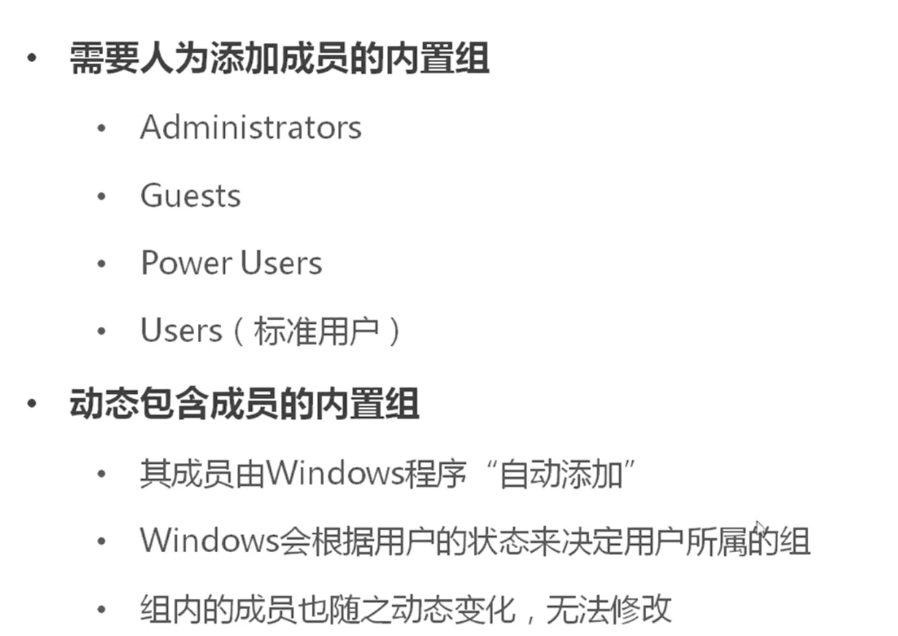
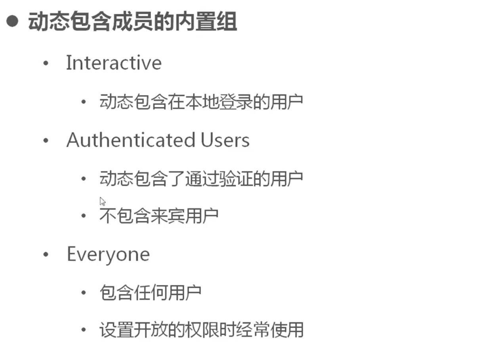
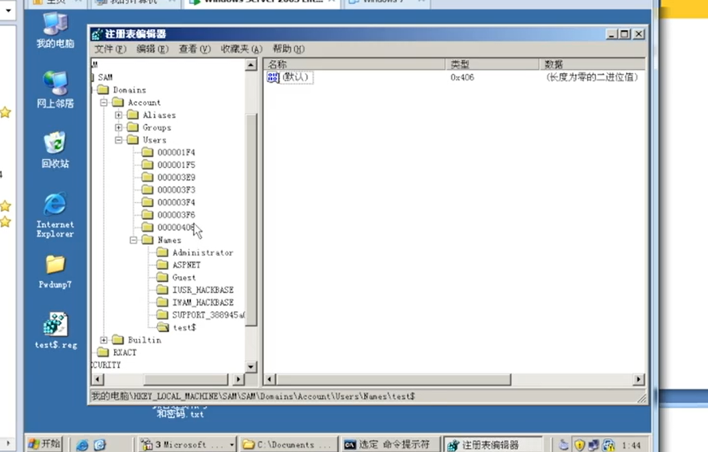
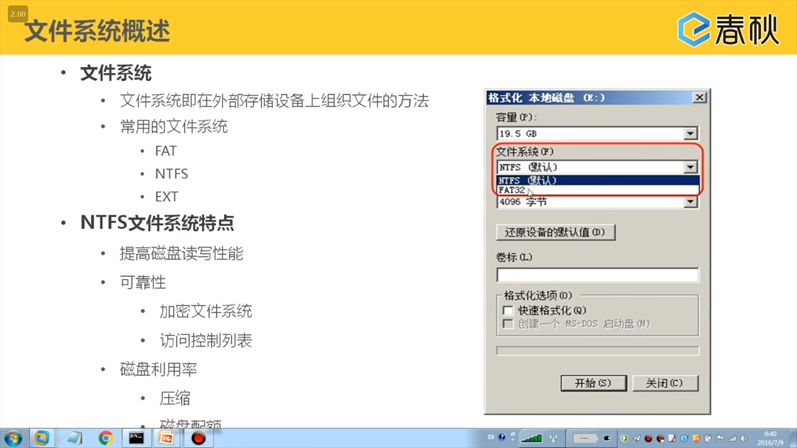
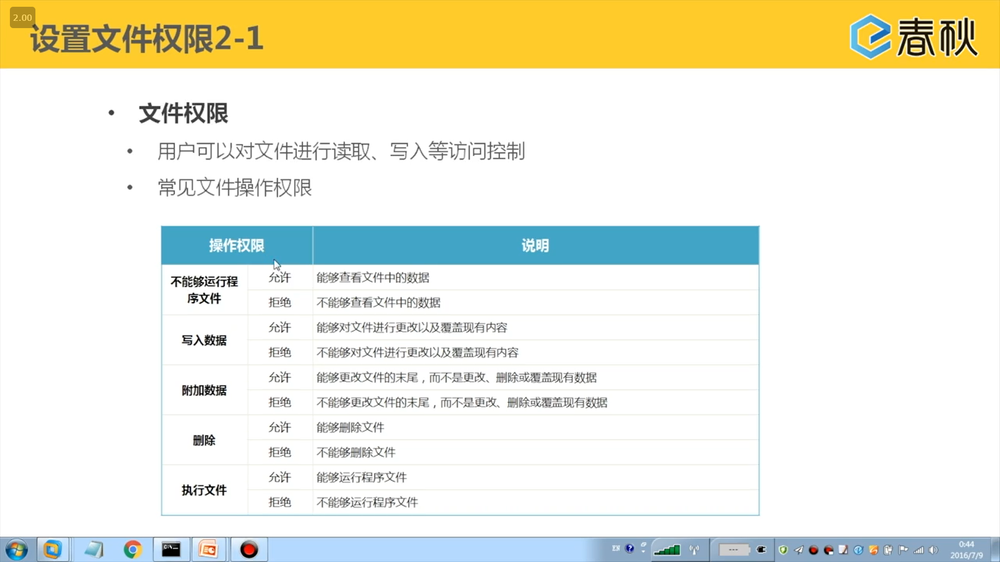
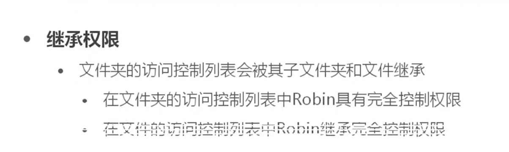
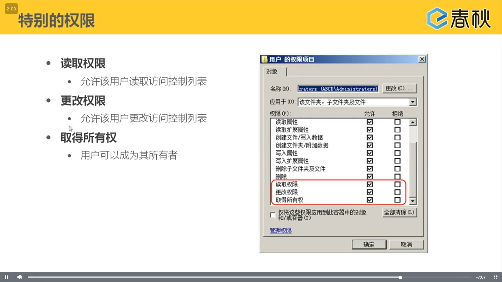
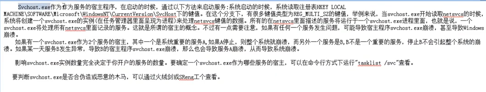

# Windows系统安全基础

## Windows系统账号安全

### 用户账户概述

- 不同的用户身份拥有不同的权限
- 每个用户包含一个名称和一个密码
- 用户账户拥有唯一的安全标识符

### 管理用户

- 创建用户

  计算机管理---本地用户和组---添加用户

- 修改密码

  计算机管理---本地用户和组---选择用户修改密码

- secpol.msc进入本地安全策略

  本地策略---用户权限分配

### 通过进程和服务区分各内置用户的账户的作用

- 与使用者关联的用户账户	
  - Administrator(管理员用户，默认的管理员用户)
  - Guest(来宾用户，默认禁用)
- 与Windows组件关联的用户账户
  - SYSTEM(本地系统，为Windows的核心组件访问文件资源提供权限)
  - LOCAL SERVICE(本地服务，预设的拥有最小权限的本地账户)
  - NETWORK SERVICE(网络服务，具有运行网络服务权限的计算机用户)

### 组账户

####  创建组

计算机管理---本地用户和组---添加组

组内的用户自动拥有组的权限





### Windows账户克隆及超级隐藏

- 通过注册表克隆用户
-  通过rootkit攻击超级隐藏用户

命令创建隐藏用户net user test$ /add(计算机管理可以看到)

注册表 导出用户以及用户权限到文件

然后将管理员用户的注册表文件的权限导出

将用户的十六进制码改为管理员用户的十六进制码

然后命令行`net user test$ /del`删除

再分别导入用户和权限的文件





在访问控制列表中，受拒绝的权限是有限的





mstsc远程桌面

```java

```

### svchost存储位置

%systemroot%\system32

%systemroot%\system32\dllcache

%systemroot%\ServicePack目录


