# Java

## java基础内容

单行注释     `/* ` `//`

多行注释  

```java
/**
*多行注释  （工具解析）
*
*/
```

public 公开的 static静态的 void表示空 main表示方法名 （String[] args) 形参

1 标识符（类名 方法名 常量 接口名 变量名）

2 规则 数字字母下划线美元  不可以数字开头 严格区分大小写 不可使用关键字

java 所有的字符串型数据使用双引号

​        所有的字符型数据使用单引号

变量： 数据类型+ 变量名称

java代码自上而下执行

变量作用域 ：变量支持的允许范围，在什么范围之内可以访问

出大括号范围 

局部变量：在方法提中声明的变量叫局部变量

成员变量：在方法体外【类体之内】声明的变量叫成员变量

类体中不可编写Java语句

数据类型

### 基本数据类型

第一条：整数型：bytes shor in long

第二类：浮点型：float double

第三类：布尔型：boolen

第四类：字符型： char

### 引用数据类型

字符串属于引用类型

基本数字类型占用空间大小：

基本数据类型                       占用空间大小单位字节

\-------------------------------------------------------------------

byte						1    -128~127

short 					2	-32768~32767

int 						4				成员变量默认赋值为0

long						8

float						4				0.0

double					8				0.0

boolean					1				false

char						2	0-65535		\u0000

ASCII码彩用一个字节编码

GB2312 GBK GB18030中文编码

unicode 统一所有文字 utf-8 

java源代码使用unicode编码

解码和编码

\转义功能 \n换行符

println输出后换行

print输出不换行

\t制表符 tab键

native2ascii可将文件转换为unicode编码格式

整数型默认当作int处理，要当作long处理  数值后加L/l

大容量变量变小容量变量  编译会发生错误

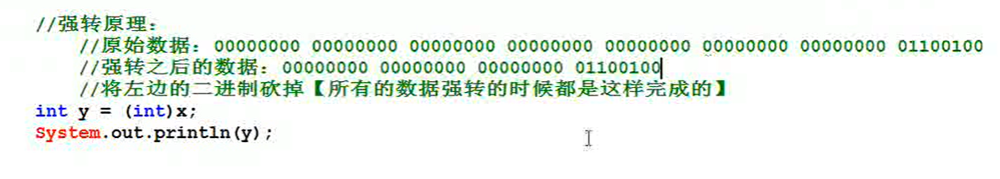

大容量转小容量需要添加强制转换符号，

一个整数变量没有超出byte类型取值范围，字面值可以直接赋值给byte类型的变量

long k = 221231231l;

int e = (int) k;

强制进行转换

**原码补码反码**

正整数的补码   二进制表示与原码相同 

负整数：所有位取反后加1

计算机中 数值一律用补码进行表示和存储

将字面值当作float类型处理 要在子面子后添加f/F

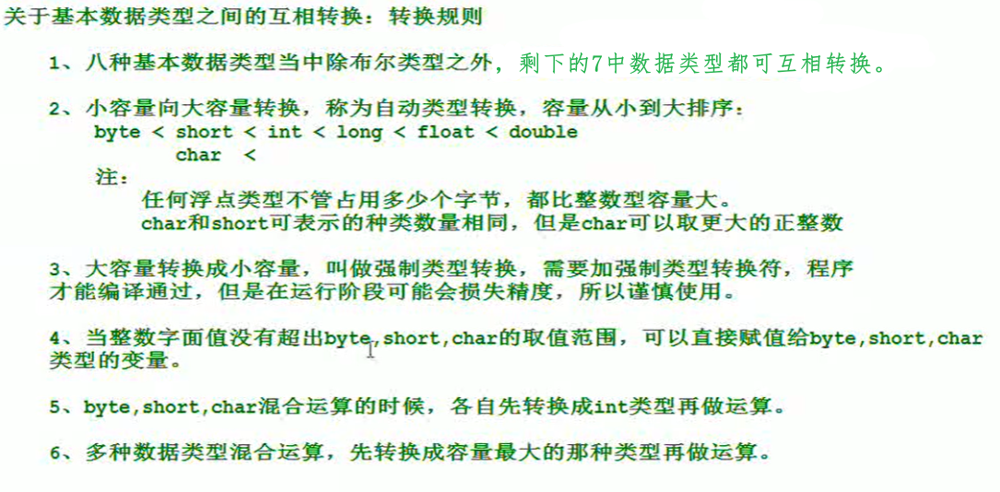

运算符号：

算数运算符 + - * / ++  -- %

关系运算符： < <= > >= == !

布尔运算符 && || & !

++自加1   

--自减一

int k=1;

k++; k=2     b = k++ 先进行赋值运算 再进行+1

int k=2; 

++k; k=3 运算结束都会加1   b = ++ k   先运算  再赋值

关系运算符  >大于 >=大于等于 <小于 <=小于等于 ==等于 != 不等于

**逻辑运算符**

 &与  两边都为真为真

  |或者  有真则真

  !非  取反

 ^异或   两边算子只要不一样就是true

 &&短路与    短路与存在短路现象   与逻辑与结果一致

 ||短路或	   短路或存在短路现象

```java
int x = 11
int y = 8
system.out.println(x<y & ++x<y)
system.out.println(x)  /x=11
system.out.println(x<y && ++x<y)
system.out.println(x)  /x=10
```

前一个算子为false 后面的不再执行

短路与或效率高

位运算符 ：

&  *

赋值类运算符：

基本：=  

 +=  x+= y  x=(类型byte)(x+y)

 -=

 /=

 %=

字符串连接：+   运算符左右只要有一个是字符串 就会拼接成字符串

**三元运算符：**

布尔表达式？表达式1：表达式2；

**控制语句**

**选择控制**

```java
- if/ if else

if(条件){
	java语句；
}

if(布尔表达式）{
	java语句；
}else{
	java语句；
}

if(布尔表达式){
	java语句；
}else if(布尔表达式){
    java语句；
}else if(布尔表达式){
    java语句；
}else{
    java语句;
}
```

只要有一个分支执行，if语句全部结束

有else的必有分支被执行

所有的控制都可互相嵌套使用，只要合理嵌套

if语句只有一条java语句，大括号可不写 

从键盘接受输入

java.util.Scanner s = new java.util.Scanner(System.in);

调用 s.next()方法接受输入

  nextint输入数字

```java
- switch
    
switch(i){
	case 1:
		code;
		code;
		break;
    case 2:
       	code;
		code;
		break; 
default :
		code;
		code;
		break;
}
```

switch后小括号中的数据与case后的数据进行匹配 匹配成功的执行分支代码

匹配成功的分支执行代码后面有break语句的话。swit语句终止

没有break，直接进入下一个分支执行代码  case穿透现象

case可以合并

case 1 : case 2 : case 3 : case 4:

code1

### **循环结构**

- for

在程序中反复执行一段代码

for(初始化表达式;布尔表达式;更新表达式){

code;

}均可省略

初始化表达式最先执行并且执行一次

   

- while

while(布尔表达式){

循环体；

}

布尔表达式为false时，循环结束。为真继续执行

- do while  

do{

} 

while()；

**控制循环**

- break

break可以在循环中使用用来终止循环的执行

可用在switch中中断匹配

默认中break中断最近的循环 

- continue

表示继续 下一个

continue；用老控制循环的执行

表示本次循环不执行

### **方法**

方法的基础:一段代码片段，可完成某个可重复使用的特定功能

类中可定义多个方法

方法的重载

```java
classname.sumInt(a,b)

public static void sumInt(int a,int b){
	int c = a + b;
	System.out.printlb('a+b'+'='+c);
}
public static void sumInt(String a,String b){
	int c = a + b;
	System.out.printlb('a+b'+'='+c);
}
```

方法定义，语法结构：

修饰符列表 返回值类型 方法名（形参){

方法体；

}

1修饰符列表：public static  ,可选项，非必需

若有关键字。调用方法：类名.方法名(实际参数);

2返回值类型：一个方法可以完成某个特定功能，功能结束后需要返回最终执行结果，执行结果可能是一个存在的数据，只要是数据就有类型。

返回值类型：Eg：任何java的数据类型

也可能方法执行结束后不反悔任何数据，Java规定，方法结束不返回任何数据的话，返回值类型位置必须编写void关键字

返回值类型若不是void，表示这个方法执行结束后必须返回一个具体的数值，当方法执行结束的税后没有返回任何数据的话编译器报错。

return 值。 值的类型必须和方法的返回值类型一致

返回值类型为void的时候，不能编写return 值，但可以编写return ;

带有return关键字的语句执行，return所在的方法执行结束

形式参数列表：可以有多个参数，局部变量。形参的个数从0-n

方法在调用的时候传递的参数成为实际参数

实参列表与形参列表必须满足类型相同，数量相同

方法体中的代码自上而下执行，

 方法定义修饰带static的方法可以不写类名进行调用

调用其他类的方法必须带类名  

方法的返回值类型不是void的时候

要求方法必须保证百分比执行return进行值的返回

return执行后，所在的方法结束

在统一个作用域中，return下不可编写任何代码

返回值类型为void的方法中使用return；语句

return；语句终止方法执行

main方法中也可以添加return;

### **内存分配**

方法在执行过程中的内存分配：

1. 方法只是定义，未调用不会分配内存空间。调用方法的时候，才会动态的给这个方法分配所需的内存空间

2. 在JVM内存主要内存空间划分：

   ​	*方法区内存

   ​	*堆内存

   ​	*栈内存

3. 关于栈数据结构

   ​	*stack 数据结构

   ​	*数据结构反应的是数据的存储形态

   ​	*数据结构是独立的学科

   ​	*数组、队列、链表、栈、二叉树、哈希表

   ​	栈帧永远指向栈顶元素

   ​	栈顶元素处于活跃状态，其他元素静止

   ​	压栈、入栈、push

   ​	弹栈、出栈、pop

   ​	存储数据的特点：先进后出，后进先出

4. 方法指向内存分配：

   ​	方法执行的时候代码片段存放?

   ​	方法代码片段放在方法区内存中，属于.class字节码文件的一部分，字节码文件在类加载的时候，将其放到了方法区中，所有JVM的三块主要的内存空间中方法区内存最先有数据。

   ​	代码片段虽然在方法区内存中只有一份。但是可以被重复调用

   ​	每一次调用此方法的时候，需要给该方法分配独立的活动场所，在栈内存中分配

   ​	栈内存中分配方法运行的所属内存空间

   ​	方法执行的时候执行过程的内存在哪里分配

5. 方法在调用的瞬间，会给该方法分配独立的内存空间，在栈中分配，此时发送压栈动作，方法执行结束之后，会给该方法分配的内存空间全部释放，此时发生弹栈动作

   ​	压栈:给方法分配内存

   ​	弹栈：释放方法的内存空间

6. 局部变量在方法体中声明，局部变量在运行阶段内存在栈中分配，

**方法初步：**

方法执行过程中的内存分配

方法调用过程中参数传递的是值

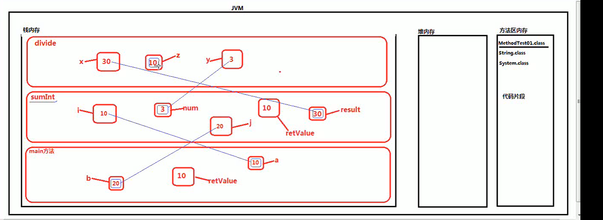

方法的重载机制

多个方法功能类似可用方法重载，方便记忆及使用

方法同一个类中：

方法名相同。参数列表不同，参数数量不同，参数顺序不同

方法重载的具体应用：

方法的递归调用

在方法自己中调用方法本身，代码片段只有一份，但是可以被重复调用，只要调用方法，栈内存中就会分配一块新的空间。递归很耗内存

栈内存溢出错误，JVM停止运行，

递归在运行时太深也会溢出即使有退出语句

### Java修饰符

- 默认访问修饰符-不使用任何关键字

  ​	使用默认修饰符声明的变量和方法，对同一个包内的类是可见的。接口里的变量都隐式声明为public static final，而接口中的方法默认情况下访问权限是public

  ```java
  String name = "lisi";
  boolean processorder(){
      return true;
  }
  ```

- 私有访问修饰符-private

  ​	私有访问修饰符是最严格的访问级别。被private声明的方法、变量和构造方法只能被所属类访问，并且接口和类不可被private修饰。

  声明为私有访问类型的变量只能通过类中公共的getter方法被外部类访问。

  ```java
  public class Student(){
      private String name;
      public String getname(){
          return this.name;
      }
      public void setname(String name){
          this.name = name;
      }
  }
  ```

- 公共访问修饰符-public

  ​	被声明为public的类、方法、构造方法和接口都能被任何其他类访问。如果几个相互访问的public类分布在不同的包中，则需要导入相应public类所在的包。

- 受保护的访问修饰符-protected

  ​	

## **面向对象**

### **类的定义**

**核心机制**

面向过程与面向对象的区别

面向过程：实现的具体过程。关注因果关系的过程

有点：对于业务逻辑简单的程序可以快速开发，前期投入低

缺点：很难解决业务复杂的逻辑。面向过程的方式导致元素之间的耦合度非常高，其中一环出问题，就会收到影响。没有独立提的概念，无法打到附件复用

c面向过程 c++半面向对象 java纯面向对象

面向对象：面向单独的对象。每个对象都是独立的单元，在给定的环境中各个单元协作工作运行

优点：耦合度低，扩展能力强。更容易解决现实世界更复杂的业务逻辑问题。

缺点：前期投入成本较高，需要进行独立提的抽取，大量的系统分析设计。

面向对象的三特征

封装

继承

多态

开发过程：面向对象的分析，面向对象的设计，面向对象的编程。

面向对象的概念

类：是一个模板。是一个不存在的概念，代表一类事物，对象A与对象B之间有共同特征，进行抽象总结出的模板。

对象：是真实存在的个体。

软件开发过程：观察现实世界，从现实世界中寻找对象，形成一个模板类

通过Java代码来表述一个类。再通过类创建对象，然后让对象协作工作形成一个系统。

类 --》 对象  通过实例化

对象 --抽象>  类

类的主要描述：状态+动作（属性+方法）

- ooa 面向对象分析

- ood 面向对象设计

- oop 面向对象编程


对象与对象之间有共同特征，也有数据的差异

### 

​	类的修饰符 class 类名 extends 父对象名 implements 接口名称{}

状态信息+动作信息

属性通常采用变量的形式来定义

类的修饰符 class 类名 {

​		在类体中，方法体之外的定义成为成员变量

​		成员变量没有赋值，系统默认赋值，向0看起

​		方法描述对象的动作信息

}

Java 语言中包括两种数据类型：

-基本数据类型

byte、int、long、bool、short、char、double、float

-引用数据类型

所有的class都是引用数据类型、String、System、User、Product、Customer

对象的创建及使用

实例化类：new classname();

new  是Java语言中的一个运算符。

作用：在JVM堆内存当中开辟新的内存空间

栈内存:(局部变量）方法代码片段执行的时候，会给该方法分配内存空间，在栈内存中压栈

堆内存：（成员变量）

 classname name = new classname();

 new运算符在堆内存中开辟的内存空间称为对象

引用，引用保存了内存地址（java对象的内存地址).

堆内存中的对象内部的实例变量只能通过访问

引用.属性；  引用.属性 = newvalue;

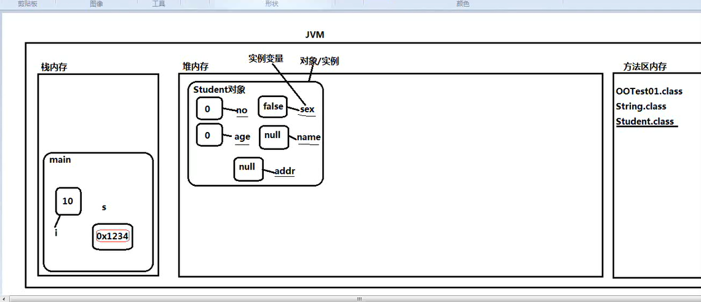

 

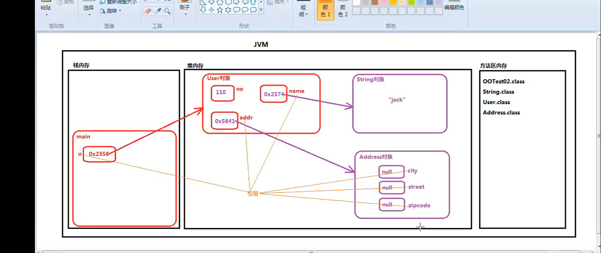

引用的地址的值发生改变，值也发生改变。

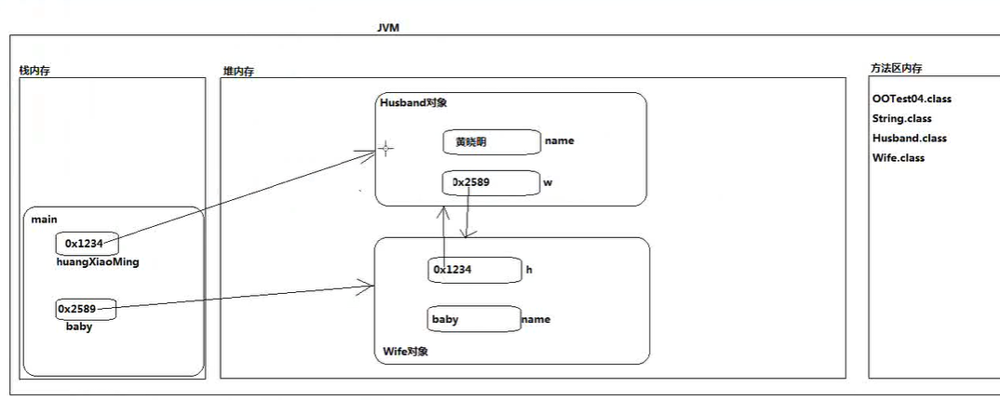

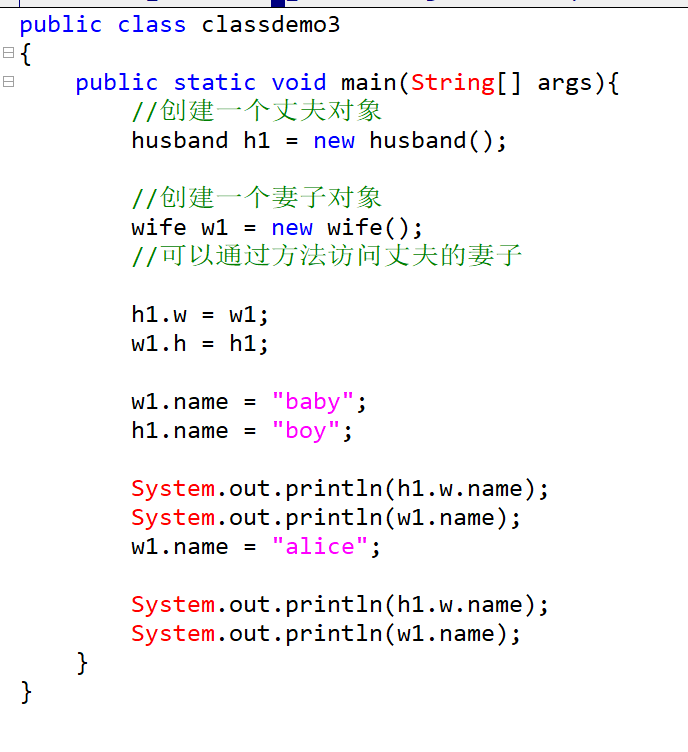

JVM（Java虚拟机）主要包括三块内存空间：分别是栈内存、堆内存、方法区内存

堆内存和方法区内存各有一个，一个线程一个栈内存

方法调用的时候，该方法所需要的内存空间在栈内存中分配，成为压线。方法执行结束之后，该方法所属的内存空间是否，成为弹栈

栈中主要存储的是方法体中的局部变量。

方法体的代码段以及整个类的代码片段都被存储在方法区内存中，在类加载的时候这些代码会载入

在程序执行过程中使用new运算符创建的Java对象，存储在堆内存当中，对象内部有实例变量，所以实例变量存储在堆内存当中。

变量分类:

-局部变量(方法体内声明

-成员变量(方法体外声明

*实例变量（没有static修饰

*静态变量（有static修饰

静态变量存储在方法区内存当中

变化最频繁的是栈内存，最先有数据的是方法区内存。垃圾回收器主要针对的是堆内存

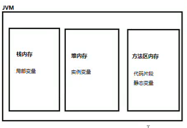

垃圾回收器【自动垃圾回收机制，GC机制】在堆内存中的Java对象成为垃圾数据的时候会被垃圾回收器回收。

什么时候堆内存中的Java对象会变成垃圾：

没有更多的引用指向数据的时候会变成垃圾数据。

这个数据无法被访问，因为访问对象只能通过引用的方式访问

 空引用访问实例相关的数据一定会抛出空指针异常

属性通常彩用变量来表示，既然是变量那么变量肯定有数据类型。数据类型：基本数据类型+引用数据类型

每个类中都可以编写主方法，但是一般情况下一个系统只有一个入口

**面向对象的封装性**

封装的好处：看不到实物复杂的一面

复杂性封装，对外提供简单的操作入口。

封装之后才会形成真正的对象，真正的独立体

封装之后程序可以重复使用

封装后对于事物本身提高了安全性

封装的步骤

1所有属性私有化，使用private进行修饰，修饰的属性只能在类中访问

private int age;

2对外提供简单的操作入口，进行对私有属性访问（set和get方法）

set方法的命名规范 public void set+属性名大写(形参){}>没有返回值

get方法的命名规范 public void set+属性名大写(){}

set和get方法没有static关键字

有static关键字修饰的方法调用：类名.方法（）;

没有static关键字修饰的方法调用：引用.方法名（实参）；

```java
public class Student{
private int age;
public void setAge(int a){
	age = a;
}
public int getAge(){
	return age;
	}
}
```

IDEA：alt+inset可选择自动生成set和get方法

### 构造方法（构造函数，构造器）

```
**构造方法：
*  1 构造方法又称为构造函数，构造器/constructor
*  2 语法结构：
*       [修饰符列表] 构造方法名(形参列表){
*               构造方法体;
*           }
*  3 普通方法：
*       [修饰符列表] 返回值类型 构造方法名(形参列表){
*           方法体
*           }
*  4 对于构造方法来说，返回值类型不需要指定，也不能写void
*  5 构造方法的方法名必须与类名一致
*  6 构造方法的作用：
*       构造方法存在的意义：通过构造方法的调用可以创建对象
*  7 构造方法的调用:
*       普通方法调用：没有static类名.方法名(实参) 有static:引用.方法名(实参列表)
*       构造方法调用：new 构造方法名(实参列表);
*  8 构造方法结束后有返回值。return值不需要编写
*    并且返回值类型是构造方法所在类的类型
*  10 当一个类中没有任何构造方法的话，系统会默认给一个无参的的构造方法，被成为缺省构造器
*   返回了内存地址
*  User u = new User();
*  11 有参数的构造方法
*  12 当一个类的显示方法将构造方法定义出来，不在为这个类提供默认缺省构造器，建议开发中手动为当前类提供无参构造方法
*  13 构造方法支持重载机制，在一个类中编写多个构造方法构成重载机制
*
*  构造方法的其他作用:
*       创建对象
*       创建对象的同时，初始化实例变量的内存空间。赋值实例变量
*       alt+7 查看此类的所有方法
*       对象没有。实例对象就不会有。实例变量在创建对象的时候声明为0，在构造方法执行的过程中对实例变量开辟内存空间。赋值默认值也是在构造方法执行的时候赋值
*
*       加载了类方法也不会有值。
```

### 对象和引用

对象：使用new运算符在堆内存中开辟的内存空间为对象

引用：是一个变量，不一定是局部变量，还可能是成员变量，引用保存了对象在堆内存中的地址。所有访问实例想过的数据需要通过引用.方式访问。

只有一个空的引用，访问对象的实例相关的数据会出现空指针异常。

#### 参数的传递

main方法中的变量是局部变量，i变量本身占有内存空间

i变量本身也有内存地址，i变量保存的是10这个字面值

传递给其他方法是传递的是10

#####  this关键字

  this关键字保存地址指向自身
  this是一个引用，是一个变量，this变量保存了内存地址指向了自身
  this存储在JVM中堆内存Java对象内部
  没有static关键字的方法被成为实例方法，使用‘引用，
  没有static关键字的变量成为实例变量，必须使用引用.
  当一个行为指向的过程中是需要对象参与的，这个方法一定要定义为’实例方法‘不带static关键字,含static的方法不可使用this关键字访问。main方法中没有this
  this可以出现在实例方法当中，this指向当前正在指向这个动作的对象

在static方法中不可以直接访问实例变量和实例方法。

this可以使用在构造方法中通过当前构造方法调用其他的构造方法，但是不会创建新的对象。this(实参);只能出现在第一行。

带static的方法，起始既可以采用类名的方式访问，也可以采用引用的方式访问，采用引用的方式去访问，实际上执行的时候和引用指向的对象无关

```java
package com.thisdemo.javase;

public class ThisDemo02 {
    int id;
    String name;
    boolean sex;

    public ThisDemo02(int id, String name, boolean sex) {
        this.id = id;
        this.name = name;
        this.sex = sex;
    }
    public ThisDemo02(){ 
        this(1,"li",true);//使用此方法调用带参数的构造方法,不会创建新的对象
    }
    public static void main(String[] args) {
        ThisDemo02.dosome();
        dosome();
//        this.doother();  //报错
//        doother();  //报错
        ThisDemo02 demo01 = new ThisDemo02();
        demo01.doother(); //doother
        demo01.run();
    }
    public static void dosome(){
        System.out.println("dosome");
    }
    public void doother(){    //必须先创对象后引用.doother
        System.out.println("doother");
    }
    public void run(){
        System.out.println("run");
        doother();
    }
}
```

##### static关键字

变量使用static修饰，静态变量在类加载的时候初始化，内存就已开辟，存放在方法区内存中

可以使用类名.以及引用.对静态变量或者方法进行访问

1. 可以使用static关键字定义静态代码块。在main方法中编写

   ` static{	javacode;}`

2. 静态代码块在类加载时执行，且只执行一次，可在一个类中编写多个，自上而下执行

3. {javacode;}实例代码块在类中编写，可以写多个，自上而下执行，实例代码块在构造方法执行之前执行。

4. 何时定义方法为静态:

   ​		当所有的对象执行这个方法的时候，最终产生的影响是一样的，那这个方法不再属于某一个对象动作，可以将这个动作提升为类级别的方法。 静态方法无法直接访问实例变量和实例方法。

  class类中编写内容：

{

​	静态代码块；

​	实例代码块；

​	静态变量；

​	实例变量；

​	构造方法；

​	静态方法；

​	实例方法；

}

#### 继承

继承是面向对象三大特征之一，基本的作用是代码复用，有了继承才有了方法的覆盖和多态机制。

格式：[修饰符列表] class 类名 extends 父类 {类体=属性+方法}

继承只继承单继承，一个类不可继承很多类。一个类可间接继承其他类：B继承A，C继承B。C类间接继承B,A 

继承符类的数据：私有的不支持继承，构造方法不支持继承，其他数据都可继承。

一个类没有显示继承任何类，默认继承Javase库中提供的java.lang.object类

```java 继承
//父类文件
package com.extend.javase;

public class FatherDemo1 {
    private int age;
    private String name;
    public int getAge() {
        return age;
    }
    public void setAge(int age) {
        this.age = age;
    }
    public String getName() {
        return name;
    }
    public void setName(String name) {
        this.name = name;
    }
    public FatherDemo1(){
        super();
    }
}
//子类文件
package com.extend.javase;
public class Son1 extends FatherDemo1{
    //private int age;
    //private String name;
    public Son1(){
        super();
    }
}
//测试文件
package com.extend.javase;
public class Testdemo01 {
    public static void main(String[] args) {
        Son1 son = new Son1();
        son.setAge(123);
        son.setName("123");
        System.out.println(son.getAge());
        System.out.println(son.getName());
    }
}

```

##### 方法的覆盖（方法重写）

 父类中的方法已不满足子类中的方法需求，需要使用方法重写

重写后子类调用的是重写后的方法。方法名相同，形参相同吗。访问权限不能更低，可以更高，抛出异常不能更多，可以更少。

  注意：私有方法不能继承，所以不能覆盖。

​			构造方法不能继承，所以不能覆盖。

​			静态方法不存在覆盖。

​			覆盖只针对方法，不针对属性。

```java
    @Override
    public void move() {
        super.move();
    }
```

#### 多态

1. 多态中的概念：

   - 向上转型：子类型转换为父类型（自动类型转换)
   - 向下转型：父类型转换为子类型（强制类型转换）【加强制类型转换符】

      两种类型之间必须有继承关系

   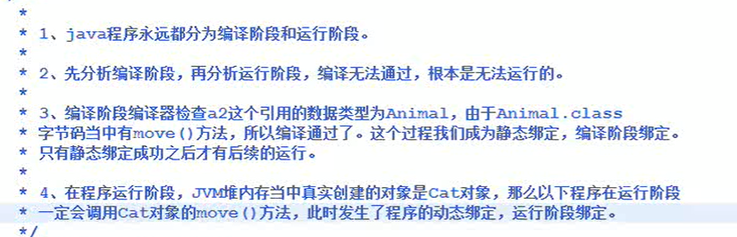

需求：想让

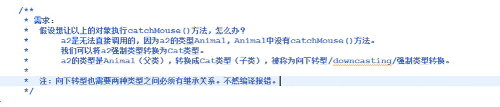

当调用的方法是子类型中特有的，在父类型中不存在，必须进行向下转型。

son so = (son)so;

向下转型存在安全隐患

使用instanceof避免转型出现的classcastexception错误；

instanceof使用：引用 instanceof 数据类型名

结果是布尔类型。真代表引用指向的对象是 数据类型 ，假代表不是 属性类型名

多态的作用：降低代码的耦合

```java [多态的使用]
//父类
package com.testplo.javase;

public class Fatherdemo02 {
    public String name;
}
//子类
package com.testplo.javase;
public class Sondemo02 extends Fatherdemo02 {
}
//调用类
package com.testplo.javase;
public class Motherdemo02 {
    public void kiss(Fatherdemo02 fa){
        System.out.println(fa.name);
        System.out.println("i kiss you!");
    }
}
//子类2
package com.testplo.javase;
public class Daugterdemo02 extends Fatherdemo02 {
}
//测试类
package com.testplo.javase;
public class Testdemo02 {
    public static void main(String[] args) {
        Motherdemo02 mo = new Motherdemo02();
        Fatherdemo02 fa = new Fatherdemo02();
        fa.name = "lise";
        Sondemo02 son = new Sondemo02();
        son.name = "bob";
        mo.kiss(son);
        Daugterdemo02 da = new Daugterdemo02();
        da.name = "alice";
        mo.kiss(da);
    }
}
//输出结果
bob
i kiss you!
alice
i kiss you!
进程已结束，退出代码 0
```

##### package和import

package成为包，这种机制为了方便程序的管理。

定义package方法

1. 在Java源程序的第一行编写package语句（只能编写一个语句）

   语法结构:package 包名;

2. 包名的命名规范：

   公司域名倒序 + 项目名 + 模块名 + 功能名;(全部小写，遵守标识符规则，一个包是一个目录)

   e.g：`com.baidu.oa.user.service;`

   使用package机制之后，类名改为包名+类名；

3. 编译方法，javac java文件，将生成的class文件到创建的包下，然后java + 类名（全称）。

   import 导入类名（全称）；同一个包下的类不需要导入，不同包下的需要导入；需要编写在package之下，class之上。

#### 访问控制权限修饰符

1. 访问控制权限来控制元素的访问范围
2. 访问控制权限修饰符包括：
   - public	表示公开的，任何位置都可访问
   - protected 同包、子类
   - 缺省  同包
   - private  表示私有的，只能在本类访问
3. 可以修饰类、变量、方法
4. 当某个数据只希望子类使用，使用protected进行修饰。
5. 修饰符的范围：private < 缺省 < protected < public

##### super()

super是一个关键字

this只能出现在实例方法和构造方法中，不可使用在静态方法中。

this()只能出现在构造方法第一行，通过当前的构造方法去调用本类中其他的构造方法，代码复用。

super能出现在实例方法和构造方法中，不能使用在静态方法中，super.大部分情况可以省略，？？？？

super()只能出现在构造方法第一行，通过当前的构造方法去调用父类中的构造方法，目的：代码复用（创建子类对象的时候，先初始化父类型特征）

super()表示通过子类的构造方法调用父类的构造方法。

 ```java
 package com.superdemo.javase;
 
 public class SuperDemo01 {
     public static void main(String[] args) {
         B b = new B();
         //A的构造方法
         //B的构造方法
     }
 }
 class A{
     public A(){
         System.out.println("A的构造方法");
     }
     public A(int a){
         System.out.println(a);
     }
 }
 class B extends A{
     public B(){
         super();
         //super(199); //调用带参数的父类构造方法
         System.out.println("B的构造方法");
     }
 }
 //子类默认调用父类的无参构造方法
 ```

this()与super()不可共存，父类的构造方法一定先执行。

```java
public class SuperDemo01 {
    public static void main(String[] args) {
        B b = new B();
        //A的构造方法
        //B的构造方法
    }
}
class A{
    public A(){
        System.out.println("A的构造方法");
    }
    public A(int a){
        System.out.println(a);
    }
}
class B extends A{
    public B(){
        this("hello world");
        System.out.println("B的构造方法");
    }
    public B(String b){
        System.out.println("B带参数的构造方法")
    }
}
//A的构造方法
//B带参数的构造方法
//B的构造方法
/*主方法中调用B类中的无参构造方法，在允许中，先执行父类A的无参构造方法，然后执行B类的带参构造方法，最后输出B的构造方法
```

super()的作用是初始化当前对象的父类型特征，并不是创建对象，实际上对象只创建了一个

super关键字代表的是当前对象的那部分父类型特征。

```java
package com.superdemo.javase;

public class SuperDemo03 {
    public static void main(String[] args) {
        F f = new F(false,"zs",14);
        System.out.println(f.getAge() + ":" + f.getName() +":" + f.isSex());
//通过super方法调用父类的构造函数以对private属性进行访问
    }
}

class E{
    private String name;
    private int age;

    public E(){

    }
    public E(String name,int age){
        this.name = name;
        this.age = age;
    }
    public String getName() {
        return name;
    }
    public int getAge() {
        return age;
    }
}

class F extends E{
    private boolean sex;
    public F(){
    }
    public F(boolean sex,String name,int age){
        super(name,age);
        this.sex = sex;
    }
    public boolean isSex() {
        return sex;
    }
}
```

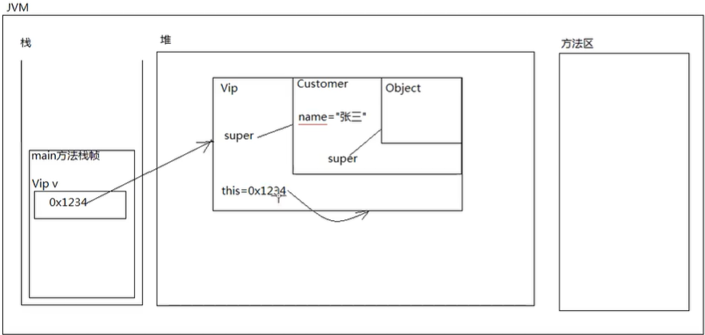

 子类中同名变量出现会将子类的变量值赋值Null

同名属性访问父类的特征必须使用super(不可省略)访问

super不是引用，不保存内存地址，不指向任何对象。仅代表当前对象的父类型的特征。

super.attr;访问父类的属性

super.func();访问父类的方法

super();调用父类的构造方法

this.attr;访问本类的属性

this.func();调用本类的方法

this();调用本类的构造方法

System.exit(0);退出Java虚拟机

##### final

1. final是Java语言中的关键字
2. 表示最终的，不可变的。
3. 可修饰遍历和方法和类
4. final修饰的变量不可再次赋值
5. final修饰的方法无法被覆盖，重写
6. final修饰的类不可被继承
7. final修饰的变量是一个引用，不可再重新赋值，该引用只能指向一个对象，并且它只能永远指向该对象，无法再指向其他对象，并且在该方法指向过程中，该引用指向该对象之后，该对象不会被垃圾回收器回收。引用指向的对象的值是可以改的。
8. final修饰的实例变量，必须手动赋值 final int a = value;或者在构造方法中再赋值
9. final修饰的实例变量一般添加static修饰改为静态变量，存储在方法区，成为常量，常量全部大写，常量和静态变量一样，但是常量的值不可变，都存在方法区，可以公开

```java
package com.finademo.javase;
public class FinalDemo02 {
    final int a = 100;
    a = 10000; //此行报错
    Fa fa = new Fa();
    fa = new son(); //报错
}
class Fa{
    public final void eat(){
        System.out.println("eat");
    }
}
class son extends Fa{
    public void eat(){  //此行报错
    }
}
```

```java
public class A{
    //final int a;错误
    final int a = 10;  //第一种方法
    
    //第二种方法
    final int b;
    public A(){
        this.b = 200;
    }
}
```

final修饰的引用一旦指向一个对象，不再可以指向新的对象。被指向的对象无法被垃圾回收机制回收。但是指向的对象的内存地址可以修改。

final修饰的实例变量是不可变的，这种变量一般和static联合使用，成为常量。

`public static final 类型 变量名 = 值`

```java
class A {
    public static final User_Name = "张伞";
}

public class B{
    public static void main(String[] args){
        System.out.println(A.User_Name);
        //结果为张伞且不可修改
    }
}
```

##### 

#### 抽象类

描述： 类与类之间具有共同特征，将共同特征提取出来，形成的就是抽象类，抽象类是用来被继承，abstract与final不可联合使用

抽象类无法实例化对象

语法： [修饰符列表] abstract class 类名{}

抽象关联到抽象方法：抽象方法表示没有实现的方法，没有方法体的方法 public abstract void functionname();抽象方法必须出现在抽象类中

**非抽象子类继承抽象类中抽象方法必须进行实现**

```java
public abstract class classname{
    public abstract void functionname();
}
abstract class animass{
    public abstract void eat();
}
abstract class bird extends animass{
}
class yingwu extends bird{
    @Override
    public void eat() {  //必须进行重写
    }
}
```

#### 接口

1. 接口也是一种引用类型。完全抽象，（抽象类是半抽象）,编译后也是class字节码文件，

2. 接口可以继承接口，且可以多继承，

3. 接口只能包含常量以及抽象方法。

4. 抽象方法的abstract和public可以省略，接口中所有的元素都是public修饰的，接口中的方法不可以有方法体

5. 接口中的常量的public static final可以省略 

6. 基础语法：

7. [修饰符列表] interface 接口名{}

8. int a = 10;  a为常量
9. **当抽象类实现接口的时候必须将所有的方法进行重写**
10. 接口和类之间叫实现。
11. 继承使用extends，实现使用emplements。 
12. 一个类可以继承多个接口。接口和接口在强制转换的时候没有继承关系也可以强转（运行时会报错）
13. 继承与实现共存格式：`class a extend b implemets c`

```java
interface a{
    public abstract int sum(int a);
    int sun(int b);
}
class c implements a{
    @Override
    public int sum(int a) {
        return 0;
    }
    @Override
    public int sun(int b) {
        return 0;
    }
}
```

抽象类是半抽象的

接口是完全抽象的

抽象类有构造方法

接口中没有构造方法

接口和接口之间支持多继承

类和类之间只能单继承

一个类可以同事实现多个接口

一个抽象类只能继承一个类

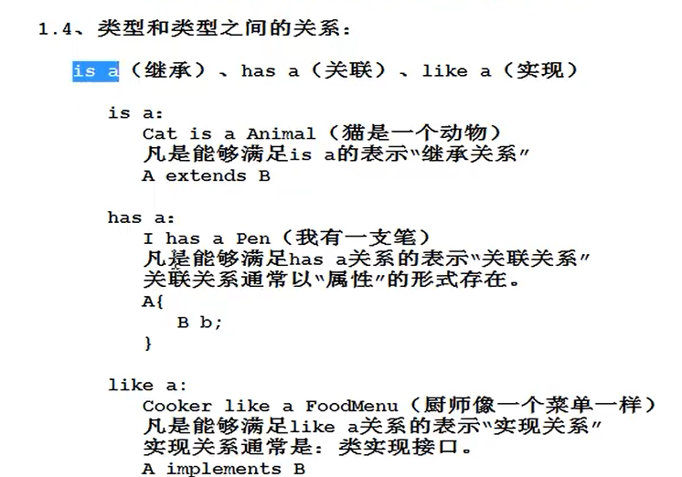

lang包下的直接子类不需导入，其他的需导入

#### 访问控制权限

public > protected > 默认 > private 

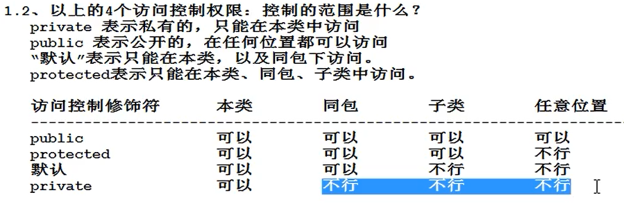

### object

1. 默认继承类object的方法

   1. toString()，输出引用的时候自动调用引用的toString方法

   2. equals()，判断两个对象是否相等，不可以使用==进行比较，==比较的是内存地址。在子类中必须对equals方法进行重写 ,且equals方法的重写要彻底

      ```java
      public boolean equals(Object obj){
          if(obj == null) return false;
      	if(this == obj) return true;
          classname u = (classname)obj;
          if(u.attr.equals(u.attr && .....)){
              return true;
          }
      }
      ```

   3. finalize()，protect修饰，在object类中只有一个方法体，里面没有代码，使用protected修饰

      这个方法不需要手动调用，jvm辣鸡回收机制负责调用此方法

      执行实际：将一个Java对象即将被辣鸡回收机制回收的时候，辣鸡回收机制负责调用此方法，若需要在辣鸡销毁时机执行一段代码的话，要写在finalize方法当中

      ```java
      protected void finalize() throws Throwable {
          super.finalize();
      }
      System.gc()//建议启动垃圾回收器
      ```

   4. hashcode() 获取对象哈希值的一个方法

       

2. 匿名内部类

   内部类：在类的内部定义了新的类称为内部类

   静态内部类：类似于静态变量

   实例内部类：类似于实例变量

   局部内部类：类似于局部年龄

   匿名内部类是局部类的一种，

   ```java
   package com.extend.javase;
   
   public class noname {
       public static void main(String[] args) {
           test01 test = new test01();
           test.sum(new computer1(),12,14);
       }
   }
   \\定义一个接口
   interface computer{
       int sum(int m,int b);
   }
   \\定义一个类实现接口
   class computer1 implements computer{
       public int sum(int a,int b){
           return a + b;
       }
   }
   创建新类，实例方法中参数为之前的类
   class test01{
       public void sum(computer1 c, int a, int b){
           int result = c.sum(a,b);
           System.out.println(result);
       }
   }
   ```

   ```java
   \\匿名内部类
   package com.extend.javase;
   
   public class noname {
       public static void main(String[] args) {
           test01 test = new test01();
           test.sum(new computer(){
               public int sum(int a,int b){
                   return a + b;
               }
           },12,14);
           new接口后+{}表示接口的实现，表示类无名为匿名类
       }
   }
   \\定义一个接口
   interface computer{
       int sum(int m,int b);
   }
   
   class test01{
       public void sum(computer c, int a, int b){
           int result = c.sum(a,b);
           System.out.println(result);
       }
   }
   ```

   

   ```java
   class test01{
       static class test02{  //静态内部类
       }
       class inner2{  //实例内部类
       }
       public void dosome(){ 
           class test03	 //局部内部类
        	}
       }
   }
   ```

   

## **数组** 

1. java语言中的数组是一种引用数据类型，不属于基本数据类型
2. 数组是一个容器，可以同时容纳多个元素。                                         
3. 数组中可以存储基本类型的数据以及引用数据类型的数据
4. 数组对象在堆内存中
5. 数组中存放java对象的时候，实际存储的是对象的引用
6. 数组一旦创建，数组的的长度不可变
7. 数组的分类：一维数组、二维数组、三维数组、多维数组。。。
8. 所有的数组对象都有length属性，获取数组中元素的个数
9. Java中的数组要求数组中元素的类型统一，int数组只能存放int类型的元素
10. 数组在内存方面存储的时候，数组中的元素的内存地址是连续的
11. 所有的数组都是使用小方块的内存地址作为整个数组的内存地址

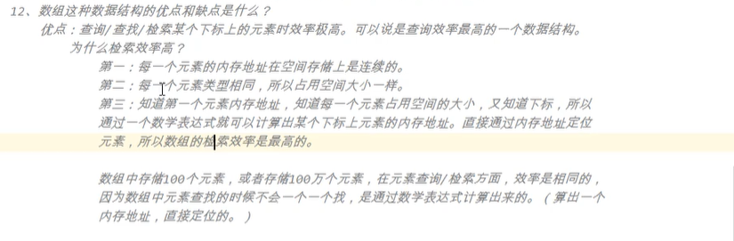

缺点：由于为了保证数组每个元素的内存地址连续，所以在数组中随机删除或者添加元素的时候，效率较低

数组不可存储大数据量，因为在内存中不易找到一块很大且连续的内存空间

定义一维数组

```java
int[] array1;
double[] array2;
boolean[] array3;
String[] array4;
Object[] array5;

//初始化一维数组
静态：int[] array = {1,23,4,5,5,6};
动态：int[] array = new int[5]; //5表示数组元素的个数（默认值为0）
```

遍历一维数组，数组[index] 访问某个元素

```java
int[] array = {1,23,4,5,5,6};
for(int i;i < a.length-1;i++){
    System.out.println(a[i]);
}
```

方法的参数为数组

```java
public static void printArray(int[] array){
    for(int i;i<array.length-1;i++){
     	System.out.println(array[i]);   
    }
}
int[] a = {1,2,3}

printArray(a);
//
public static void printArray(int[] array){
    for(int i;i<array.length;i++){
     	System.out.println(array[i]);   
    }
}
printArray(new int[]{2,2,3});
```

main方法中的String[] args，默认为空

用户在控制台以java 类名 str1,str2,的时候进项传递，jvm默认以空格的方式进行分离放入String args[]数组中 

`java classname field1 field2 `

```java
public static void main(String args[]){
    if(args.length == x){
        System.out.println('xxx');
     }
}
```

对象数组中可以存放类的子类

```java
package com.arraystudy.javase;

public class ArrayStudy01 {
    public static void main(String[] args) {
        Cat a = new Cat();
        Bird b = new Bird();
        Animals[] c = {a,b};
        
        for(int i=0;i<c.length;i++){
            Animals d = c[i];
            d.move();
            if(c[i] instanceof Cat){
                Cat cat = (Cat)c[i];
                System.out.println("cat");
            }
            if(c[i] instanceof Bird){
                Bird bird = (Bird)c[i]; 
                System.out.println("Bird");
            }    
        }
    }
}

class Animals{
    public void move(){
        System.out.println("Animals is moving!");
    }
}

class Cat extends Animals{
    public void move(){
        System.out.println("Cat is moving");
    }
}

class Bird extends Animals{
    public void move(){
        System.out.println("Bird is moving!");
    }
}
/*
Cat is moving
Bird is moving!
*/
```

一维数组的扩容

先新建一个大容量的数组，然后将旧数组中的数据拷贝进入新的数组，使用`System.arraycopy()`方法

```java
System.arraycopy(srcarray,srcindex,destarray,destindex,len)
srcarray:源数组
srcindex:源数组开始拷贝的下标起点
destarray:目标数组
destindex:拷贝进入目标数组的下标起点
len:拷贝元素的长度
```

```java
package com.arraystudy.javase;

public class copyarray {

    public static void main(String[] args) {
        int[] a = {1,2,3,4,5,6,7,};
        int[] b = new int[10];
        System.arraycopy(a,0,b,0,a.length);
        for (int i = 0; i < b.length; i++) {
            System.out.println(b[i]);
        }
        Object o1 = new Object();
        Object o2 = new Object();
        Object o3 = new Object();
        Object[] Oarray = {o1,o2,o3};
        Object[] newarray = new Object[8];
        System.arraycopy(Oarray,0,newarray,0,Oarray.length);
        for (int i = 0; i < newarray.length ; i++) {
            System.out.println(newarray[i]);
        }
        String c = "abc";
        String d = "123";
        String e = "hello";
        String f = "workd";
        String[] strarray = {c,d,e,f};
        String newstr[] = new String[10];
        System.arraycopy(strarray,0,newstr,0,strarray.length);
        for (int i = 0; i < newstr.length;i++) {
            System.out.println(newstr[i]);
            
        }
    }
}
/**
1
2
3
4
5
6
7
0
0
0
java.lang.Object@1b6d3586
java.lang.Object@4554617c
java.lang.Object@74a14482
null
null
null
null
null
abc
123
hello
workd
null
null
null
null
null
null
*/
```

##### 二维数组

1. 二维数组是特殊的一维数组，一维数组中嵌套一维数组

2. 二维数组静态初始化

   ```java
   int[] array = {1,2,3}; #一维数组
   int[][] a = {{1,2,3},{3,4,5}}; #二维数组
   ```

3. 二维数组元素的访问

   ```java
   int[][] a = {{1,2,3},{3,4,5}};
   int[] a1 = a[0];
   System.out.println(a[0][0]); #获取二维数组中第一个一维数组的第一个元素
   
   ```

4. 二维数组的遍历

   ```java
   String[][] aray = {
       {'123','world','hello'},
       {'adasd','adas','baw'},
       {'你好','世界'}
   };
   for(int i=0;i<aray.length;i++){
       for(int j=0;j<aray[i].length;j++){
           System.out.println(aray[i][j]);
       }
   }
   ```

5. 动态创建二维数组

   ```java
   int[] array = new int[3][4]{{1,2,3,4},{1,2,3,4},{1,2,3,4}}
   int[][] array = new int[3][4]; 
   public static void printArray(int[][] array){
       for(int i=0;i<array.length;i++){
       	for(int j=0;j<array[i].length;j++){
           	System.out.println(array[i][j]);
       	}
   	}
   }
   printArray(array);
   ```

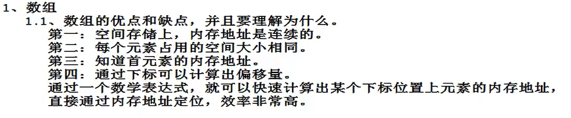

#冒泡排序

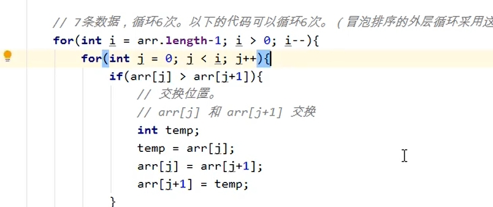

数组工具类 java.util.Arrays

#### String

1. String字符串类型，属于引用数据类型，不属于基本数据类型
2. 在Java中使用双引号括起来的都是Sting对象
3. 字符串类型数据不可变
4. 字符串都是存储在方法区的字符串常量池中
5. 使用构造方法new创建的字符串在堆内存中

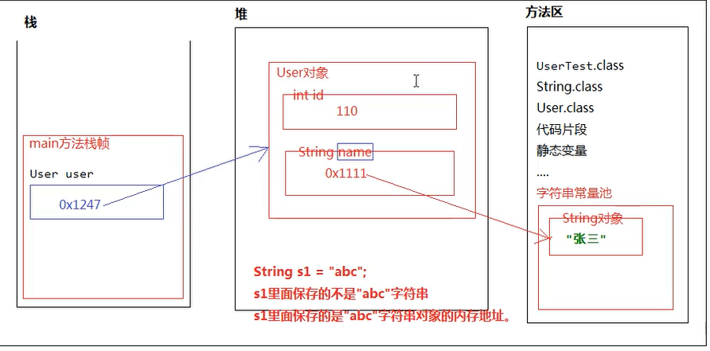


```java
#String的构造方法
String a = new ("hello world:");

String b = "Hello World";

String s = new String(char数组)；

String s = new String(char[],index,length);

String s =  new String(Byte[]);

String s = new String(Byte[],index,length);

String类已经重写了toString方法
```

indexOf()返回某个字符串在其他字符串首次出现的位置

isEmpty()判断某个字符串是否为空字符串

lastindexOf()返回某个字符串在其他字符串最后一次出现的位置

length()返回字符串的长度

replace(oldchar,newchar) 通过newchar替换oldchar

split()拆分字符串   

str.startwith(str2)判断某个字符串是否以子字符串开头

str.substring(num)从num下标截取字符串

str.substring(num1,num2)从num1>num2截取 左闭右开

str.toCharArray()转换为char数组

str.toLowerCase()转换小写

str.toUpperCase()转换大写

str.trim()去除前后的空白

String.valueOf()将非字符串转换为字符串。对象的话调用toString()方法

StringBuffer()

StringBuilder()

区别 StringBuffer中的方法使用synchronizer关键字修饰，表示在多线程环境下运行安全，Builder不适用修饰，在多线程环境下运行不安全

```java
StringBuffer s = new StringBuffer();
s.append('asd');

StringBuilder ss = new StringBuilder();
```

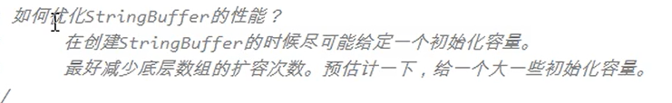


八种数据类型的包装类，属于引用类型

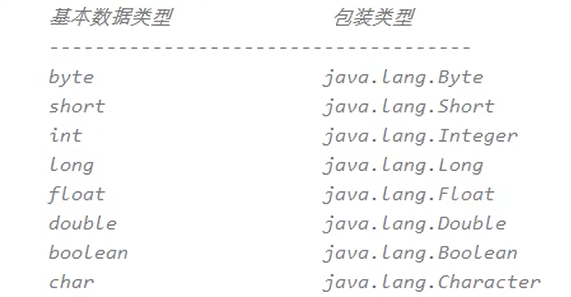

```java
Integer s = new Integer(121);
Integer b = new Integer("123");

System.out.println(s==b);
==判断的是两个对象的内存地址，不会进行自动拆箱操作。只有在进行加减乘除运算的时候才会进行自动拆箱机制
java中为了提高程序的执行效率，将[-128-127]之间所有的包装对象提前创建号，放到了一个方法区的整数型常量池中，目的是只要用这个区间的数据不需要再重新new，直接从整型常量池中获取。
    
Integet s = new Integet("中文");
会报异常：数字格式化异常
Java.lang.NumberFormatException

Static int parseInt("string");
parseInt('123');
字符串转换为Int的静态方法
```

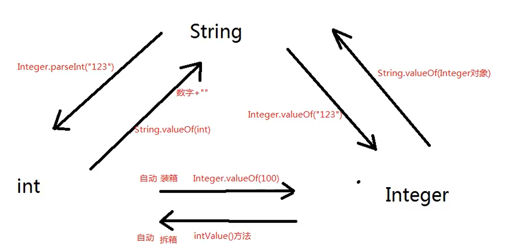

```java
#Date  java对日期的处理
Date()无参构造方法，分配Date对象并初始化此对象，
import java.util.Date;
Date nowTime = new Date();
nowTime：Tue Mar 05 10:51:06 CST 2021	

格式化方法
SimpleDateFormat  日期格式化

SimpleDateFormat Time = new SimpleDateFormat(日期格式)
yyyy 年
MM 月
dd 日
HH 时
mm 分
ss 秒
SSS 毫秒
String nowTime = Time.format(nowTime)
System.out.println(nowTime);

日期字符串转为Date类型
String newTime = "2021-07-25 14:13:11 888"
SimpleDateFormat stf = new SimpleDateFormat("yyyy-MM-dd HH:mm:ss SSS");
Date newtime2 = stf.parse(newtime)
System.out.println(newtime2);


long nowTimeMillis = System.currentTimeMillis();
获取1970年1月1日到目前的毫秒数

```

```java
##数字格式化
//DecimalFormat()
DecimalFormat() a = new DecimalFormat("数字格式");
数字格式：
#  任意数字
,  代表千分位
.  代表小数位
0  不够补充
DecimalFormat() ab = new DecimalFormat("##,###,###");
Double s = ab.format(1234.4123123);
1,234.4123123

   

BigDecimal()大数据，精度极高。
BigDecimal v1 = new BigDecimal();
BigDecimal v2 = new BigDecimal();
BigDecimal v3 = v1.add(v2);
```

```java
#随机数
import java.util.Random;
Random()
Random rand = new Random(); 生成随机数对象
int num1 = rand.nextInt(); 随机产生int类型的数组
rand.nextInt(101); 产生1-100】内的随机数
```

```java 
#枚举
enum Result{
    SUCCESS,FAIL
}
public static Result devide(){
    if(){
        code;
        return Result.SUCCESS;
    }
    else if(){
        code;
        return Result.FAIL;
    }
}
判断语句中多种返回结果建议使用枚举。
```


### 异常处理

异常处理机制：Java语言执行过程中出现了不正常的清空，称为异常

```java
#常见的异常类型
    空指针异常：
    	NullPointerException
   	类型转化异常：
    	ClassCastException
    数组下标越界异常：
    	IndexOfBoundsException
    数字格式化异常：
    	NumberFormatException
```

Java中异常以类存在，可以通过新建对象创建异常

```java
java.lang.Throwble

	- java.lang.Exception
```

运行时异常和编译时异常都是发生在运行阶段。

编译时异常和运行时异常的区别：	

​	编译时异常发生的概率要高（需要在运行之前进行预处理）

​    运行时异常以发送的概率较低

#### 处理异常的方式

1. 在方法声明的位置使用throws关键字
2. 使用try...catch的方式捕捉

方法后的throws抛出异常后会抛给上一级的调用方法。一般main方法不抛出异常

exception.getMessage() 获取异常简单描述信息

eaxception.printStackTrace()打印异常追踪的的堆栈信息

```java
Exception ec = new Exception("错误信息");
System.out.println(ec.getMessage());
//输出  "错误信息"
ec.printStackTrace();
//java.lang.Exception: 错误信息
//	at com.ofenclass.javase.newString.main(newString.java:20)
```

finally中代码一定会执行

try不能单独使用，先执行try，在执行finally，最后执行return
自定义异常

```java 
public class myexception0 extends Exception{
    code;
}
public class myexception extends RuntimeException{
    code;
}
```

重写之后的方法不能比重写之前的方法抛出更多的异常

throws在方法声明的时候抛出异常，上报异常

throw 手动抛出异常

P657集合

### 集合

 定义：数组就是集合，集合是一个容器，可以容纳其他类型的数据

集合不能直接存储基本数据类型，也不能存储Java对象，集合中存储的都是Java对象的内存地址

Java中集合本身就是一个对象

在Java中每一个不同的集合，底层会对应不同的数据结构，往不同的集合中存储元素，等于将数据放到了不同的数据结构中。所有集合继承Iterable的含义是所有的集合都是可迭代的。

集合在java.util.*包下

Java中集合的分类

- 单个方式存储元素（父接口java.util.Collection）
- 键值对的方式存储元素（父接口java.util.Map）

List集合存储元素的特点：有序可重复，存储的元素有下标。有序实际上是取出的时候按照存储的顺序进行取出

Set集合存储元素的特点：无序不可重复。没有下标

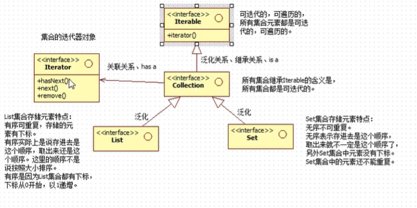

List集合的常用实现类

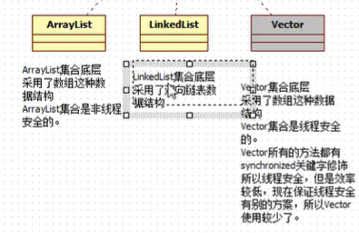

Set集合的常 用实现类

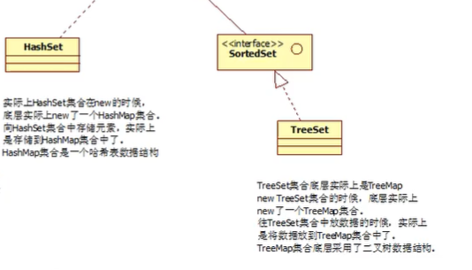

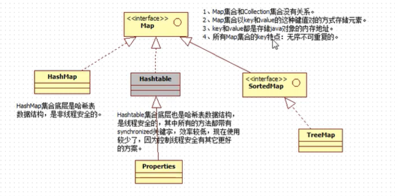

 

#### Collections

没有使用泛型，collection可以存储OBject的所有子类型

使用泛型之后，只能存储某个具体的类型

```java
package com.javaset.javase;

import java.util.ArrayList;
import java.util.Collection;

public class setClass {
    public static void main(String[] args) {
        Collection co = new ArrayList();
        //自动装箱  存储了1234的内存地址
        co.add(1234);
        co.add("1234");
        co.add(new Object());
        //获取集合元素的个数
        System.out.println(co.size());
        //3
        co.clear();//清空集合
        System.out.println(co.size());
        //0
        co.add("!23");
        //判断集合是否包含某个元素,返回布尔值
        System.out.println(co.contains("!23"));
        //true
        //删除集合中某个元素
        co.remove("!23");
        //判断集合是否为空
        System.out.println(co.isEmpty());
        //true
        co.add("!23");
        //转换为数组
        co.toArray();
    }
}

```

迭代器的使用

```java
package com.iterable;

import java.util.ArrayList;
import java.util.Collection;
import java.util.Iterator;

public class ItrableClas {
    public static void main(String[] args) {
        Collection co1= new ArrayList();

        co1.add("1234");
        co1.add("dead");
        co1.add(123123);

        co1.add(new Object());
        //获取集合对象的迭代器Iterator
        Iterator it = co1.iterator();

        //通过获取的迭代器对象开始迭代遍历集合

        /*
        /*boolean hasNext()仍有元素可迭代返回true
        /*Object next() 返回下个元素
         */
        if(it.hasNext()){
            System.out.println(it.next());
        }
        //判断是否含有下个元素，有则输出
        while(it.hasNext()){
            System.out.println(it.next());
        }

    }
}

```

#### contains方法解析

```java
package com.javaset.javase;

import java.util.ArrayList;
import java.util.Collection;

public class IterableClass1 {

    public static void main(String[] args) {
        //contains方法
        Collection co = new ArrayList();

        String s1 = new String("asd");
        co.add(s1);

        String s2 = new String("base");
        co.add(s2);

        String x = new String("asd");
        System.out.println(co.contains(x));
        //true
        //底层调用的是equals方法，对比的是值
    }
}

```

在调用contains方法和remove方法中都调用了quals方法

**在使用迭代器中，结合结构只要发生改变，迭代器必须重新获取**，删除集合中对象的时候可使用迭代器的remove()方法 

#### List接口常用方法

1. lis集合有下标
2. list集合特有的方法
   1. void add(int index,x element)
   2. E get(int index)
   3. int indexOf(Object o)
   4. int lastIndexOf(Object o)
   5. E remove(int index)

```java
package com.javaset.javase;

import java.util.ArrayList;
import java.util.Collection;
import java.util.Iterator;
import java.util.List;

public class IterableClass1 {

    public static void main(String[] args) {
        List mylist = new ArrayList();
        mylist.add("A");
        mylist.add("C");
        mylist.add("BV");

        Iterator it = mylist.iterator();
        while(it.hasNext()){
            Object elt = it.next();
            System.out.println(elt);
        }
    }
}
/*输出内容
A
C
BV
*/
package com.javaset.javase;

import java.util.ArrayList;
import java.util.Collection;
import java.util.Iterator;
import java.util.List;

public class IterableClass1 {

    public static void main(String[] args) {

        List mylist = new ArrayList();
        mylist.add("A");
        mylist.add("C");
        mylist.add("BV");
        mylist.add(1,"ARAR"); //指定下标添加元素
        Iterator it = mylist.iterator();
        while(it.hasNext()){
            Object elt = it.next();
            System.out.println(elt);
        }
    }
}
/*输出内容
A
ARAR
C
BV
*/
```

### IO流

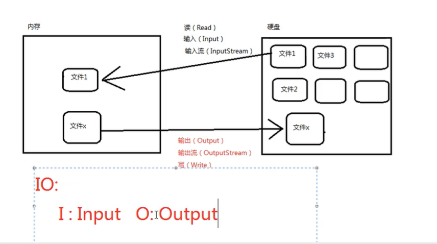

io是通过io对硬盘文件读写

分类：

1. 流的方向进行分类：输入和输出

2. 读取方式的不同分类

   一次读取一个字节、等同于一次读取8个二进制数字（可读取文件、图片、声音）
   
   有的流按字符读取，为了读取普通文本（只能读取纯文本文件）

IO

- java.io.InputStream
- java.io.OutputStream
- java.io.Reader
- java.io.Writer

以steam结尾的都是字节流。以reader/writer结尾的都是字符流

 所有的流都可关闭，都有close()方法

输出流在最终输出之后要使用flush() 刷新，表示将通道当中剩余未输出的数据强制输出完成（清空管道），没有flush()可能会丢失数据

常用的IO流

#文件流

java.io.FileInputStream

java.io.FileOutStream

java.io.FileReader

java.io.FileWriter

#转换流（字节流转换为字符流）

java.io.InputStreamReader

java.io.OutPutStreamWriter

#缓冲流专属

java.io.BufferedReader

java.io.BufferedWriter

java.io.BufferedInputStream

java.io.BufferedOutputStream

#数据流专属

java.io.DataInputStream

java.io.DataOutPutStream

#对象专属流

java.io.ObjectInputStream

java.io.ObjectOutputStream

#标准输出流

java.io.PrintWriter

java.io.PrintStream

```java
FileInputStream
文件字节输入流，任何文件都可使用读取
字节的方式，完成输入的操作，完成读的操作(从硬盘到内存)
package com.iopack.javase;

import java.io.File;
import java.io.FileInputStream;
import java.io.FileNotFoundException;
import java.io.IOException;

public class IOdemo0 {
    public static void main(String[] args){
        FileInputStream file = null;
        try {
            file = new FileInputStream("C:\\Users\\Administrator\\Desktop\\123.txt");

            while (true){
                int fileread = file.read();
                if(fileread == -1){
                    break;
                }
                System.out.println(fileread);
            }
            //int readdata = 0;
            //while((readdata = file.read()) != -1){
                //System.out.println(readdata);
            }//读的姿势二

        } catch (FileNotFoundException e) {
            e.printStackTrace();
        } catch (IOException e) {
            e.printStackTrace();
        } finally {
            try {
                file.close();
            } catch (IOException e) {
                e.printStackTrace();
            }
        }
    }
}

```

  ```java
  //一次进行读取多个字节的数据
  //idea默认当前路径为项目的根目录
  package com.iopack.javase;
  
  import java.io.File;
  import java.io.FileInputStream;
  import java.io.FileNotFoundException;
  import java.io.IOException;
  
  public class fileoutput {
      public static void main(String[] args) {
          FileInputStream file = null;
          try {
              file = new FileInputStream("IOdemo/hello");
              //定义一个Byte数组长度为5
              byte[] byte1 = new byte[5];
              //count为读取出的字节数量 5
              int count = file.read(byte1);
  
              //dasda 第一次读取到的5个字节的内容
              System.out.println(new String(byte1));
  
              count = file.read(byte1);
              //4
              //通过设置读取了多少位而输出多少位
              //bf
              System.out.println(new String(byte1,0,count));
  
          } catch (FileNotFoundException e) {
              e.printStackTrace();
          } catch (IOException e){
              e.printStackTrace();
          } finally {
              if (file != null){
                  try {
                      file.close();
                  } catch (IOException e) {
                      e.printStackTrace();
                  }
  
  
              }
          }
  
  
      }
  }
  
  ```

```java
//for循环修改
package com.iopack.javase;

import java.io.FileInputStream;
import java.io.FileNotFoundException;
import java.io.IOException;

public class Fileinputtest4 {
    public static void main(String[] args) {
        FileInputStream file = null;
        try {
            file = new FileInputStream("IOdemo/hello");
            //定义一个Byte数组长度为5
            byte[] byte1 = new byte[5];
            while (true) {
                int count = file.read(byte1);
                if (count == -1) {
                    break;
                }
                System.out.println(new String(byte1,0,count));
            }

        } catch (FileNotFoundException e) {
            e.printStackTrace();
        } catch (IOException e){
            e.printStackTrace();
        } finally {
            if (file != null){
                try {
                    file.close();
                } catch (IOException e) {
                    e.printStackTrace();
                }
            }
        }
    }
}

```

```java
package com.iopack.javase;

import java.io.FileInputStream;
import java.io.FileNotFoundException;
import java.io.IOException;

public class Fileinputtest4 {
    public static void main(String[] args) {
        FileInputStream file = null;
        try {
            file = new FileInputStream("IOdemo/hello");
            //定义一个Byte数组长度为5
            byte[] byte1 = new byte[5];
//            while (true) {
//                int count = file.read(byte1);
//                if (count == -1) {
//                    break;
//                }
//                System.out.println(new String(byte1,0,count));
//            }
            int count = 0;
            while((count = file.read(byte1)) != -1){
                System.out.print(new String(byte1,0,count));
            }
		            byte[] byte2 = new byte[file.available()];
            file.read(byte2);
            System.out.println(new String(byte2));
        } catch (FileNotFoundException e) {
            e.printStackTrace();
        } catch (IOException e){
            e.printStackTrace();
        } finally {
            if (file != null){
                try {
                    file.close();
                } catch (IOException e) {
                    e.printStackTrace();
                }
            }
        }
    }
}

```

int available()返回流当中未读到的字节数量

long skip(long n) 跳过几个字节不读 

```java
//写入文件
package com.iopack.javase;

import java.io.File;
import java.io.FileNotFoundException;
import java.io.FileOutputStream;
import java.io.IOException;

public class FileOutPutStream0 {
    public static void main(String[] args) {
        FileOutputStream file = null;

        File file1;
        byte[] byte1= {97,99,100,101};
        try{
            //file = new FileOutputStream("IOdemo/hello");
            //使用追加的方式写入
            file = new FileOutputStream("IOdemo/hello",true);
            //写入全部的Byte1
            file.write(byte1);
            //写入部分内容
            file.write(byte1,0,2);
            String s = "你好 世界";
            byte[] byte2 = s.getBytes();
            file.write(byte2);
            file.flush();
        } catch (FileNotFoundException e) {
            e.printStackTrace();
        } catch (IOException e){
            e.printStackTrace();
        } finally {
            if (file != null){
                try{
                    file.close();
                } catch (IOException e) {
                    e.printStackTrace();
                }

            }
        }
    }
}

```

```java
#File类
File是文件和路径名的抽象表示形式
file对象：可能是目录也可能是文件
import java.io.File;
import java.io.IOException;

public class FileDemo00 {
    public static void main(String[] args) throws IOException {
        File file = new File("D:\\file");
        System.out.println(file.exists());
        // false 判断对象的路径是否存在
//        if(!file.exists()){
//            file.createNewFile();
            //若不存在以文件形式存在
//        }
        if(!file.exists()){
            file.mkdir();
            //不存在以目录形式创建
        }
//        if (!file.exists()) {
//            file.mkdirs();
//            //以多重的目录进行创建文件夹
//        }
//        File file1 = new File("D:\\a.txt");
//        String a = file1.getParent();
//        //获取父路径
//        String b = file1.getAbsolutePath();
//        //获取绝对路径
//        System.out.println("获取绝对路径"+b);
//        File fileparennt1 = file1.getParentFile();
//        //将获取的父路径作为File对象
        //file1.getName();
        //获取文件名
        //file1.isDirectory();
        //判断是否为目录
        //file1.isFile();
        //判断是否为脚本
        //long time = file1.lastModified();
        //获取最后一次的修改时间
        //a.length();获取文件大小
        //file[] listfiles()
        //获取当前目录下的所有子文件
    }
}

```

```java
#反序列化
#ObjectOutPutStream
#序列化:Serialize  将对象存储倒文件中
#反序列化:DeSerialize  将文件中的数据重新恢复为Java对象
ObjectOutPutStream 进行序列化
ObejctInPutStream  进行反序列化


```

```java
ObjectPutStreamTest00.class

    import java.io.*;

public class ObejectPutStreamTest00 {
    public static void main(String[] args) throws IOException {
        serializedemo0 se0 = new serializedemo0(111,"张三");

        OutputStream out;
        ObjectOutputStream oos = new ObjectOutputStream(new FileOutputStream("test"));

        oos.writeObject(se0);
        oos.flush();
        oos.close();

    }
}

```

```java
#serializedemo0.java
 
import java.io.Serializable;
public class serializedemo0 implements Serializable{
    public  int numid;
    private String name;

    public serializedemo0(){

    }
    public serializedemo0(int numid,String name) {
        this.numid = numid;
        this.name = name;
    }

    @Override
    public String toString() {
        return "serializedemo0{" +
                "numid=" + numid +
                ", name='" + name + '\'' +
                '}';
    }

    public static void main(String[] args) {

    }

}

```

java反序列化

```java
import java.io.FileInputStream;
import java.io.ObjectInputStream;
import java.io.OutputStream;

public class serializedemo01 {
    public static void main(String[] args) throws Exception {
        ObjectInputStream ois = new ObjectInputStream(new FileInputStream("test"));
        //开始反序列化
        Object obj = ois.readObject();
        System.out.println(obj);
        ois.close();

    }
}
//serializedemo0{numid=111, name='张三'} 输出结果
```

```java
//一次序列化多个对象 
//ObejectPutStreamTest00.class
import java.io.*;
import java.util.ArrayList;
import java.util.List;

public class ObejectPutStreamTest00 {
    public static void main(String[] args) throws IOException {
        List<serializedemo0> userlist = new ArrayList<>();
        userlist.add(new serializedemo0(1,"zs"));
        userlist.add(new serializedemo0(2,"lise"));
        userlist.add(new serializedemo0(3,"wangwu"));
        OutputStream out;
        ObjectOutputStream oos = new ObjectOutputStream(new FileOutputStream("test2"));
        oos.writeObject(userlist);
        oos.flush();
        oos.close();
    }
}
//生成多个对象且保存到一个集合中写入到test2


//serializedemo0.class 类的定义
import java.io.Serializable;
public class serializedemo0 implements Serializable{
    public  int numid;
    private String name;

    public serializedemo0(){

    }
    public serializedemo0(int numid,String name) {
        this.numid = numid;
        this.name = name;
    }

    @Override
    public String toString() {
        return "serializedemo0{" +
                "numid=" + numid +
                ", name='" + name + '\'' +
                '}';
    }
    public static void main(String[] args) {
    }
}


//serializedemo01.class
import java.io.FileInputStream;
import java.io.ObjectInputStream;
import java.io.OutputStream;
import java.util.ArrayList;
import java.util.List;

public class serializedemo01 {
    public static void main(String[] args) throws Exception {
        ObjectInputStream ois = new ObjectInputStream(new FileInputStream("test2"));
        //开始反序列化

        List<serializedemo0> list = (List<serializedemo0>)ois.readObject();
        //反序列化出的是集合
        for(serializedemo0 user:list){
            System.out.println(String.valueOf(user));
        }
        //对集合中的对象遍历输出
        ois.close();
    }
}

//输出结果
//serializedemo0{numid=1, name='zs'}
//serializedemo0{numid=2, name='lise'}
//serializedemo0{numid=3, name='wangwu'}
```

属性添加transient关键字  不参与序列化

一个类实现了serializable接口，应该指定一个序列化版本号

`public static final long serialVersionUID = 12321312L;`

```java
public class IOdemo01{
    public static void main(String[] args) throws Exception{
        FileReader reader = new FileReader("test");
        
    }
    Properties pro = new Properties();
    pro.load(reader);
    String username = pro.getProperty("username");
    System.out.println(username);
}

//test文件
username=root
password=1234
    
//输出内容root
    
.properties属性配置文件
```

#### 多线程

进程是一个应用程序

线程是一个进程中的执行场景/执行单元

一个进程可以启动多个线程

在Java语言中

线程之间堆内存和方法区内存共享

占内存独立，一个线程一个栈


java实现线程一个类继承java.lang.Thread

```java
import java.lang.String;


/**
 * @author marmot
 */
public class ThreadDemo0 {
    public static void main(String[] args) {
        //主栈创建分支线程对象
        Thread1 mythread = new Thread1();
        //启动线程使用start()方法
        mythread.start();
		//start()方法是开启了一个分支栈
    }
}

class Thread1 extends Thread{
    @Override
    public void run() {
        //运行在分支栈
        for (int i = 0; i < 100; i++) {
            System.out.println("分支线程" + i);

        }
    }
}
//run()方法必须写
```

```java
//实现多线程的方法二
import java.lang.Thread;
/**
 * @author marmot
 */
public class ThreadDmoe1 {
    public static void main(String[] args) {
        //创建一个可运行的对象
        Myrunable r = new Myrunable();
        //将可允许的对象封装成一个线程对象
        Thread t = new Thread(r);
        //启动线程
        t.start();
        for (int i = 0; i < 100; i++) {
            System.out.println("主线程" + i);
        }

    }
}

//此类非线程类，是一个可运行的类。
class Myrunable implements Runnable {
    @Override
    public void run() {
        for (int i = 0; i < 100; i++) {
            System.out.println("分支线程" + i);
        }

    }
}
```

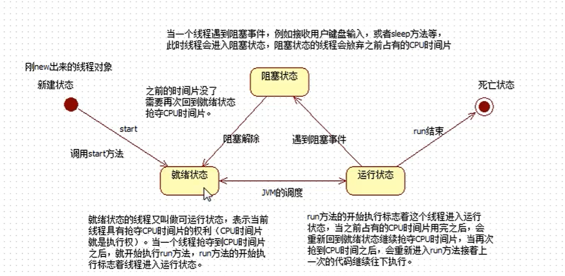

```java
//获取线程的名字
import java.lang.Thread;
import java.util.Map;

/**
 * @author marmot
 */
public class ThreadDemo2 {
    public static void main(String[] args) {
        Mythread1 t = new Mythread1();
        t.setName("tttt");

        String name = t.getName();
        System.out.println(name);

        t.start();

        Mythread1 t2 = new Mythread1();
        //Thread-1
        System.out.println(t2.getName());
    }
}

class Mythread1 extends Thread{
    @Override
    public void run(){
        for (int i = 0; i < 100; i++) {
            System.out.println("分支线程===>" + i);
        }
    }
}
```


返回当前线程

`Thread t = Thread.currentThread()` 主线程的名字返回main

线程的sleep方法：

​	static void sleep(long millis)

​	静态方法

​	参数为毫秒

​	作用为使当前线程进入休眠

```java
/**
 * @author marmot
 */
public class ThreadDemo3 {
    public static void main(String[] args) {

        try {
            Thread.sleep(1000 * 6);
        } catch (InterruptedException e) {
            e.printStackTrace();
        }

    }
}


class MyThread extends Thread{
    @Override
    public void run() {
        super.run();
    }
}
//主线程等待6秒

interrupt()干扰线程睡眠
```

t.stop()终止线程的指向

方法二：打一个boolean标记进行iflese判断

```java
/**
 * @author marmot
 */
public class ThreadDemo3 {
    public static void main(String[] args) {
        MyThread r = new MyThread();
        Thread t = new Thread(r);
        t.setName("r");
        t.start();
        try {
            Thread.sleep(1000 * 6);
        } catch (InterruptedException e) {
            e.printStackTrace();
        }
        r.run = false;   //指定run的状态
    }
}


class MyThread extends Thread{
    boolean run = true;
    @Override
    public void run() {
        for (int i = 0; i < 100; i++) {
            if (run){
                System.out.println(Thread.currentThread().getName() + ">" + i);
                try {
                    Thread.sleep(1000);

                }catch (InterruptedException e){

                }
              
            }
            else {
                return;
            }
        }
    }
}

```


P775
