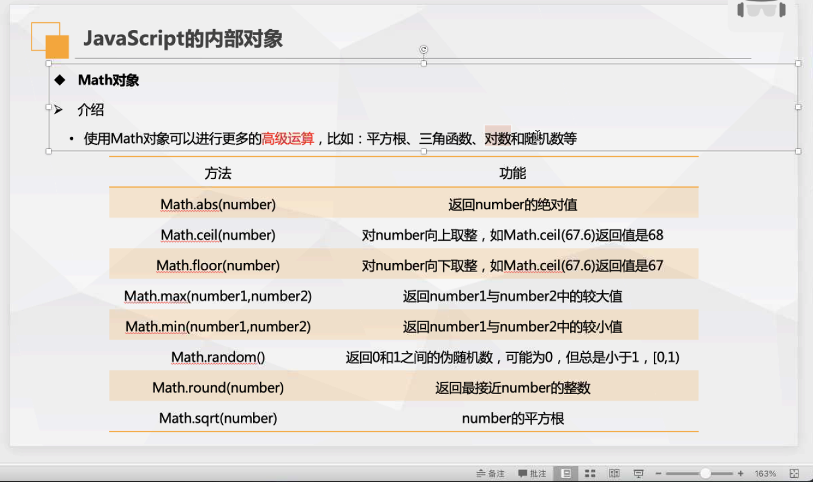
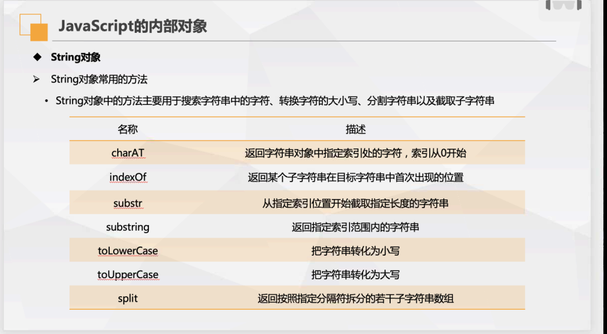
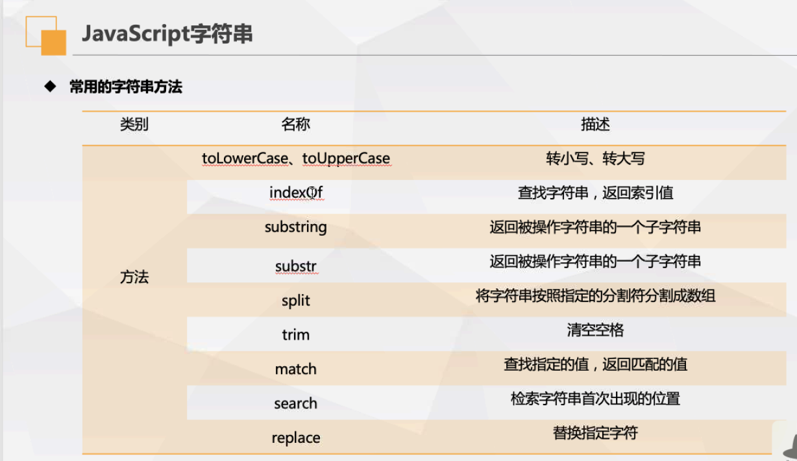
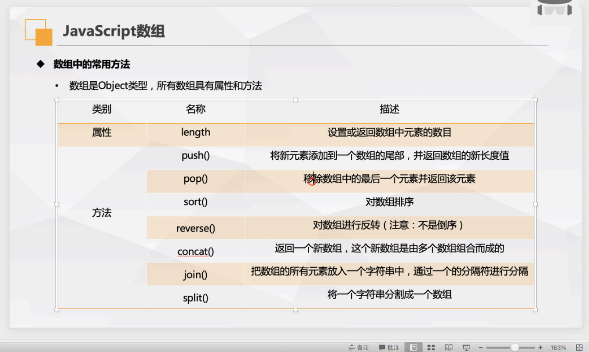
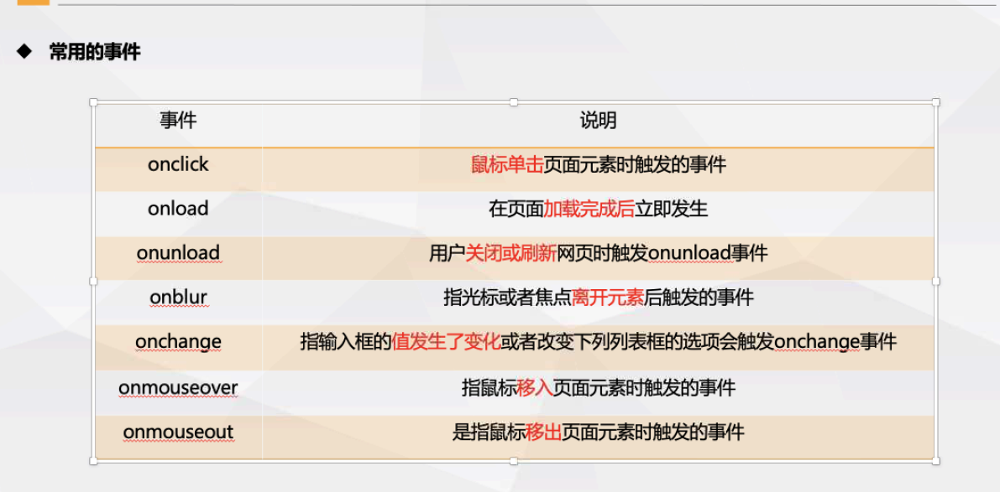

### JavaScript介绍
	
	JavaScript 是一门跨平台、面向对象的脚本语言，它能使网页可交互（例如拥有复杂的动画，可点击的按钮，通俗的菜单等）。另外还有高级的服务端Javascript版本，例如Node.js，它可以让你在网页上添加更多功能，不仅仅是下载文件（例如在多台电脑之间的协同合作）。在宿主环境（例如 web 浏览器）中，JavaScript 能够通过其所连接的环境提供的编程接口进行控制。



### 创建script标签的方式

#### head标签中添加
```  [JavaScript]
<script  src="js/jsname.js"></script>
<script type="text/javascript">jscode</script>
```
#### body标签中添加
```  [JavaScript] hello world
<script>
	document.write("hello world")
</script>
```
#### 元素绑定js事件
```  [JavaScript]
<elemnet event='js代码'>元素绑定js事件</elemnet>
<a href="javascript:alert(1)">点击弹窗</a>
```
### 显示数据方式：

1. window.alert()弹出警告框
2. document.write()方法将内容写到HTML文档中
3. innetHTML写入到HTML元素
4. console.log()写入浏览器的控制台

### JavaScript数据类型

JavaScript 变量能够保存多种数据类型：数值、字符串值、布尔值、数组、对象、Undefined、空值、Null等等：
```
var length = 7;                                //数字
var lastName = "bob";                          //字符串
var cars = ["benc", "BYD", "BMW"];             //数组
var x = {firstName:"Bill", lastName:"Gates"};  //对象 
var a = true;								   //布尔值
var b = '';									   //空值
var c = Null; 								   //Null
```
### JavaScript定义变量
使用var对变量进行定义，语句:var name = value。变量必须以字母、下划线、$符开头，不可以数字开头。对大小写敏感

未使用值来声明的变量，其值实际上是 undefined。

``` [JavaScript] 定义变量
var length = 15;  数值
var strname = "john"; 字符串
var cars = ["a","b","c"]; 数组
var cars = new Array(); cars[1]="audi";数组
var cars = new Array("audi","bwm");
var person = {name:"jobe",age:10}; 对象
var objectname = new object();定义对象

//可以使用new关键字声明变量的类型
var carname=new String;
var x=      new Number;
var y=      new Boolean;
var cars=   new Array;
var person= new Object;
```
#### JavaScript对象：

​	可以说 "JavaScript 对象是变量的容器"。

​	键值对通常写法为 **name : value** (键与值以冒号分割)。

​	键值对在 JavaScript 对象通常称为 **对象属性**。

​	访问对象的属性：name = person.name; name = erson["name"];

​	对象的方法创建及调用：

```javascript
var person = {
    Name:"Doe",
    age:50,
    getName : function(){
        return this.Name;
    }
};
person.getName();
```

#### JavaScript函数

函数的创建及调用：

```javascript
function functionName(field形参){
    //code;
   // return x;带有返回值，调用可用变量进行接受返回值
}
functionName(field实参);调用函数
//案例
<p>点击这个按钮，来调用带参数的函数</p>
<button onclick=alertfunc('bob','worker')">点击这里</button>
<script>
function alertfunc(name,job){
    alert("Welcome " + name + ", the " + job);
}
</script>
```

JavaScript函数中声明的变量是局部变量，只能在函数内部进行访问。在函数外部声明的变量为全局变量，网页上的所有脚本和函数都可以访问。函数内部未使用var声明变量，此变量为全局变量。

### JavaScript字符串

JavaScript字符串用于存储和处理文本。

定义：var name = 'xx' 或者"ad";使用单引号或双引号

字符串可用下标进行索引。

在JavaScript中，字符串拥有许多的方法可以调用
例如:

char.length；返回字符串长度

charAt()返回指定位置的字符
concat()连接两个或者多个字符串，最后返回l连接后的字符串
indexOf()返回检索字符串第一次匹配的位置
toLowerCase()将字符串转换为小写
toUpperCase()将字符串转换为大写

trim()移除字符串首尾空白

valueOf()返回字符串对象的原始值

### JavaScript运算符
\+	加运算，在字符串中使用也可对字符串进行拼接
\-	减运算
\*	乘运算
\/	除运算
%	取余运算
++	自增运算，++在变量后表示先引用后自增，在变量前表示先自增再引用

--	自减运算，--在变量后表示先引用后自减，在变量前表示先自减再引用

###### 比较运算符

== 相等

=== 绝对等于（值和类型均相等）

!= 不相等

!== 不绝对等于（值和类型有不相等）

< 小于

\> 大于

``` [JavaScript]
a = 1
a++ //此时a为1
a   //此时a为2
b = 2
++b //此时b为3
b	//此时b为3
```
###### 逻辑运算符
&&	与运算，对表达式两边的条件进行与运算。全真为真，有假则假。
||	或运算，对表达式两边的条件进行或运算。有真为真，全假则假。
!	非运算，对表达式后边的条件进行非运算。非运算进行取反

###### 条件运算符

变量 = (条件)?value1:value2;   //成立为1，否则为2

### JavaScript条件控制语句

#### if流程语句
```	[JavaScript]
if (18<=age)
{
	console.log('已成年')
}
else
{
	console.log('未成年')
}
```
#### switch控制语句
``` [JavaScript]
switch (n){
	case 1:
		code1	//执行代码
		break; //退出匹配
	case 2:
		code2	//执行代码
		break;	//退出匹配
	default:
		code3;	//匹配不到执行的代码
}
```
### JavaScript循环控制语句
#### for循环
``` [JavaScript]
for (var i=0;i<num;i++){	//var i对i进行初始化，仅执行一次，i<num对i进行判断，直到条件不符合退出循环。i++每次循环后执行的代码
	code;	//code为每次循环执行的代码块
}
```

#### while循环
``` [JavaScript]
while (条件）//while循环为条件符合执行代码块，条件不符合退出循环
{
code;
}
```
#### do-while循环
``` [JavaScript]
do {	//do-while循环,循环中的代码至少执行一次，直到条件不符合退出循环。
code;
}
while(条件);
```

### JavaScript事件

HTML事件是发生在HTML元素上的事情，当在HTML页面使用JavaScript时，JavaScript可以触发这些事件。html元素可以添加事件属性，使用JavaScript代码添加html元素。

HTML事件实例：

1. html页面加载完成
2. html input字段改变时
3. html 按钮被点击

常见的html事件

| 事件        | 描述                         |
| :---------- | :--------------------------- |
| onchange    | HTML 元素改变                |
| onclick     | 用户点击 HTML 元素           |
| onmouseover | 用户在一个HTML元素上移动鼠标 |
| onmouseout  | 用户从一个HTML元素上移开鼠标 |
| onkeydown   | 用户按下键盘按键             |
| onload      | 浏览器已完成页面的加载       |

事件可以用于处理表单验证，用户输入，用户行为及浏览器动作:

- 页面加载时触发事件
- 页面关闭时触发事件
- 用户点击按钮执行动作
- 验证用户输入内容的合法性
- 等等 ..

###### typeof

typeof 返回遍历的类型

typeof null undefined

null 空对象引用  变量的值为空

undefined; 值为undefined未定义

null与undefined值相等，但类型不等

constructor 返回所有js变量的构造函数

```javascript  
function isArray(myArray) {
  return yArray.constructor.toString().indexOf("Array") > -1;
}
```

你可以使用 constructor 属性来查看对象是否为数组 (包含字符串 "Array"):

```javascript
typeof "John"         // 返回 string
typeof 3.14          // 返回 number
typeof NaN           // 返回 number
typeof false         // 返回 boolean
typeof [1,2,3,4]       // 返回 object
typeof {name:'John', age:34} // 返回 object
typeof new Date()       // 返回 object
typeof function () {}     // 返回 function
typeof myCar         // 返回 undefined (如果 myCar 没有声明)
typeof null          // 返回 object
```

constructor属性返回变量的构造函数。

###### js类型转换

String(x) 将变量x转换为字符串并返回

x.toString()同上

| 方法            | 描述                                                 |
| --------------- | ---------------------------------------------------- |
| toExponential() | 把对象的值转换为指数计数法。                         |
| toFixed()       | 把数字转换为字符串，结果的小数点后有指定位数的数字。 |
| toPrecision()   | 把数字格式化为指定的长度。                           |

全局方法 **String()** 可以将布尔值转换为字符串。

String(false)     // 返回 "false"

String(true)     // 返回 "true"

Number()将变量转换为数字

当你尝试输出一个对象或一个变量时 JavaScript 会自动调用变量的 toString() 方法：

```javascript
document.getElementById("demo").innerHTML = myVar;
function funcname(){
	code;
}
var a = new Object(){};  //创建对象
a.attri = xx;	//对象属性
a.func = function xx(){};  //对象的方法	
```





字符串方法

substring 从某位到几位

substr 从某位后几位

str.replace('str1','str2') 替换str1为str2



**数组**

追加push





**addEventLisener()**

para = createElement('p')

node = createTextNode

xx.appendChiled(node)

静态方法：

1. Array,isArray()方法返回一个布尔值，表示参数是否为数组。

实例方法：

valueOf()方法是一个所有对象都有的方法，表示对该对象求值。toString()方法是读写的通用方法，返回对象的字符串形式

push()方法用于在数组的末端添加一个或多个元素，并返回添加后的数组长度

```javascript
> var arr = new Array(1,"!23",412,true)
undefined
> arr
[ 1, '!23', 412, true ]
> arr.push('hello world')
5
> arr
[ 1, '!23', 412, true, 'hello world' ]
```

pop()方法用于在数组末端删除最后一个元素，并返回该元素

```javascript
> arr
[ 1, '!23', 412, true, 'hello world' ]
> arr.pop()
'hello world'
> arr
[ 1, '!23', 412, true ]
```

push()和pop()方法都会改变原数组。

shift()方法用于删除数组的第一个元素，并返回该元素

```javascript
> arr
[ 1, '!23', 412, true ]
> arr.shift()
1
> arr
[ '!23', 412, true ]  //删除数组第一个元素
```

unshift()方法用于在数组的第一个位置添加元素，并返回添加后的属于组长度。

```javascript
> arr
[ '!23', 412, true ]
> arr.unshift('你好')
4
> arr
[ '你好', '!23', 412, true ] 
```

shift()方法和unshift()方法都会改变原数组

join()方法以指定参数作为分隔符将数组成员连接为一个字符串返回，不加参数默认以逗号分隔

concat()方法用于多个数组的合并，将新数组的成员添加到原数组的尾部，并返回一个新数组，原数组变，也可以接受其他类型的值作为参数加入尾部

```javascript
> arr
[ '你好', '!23', 412, true ]
> arr.concat([1,2,3,4])
[
  '你好', '!23', 412,
  true,   1,     2,
  3,      4
]
> arr
[ '你好', '!23', 412, true ]
```

reverse()方法用于颠倒排列数组元素，返回改变后的数组，此方法改变原数组。

sort()对数组成员进行排序，此方法改变数组。

indexOf()方法返回给定元素在数组中第一次出现的位置，没有出现返回-1，也可以接受第二个参数，表示搜索的开始位置。

lastindexOf()方法返回给顶元素在数组中最后一次出现的位置，没有出现返回-1

**正则表达式**

str.search()使用正则表达式

str.relace()用一些字符替代另一些字符

| 修饰符 | 描述                                                     |
| ------ | -------------------------------------------------------- |
| i      | 执行对大小写不敏感的匹配。                               |
| g      | 执行全局匹配（查找所有匹配而非在找到第一个匹配后停止）。 |
| m      | 执行多行匹配。                                           |

| 表达式 | 描述                       |
| ------ | -------------------------- |
| [abc]  | 查找方括号之间的任何字符。 |
| [0-9]  | 查找任何从 0 至 9 的数字。 |
| (x\|y) | 查找任何以 \| 分隔的选项。 |

| 元字符 | 描述                                        |
| ------ | ------------------------------------------- |
| \d     | 查找数字。                                  |
| \s     | 查找空白字符。                              |
| \b     | 匹配单词边界。                              |
| \uxxxx | 查找以十六进制数 xxxx 规定的 Unicode 字符。 |

| 量词 | 描述                                  |
| ---- | ------------------------------------- |
| n+   | 匹配任何包含至少一个 *n* 的字符串。   |
| n*   | 匹配任何包含零个或多个 *n* 的字符串。 |
| n?   | 匹配任何包含零个或一个 *n* 的字符串。 |

###### try catch异常处理

```javascript
try {
    ...    //异常的抛出 
    if(condition) throw "不成立信息";
} catch(e) {
    ...    //异常的捕获与处理 
} finally { 
    ...    //结束处理 
}
```

Throw 语句

throw 语句允许我们创建自定义错误。

正确的技术术语是：创建或**抛出异常**（exception）。

如果把 throw 与 try 和 catch 一起使用，那么您能够控制程序流，并生成自定义的错误消息。

throw *exception*

console.log()调试窗口打印js值

debugger关键字用于断点调试

javascript提供Error构造函数，所有的错误都是这个构造函数的实例

```javascript
var err = new Error("出错");
err.message //'报错'
```

SyntaxError是解析代码时发生的语法错误。

ReferenceError对象是引用一个不存在的变量时发生的错误

RangeError对象是一个超出有效范围的错误

TypeError对象是变量或参数不是逾期类型时发生的错误。

URIError对象是URI相关函数的参数不正确抛出的错误。

eval函数没有被正确执行时，会抛出EvalError错误。

###### 声明提升

JavaScript 中，函数及变量的声明都将被提升到函数的最顶部。

JavaScript 中，变量可以在使用后声明，也就是变量可以先使用再声明。

#### Object对象

JavaScript提供原生对象，JavaScript的所有对象都继承自Object对象，都是Object的实例。Object对象的原生方法为：Object本身的方法与Object的实例方法。

```javascript
//Object对象本身的方法
Object.print = function(o){ console.log(o)};
//print方法直接定义在Object对象上。

//Object的实例方法
Object.ororotype.print = funcion(){ console.log(this)};
var obj = new Obejct();
obj.print();//Object
//实例方法是定义在Object.prototype上的方法，可被Object实例直接使用。
```

Object()`Object`本身是一个函数，可以当作工具方法使用，将任意值转为对象。这个方法常用于保证某个值一定是对象。


Object构造方法，前面+new使用

`var obj = new Object();`

`Object`构造函数的用法与工具方法很相似，几乎一模一样。使用时，可以接受一个参数，如果该参数是一个对象，则直接返回这个对象；如果是一个原始类型的值，则返回该值对应的包装对象（详见《包装对象》一章）。

虽然用法相似，但是`Object(value)`与`new Object(value)`两者的语义是不同的，`Object(value)`表示将`value`转成一个对象，`new Object(value)`则表示新生成一个对象，它的值是`value`。

###### Object的静态方法

Object.keys(),Object.getOwnPropertyNames()

都是用来遍历对象的属性，参数都是一个对象，返回结果为一个数组。

```javascript
> var a = {name:'123',age:12}
undefined
> a
{ name: '123', age: 12 }
> Object.keys(a)
[ 'name', 'age' ]  //均返回的是包含属性名的数组
> Object.getOwnPropertyNames(a)
[ 'name', 'age' ]  //均返回的是包含属性名的数组

> var b = [123,456]
undefined
> b                
[ 123, 456 ]
> Object.keys(b)
[ '0', '1' ]
> Object.getOwnPropertyNames(b)
[ '0', '1', 'length' ]
> b.length
2
//涉及不可枚举属性时，getOwnPropertyNames()方法还返回不可枚举的属性名
```

###### Object的实例方法

除了静态方法，还有不少方法定义在`Object.prototype`对象。它们称为实例方法，所有`Object`的实例对象都继承了这些方法。

`Object`实例对象的方法，主要有以下六个。

- `Object.prototype.valueOf()`：返回当前对象对应的值。
- `Object.prototype.toString()`：返回当前对象对应的字符串形式。
- `Object.prototype.toLocaleString()`：返回当前对象对应的本地字符串形式。
- `Object.prototype.hasOwnProperty()`：判断某个属性是否为当前对象自身的属性，还是继承自原型对象的属性。
- `Object.prototype.isPrototypeOf()`：判断当前对象是否为另一个对象的原型。
- `Object.prototype.propertyIsEnumerable()`：判断某个属性是否可枚举。

#### JSON格式

JSON格式（JavaScript object notaion的缩写），是一种用于数据交换的文本格式。

json对值的类型和格式：

1. 符合类型的值只能是数组或对象，不能是函数，正则表达式对象，日期对象
2. 原始类型的值只有四种：字符串、数值（十进制）、布尔值和null
3. 字符串必须使用双引号
4. 对象的键名必须放在双引号中
5. 数组或对象最后ige成员的后面不可加逗号

JSON的方法

1. JSON.stringify()方法用于将一个值转为json字符串，该字符串符合json格式，且可以被JSON.parse方法还原,

   ```javascript
   > JSON.stringify({"name":"zhangsan","age":1})
   '{"name":"zhangsan","age":1}'
   ```

2. `JSON.stringify`方法还可以接受一个数组，作为第二个参数，指定需要转成字符串的属性。

   ```javascript
   var obj = {
     'prop1': 'value1',
     'prop2': 'value2',
     'prop3': 'value3'
   };
   var selectedProperties = ['prop1', 'prop2'];
   JSON.stringify(obj, selectedProperties)
   // "{"prop1":"value1","prop2":"value2"}"
   ```

3. 第二个参数还可以是一个函数，用来更改`JSON.stringify`的返回值。

   ```javascript
   function f(key, value) {
     if (typeof value === "number") {
       value = 2 * value;
     }
     return value;
   }
   JSON.stringify({ a: 1, b: 2 }, f)
   // '{"a": 2,"b": 4}'
   ```

4. `JSON.stringify`()还可以接受第三个参数，用于增加返回的 JSON 字符串的可读性。如果是数字，表示每个属性前面添加的空格（最多不超过10个）；如果是字符串（不超过10个字符），则该字符串会添加在每行前面。

5. 如果参数对象有自定义的`toJSON`方法，那么`JSON.stringify`会使用这个方法的返回值作为参数，而忽略原对象的其他属性。

   ```javascript
   var user = {
     firstName: '三',
     lastName: '张',
   
     get fullName(){
       return this.lastName + this.firstName;
     },
   
     toJSON: function () {
       return {
         name: this.lastName + this.firstName
       };
     }
   };
   JSON.stringify(user)
   // "{"name":"张三"}"
   ```

6. JSON.parse()方法用于将 JSON 字符串转换成对应的值。

   ```javascript
   > JSON.parse('{"name":"zhangsan","age":1}')
   { name: 'zhangsan', age: 1 }
   ```

**严格模式**

"use strict"进行严格判断

- 不允许使用未定义的变量
- 不允许删除变量或者对象
- 不允许删除函数
- 不允许变量重名
- 不允许使用8进制
- 不允许使用转义字符
- 不允许对只读属性进行赋值
- 不允许对一个使用getter方法读取的属性进行赋值
- 不允许删除一个不允许删除的属性
- 变量名不能使用eval字符串
- 变量名不能使用arguments字符串
- 在eval()创建的变量不能被调用
- 禁止this关键字指向全局对象

字符串断行使用\

数组以及对象最后不能添加逗号

**JavaScript表单**

function validateForm() {    var x = document.forms["myForm"]["fname"].value;    if (x == null || x == "") {        alert("需要输入名字。");        return false;    } }

**约束验证 HTML 输入属性**

| 属性     | 描述                     |
| -------- | ------------------------ |
| disabled | 规定输入的元素不可用     |
| max      | 规定输入元素的最大值     |
| min      | 规定输入元素的最小值     |
| pattern  | 规定输入元素值的模式     |
| required | 规定输入元素字段是必需的 |
| type     | 规定输入元素的类型       |

**约束验证 CSS 伪类选择器**

| 选择器    | 描述                                    |
| --------- | --------------------------------------- |
| :disabled | 选取属性为 "disabled" 属性的 input 元素 |
| :invalid  | 选取无效的 input 元素                   |
| :optional | 选择没有"optional"属性的 input 元素     |
| :required | 选择有"required"属性的 input 元素       |
| :valid    | 选取有效值的 input 元素                 |

**约束验证 DOM 方法**

| Property            | Description                                                  |
| ------------------- | ------------------------------------------------------------ |
| checkValidity()     | 如果 input 元素中的数据是合法的返回 true，否则返回 false。   |
| setCustomValidity() | 设置 input 元素的 validationMessage 属性，用于自定义错误提示信息的方法。使用 setCustomValidity 设置了自定义提示后，validity.customError 就会变成true，则 checkValidity 总是会返回false。如果要重新判断需要取消自定义提示，方式如下：setCustomValidity('') setCustomValidity(null) setCustomValidity(undefined) |

<input id="id1" type="number" min="100" max="300" required> <button onclick="myFunction()">验证</button>  <p id="demo"></p>  <script>

function myFunction() {    var inpObj = document.getElementById("id1");    if (inpObj.checkValidity() == false) {        document.getElementById("demo").innerHTML = inpObj.validationMessage;    } }

</script>

**this关键字的使用**

this表示当前对象的一个引用

在方法中，this表示该方法所属的对象

如果单独使用，this表示全局对象

在函数中，this表示全局对象

在函数中，严格模式下，this是未定义

在事件中，this表示接受事件的元素

**显式函数绑定**

在 JavaScript 中函数也是对象，对象则有方法，apply 和 call 就是函数对象的方法。这两个方法异常强大，他们允许切换函数执行的上下文环境（context），即 this 绑定的对象。

var person1 = {  fullName: function() {    return this.firstName + " " + this.lastName;  } } var person2 = {  firstName:"John",  lastName: "Doe", } person1.fullName.call(person2);  // 返回 "John Doe"

**let**

let 声明的变量只在 let 命令所在的代码块 **{}** 内有效，在 **{}** 之外不能访问。

let carname = 'audi'

不可使用window.carname 访问变量

在相同的作用域或块级作用域中，不能使用 **let** 关键字来重置 **var** 关键字声明的变量:

**let** 关键字在不同作用域，或不同块级作用域中是可以重新声明赋值的:

**const** 

const  用于声明一个或者多个变量，声明时必须进行初始化，且初始化后值不可修改

也不可和它所在作用域内的其他变量或者函数拥有相同的名称

const 声明的常量必须初始化，const定义常量的值不能通过在复制修改，也不能再次声明

而let定义的变量可以修改

**json**

json数据：一个名称对应一个值

json对象：保存在大括号中，对象可以保存多个键值对

json数组：保存在中括号中，数组可以包含对象

json字符串转换为JavaScript对象

使用JSON.parse()将字符串转换为JavaScript对象

JSON.stringify()将JavaScript值转换为json字符串

JavaScript：void(0) 计算一个表达式但是不返回值

**函数**

**作为函数方法调用函数**

在 JavaScript 中, 函数是对象。JavaScript 函数有它的属性和方法。

**call()** 和 **apply()** 是预定义的函数方法。 两个方法可用于调用函数，两个方法的第一个参数必须是对象本身。

**实例**

function myFunction(a, b) {    return a * b; } myObject = myFunction.call(myObject, 10, 2);     // 返回 20

**document.cookie.split(';')**

**DOM  文档对象模型  document object module**

查找HTML元素

通过Id找到html元素    document.getElementById('xxx')

通过标签名找到HTML元素   document.getElementsByTagName('p')

通过类名找到HTML元素      document.getElementByClassName('ttt')

document.write(Date())会覆盖文档

改变HTML内容   :document.getElementById('x').innetHTML='xxxxxx';

改变HTML属性：document.getElementById('x').attr=newattr;

改变HTML样式：document.getElementById('x').style.color='red';

事件：<button type='button' onclick='document.getElementById('x').style.color='red'‘>点击</button>

onload   onunload进入或者离开页面触发

onchange对输入字段的验证使用

onmouseover/onmouseout 鼠标在元素以及离开元素

onmousedown/onmouseup/onclick    鼠标点击按钮时，鼠标释放按钮，鼠标点击时

**事件监听**

在用户点击按钮时触发监听事件：

document.getElementById("myBtn").addEventListener("click", displayDate);

removeEventListener去除监听

appendChild()创建新的HTML元素

insertBefore()创建新的HTML元素（节点)

removeChild()删除元素

replaceChild()替换元素

var x = document.getElementsByTagName("p");

集合中的元素可以通过索引(以 0 为起始位置)来访问。

访问第二个 <p> 元素可以是以下代码:

y = x[1];

var myNodeList = document.querySelectorAll("p");

NodeList 中的元素可以通过索引(以 0 为起始位置)来访问。

访问第二个 <p> 元素可以是以下代码:

y = myNodeList[1];

　　情况1：如果一个函数中有this，但是它没有被上一级的对象所调用，那么this指向的就是window，这里需要说明的是在js的严格版中this指向的不是window，但是我们这里不探讨严格版的问题，你想了解可以自行上网查找。

　　情况2：如果一个函数中有this，这个函数有被上一级的对象所调用，那么this指向的就是上一级的对象。

　　情况3：如果一个函数中有this，**这个函数中包含多个对象，尽管这个函数是被最外层的对象所调用，this指向的也只是它上一级的对象，**例子3可以证明，如果不相信，那么接下来我们继续看几个例子。

var o = {    a:10,    b:{        // a:12,        fn:function(){            console.log(this.a); //undefined        }    } } o.b.fn();

var o = {    a:10,    b:{        a:12,        fn:function(){            console.log(this.a); //undefined       4            console.log(this); //window        }    } } var j = o.b.fn; j();

this永远指向的是最后调用它的对象，也就是看它执行的时候是谁调用的，例子4中虽然函数fn是被对象b所引用，但是在将fn赋值给变量j的时候并没有执行所以最终指向的是window，这和例子3是不一样的，例子3是直接执行了fn。

这里之所以对象a可以点出函数Fn里面的user是因为new关键字可以改变this的指向，将这个this指向对象a，为什么我说a是对象，因为用了new关键字就是创建一个对象实例，理解这句话可以想想我们的例子3，我们这里用变量a创建了一个Fn的实例（相当于复制了一份Fn到对象a里面），此时仅仅只是创建，并没有执行，而调用这个函数Fn的是对象a，那么this指向的自然是对象a，那么为什么对象a中会有user，因为你已经复制了一份Fn函数到对象a中，用了new关键字就等同于复制了一份。

**如果返回值是一个对象，那么this指向的就是那个返回的对象，如果返回值不是一个对象那么this还是指向函数的实例。**

**HTMLCollection 与 NodeList 的区别**

[HTMLCollection](https://www.runoob.com/js/js-htmldom-collections.html) 是 HTML 元素的集合。

NodeList 是一个文档节点的集合。

NodeList 与 HTMLCollection 有很多类似的地方。

NodeList 与 HTMLCollection 都与数组对象有点类似，可以使用索引 (0, 1, 2, 3, 4, ...) 来获取元素。

NodeList 与 HTMLCollection 都有 length 属性。

HTMLCollection 元素可以通过 name，id 或索引来获取。

NodeList 只能通过索引来获取。

只有 NodeList 对象有包含属性节点和文本节点	