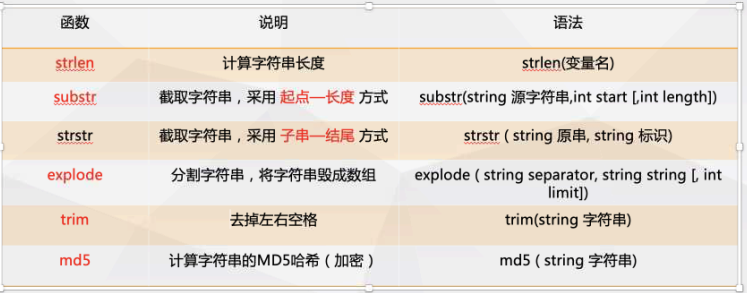
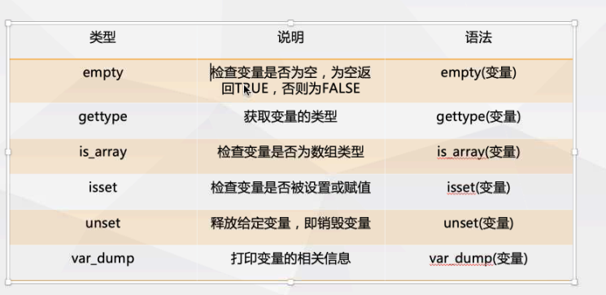
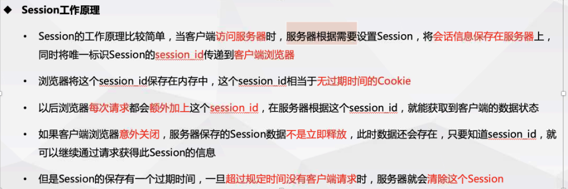
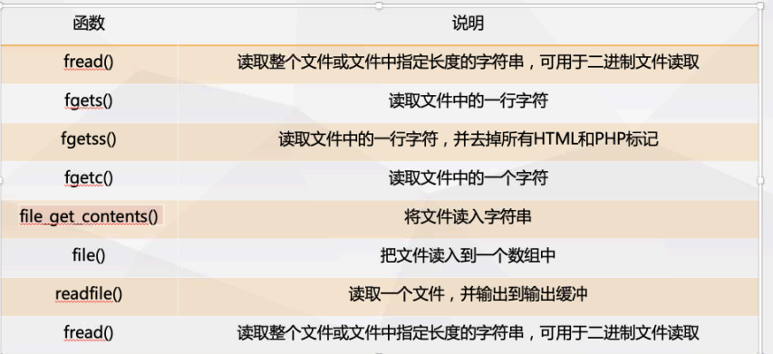
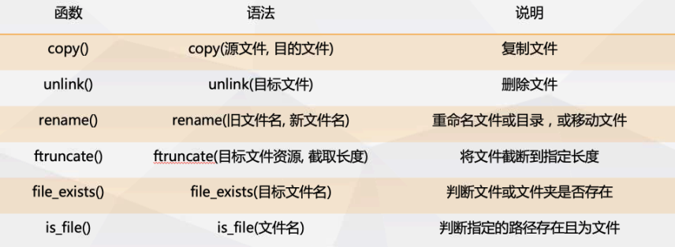
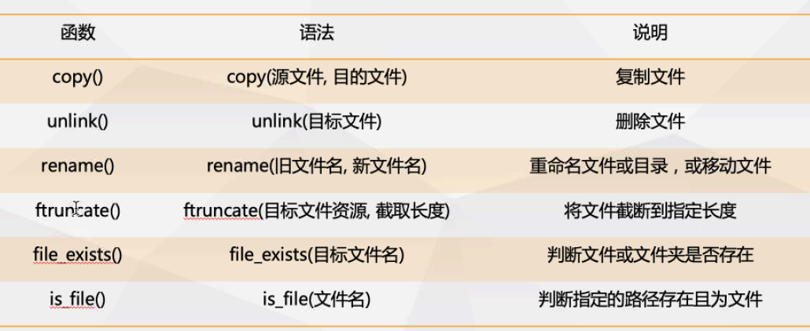

### php数据类型

-     整型            $a = 100;
-     浮点型        $b = 10.455;
-     字符串        $c = "hello world";
-     布尔类型    $key = false;
-     NULL          $abc = null;
-     数组            $age = [1,3,4,5] || $age = array(1,2,3,4)
-     对象            $ob = new Object();
-     资源            $file = fopen($fielname,'w');

### php运算符

#### 数值运算符

```
+   数值的加法
-   数值的减法
*   数值的乘法
/   数值的除法
%   数值的取余
.   拼接字符串，不可拼接布尔值与数组
""  中的变量会被解析，''中的变量不会被解析
\   可将字符串的中特殊值进行转义
```

#### 逻辑运算符

- and  与运算，若两边均为true则返回true，其余返回false
- or     或允许，若两边均为false则返回false，其余返回true
- xor   异或 x和y中有且仅有一个为true
- &&   与运算，若两边均为true则返回true，其余返回false
- ||    或运算，若两边均为false则返回false，其余返回true
- !       非运算，对结果进行取反

#### 比较运算符

- ==    若两边的值相等返回true
- ===  若两边的值与类型都相等返回true
- !=     若两边的值不相等返回true
- <>    若两边的值不相等返回true
- !==   若两边的值或者类型不相等返回true
- <      若小于则返回true
-  <     若大于则返回true
- <=>  若小于返回-1，等于返回0，大于返回1

#### 自增/自减运算符

- ++$x  先自增后使用
- $x++  先使用后自增
- $x--    先使用后自减
- --$x    先自减后使用

#### 条件赋值运算符

- $x = expr1 ? expre2 : expr3    条件1成立执行expr2否则执行expr3
- $x = expr1 ?? expre2                若expr1存在且不为空则赋值给$x，反之赋值expre2给$x

### 字符串

常用的字符串函数

|       函数       |                             作用                             |
| :--------------: | :----------------------------------------------------------: |
|     strlen()     |                       返回字符串的长度                       |
| str_word_count() |                      返回字符串中的字数                      |
|     strrev()     |                          反转字符串                          |
|     strpos()     | 在字符串中搜索文本 strpos('hello world','hello')返回第一匹配的字符位置，未找到返回false |
|  str_replace()   | 替换字符串的文本（str1,str2,str3)  1被替换的 2要替换的 3目标字符串 |



### 数值

##### 整数

不含小数点，整数必须有以为，可以是正数也可以是负数

可三种格式：十进制，十六进制0x ,八进制0

is_int()判断是否是整数  == is_int()

##### 浮点数

带有小数点的数值

is_float 约等于 is_double()

数值之间的转换：(int),(integer),(intval)

##### 无限

is_finite() 判断数值是否无限 is_infinite()

##### 其余函数

NaN代表非数字     is_nan()查看值是否为非数字

pi()返回PI的值

min(),max()返回最大值与最小值

abs()返回数值的绝对值

sqrt()返回一个数的平方根

round()将数值进行四舍五入的取整数

rand()生成一个随机数

##### 常量

使用define()函数创建常量

语法：define(name,value,case-insensitive)

name：常量的名称

value：常量的值

case-insensitive：常量是否区分不大小写，默认为区分，true为不区分

定义数组常量：define("cars",["bmw","audi","benci"])

**数组：**

在 PHP 中，共有三种类型的数组：

- **索引数组**- 带有数字索引的数组

`$cars = array("volvo","bmw","byd");`

通过$cars[0]进行数组元素访问

count()返回数组的长度（元素数量）

- **多维数组**- 包含一个或多个数组的数组

`$cars = array(array("va",123,1),array("ca",143,4));`

- **关联数组**- 具有命名键的数组

关联数组是使用分配给元素键命名的数组

`$age = array("peter"=>12,"ben"=>12,"joe"=>"123")`

关联数组使用键进行访问：arrayname[keyname];

遍历关联数组：

```foreach($age as $x => $x_value){echo $x.":".$x_value;echo "<br>";```

数组函数：

- sort() 按升序对数组进行排序
- rsort()按降序对数组进行排序
- asort()安装值对关联数组进行排序
- ksort()按照建按升序对关联数组进行排序
- arsort()值关联数组降序排序
- kasort()按键降序关联数组排序
- key_exits() 判断键是否在数组中存在
- count() == sizeof()返回数组的长度
- array_push()向数组中追加元素
- array_pop()删除最后一个数组元素

### 条件语句

条件语句进行流程控制

`if(condition){	code;}`

`if(condition){	code;}else{	code;}`

`if(condition){	code;}elseif(condition2){	code2;}else{	code3;}`

```PHP
switch (n){
	case label1:
		code to be executed if n==label1;
		break;
	case label2:
		code to be executed if n==label2;
		break;
	default:
		code to be executed if n is different from all labels;
}
```

### 循环语句

循环语句用来执行重复代码，有while循环以及for循环

`while(condition is true){ code tobe executed;} \\只要条件成立就一直循环直到条件不成立`

`do{ code to be executed;}while(condition is true);\\至少执行一次语句块`

for-循环代码执行循环次数

`for(init counter;test counter;increment counter){	code;}\\指定具体的循环次数`

foreach()为数组中的每个元素循环一段代码

`foreach($array as $value){ code tobe executed;}`

```php
<?php //输出数组中的每个值
	$colors = array("red", "green", "blue", "yellow");
	foreach ($colors as $value) {
		echo "$value <br>";
}
?>
<?php //对数组中的每组进行输出
	$age = array("Peter"=>"35", "Ben"=>"37", "Joe"=>"43");
	foreach($age as $x => $val) {
		echo "$x = $val<br>";
}
?>
```

PHP对循环进行中断使用break或者continue

break跳出循环，continue用于仅跳过本次循环

### PHP函数

```php
function funcname(){
​	code to be executed;
}
function funcname($fname){
​	code to be executed;       //带有参数的函数，可指定函数参数的默认值
}
function funcname($fname){
​	code to be executed;       //带有参数的函数
	return result;			   //有返回值的函数
}							   //可在括号后使用: type指定返回值类型
```



### PHP 超全局变量

- $GLOBAL

- $_SERVER 是一个包含了诸如头信息(header)、路径(path)、以及脚本位置(script locations)等等信息的数组。

  ​	$_SERVER['PHP_SELF']是一个超级全局变量，返回当前正在执行的脚本的文件名

  ​	htmlspecialchars()函数，将特殊字符转换为html实体，防止xss攻击

  ​	trim()函数去除不必要的字符（额外的空格，制表符，换行符）

  ​	stripslashes()删除反斜杠

- $_REQUEST 指 _GET与 _POST的集合

- $_POST        指使用POST方法传递的数据值数组

- $_GET          指GET方法传递的数据数组  

- $_FILES        这个变量是一个二维数组，用来保存通过 HTTP POST 方式上传到当前脚本的项目的内容

- $_ENV

- $_COOKIE    cookie 常用于识别用户。cookie 是一种服务器留在用户计算机上的小文件。每当同一台计算机通过浏览器请求页面时，这台计算机将会发送 cookie。通过 PHP，您能够创建并取回 cookie 的值。

- $_SESSION  PHP session 变量用于存储关于用户会话（session）的信息，或者更改用户会话（session）的设置。Session 变量存储单一用户的信息，并且对于应用程序中的所有页面都是可用的。

  ### 文件上传

  打开文件上传服务在"php.ini"中配置file_uploads为on

  html表单标签中enctype属性指定将表单数据提交到服务器时如何编码，只有在post方法有。上传文件时必须为multipart/form-data

  | Value                             | Description                                                  |
  | :-------------------------------- | :----------------------------------------------------------- |
  | application/x-www-form-urlencoded | Default. All characters are encoded before sent (spaces are converted to "+" symbols, and special characters are converted to ASCII HEX values) |
  | multipart/form-data               | This value is necessary if the user will upload a file through the form |
  | text/plain                        | Sends data without any encoding at all. Not recommended      |

  input标签中type属性为file

  var_dump($_FILES);

  copy()函数进行文件的复制

  

  move_uploaded_file()移动上传文件

  

- $_HEADER

- $_ENV

- $_COOKIE

- $_SESSION

#### COOKIE+SEESION

setcookie(name,value,expire,path,)

name:cookie名称

value:cookie值

expire:cookie有效时间

path:服务器保存cookie地址

session用于身份认证

session_start()启动session

session_destroy()清除session




**isset()判断内容是否定义**

die()函数控制程序结束

#### 日期函数

echo date('y') ;   //21 两位数年份

echo date('Y') ;    //2021 四位数年份

echo date('M') ;    //缩写月份 Jun

echo date('m') ;    //数字月份 06

echo date('D') ;    //缩写星期 Sat

echo date('d') ;    //数字日 19

echo date('l') ;    //星期全称 Saturday

echo date('W') ;    //24

echo date('e');    //时区 Asia/Shanghai

echo date('r');    //全部日期时间 Sat, 19 Jun 2021 15:19:41 +0800

echo date('t');    //30

echo date('U');    //时间戳 1624087265

echo date('i');    //两位年份 21

echo date('o');    //四位年份

echo date('Y-m-d'); //格式化输出

echo date('H');    //二十四小时制小时

echo date('sa');    //12小时制

mktime() 根据参数创建时间

strtotime()从字符串中获取时间

time()时间

ceil()向上取整

### 文件包含

include("filename")；

可调用文件中的变量

include文件不存在时，脚本继续执行

requeire()包含文件时，文件不存在会报错

可调用文件中的变量

### 文件处理

readfile() 函数 读取文件并将其写入输出缓冲区 

fopen() 打开，读取，关闭服务器上的文件   

fopen打开文件的方式：

| 方式 |                             作用                             |
| :--: | :----------------------------------------------------------: |
|  r   |                             仅读                             |
|  w   |              写入 文件不存在创建，存在覆盖写入               |
|  a   |                         追加写入文件                         |
|  x   |           创建文件， 如果文件存在报错，且返回false           |
|  r+  |                   读写文件，从文件开始读写                   |
|  w+  |      读写文件，如果文件不存在则创建，从文件初始进行读写      |
|  a+  | 读写文件，如果文件不存在则创建，若存在追加写入。指针在文件文件末尾 |
|  x+  |       创建一个文件（为读写） 文件存在则返回false。报错       |
|  b   |                       以二进制打开文件                       |

fread()读取文件，从打开的文件中读取

第一个为名称，第二个参数指定要读取的最大字节数

fgets()函数用于从文件中读取一行

fgetc()函数用于从文件中读取的单个字符

fclose()关闭打开的文件

fclose($file);

feof() 检查是否已到达文件结尾

fwrite()函数用来写入文件

fwrite(打开的文件，要写入的内容);

filesezi('xxx.txt')返回文件大小

file_get_contents()读取文件所有内容，可自动关闭

file_put_contents('source',data)将数据覆盖文件中的内容







### 表单处理

window.location="123.html";

#### 文件包含

include 'xx.php'; 提供代码复用，使用相对路径

包含的php代码会一起执行

include_once '123.php';一次包含

required

required_once

mysqli_fetch_array()：返回数组：包含索引+关联

mysqli_fetch_assoc()：返回数组：关联数组

返回数组的长度：sizeof()和count()

```php
$re = mysqli_fetch_all($result);
for($i=1;$i<=count($re);$i++){
	echo $re[$i][1];
	echo "<br>";
} //mysqli_fetch_all返回一个大数组包含多个小数组

for($i=1;$i<=$result->num_rows;$i++){
var_dump(mysqli_fetch_assoc($result));
$re = mysqli_fetch_array($result);
	echo $re['uname'];
	echo "<br>";
}
//mysqli_fetch_assoc返回一行的数组，都是关联数组

for($i=1;$i<=$result->num_rows;$i++){
	var_dump(mysqli_fetch_assoc($result));
	$re = mysqli_fetch_assoc($result);
	echo $re['uname'];
	echo "<br>";
}
//mysqli_fetch_array返回一行的数组，索引数组+关联数组
```


## 类和对象

`万物皆对象`:类是定义为其有共同特征并展现同样行为的对象的集合

```php
class class_name(){  //定义类的代码
    var $field1;
    var $field2;
    function func_name($field1){
        code to be executed;
        return $this->$field;
    }
    function func_name2(){
        code to be executed;
        return result;
    }
}
```

常用访问修饰符：

- public：公共的，在类的内部、子类中或者类的外部都可以使用，不受限制；
- protected：受保护的，在类的内部和子类中可以使用，但不能在类的外部使用；
- private：私有的，只能在类的内部使用，在类的外部或子类中都无法使用

`$name = new class_name(); //创建对象的方法` 

`$name -> field; //访问类属性`

`$name -> func_name(); //调用类的方法`

$this关键字：指的是当前对象，并且只能在方法内部使用

修改属性的值：1在类内部添加方法并且使用$this

​						   2在类外空过对象->$field进行修改

可以通过instanceof关键字来检查对象是否属于特定类；

##### 构造函数__construct

创建类时创建了一个__construct()函数，创建对象时会自动调用此函数

##### 析构函数__destruct

当对象配破坏或脚本停止或退出时，会调用析构函数。PHP会在脚本的末尾自动调用这个函数

访问修饰符--属性和方法可以有访问修饰符来控制可以访问它们的位置

- public -- 可以从任何地方访问属性和方法（默认）,父类所有使用public修饰的成员变量均可以被子类继承
- protected -- 属性或方法可以在类内以及从该类派生的类中访问
- private -- 父类中的私有成员不会被子类继承，属性和方法只能在类中访问

#### 继承

继承：当一个类从类一个类派生为继承，子类将从父类继承所有公共和保护的属性和方法。此外，也可有自己的属性和方法。

```php
class newclassname extends classname{

​	code;

}
```

继承Protected方法

```php
<?php
class Fruit {
  public $name;
  public $color;
  public function __construct($name, $color) {
    $this->name = $name;
    $this->color = $color;
  }
  protected function intro() {
    echo "The fruit is {$this->name} and the color is {$this->color}.";
  }
}

class Strawberry extends Fruit {
  public function message() {
    echo "Am I a fruit or a berry? ";
    // Call protected method from within derived class - OK
    $this -> intro();
  }
}

$strawberry = new Strawberry("Strawberry", "red"); // OK. __construct() is public
$strawberry->message(); // OK. message() is public and it calls intro() (which is protected) from within the derived class
?>
```

##### 覆盖继承的方法

在新定义的类中可以通过重新定义子类的方法（使用相同的名称）来覆盖继承的方法。

```PHP
<?php
class Fruit {  //定义水果类
  public $name;
  public $color;
  public function __construct($name, $color) {
    $this->name = $name;
    $this->color = $color;
  }
  public function intro() {
    echo "The fruit is {$this->name} and the color is {$this->color}.";
  }
}

class Strawberry extends Fruit { //定义继承水果类的子类
  public $weight;
  public function __construct($name, $color, $weight) {
    $this->name = $name;
    $this->color = $color;
    $this->weight = $weight;
  }
  public function intro() {  //重新编写intro函数
    echo "The fruit is {$this->name}, the color is {$this->color}, and the weight is {$this->weight} gram.";
  }
}

$strawberry = new Strawberry("Strawberry", "red", 50);
$strawberry->intro();
?>
```

final关键字可以防止类继承或者方法覆盖。

```php
final class classname{  \\防止类被继承
    code; 
}
class classname{
    code;
    final public funciotn funcname{  \\防止方法被继承
        code;
    }
}
```

#### PHP-OOP类常量

类常量使用const关键字声明。类常量区分大小写。

通过使用类名后跟范围解析运算符(::)后跟常量名来从类外部访问常量。

在类内部可以通过使用self关键字+返回解析运算符(::)后跟常量名访问常量

```php
class classname{
    const name = "lisi";
}
echo classname::name;
```

### MYSQL+php语法

mysqli_function(value,value2)

mysqli_connect(servername,username,password);是面向过程的数据库连接方式，以过程进行访问

mysqli_connect()是面向对象的方式。链接后以对象形式存在

```php
mysqli_connect(host,username,password,dbname,oort,socket);

```

mysqli_set_charset('utf-8');

mysqli_query(sql,connection);sql为sql语句，connection为连接标识符，可选

mysqli_query('drop databasename;',conncection) php删除数据库

mysqli_select_db(dbname,connection) php选择数据库、

mysqli_fetch_array(result,MYSQL_ASSOC) 从结果中取得一行作为关联数组，返回根据从结果集取得的行生成的关联数组，如果没有更多行，则返回 false。PHP mysql_fetch_array()函数第二个参数为MYSQL_ASSOC， 设置该参数查询结果返回关联数组，你可以使用字段名称来作为数组的索引。可用MySQL_NUM作为返回数字数组

mysqli_error()返回错误信息

执行完成SELECT语句后，释放游标内存，php中使用mysqli_free_result()函数实现内存的释放

```php
<?php
    $con = mysql_connect("localhost","root","password");
if(!$con){
    die("can not connect to".mysql_error());
}
if(mysql_query($sql,$con)){
    echo "success";
}
else{
    echo "failed".mysql_error();
}
mysql_select_db("dbname",$con);
$sql = "select * from tablename;";
?>
```

```php
//连接数据库返回的内容
object(mysqli)'#'1 (19) { ["affected_rows"]=> int(0) ["client_info"]=> string(79) "mysqlnd 5.0.11-dev - 20120503 - $Id: 3c688b6bbc30d36af3ac34fdd4b7b5b787fe5555 $" ["client_version"]=> int(50011) ["connect_errno"]=> int(0) ["connect_error"]=> NULL ["errno"]=> int(0) ["error"]=> string(0) "" ["error_list"]=> array(0) { } ["field_count"]=> int(0) ["host_info"]=> string(20) "localhost via TCP/IP" ["info"]=> NULL ["insert_id"]=> int(0) ["server_info"]=> string(6) "5.7.26" ["server_version"]=> int(50726) ["stat"]=> string(135) "Uptime: 35636 Threads: 2 Questions: 644 Slow queries: 0 Opens: 140 Flush tables: 1 Open tables: 29 Queries per second avg: 0.018" ["sqlstate"]=> string(5) "00000" ["protocol_version"]=> int(10) ["thread_id"]=> int(82) ["warning_count"]=> int(0) }
//执行查询sql语句返回的内容
object(mysqli_result)'#'2 (5) { ["current_field"]=> int(0) ["field_count"]=> int(6) ["lengths"]=> NULL ["num_rows"]=> int(2) ["type"]=> int(0) }
//查询一行数据查看对象返回的内容
array(12) { [0]=> string(1) "1" ["id"]=> string(1) "1" [1]=> string(6) "张飞" ["uname"]=> string(6) "张飞" [2]=> string(32) "e10adc3949ba59abbe56e057f20f883e" ["upass"]=> string(32) "e10adc3949ba59abbe56e057f20f883e" [3]=> string(11) "default.jpg" ["active"]=> string(11) "default.jpg" [4]=> string(12) "12345@qq.com" ["mail"]=> string(12) "12345@qq.com" [5]=> string(19) "2021-06-23 18:37:37" ["addtim"]=> string(19) "2021-06-23 18:37:37" }
//执行创建数据库语句返回的内容
bool(true)
//执行创建数据表语句返回的内容
bool(true)
//执行插入数据语句返回的内容
bool(true)
//执行删除数据语句返回的内容
bool(true)
//执行修改数据语句返回的内容
bool(true)
```

#### PHP的魔术方法

| 魔术方法       | 作用                                                 |
| -------------- | ---------------------------------------------------- |
| __construct()  | 实例化类时自动调用                                   |
| __destruct()   | 类对象使用结束时自动调用                             |
| __set()        | 在给未定义的属性赋值时自动调用                       |
| __get()        | 调用未定义的属性时自动调用                           |
| __isset()      | 使用 isset() 或 empty() 函数时自动调用               |
| __unset()      | 使用 unset() 时自动调用                              |
| __sleep()      | 使用 serialize 序列化时自动调用                      |
| __wakeup()     | 使用 unserialize 反序列化时自动调用                  |
| __call()       | 调用一个不存在的方法时自动调用                       |
| __callStatic() | 调用一个不存在的静态方法时自动调用                   |
| __toString()   | 把对象转换成字符串时自动调用                         |
| __invoke()     | 当尝试把对象当方法调用时自动调用                     |
| __set_state()  | 当使用 var_export() 函数时自动调用，接受一个数组参数 |
| __clone()      | 当使用 clone 复制一个对象时自动调用                  |
| __debugInfo()  | 使用 var_dump() 打印对象信息时自动调用               |

##### \_\_set()方法

\_\_set()为当前对象未定义或者不可见的类属性赋值时自动调用此方法。有两个参数为属性和值

```php
<?php
    class Studentd{

        public $name;
        private $sex;
        public function __set($key,$value){
            echo "不能赋值";
        }
    }
    $zs = new Studentd();
    $zs->sex = 'nan';    //输出不能赋值
	$zs->age = 'nan';    //输出不能赋值
?>
```

##### \_\_get()方法

\_\_get()方法在调用当前环境下未定义或不可见的属性自动调用此方法。有一个参数为访问的属性

```php
<?php
    class Studentd{

        public $name;
        private $sex;
        public function __get($value){
            echo "$value" . "不可获取";
        }
}
    $zs = new Studentd();
    echo $zs->sex;		//输出不可获取
    echo $zs->age;		//输出不可获取
```

##### \_\_isset()方法

\_\_isset()方法当在类外部对类中不可访问或者不存在的属性使用isset()或empty()函数时，会自动调用\_\_isset()方法。有一个参数为访问的属性。

isset()方法检查一个变量是否存在且不为NULL，存在且不为NULL返回true，否则返回false

```php
<?php
    class Studentd{
        public $name;
        private $sex;
        public function __get($value){
            echo "$value" . "不可获取";
        }
    	public function __isset($value){
            if(property_exists('Student',$value)){
                echo "成员属性" . "$value" . "存在";
            }
            else{
                echo "$value" . "不存在!";
            }
        }
}
    $zs = new Studentd();
	isset($zs->sex);
	isset($zs->age);  //输出不存在
?>
```

##### \_\_unset()方法

\_\_unset()方法在类外部对类中不可访问或不存在的属性unset()函数时，\_\_unset()方法自动调用。有一个参数为要删除的属性。

unset()方法为删除指定的变量，需要传入一个或多个变量作为参数，该函数没返回值

```php
<?php
    class Studentd{
        public $name;
        private $sex;
        public function __get($value){
            echo "$value" . "不可获取";
        }
    	public function __unset($value){
            if(property_exists('Student',$value)){
                echo "成员属性" . "$value" . "移除成功";
            }
            else{
                echo "$value" . "属性不存在!无法移除";
            }
        }
}
    $zs = new Studentd();
	unset($zs->age);  //属性不存在!无法移除
?>
```

##### \_\_call()方法

当调用类中一个不可访问或不存在的方法时，\_\_call()方法会被调用

```php
<?php
    class Studentd{
        public $name;
        private $sex;
        public function __call($name,$arg){
            echo "调用的方法：$name";
            if(!empty($arg)){
                echo "[参数：";
                print_r($arg);
                echo " ]";
            }
            echo "不存在，无法调用";
        }
}
    $zs = new Studentd();
	$zs->say();
?>
```

#### PHP-OOP-抽象类

抽象类和方法是指符类具有命名方法，但是需要其子类来填写任务

抽象类是包含至少一个抽象方法的类。抽象方法是已声明但未在代码中实现的方法。抽象类使用abstract关键字定义。抽象类中可以含有不是抽象方法的成员方法和成员属性，但是访问权限不能是私有的（使用private关键字修饰），因为抽象类的方法需要被继承。

```php
#定义抽象类的方法
abstract class classname{
    public $name;
    abstract public/protect function funcname();
    abstract public/protect function funcname2();
    public/protect function funcname3();
}
```

php中的抽象类与Java中的抽象类都相当于一个半成品的类，在抽象类中没有可以进行实例的方法，所以抽象类不可被实例化，即创建不留对象，只能被继承。子类继承抽象类的抽象方法必须对抽象方法进行重写。并且在子类成员方法的访问权限不可以比抽象方法的访问权限更高。

抽象方法是没有方法体的方法，在抽象方法后没有{}以及其中的内容。抽象方法也是使用abstract修饰

子类继承抽象类必须对抽象类的抽象方法全部进行实现

格式：

```php
abstract 修饰符 function funcname($field);
```

#### interface 接口

在php中，接口是一种特殊的抽象类，而抽象类又是一种特殊的类，所以接口也是一种特殊的类。

接口的定义：`interface name{}`

在接口中，所有的方法都是抽象方法，以及属性都是常量。抽象方法和成员变量都是public（只能是public）公开的，所以public以及abstract省略不写。只能使用const声明为常量类型的成员属性

```php
<?php
    interface Demo{
    const NAME = '张伞';
    function func0();
    function func1();
}
echo Demo::NAME;
```

##### 接口的应用

接口不可直接实例化，所以接口也只能通过子类实现接口来实例化，子类继承接口使用implements关键字，且可以实现继承多个接口。

``` php
class classname extends faclass implements face0,face1{
    code;
}
```

实例

```php
<?php
    interface Demo{
        const NAME = 'PHP';
        const URL = 'http://php.net';
        function fun1();
        function fun2();
    }
    class Website implements Demo{
        public function fun1(){
            echo self::NAME.'<br>';
        }
        public function fun2(){
            echo self::URL;
        }
    }
    $obj = new Website();
    $obj -> fun1();
    $obj -> fun2();
?>
```

#### final关键字

final关键字在类或类中方法前使用，但是不能修饰成员属性。final的作用为不可被继承。final修饰的类不可被继承，修饰的成员方法在子类中不可重写。

`final class classname{}`

#### clone关键字

在php中，使用clone关键字对存在的对象进行一次复制，此复制是对对象的内存区域进行一次复制并且使用新的对象变量指向新的内存。所以克隆后的对象与源对象是相对独立的。

语法：`$newobj = clone $oldobj`

```php
<?php
    class Student{
    	public $name;
    	public $id;
    	public function __construct($name,$id){
            $this -> name = $name;
            $this -> id = $id;
        }
    	public function say(){
            echo "my name is " . $name . "and id is " . $id;
        }
	}
	$stu1 = new Student("张三",123456);
	$stu1 -> say();
	echo "<br>";
	$stu2 = clone $stu1;
	$stu2 -> say();
?>
```

在使用clone关键字进行克隆时，会自动调用\_\_clone()方法，未定义的话调用默认的\_\_clone()方法，克隆对象的所有属性。若定义了\_\_cloen()方法，那么 __clone() 方法就会负责设置新对象的属性。

instanceof()判断对象是否属于某个类。结果返回一个布尔值。也可以用来确定一个对象是不是继承自某个父类的子类。也可用来确顶一个变量是不是实现了某个接口的对象的实例

对__clone()方法进行使用final修饰，表示对象不可被克隆

##### \_\_clone()方法

在使用clone关键字对对象进复制时，当复制完成时，若定义了\_\_clone()方法，则新创建的对象中的__clone()方法自动调用。

__clone()方法可以定义克隆对象时设置新对象的属性。

```php
<?php
    class Studentd{
        public $name;
        private $sex;
		public function __clone(){
            echo "对象克隆成功";
        }
}
    $zs = new Studentd();
	$zs_1 = clone $zs;
	echo "<bre>";
	var_dump($zs,$zs_1)
?>
```

instanceof 判断对象是否为某个类的对象或者为继承某个父类的子类，或者可以-判断一个变量是否是实现了某个接口的对象的实例

返回的结果为布尔值

$str = 'A';  A为类名的字符串

$obj instanceof $str

类名可以使用字符串进行代替

格式：`obj instanceof classname`


PHP执行系统命令函数

1. system(str,$return_var) 

   str为执行的命令，return_var为放命令执行后的状态码

   `system("whoami")`

2. passthru(str,return_var)函数与system()类似

   str为执行的命令，return_var为存放命令执行后的状态码

   `passthru("net user")`

3. exec(str,output,return_var函数

   str为执行的命令，output为执行命令输出的每一行字符。return_var保存状态码

   ```php
   
   exec("ipconfig",$abc);
   print_r($abc);
   ```

4. shell_exec(str)函数

   str为执行的命令，shell_exec默认无回显，通过echo输出结果

   `shell_exec("whoami")`

5. `` 与shell_exec()相同，禁用shell_exec，  反引号也禁用
