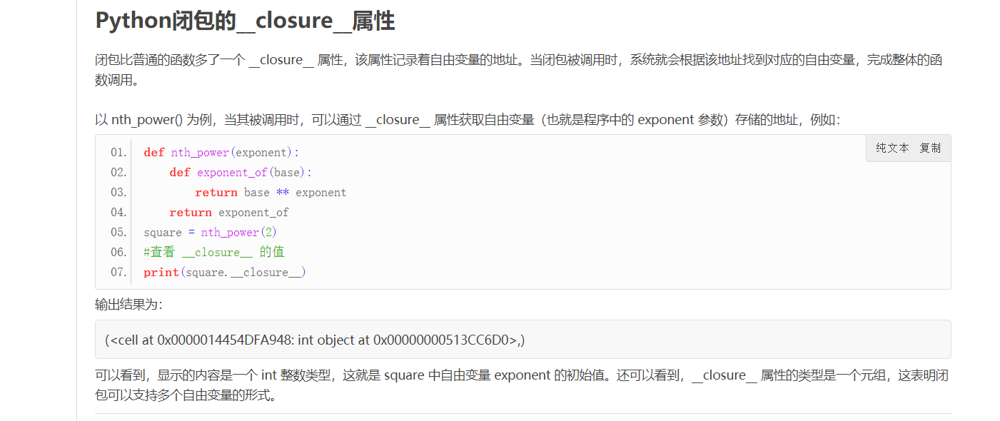

byte('abc')构造方法创建字节串

b'abc'  创建字节串

byte('str',encoding='gbk') 指定字节从的编码

或者 = str.encode('gbk')

解码方式：str.decode('gbk')

查看编码格式：chardet.deetect(byte)返回一个字典

```python
print(chardet.detect(b5))
{'encoding': 'utf-8', 'confidence': 0.7525, 'language': ''}
```

|    函数     |                             功能                             |
| :---------: | :----------------------------------------------------------: |
|    len()    |         计算序列的长度，即返回序列中包含多少个元素。         |
|    max()    | 找出序列中的最大元素。注意，对序列使用 sum() 函数时，做加和操作的必须都是数字，不能是字符或字符串，否则该函数将抛出异常，因为解释器无法判定是要做连接操作（+ 运算符可以连接两个序列），还是做加和操作。 |
|    min()    |                    找出序列中的最小元素。                    |
|   list()    |                      将序列转换为列表。                      |
|    str()    |                     将序列转换为字符串。                     |
|    sum()    |                         计算元素和。                         |
|  sorted()   |                       对元素进行排序。                       |
| reversed()  |                      反向序列中的元素。                      |
| enumerate() |        将序列组合为一个索引序列，多用在 for 循环中。         |

### 列表

列表添加元素：

1. +拼接
2. append()方法，添加元素到尾部
3. extend()方法，将序列中的元素逐个添加到列表尾部
4. insert(index,obj)方法，将obj插入列表的指定位置

列表删除元素：

1. del listname[index]，删除列表中下标为index的元素，也可以加切片删除一段连续的元素del listname[start,end]
2. pop()方法，根据索引删除元素，listname.pop(index)，删除下表为index的元素，不写index默认删除最后一个元素
3. remove()方法，根据元素本身的值进行删除，删除第一个和指定值相同的元素，且目标元素存在在列表。listname.remove(value)
4. clear()方法，删除列表是所有元素。listname.clear()

列表修改元素：

1. listname[index] = value 将index下标的值修改为value
2. listname[start,end] = 序列，将区域内的值改为新的序列，也可以删除元素，不支持单个值，支持字符串（会将字符串中的值转为序列）

列表查找元素：

1. listname.index(obj,start,end)，从start位置开始到end位置结束查询obj 的位置 ，start和end可省略
2. listname.count(obj)返回obj在列表中出现的次数

### 元组

元组也是有一序列按特定顺序排序的元素组成，但是元组是不可变序列，一旦创建就不可变

创建元组：

1. ()中放置元素进行创建
2. 使用tuple()函数进行创建。 a = tuple("hello")

访问元组元素：

1. tuplename[index]访问元组指定下标的值
2. tuplename[start,end,step] 切片访问

只能创建新的元组替代旧的元组

删除元组：

del tuplename

### 字典

字典是可变的，字典的键不可变，只能使用数字，字符串或元组

创建字典：

1. {key1:value1,key2:value2}
2. dict.fromkeys(list,vlue)，每个键的值都为value
3. dict(key1=value1,key2=value2)
4. \#方式1
   demo = [('two',2), ('one',1), ('three',3)]
   \#方式2
   demo = [['two',2], ['one',1], ['three',3]]
   \#方式3
   demo = (('two',2), ('one',1), ('three',3))
   \#方式4
   demo = (['two',2], ['one',1], ['three',3])
   a = dict(demo)
5. dict(zip(keys,vlues)),将两个列表转为对应的字典

访问字典：

1. dictname[key]访问键为key的值
2. dictname.get(key,default)，获取key的值，不存在返回默认值，默认值可不填

删除字典：

​	del dictname

添加键值对：

​	dictname[key] = value

修改键的值：

​	dictname[key] = newvalue

删除键值对：

​	del dictname[key]

判断是否存在键值对:

​	key in dictname

字典的方法：

1. keys 返回字典中所有的键

   dict_keys(['123', '124', 1])

2. values()方法返回字典中所有的值

   dict_values([1, 4, 'hello'])

3. items()方法返回字典中所有的键值对

   dict_items([('123', 1), ('124', 4), (1, 'hello')])

4. copy()方法返回一个字典的拷贝，相同键值对的新字典，对列表类型的值做的是浅拷贝

5. update()方法使用一个字典所包含的键值对来更新已有的字典（怨字典有的覆盖，没有的添加）

6. pop()方法popitem()方法都是删除字典中的键值对，pop()用来删除指定的键值对，popitem()方法是随机删除一个键值对

7. setdefault()方法返回某个key对应的value

   dictname.setdefault(key,defaultvalue) 存在返回值，不存在添加一个默认值

### 集合

集合是在{}中保存的元素序列，使用,分割。几个的值不可重复

{element1,element2,element3}

集合只能存储不可变的数据类型：整型、浮点型、字符串、元组。

不可存储列表、字典、集合

创建集合：

1. 使用{}创建

2. 使用set()函数创建

   setname = set(iteration)  iteration为可迭代对象

访问set集合元素：

1. 使用for循环访问

删除set集合：

1. del(setname)

集合添加元素：

1. setname.add(element)

集合删除元素：

1. setname.remove(element)

集合的交集并集差集

& | -

| 运算操作 | Python运算符 | 含义                              | 例子                                        |
| -------- | ------------ | --------------------------------- | ------------------------------------------- |
| 交集     | &            | 取两集合公共的元素                | >>> set1 & set2 {3}                         |
| 并集     | \|           | 取两集合全部的元素                | >>> set1 \| set2 {1,2,3,4,5}                |
| 差集     | -            | 取一个集合中另一集合没有的元素    | >>> set1 - set2 {1,2} >>> set2 - set1 {4,5} |
| 对称差集 | ^            | 取集合 A 和 B 中不属于 A&B 的元素 | >>> set1 ^ set2 {1,2,4,5}                   |

集合的方法

| 方法名                        | 语法格式                               | 功能                                                         | 实例                                                         |
| ----------------------------- | -------------------------------------- | ------------------------------------------------------------ | ------------------------------------------------------------ |
| add()                         | set1.add()                             | 向 set1 集合中添加数字、字符串、元组或者布尔类型             | >>> set1 = {1,2,3} >>> set1.add((1,2)) >>> set1 {(1, 2), 1, 2, 3} |
| clear()                       | set1.clear()                           | 清空 set1 集合中所有元素                                     | >>> set1 = {1,2,3} >>> set1.clear() >>> set1 set()  set()才表示空集合，{}表示的是空字典 |
| copy()                        | set2 = set1.copy()                     | 拷贝 set1 集合给 set2                                        | >>> set1 = {1,2,3} >>> set2 = set1.copy() >>> set1.add(4) >>> set1 {1, 2, 3, 4} >>> set1 {1, 2, 3} |
| difference()                  | set3 = set1.difference(set2)           | 将 set1 中有而 set2 没有的元素给 set3                        | >>> set1 = {1,2,3} >>> set2 = {3,4} >>> set3 = set1.difference(set2) >>> set3 {1, 2} |
| difference_update()           | set1.difference_update(set2)           | 从 set1 中删除与 set2 相同的元素                             | >>> set1 = {1,2,3} >>> set2 = {3,4} >>> set1.difference_update(set2) >>> set1 {1, 2} |
| discard()                     | set1.discard(elem)                     | 删除 set1 中的 elem 元素                                     | >>> set1 = {1,2,3} >>> set1.discard(2) >>> set1 {1, 3} >>> set1.discard(4) {1, 3} |
| intersection()                | set3 = set1.intersection(set2)         | 取 set1 和 set2 的交集给 set3                                | >>> set1 = {1,2,3} >>> set2 = {3,4} >>> set3 = set1.intersection(set2) >>> set3 {3} |
| intersection_update()         | set1.intersection_update(set2)         | 取 set1和 set2 的交集，并更新给 set1                         | >>> set1 = {1,2,3} >>> set2 = {3,4} >>> set1.intersection_update(set2) >>> set1 {3} |
| isdisjoint()                  | set1.isdisjoint(set2)                  | 判断 set1 和 set2 是否没有交集，有交集返回 False；没有交集返回 True | >>> set1 = {1,2,3} >>> set2 = {3,4} >>> set1.isdisjoint(set2) False |
| issubset()                    | set1.issubset(set2)                    | 判断 set1 是否是 set2 的子集                                 | >>> set1 = {1,2,3} >>> set2 = {1,2} >>> set1.issubset(set2) False |
| issuperset()                  | set1.issuperset(set2)                  | 判断 set2 是否是 set1 的子集                                 | >>> set1 = {1,2,3} >>> set2 = {1,2} >>> set1.issuperset(set2) True |
| pop()                         | a = set1.pop()                         | 取 set1 中一个元素，并赋值给 a                               | >>> set1 = {1,2,3} >>> a = set1.pop() >>> set1 {2,3} >>> a 1 |
| remove()                      | set1.remove(elem)                      | 移除 set1 中的 elem 元素                                     | >>> set1 = {1,2,3} >>> set1.remove(2) >>> set1 {1, 3} >>> set1.remove(4) Traceback (most recent call last):  File "<pyshell#90>", line 1, in <module>   set1.remove(4) KeyError: 4 |
| symmetric_difference()        | set3 = set1.symmetric_difference(set2) | 取 set1 和 set2 中互不相同的元素，给 set3                    | >>> set1 = {1,2,3} >>> set2 = {3,4} >>> set3 = set1.symmetric_difference(set2) >>> set3 {1, 2, 4} |
| symmetric_difference_update() | set1.symmetric_difference_update(set2) | 取 set1 和 set2 中互不相同的元素，并更新给 set1              | >>> set1 = {1,2,3} >>> set2 = {3,4} >>> set1.symmetric_difference_update(set2) >>> set1 {1, 2, 4} |
| union()                       | set3 = set1.union(set2)                | 取 set1 和 set2 的并集，赋给 set3                            | >>> set1 = {1,2,3} >>> set2 = {3,4} >>> set3=set1.union(set2) >>> set3 {1, 2, 3, 4} |
| update()                      | set1.update(elem)                      | 添加列表或集合中的元素到 set1                                | >>> set1 = {1,2,3} >>> set1.update([3,4]) >>> set1 {1,2,3,4} |

浅拷贝：拷贝了原对象内部数据的地址，地址都是原来的，修改可变对象影响源对象的数据，修改不可变对象不影响

深拷贝：源对象与拷贝对象相互独立，地址都是新的

```python
>>> a = [1,2,3,4,['heelo',6,9]]
>>> b = a
>>> c = copy.copy(a)
>>> id(a)
2299284970944
>>> id(b)
2299284970944
>>> id(c)
2299284981120
>>> a
[1, 2, 3, 4, ['heelo', 6, 9]]
>>> b
[1, 2, 3, 4, ['heelo', 6, 9]]
>>> c
[1, 2, 3, 4, ['heelo', 6, 9]]
>>> a.append('mmmm')
>>> a
[1, 2, 3, 4, ['heelo', 6, 9], 'mmmm']
>>> b
[1, 2, 3, 4, ['heelo', 6, 9], 'mmmm']
>>> c
[1, 2, 3, 4, ['heelo', 6, 9]]
>>> a[4].append('nihao')
>>> a
[1, 2, 3, 4, ['heelo', 6, 9, 'nihao'], 'mmmm']
>>> b
[1, 2, 3, 4, ['heelo', 6, 9, 'nihao'], 'mmmm']
>>> c
[1, 2, 3, 4, ['heelo', 6, 9, 'nihao']]
```

help(funcname)查看函数的帮助文档

print(func.\_\_doc\_\_)  查看函数的帮助文档

函数名.__defaults__”查看函数的默认值参数的当前值

#### 1) globals()函数

globals() 函数为 Python 的内置函数，它可以返回一个包含全局范围内所有变量的字典，该字典中的每个键值对，键为变量名，值为该变量的值。  **可修改**

locals() 函数也是 Python 内置函数之一，通过调用该函数，我们可以得到一个包含当前作用域内所有变量的字典。这里所谓的“当前作用域”指的是，在函数内部调用 locals() 函数，会获得包含所有局部变量的字典；而在全局范文内调用 locals() 函数，其功能和 globals() 函数相同。**不可修改**

vars() 函数也是 Python 内置函数，其功能是返回一个指定 object 对象范围内所有变量组成的字典。如果不传入object 参数，vars() 和 locals() 的作用完全相同。

由于这里的 name 变量也是局部变量，因此前面章节讲解的 globals() 函数或者 globals 关键字，并不适用于解决此问题。这里可以使用 Python 提供的 nonlocal 关键字。



eval和exec函数的都是执行一个字符串形式的python代码。

eval执行要返回结果，而exec执行完不返回结果

eval(source, globals=None, locals=None, /)

exec(source, globals=None, locals=None, /)

- expression：这个参数是一个字符串，代表要执行的语句 。该语句受后面两个字典类型参数 globals 和 locals 的限制，只有在 globals 字典和 locals 字典作用域内的函数和变量才能被执行。
- globals：这个参数管控的是一个全局的命名空间，即 expression 可以使用全局命名空间中的函数。如果只是提供了 globals 参数，而没有提供自定义的 __builtins__，则系统会将当前环境中的 __builtins__ 复制到自己提供的 globals 中，然后才会进行计算；如果连 globals 这个参数都没有被提供，则使用 Python 的全局命名空间。
- locals：这个参数管控的是一个局部的命名空间，和 globals 类似，当它和 globals 中有重复或冲突时，以 locals 的为准。如果 locals 没有被提供，则默认为 globals。

## 类

通过类名对类变量进行修改，对对象的类变量也会影响

def function(self)实例方法

@classmethod def function(cls)类方法

声明类方法使用@classmethod

通过类名调用实例对象必须传递引用。用类的实例对象访问类成员的方式称为绑定方法，而用类名调用类成员的方式称为非绑定方法。

Python 并没有提供 public、private 这些修饰符。为了实现类的封装，Python 采取了下面的方法：

- 默认情况下，Python 类中的变量和方法都是公有（public）的，它们的名称前都没有下划线（_）；
- 如果类中的变量和函数，其名称以双下划线“__”开头，则该变量（函数）为私有变量（私有函数），其属性等同于 private。

除此之外，还可以定义以单下划线“_”开头的类属性或者类方法（例如 _name、_display(self)），这种类属性和类方法通常被视为私有属性和私有方法，虽然它们也能通过类对象正常访问，但这是一种约定俗称的用法，初学者一定要遵守。

```python
class children:
    @property   #@property将age方法作为一个属性，
    def age(self):
        return self.__age
    @age.setter   #使用@age.setter装饰age，使age可写
    def age(self,age):
        self.__age = age
    @property
    def birth(self):    #定义属性的方法名不许与实例变量重名
        return 2021 - self.__age
Lisi = children()
Lisi.age = 12
print(Lisi.age)    #12
print(Lisi.birth)   #2009
```

```python
#类的封装
class CLanguage:

    def setname(self, name):
        if len(name) < 3:
            raise ValueError('名称长度必须大于3！')
        self.__name = name
    def getname(self):
        return self.__name
    # 为 name 配置 setter 和 getter 方法
    name = property(getname, setname)

    def setadd(self, add):
        if add.startswith("http://"):
            self.__add = add
        else:
            raise ValueError('地址必须以 http:// 开头')
    def getadd(self):
        return self.__add

    # 为 add 配置 setter 和 getter 方法
    add = property(getadd, setadd)

    # 定义个私有方法
    def __display(self):
        print(self.__name, self.__add)

clang = CLanguage()
clang.name = "C语言"
clang.add = "http://c.marmot.vip"
# clang.add = "://c.marmot.vip"   报错
print(clang.name)
print(clang.add)
```

\_\_new\_\_()方法使一种负责创建类实例的静态方法，优先\_\_init\_\_()方法执行

\_\_repr\_\_()方法输出实例化对象的信息

\_\_del\_\_()方法销毁对象，在对象销毁的时候调用  del的时候调用此方法

\_\_dir\_\_()方法：列出对象的所有属性

`['__class__', '__delattr__', '__dict__', '__dir__', '__doc__', '__eq__', '__format__', '__ge__', '__getattribute__', '__gt__', '__hash__', '__init__', '__init_subclass__', '__le__', '__lt__', '__module__', '__ne__', '__new__', '__reduce__', '__reduce_ex__', '__repr__', '__setattr__', '__sizeof__', '__str__', '__subclasshook__', '__weakref__', 'add', 'name', 'say']`也可以使用dir()方法

\_\_dict\_\_()方法显示对象的属性，类使用的时候显示类的属性

hassttr()方法判断对象是否包含具体的属性和方法

getattr()方法获取某个类实例对象中指定属性的值

setattr()方法将实例对象的属性修改为指定的值

issubclass(cls,class_or_tuple)检测cls是否为后一个类或者元组中包含的多个类中任意类的子类

isinstance(obj,class_or_tuple)检测obj是否为后一个类或元组包含的多个类中任意类的对象

\_\_call\_\_()方法


### socket

```python
sk = socket.socket([family[,type[,proto]]])
#family：套接字家族，参数：AF_UNIX或者AF_INET
#type:套接字协议 参数：SOCK_STREAM或者SOCK_DGRAM  代表TCP和udp
#protocal默认为0
#创建tcp socket：sk = socket.socket(socket.AF_INET,socket.SOCK_STREAM)
#创建udp socket: sk = socket.socket(socket.AF_INET,socket.SOCK_DGRAM)
```

通过s = socket.socket()方法获取一个socket对象

服务端方法

1. s.bind()绑定地址参数为host,port
2. s.listen(backlog) 开始监听，backlog指定在拒绝连接之前，操作系统可以挂起的最大连接数量。该值至少为1，大部分应用程序设为5就可以了。
3. s.accept()被动接受客户端连接，(阻塞式)等待连接的到来，并返回（conn,address）二元元组,其中conn是一个通信对象，可以用来接收和发送数据。address是连接客户端的地址。

客户端方法

1. s.connect(address)客户端向服务端发起连接，address的参数为元组(hostname,port)
2. s.connect_ex()出错返回错误码

公共方法：

1. s.recv(bufsize)接受数据，数据以byte返回
2. s.send()发送数据
3. s.sendall()完整发送数据
4. s.recvform()接受udp数据，返回值为(data,address)
5. s.sendto(data,address),发送UDP数据，将数据data发送到套接字，address是形式为（ipaddr，port）的元组，指定远程地址。返回值是发送的字节数。
6. s.close()关闭套接字，必须执行
7. s.getpeername()返回连接套接字的远程地址
8. s.getsockname()返回套接字自己的地址

| s.settimeout(timeout) | 设置套接字操作的超时期，timeout是一个浮点数，单位是秒。值为None表示没有超时期。一般，超时期应该在刚创建套接字时设置，因为它们可能用于连接的操作（如connect()） |
| --------------------- | ------------------------------------------------------------ |
| s.gettimeout()        | 返回当前超时期的值，单位是秒，如果没有设置超时期，则返回None。 |
| s.fileno()            | 返回套接字的文件描述符。                                     |
| s.setblocking(flag)   | 如果flag为0，则将套接字设为非阻塞模式，否则将套接字设为阻塞模式（默认值）。非阻塞模式下，如果调用recv()没有发现任何数据，或send()调用无法立即发送数据，那么将引起socket.error异常。 |
| s.makefile()          | 创建一个与该套接字相关连的文件                               |

## socket编程思路：

**服务端：**

1. 创建套接字，绑定套接字到本地IP与端口：socket.socket(socket.AF_INET,socket.SOCK_STREAM) , s.bind()
2. 开始监听连接：s.listen()
3. 进入循环，不断接受客户端的连接请求：s.accept()
4. 接收传来的数据，或者发送数据给对方：s.recv() , s.sendall()
5. 传输完毕后，关闭套接字：s.close()

**客户端:**

1. 创建套接字，连接服务器地址：socket.socket(socket.AF_INET,socket.SOCK_STREAM) , s.connect()
2. 连接后发送数据和接收数据：s.sendall(), s.recv()
3. 传输完毕后，关闭套接字：s.close()


### 接收参数

sys.argv接收 以列表接收

argparse 参数识别

getopt

## getopt模块

getopt模块是专门处理命令行参数的模块，用于获取命令行选项和参数，也就是sys.argv。命令行选项使得程序的参数更加灵活。支持短选项模式（-）和长选项模式（--）。

该模块提供了两个方法及一个异常处理来解析命令行参数。

### getopt.getopt 方法

getopt.getopt 方法用于解析命令行参数列表，语法格式如下：

```
getopt.getopt(args, options[, long_options])
```

方法参数说明：

- **args**: 要解析的命令行参数列表。
- **options** : 以字符串的格式定义，**options** 后的冒号 **:** 表示如果设置该选项，必须有附加的参数，否则就不附加参数。
- **long_options** : 以列表的格式定义，**long_options** 后的等号 **=** 表示该选项必须有附加的参数，不带冒号表示该选项不附加参数。
- 该方法返回值由两个元素组成: 第一个是 **(option, value)** 元组的列表。 第二个是参数列表，包含那些没有 **-** 或 **--** 的参数。

```python

import sys, getopt

def main(argv):
    inputfilename = ''
    outputfile = ''
    try:
        opts, args = getopt.getopt(argv, "hi:o:", ["ifile=", "ofile="])
    except getopt.GetoptError:
        print('test.py -i <inputfilename> -o <outputfile>')
        sys.exit(2)
    for opt, arg in opts:
        if opt == '-h':
            print('test.py -i <inputfilename> -o <outputfile>')
            sys.exit()
        elif opt in ("-i", "--ifile"):
            inputfilename = arg
        elif opt in ("-o", "--ofile"):
            outputfile = arg
    print('输入的文件为：', inputfilename)
    print('输出的文件为：', outputfile)


if __name__ == "__main__":
    main(sys.argv[1:])

```

```python
str = '12'
str.replace('','+') # 替换
str.split('x') # 以x分割
str.swapcase()# 大小写互换
print(str,str_utf8)
print(str,str_gbk)
print(str,str_utf8.decode('utf-8','strict'))
print(str,str_utf8.decode('GBK','strict'))
list.join() # 列表拼接为字符串
```

```python
# encoding : utf-8 -*-                                                       
# @file    :   os_shell.py
# @Time    :   2021/8/9 16:58
import getopt
import os
import sys
def main(argv):
    print('''
            ___
           __H__
     ___ ___[)]_____ ___ ___  {1.5.7.1#dev}
    |_ -| . [)]     | .'| . |
    |___|_  ["]_|_|_|__,|  _|
          |_|V...       |_|   http://sqlmap.org
    
    ''')

    url = ''
    try:
        opts, args = getopt.getopt(argv, "hu:",["os-shell"])
    except getopt.GetoptError:
        print('please use correct args! use -h for help')
        sys.exit(2)
    for opt, arg in opts:
        if opt == '-h':
            print('test.py -u https://www.example.com --os-shell')
            sys.exit()
        elif opt in ("-u"):
            url = arg
        elif opt in ("--os-shell",):
            while(True):
                command = input(">>>")
                if command == "exit":
                    exit()
                try:
                    print(os.system(command))
                except Exception as e:
                    print(e)

if __name__ == '__main__':
    main(sys.argv[1:])

```

```python
#! coding=utf-8

字符串 = 'hello word !'  # 10000  不定长
# [] 分片
取字符串第三个值 = 字符串[2]

取字符串最后一个值 = 字符串[-1]

取字符串第三个到第五个的值 = 字符串[2:5]  # 中括号，中间用 : 分开，从冒号前面计数，取到冒号后面，冒号后边的，不取，前边取
#  第三个，到第五个   2:5

取字符串第三个到最后一个 = 字符串[2:] #

取字符串第一个到倒数第三个 = 字符串[:-2]

# 转义

转义 = '\' \n \b \t \r \\ \
    \x27    a \
    \x20  \x25 \f  \b  \000 \v	 \x00 \
 '

print(转义)

重复输出字符串 = 'xxx' * 100
print(重复输出字符串)

print('a' not in 字符串)

原始字符串 = R'a\nb'  # R
print(原始字符串)


age = '18'
url = 'https://www.baidu.com'
name = 'zs'
sex = '男'

print('名字为: ' + name + '\n性别为: ' + sex + '\n网址为:' + url + '\n年龄为: ' + age + '\n')

print(  '名字为: %s\n性别为: %s\n网址为: %s\n年龄为: %s\n' % (name, sex, url, age) )

print(  '名字为: {0}\n性别为: {1}\n网址为: {1}\n年龄为: {0}\n' .format (name, sex) )

print(  '名字为: {}\n性别为: {}\n网址为: {}\n年龄为: {}\n' .format (name, sex, url, age) )

print(f'名字为: {name}\n性别为: {sex}\n网址为: {url}\n年龄为: {age}\n')

'''
len(string)

join(seq)

encode(encoding='UTF-8',errors='strict')

bytes.decode(encoding="utf-8", errors="strict")

swapcase()

strip([chars])

split(str="", num=string.count(str))

replace(old, new [, max])

lower()

upper()

'''

字符串 = '\r Hello Word ! \n'

字符串长度 = len(字符串)

分割后的字符串 = 字符串.split(' ')

变小写的字符串 = 字符串.lower()

变大写的字符串 = 字符串.upper()

大小写互换的字符串 = 字符串.swapcase()

去除两侧空字符 = 字符串.strip()  # 在爆破时，用来去除两侧换行

空格替换成下户线后的字符串 = 字符串.replace(' ', '_')  # 默认全替换，通过第三个参数，控制次数

列表 = ['zs', '18', 'xxx']

把列表拼接成字符串 = '_'.join(列表)  # zs_18_xxx

str = "菜鸟教程"
str_utf8 = str.encode("UTF-8")
str_gbk = str.encode("GBK")

print(str)

print("UTF-8 编码：", str_utf8)
print("GBK 编码：", str_gbk)

print("UTF-8 解码：", str_utf8.decode('UTF-8','strict'))
print("GBK 解码：", str_gbk.decode('GBK','strict'))
```

```python
#requestas
# encoding : utf-8 -*-                                                       
# @file    :   test4.py
# @Time    :   2021/8/10 13:00
import requests

data={"name":"1"}

response = requests.post("https://www.baidu.com",data=data,allow_redirects=False,proxies={"http": "http://127.0.0.1:8080","https": "http://127.0.0.1:8080"},verify=False)

print(response.content)


```

### \_\_init\_\_.py

\_\_init\_\_.py的作用为将文件夹变为一个Python模块，Python导入的每个模块的包中都有一个\_\_init\_\_.py。

通常\_\_init\_\_.py为空，但是可以添加其他的功能，导入一个包的时候实际上是导入了\_\_init\_\_.py文件

\_\_all\_\_ = ['os','sys']

\_\_all\_\_将模块全部导入

```python
# __init__.py
__all__ = ['os', 'sys', 're', 'urllib']
# a.py
from package import *
```

这时就会把注册在__init__.py文件中__all__列表中的模块和包导入到当前文件中来。

可以了解到，__init__.py主要控制包的导入行为。要想清楚理解__init__.py文件的作用，还需要详细了解一下import语句引用机制：

•模块文件（.py文件）

•C或C++扩展（已编译为共享库或DLL文件）

•包（包含多个模块）

•内建模块（使用C编写并已链接到Python解释器中）

当导入模块时，解释器按照sys.path列表中的目录顺序来查找导入文件。


pip3 install vitualenvwrapper


```sh
windows
pip isntall virtualenvwrapper
```


```python
#多线程
import threading

```


```sh
pocsuite -r xx.py -u url --verify 执行poc 
```

```python
#poc编写

#文件名称 
_141017_phpMyAdmin_all_weak_password.py

#编写继承PoCBase的DemoPOC类
导入包
import re
from collections import OrderedDict

from pocsuite3.api \
    import Output, POCBase, POC_CATEGORY, register_poc, requests, VUL_TYPE, get_listener_ip, get_listener_port
from pocsuite3.lib.core.interpreter_option \
    import OptString, OptDict, OptIP, OptPort, OptBool, OptInteger, OptFloat, OptItems
from pocsuite3.modules.listener import REVERSE_PAYLOAD


class DemoPOC(POCBase):
    vulID = '1571'                  # ssvid ID 如果是提交漏洞的同时提交 PoC,则写成 0
    version = '1'                   # 默认为1
    author = 'seebug'               # PoC作者的大名
    vulDate = '2014-10-16'          # 漏洞公开的时间,不知道就写今天
    createDate = '2014-10-16'       # 编写 PoC 的日期
    updateDate = '2014-10-16'       # PoC 更新的时间,默认和编写时间一样
    references = ['https://xxx.xx.com.cn']      # 漏洞地址来源,0day不用写
    name = 'XXXX SQL注入漏洞 PoC'   # PoC 名称
    appPowerLink = 'https://www.drupal.org/'    # 漏洞厂商主页地址
    appName = 'Drupal'          # 漏洞应用名称
    appVersion = '7.x'          # 漏洞影响版本
    vulType = VUL_TYPE.UNAUTHORIZED_ACCESS      # 漏洞类型,类型参考见 漏洞类型规范表
    category = POC_CATEGORY.EXPLOITS.WEBAPP
    samples = []                # 测试样列,就是用 PoC 测试成功的网站
    install_requires = []       # PoC 第三方模块依赖，请尽量不要使用第三方模块，必要时请参考《PoC第三方模块依赖说明》填写
    desc = '''
            Drupal 在处理 IN 语句时，展开数组时 key 带入 SQL 语句导致 SQL 注入，
            可以添加管理员、造成信息泄露。
        '''                     # 漏洞简要描述
    pocDesc = ''' 
            poc的用法描述 
        '''                     # POC用法描述

    def _options(self):
        opt = OrderedDict()     # value = self.get_option('key')
        opt["string"] = OptString('', description='这个poc需要用户登录，请输入登录账号', require=True)
        opt["integer"] = OptInteger('', description='这个poc需要用户密码，请输出用户密码', require=False)
        return opt

    def _verify(self):
        output = Output(self)
        # 验证代码
        result = {
            # 不管是验证模式或者攻击模式，返回结果 result 中的 key 值必须按照下面的规范来写
            # [ PoC结果返回规范 ]( https://github.com/knownsec/pocsuite3/blob/master/docs/CODING.md#resultstandard )
            'Result': {
                'DBInfo': {'Username': 'xxx', 'Password': 'xxx', 'Salt': 'xxx', 'Uid': 'xxx', 'Groupid': 'xxx'},
                'ShellInfo': {'URL': 'xxx', 'Content': 'xxx'},
                'FileInfo': {'Filename': 'xxx', 'Content': 'xxx'},
                'XSSInfo': {'URL': 'xxx', 'Payload': 'xxx'},
                'AdminInfo': {'Uid': 'xxx', 'Username': 'xxx', 'Password': 'xxx'},
                'Database': {'Hostname': 'xxx', 'Username': 'xxx', 'Password': 'xxx', 'DBname': 'xxx'},
                'VerifyInfo': {'URL': 'xxx', 'Postdata': 'xxx', 'Path': 'xxx'},
                'SiteAttr': {'Process': 'xxx'},
                'Stdout': 'result output string'
            }
        }
        if result:  # result是返回结果
            output.success(result)
        else:
            output.fail('target is not vulnerable')
        return output

    def _attack(self):
        output = Output(self)
        result = {}
        # 攻击代码
        pass

    def _shell(self):
        """
        shell模式下，只能运行单个PoC脚本，控制台会进入shell交互模式执行命令及输出
        """
        cmd = REVERSE_PAYLOAD.BASH.format(get_listener_ip(), get_listener_port())
        # 攻击代码 execute cmd
        pass


def other_fuc():
    pass


def other_utils_func():
    pass


# 注册 DemoPOC 类
register_poc(DemoPOC)

```

```python
def__verify(self):
    Output = Output(self)
    Req = requests.Session()
    Req.get(self.url)
    r= Req.get(self.url,headers={})
    
    if 'phpinfo' in r.text:
        output.success({"Stdout":"存在漏洞"})
    else:
        output.fail("漏洞不存在")
        
def _attack(self):
    pass
	#写webshell
def _shell(self):
    rcv_ip = get_listener_port()#监听ip
    rec_port = get_listener_port()#监听端口
    Req = requests.Session()
    
    Req.get(self.url)
    
    r = Req.get(self.url,header={})
def _
```

