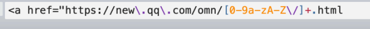
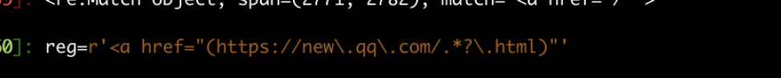
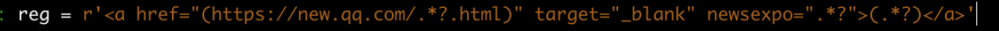

| 元字符 | 行为                                                         | 说明                                                         |
| ------ | ------------------------------------------------------------ | ------------------------------------------------------------ |
| *      | 零次或者多次匹配前面的字符或者表达式，等效于{0，}            | zo*  匹配z ~zoooooo....                                      |
| +      | 一次或多次匹配前面的字符或者表达式，等效于{1，}              | zo+  匹配zo ~ zoooooo.....                                   |
| ?      | 零次或者一次匹配前面的字符或者表达式，等效于{0,1}            | zo?  匹配z zo  非贪婪模式尽可能少匹配                        |
| ^      | 匹配搜索字符串开始的位置。标志中包括多行字符还会匹配换行后面的位置，若是使用中括号则不匹配中括号中的字符集 | ^\d{3} 与搜索字符串开始处的 3 个字符匹配<br/>[^abc\] 与除 a、b、c 以外的任何字符匹配 |
| $      | 匹配字符串结束的位置，若标志中包括多行字符，还匹配换行符前面的位置 | \d{3}$ 与搜索字符串结尾处的 3 个数字匹配                     |
| .      | 匹配出换行符\n之外的任何单个字符，                           | a.c 与 “abc”“a1c”和“a-c”匹配                                 |
| []     | 编辑括号表达式的开始和结尾                                   | [1-4] 与“1”、“2”、“3”或“4”匹配<br/>[^aAeEiIoOuU\] 与任何非元音字符匹配 |
| {}     | 标记限定符表达式的开始和结尾                                 | a{2,3} 匹配'aa'和'aaa'                                       |
| ()     | 标记子表达式的开始和结尾，可以保存子表达式，以备将来只用     | A(\\d) ‘A0' -'A9'                                            |
| \|     | 表示两个或多个项之间进行选择                                 | a\|zo   匹配a或者 zo                                         |
| /      | 表示 JavaScript 中的文本正则表达式模式的开始和结尾。在第二个 “/”后添加单字符标志可以指定搜索行为 | /abc/gi 是与 “abc”匹配的 JavaScript 文本正则表达式。g（全局）标志指定查找模式的所有匹配项，i（忽略大小写）标志使搜索不区分大小写 |
| \      | 将下一字符标记为特殊字符、文本、反向引用或八进制转义符       | \n 与换行符匹配。\( 与 “(”匹配。\\ 与 “\”匹配                |
|        |                                                              |                                                              |
|        |                                                              |                                                              |
|        |                                                              |                                                              |
|        |                                                              |                                                              |
|        |                                                              |                                                              |
|        |                                                              |                                                              |
|        |                                                              |                                                              |
|        |                                                              |                                                              |
|        |                                                              |                                                              |
|        |                                                              |                                                              |
|        |                                                              |                                                              |
|        |                                                              |                                                              |
|        |                                                              |                                                              |
|        |                                                              |                                                              |
|        |                                                              |                                                              |
|        |                                                              |                                                              |
|        |                                                              |                                                              |

```python
import re
# 正则表达式匹配
if str:
	re.search("re",str) #在字符串str中搜索re,匹配第一个

	re.match(patterm,string) #使用正则表达式匹配
	result2 = re.findall(pattern,scripts)
print(result2) # 使用正则表达式匹配多个结果
```







