## 计算机网络

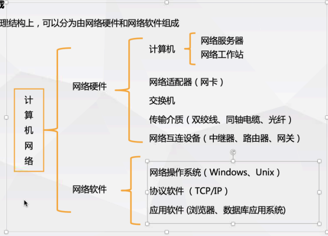

#### 交换机：

#### 路由器：工作在网络层，根据网络层地址（IP地址）寻找路径的机器

#### 网关：使在不同的体系结构和环境之间的通信可能，把数据进行重新转换。

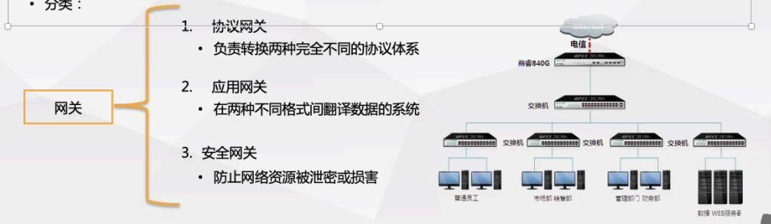

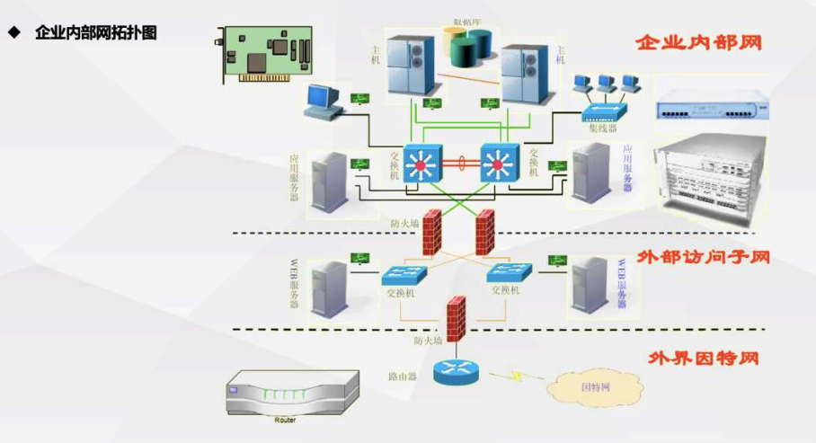

A类地址范围：1.0.0.0-127.255.255.255

B类地址范围：128.0.0.0-191.255.255.255

C类地址范围：192.0.00-223.255.255.255

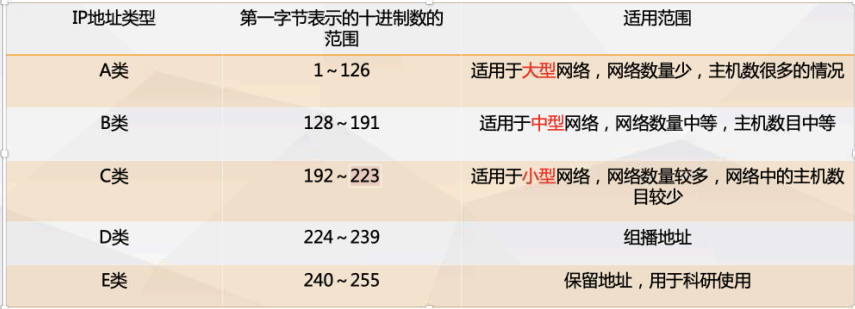

route print查看Windows中网络路由

arp -a查看网内存活Ip

   osi:

应用层：为应用程序提供服务，提供用户接口

表示层：数据格式转化、数据加密，编码、数据加密，数据格式转换

会话层：建立、管理和维护会话

传输层：定义传输数据的协议端口号 、建立、管理和维护端到端的连接，向用户提供可靠的端到端的差错和流量控制，保证报文的正确传输

网络层：ip地址及路由选择，逻辑地址寻址

数据链路层：提供介质访问和链路管理，接受来自物理层的比特流形式的数据库，通过差错控制传输到网络层。也将上层的数据封装成帧转发到物理层

物理层 ：传输比特

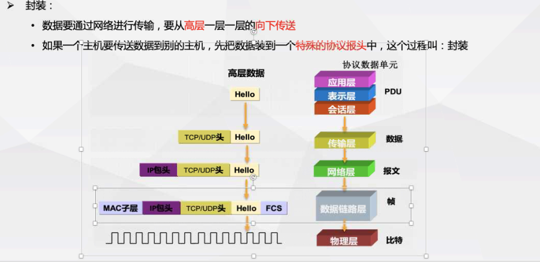

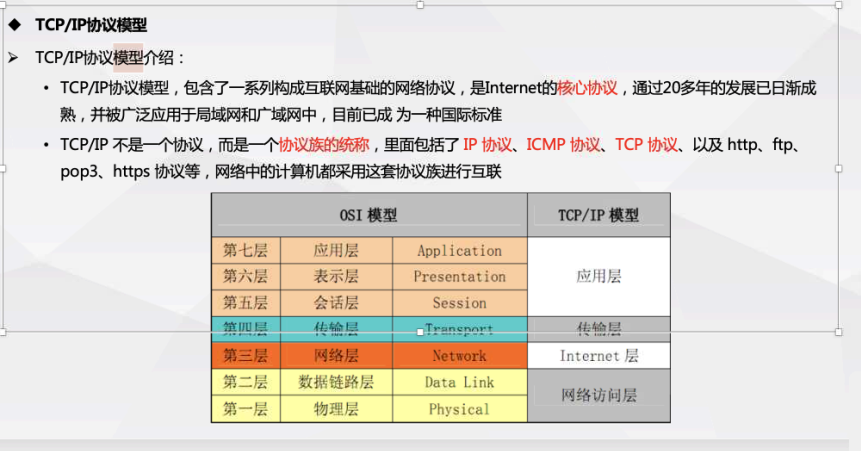

应用层协议：http:80 https:443 ftp:20/21 dns:53 smtp:25 pop3:110 telnet:23 ssh:22 tftp:69 server:445

传输层：TCP、UDP

网络层：ICMP IP ARP

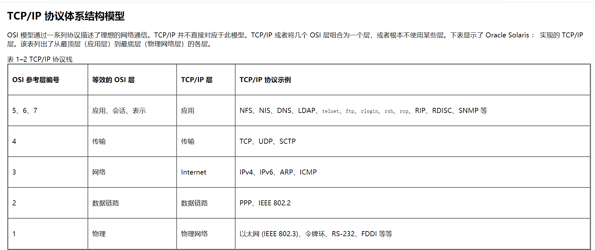

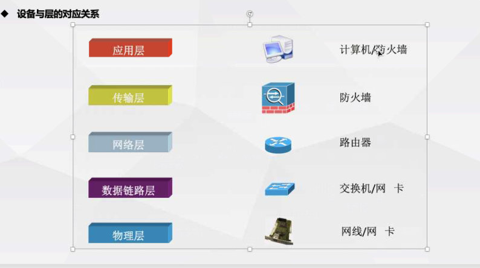

ARP协议

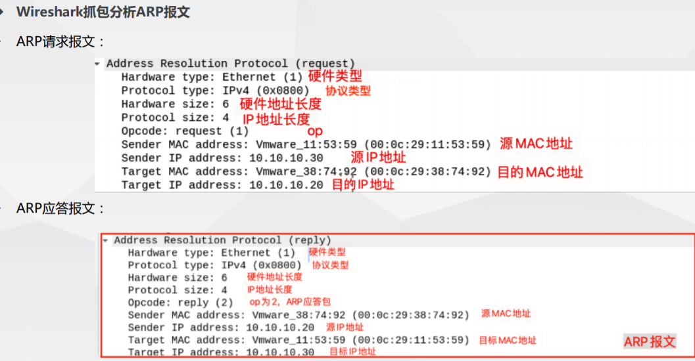

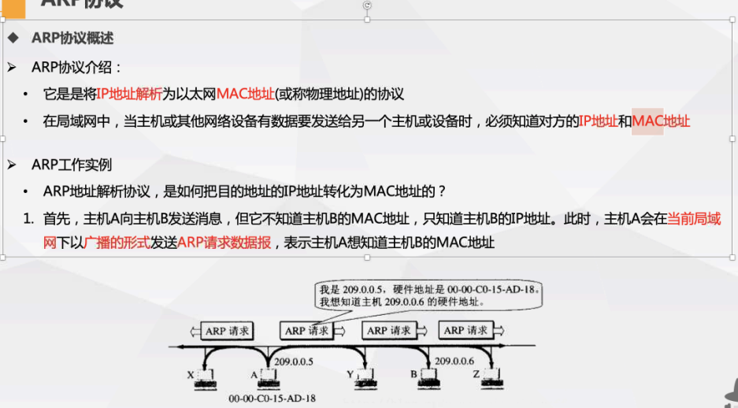

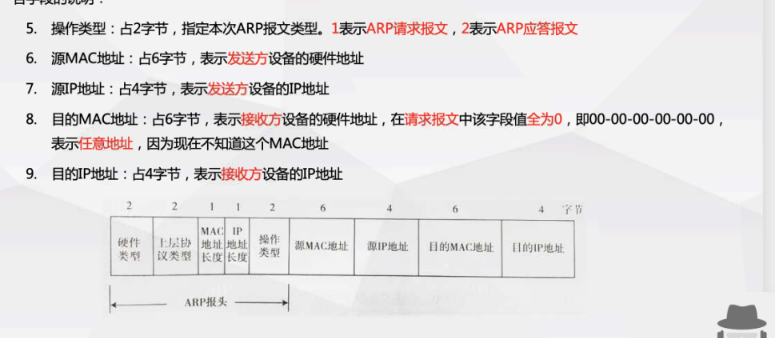

nc命令

nc -l 本地系统监听特定端口上的tcp和udp活动

tracert ip 查看下一条的命令

C:\Users\Administrator>tracert --help
--help 是无效的命令选项。

用法: tracert [-d] [-h maximum_hops] [-j host-list] [-w timeout]
               [-R] [-S srcaddr] [-4] [-6] target_name

选项:
    -d                 不将地址解析成主机名。
    -h maximum_hops    搜索目标的最大跃点数。
    -j host-list       与主机列表一起的松散源路由(仅适用于 IPv4)。
    -w timeout         等待每个回复的超时时间(以毫秒为单位)。
    -R                 跟踪往返行程路径(仅适用于 IPv6)。
    -S srcaddr         要使用的源地址(仅适用于 IPv6)。
    -4                 强制使用 IPv4。
    -6                 强制使用 IPv6。

C:\Users\Administrator>nslookup ?
用法:
   nslookup [-opt ...]             # 使用默认服务器的交互模式
   nslookup [-opt ...] - server    # 使用 "server" 的交互模式
   nslookup [-opt ...] host        # 仅查找使用默认服务器的 "host"
   nslookup [-opt ...] host server # 仅查找使用 "server" 的 "host"

​	①PC1在请求数据包里面封装源目IP地址，并将**带有IP地址的数据包**发送到互联网；

②互联网有大量的网络通信设备（例如路由器），**路由器根据数据包的IP地址查找路由表（地图）**，然后以接力棒的方式逐跳转发直到目标服务器；

③服务器收到请求数据后，**将源目IP地址翻转**，并封装回应数据包发送到互联网。

     PS C:\Users\Administrator\Desktop> nc -h
    [v1.12 NT http://eternallybored.org/misc/netcat/]
    connect to somewhere:   nc [-options] hostname port[s] [ports] ...
    listen for inbound:     nc -l -p port [options] [hostname] [port]
    options:
        -d              detach from console, background mode
    	-e prog         inbound program to exec [dangerous!!]
        -g gateway      source-routing hop point[s], up to 8
        -G num          source-routing pointer: 4, 8, 12, ...
        -h              this cruft
        -i secs         delay interval for lines sent, ports scanned
        -l              listen mode, for inbound connects	//监听模式。用于入站连接
        -L              listen harder, re-listen on socket close
        -n              numeric-only IP addresses, no DNS
        -o file         hex dump of traffic
        -p port         local port number
        -r              randomize local and remote ports
        -s addr         local source address
        -t              answer TELNET negotiation
        -c              send CRLF instead of just LF
        -u              UDP mode
        -v              verbose [use twice to be more verbose]
        -w secs         timeout for connects and final net reads
        -z              zero-I/O mode [used for scanning]
port numbers can be individual or ranges: m-n [inclusive]

nc -lunvp 

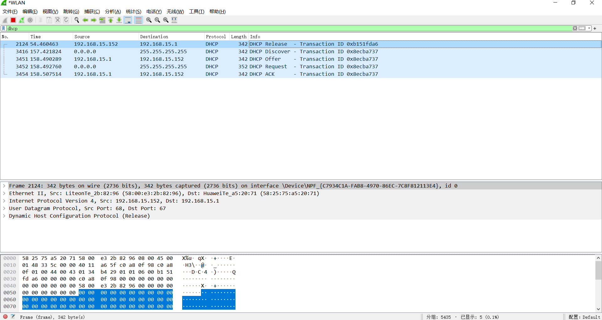

403代表目标服务器对应的文件夹下没有默认文档，apache,nginx,tomcat没有index.html/index.php   iis是指没有设置默认文档。（禁止访问）

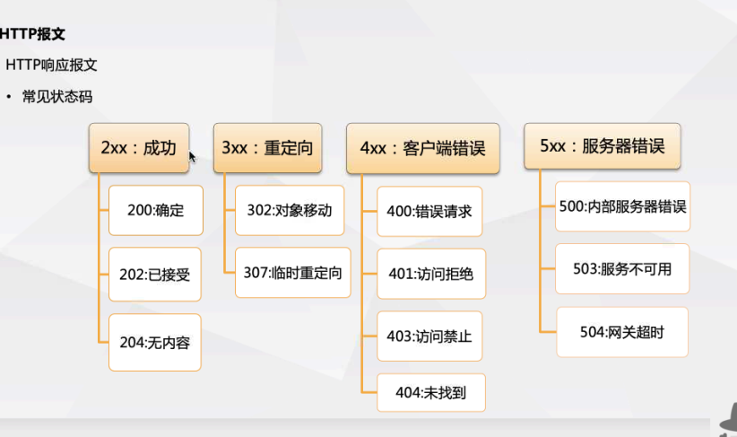

http字段：

- 通用字段：
  - catch-control 控制缓存的行为
  - connection 逐跳首部，连接的管理
  - **date**创建报文的日期事件
  - **transfet-encodifng** 指定报文主题的传输编码方式（分块传输绕过waf） Chunked  
  - Pragma 报文指令
  - trailer报文末端的首部一览
  - upgrade升级为其他协议
  - via代理服务器的相关信息
  - warning 警告
- 请求字段：
  - accept 可处理的媒体类型
  - accept-charset 优先字符集
  - accept-encoding 优先的内容编码
  - accept-language 优先的语言
  - authorization web认证信息
  - **host** 资源所在的服务器（域名+端口）
  - If modified since 比较资源的更新事件
  - from 用户的电子邮箱地址
  - proxy-authorization 代理服务器要求客户端的认证信息
  - **referer** uri的原始获取方
  - **user-agent** HTTP客户端程序的信息（操作系统+浏览器版本）
  - **content-type**：请求内容的格式
  - **content-length**：请求内容的长度
  - **cookie**：cookie
- 响应字段：
  - **location**：目标url跳转
  - **X-powered-by**：目标的脚本语言（php,asp,jsp)
  - **server**：目标服务器中间件信息
  - **set-cookie**：浏览器的cookie
  - **content-type**：响应内容的格式
  - **content-length**：响应内容的长度
  - accept-encoding：内容编码格式
  - referer：从哪个页面跳转而来
  - x-forwarder-for：请求的客户端ip（针对代理服务器）【可伪造】
  - origin：从哪个域跳转而来（只放域名）
  - date：目标服务器的事件

29DOCUMENT_ROOT : C:\Users\Administrator\Desktop\study
REMOTE_ADDR : 127.0.0.1
REMOTE_PORT : 61239
SERVER_SOFTWARE : PHP 5.6.9 Development Server
SERVER_PROTOCOL : HTTP/1.1
SERVER_NAME : 127.0.0.1
SERVER_PORT : 9007
REQUEST_URI : /1234.php
REQUEST_METHOD : GET
SCRIPT_NAME : /1234.php
SCRIPT_FILENAME : C:\Users\Administrator\Desktop\study\1234.php
PHP_SELF : /1234.php
HTTP_HOST : 127.0.0.1:9007
HTTP_CONNECTION : keep-alive
HTTP_CACHE_CONTROL : max-age=0
HTTP_SEC_CH_UA : "Chromium";v="92", " Not A;Brand";v="99", "Google Chrome";v="92"
HTTP_SEC_CH_UA_MOBILE : ?0
HTTP_UPGRADE_INSECURE_REQUESTS : 1
HTTP_USER_AGENT : Mozilla/5.0 (Windows NT 10.0; WOW64) AppleWebKit/537.36 (KHTML, like Gecko) Chrome/92.0.4515.40 Safari/537.36
HTTP_ACCEPT : text/html,application/xhtml+xml,application/xml;q=0.9,image/avif,image/webp,image/apng,*/*;q=0.8,application/signed-exchange;v=b3;q=0.9
HTTP_SEC_FETCH_SITE : none
HTTP_SEC_FETCH_MODE : navigate
HTTP_SEC_FETCH_USER : ?1
HTTP_SEC_FETCH_DEST : document
HTTP_ACCEPT_ENCODING : gzip, deflate, br
HTTP_ACCEPT_LANGUAGE : zh-CN,zh;q=0.9
HTTP_COOKIE : PHPSESSID=ho3vkhebvoq1ujddikcu3ildl5
REQUEST_TIME_FLOAT : 1625115087.8429
REQUEST_TIME : 1625115087

#### https

非对称加密

